# Работа со сторонним ПО

В данном разделе можно ознакомиться с принципами работы **Carrot** с **After Effects** и **Unreal Engine**.

## Работа с After Effects

### Основная информация по работе с Carrot After Effects Plugin

#### Работа со слоями

##### Поддерживаемые типы слоев

**Carrot Engine** поддерживает следующие типы слоев из **After Effects** при экспорте с помощью `Carrot AE Plugin`:

###### Null Layer

Работает аналогично **AE**, к нему можно парентить другие слои, анимировать и применять эффекты, использовать в эскпрешенах и т.д.

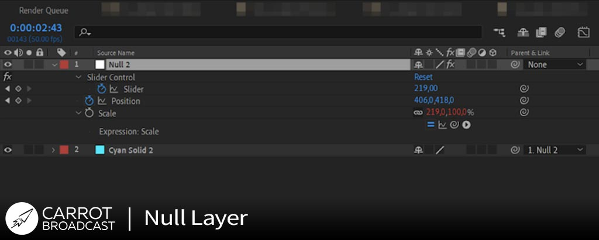

###### Solid Layer

Аналогично **АЕ**. Отличие только в том, что в **Carrot** этот тип слоя рисуется в режиме `Bicubic sampling` (*пример на рис. ниже*)

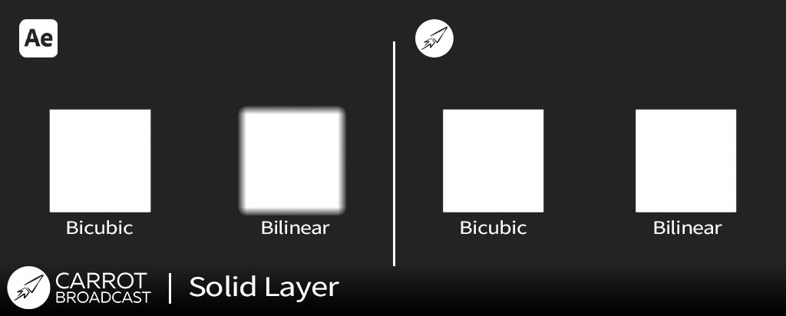

###### Shape Layer

Для работы с **Shape Layers** их необходимо перед экспортом из After Effects в Carrot конвертировать в `Bezier Path`

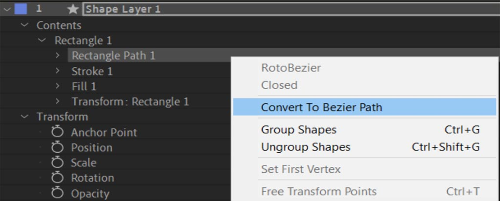

Поддерживается `Stroke` со скругленными краями, с возможностью редактирования толщины обводки `Stroke Width` и применения сплошной заливки `Fill`

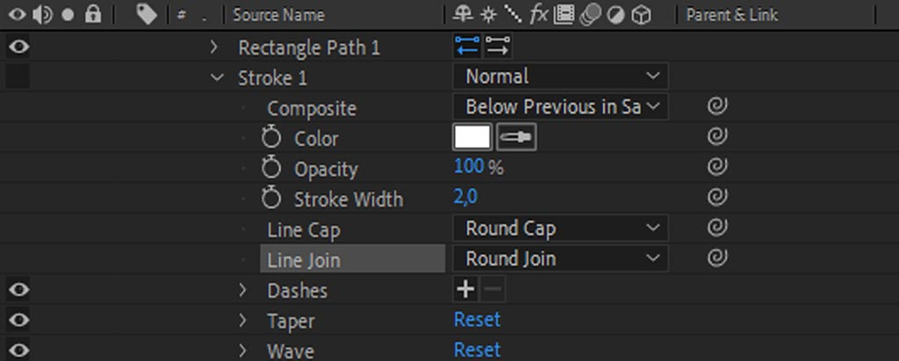

Для применения масок на слое **Shape** необходимо предварительно переместить данный слой в `Precomposition` или использовать `Track Matte`

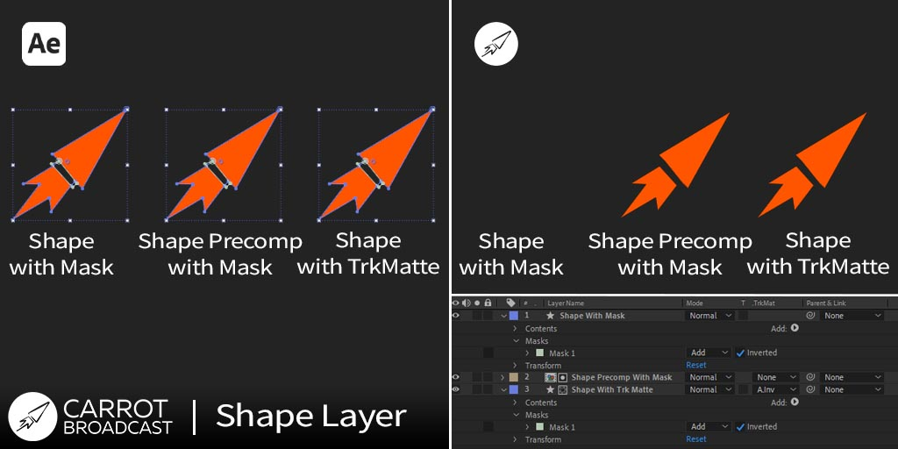

Векторные слои имеют ограничения по размеру композиции. Это нужно учитывать при построении архитектуры композиции. Для работы в режиме реального времени векторный слой растрируется и его **масштабирование более 100% может вызвать появление артефактов**. Аналогичным образом слой может обрезаться по границе композиции при масштабировании.

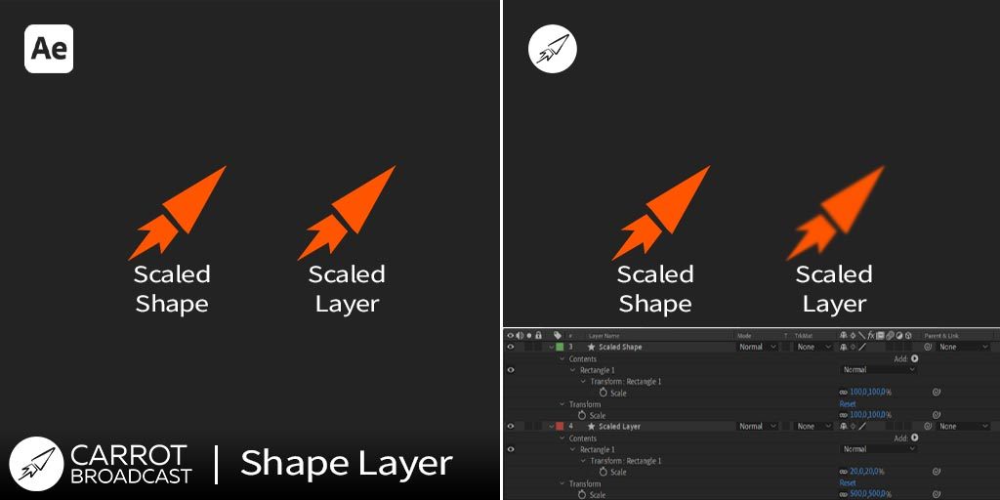

###### Text Layer

О работе с текстовыми блоками можно ознакомиться в `пункте 3.1.`

###### Media Layer

Для циклического воспроизведения видео в **Carrot** нужно указать `Loop Times` больше 1

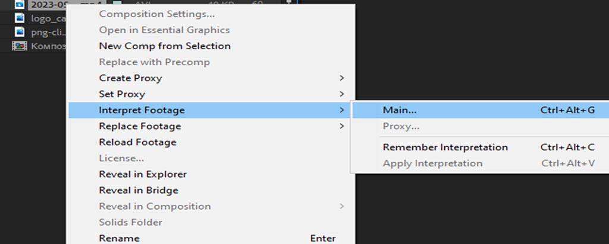

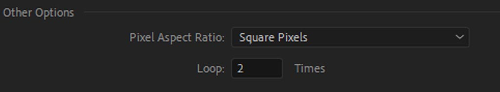

Важно учитывать `Frame Rate` шаблона и тракта (*настроенного в Carrot Flow Chart*), проигрывание всей медиа будет происходить с этим **FPS** (*ускорение или замедление при несоответствии Frame Rate*)

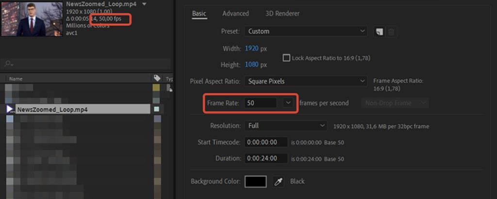

###### 3D слои

**Carrot Engine** считывает систему измерений из **After Effects** в **миллиметрах**.

`1000px в After Effects = 1000mm в Carrot Engine`


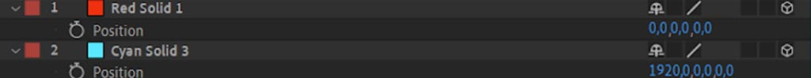

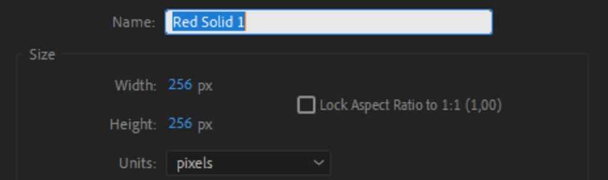

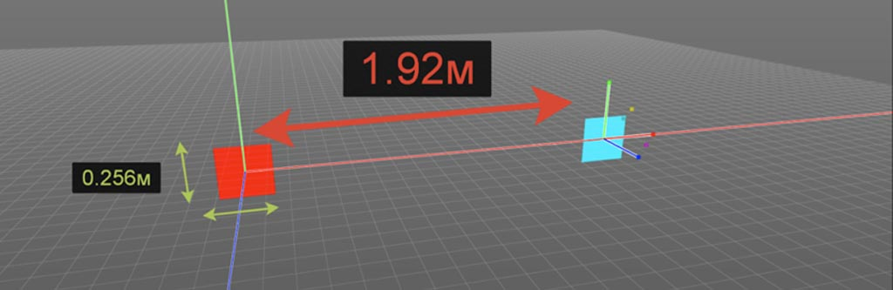

##### Эффекты наложения слоев и Track Matte

- `Track Matte` (Подложки отслеживания);
- `Parent Link` к другому слою или его свойствам (Привязка);
- `Blending Modes` (Режимы наложения).

###### Поддерживаемые типы наложений слоев и их особенности

| Поддерживаемые режимы наложения из AE в данный момент | Ограниченная поддержка (результат может отличаться от After Effects) |
| :---------------------------------------------------: | :------------------------------------------------------------------: |
|                     Linear Color                      |                              Pin Light                               |
|                   Silhouette Alpha                    |                               Hard Mix                               |
|                        Screen                         |                             Linear Light                             |
|                          Add                          |                              Difference                              |
|                        Lighten                        |                         Classic Color Dodge                          |
|                       Dissolve                        |                              Exclusion                               |
|                   Dancing Dissolve                    |                               Subtract                               |
|                        Darken                         |                                Divide                                |
|                       Multiply                        |                                 Hue                                  |
|                      Color Burn                       |                              Saturation                              |
|                      Linear Burn                      |                                Color                                 |
|                     Darker Color                      |                              Luminosity                              |
|                     Linear Dodge                      |                            Stencil Alpha                             |
|                     Lighter Color                     |                             Stencil Luma                             |
|                      Soft Light                       |                           Silhouette Luma                            |
|                      Color Dodge                      |                          Classic Color Burn                          |
|                      Vivid Light                      |                         Lighter Color Dodge                          |
|                                                       |                              Hard Light                              |
|                                                       |                               Overlay                                |

##### Работа с масками слоев

Ограничения при работе с Масками Слоёв:

- При булевых операция с масками, тип `Intersect` не должен идти первым. В этом случае, первую маску в режиме `Intersect` следует поменять на `Add`.

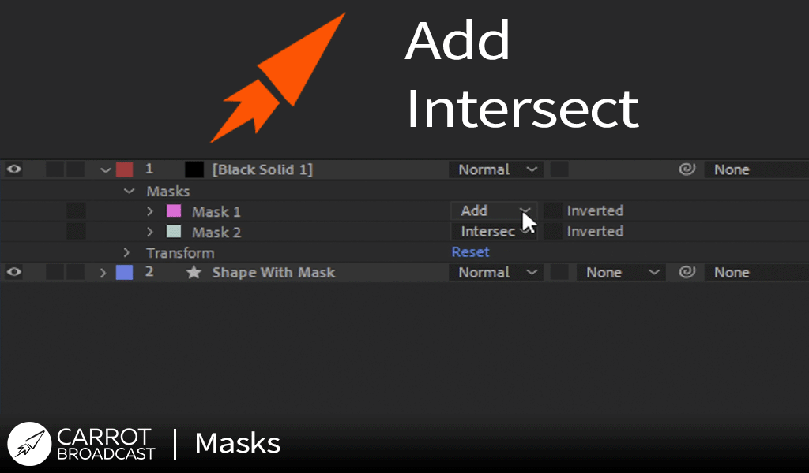

- `Мask Feather` использует исключительно **билинейную интерполяцию** (важно учитывать при масках с острыми углами и высоким значением `Feather`).
- Отрицательное значение свойства `Мask Expansion` использует проприетарный алгоритм отличный от **After Effects**, результат необходимо контролировать в `Template Preview`.
- Тип маски `None` в **Carrot** делает весь слой невидимым.

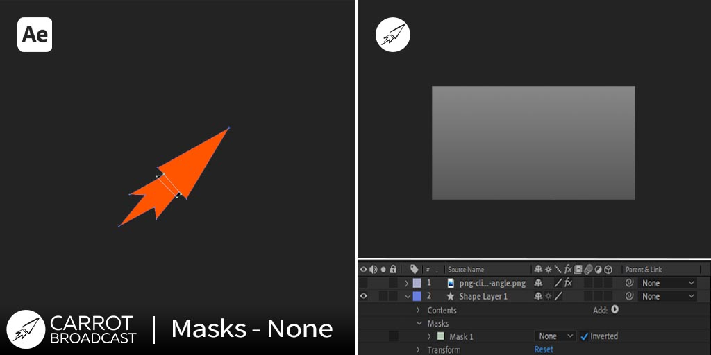

##### Анимация слоев

Необходимо ставить ключи анимации на всех вложенных композициях, иначе содержимое не будет обновляться при воспроизведении в **Carrot**. Более подробно о подготовке ключей анимации при экспорте шаблонов в **Сarrot** читайте в `"Шаг 4. Экспорт шаблона из проекта AE"`.

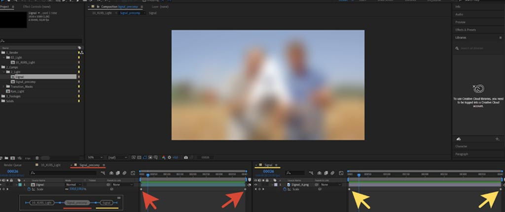

#### Работа с эффектами

##### Поддерживаемые эффекты и правила работы с ними

|**Поддерживаемые эффекты**              |
|:---------------------------------------|
| Blur & Sharpen - Sharpen               |
| Blur & Sharpen - Fast Box Blur         |
| Distort - Displacement Map             |
| Distort - Corner Pin                   |
| Time - Posterize Time                  | 
| Generate - Fill                        | 
| Generate - Gradient Ramp               | 
| Color Correction - Tritone             | 
| Color Correction - Tint                | 
| Color Correction - Levels              | 
| Color Correction - Curves              | 
| Expression Controls - 3D Point Control | 
| Expression Controls - Angle Control    | 
| Expression Controls - Checkbox Control | 
| Expression Controls - Color Control    | 
| Expression Controls - Point Control    | 
| Expression Controls - Slider Control   | 
| Transition - Wipes - Linear Wipe       | 

---

###### Ограничения

- `Gradient Ramp` работает только в режиме `Linear Ramp`.
- `Fill` – `Fill Mask` не поддерживается.
- Для работы с `Track Matte` со слоями на которых применены `Fast Box Blur` или `Displacement Map`, необходимо переместить слой с этими эффектами в `Precomposition`.

##### Fast Box Blur особенности и ограничения

Доступный для изменения параметр `Fast Box Blur` в **Carrot** — `Blur Radius`, остальные параметры эффекта фиксированные:

- `Repeat Edge Pixels` – On;
- `Iterations` - 3;
- `Blur Dimensions` – Horizontal and Vertical.

> - *При необходимости работы с `Track Matte` со слоем, к которому применён `Fast Box Blur`, данный слой предварительно переносится в `Precomposition`.*
> - *Для корректной работы `Fast Box Blur` должен находится первым в списке эффектов на слое. Аналогичным, но не предпочтительным, способом можно разместить слой с другими эффектами в `Precomposition`, на который уже применить `Fast Box Blur`.*

##### Posterize Time

Данный эффект используется для создания стоп-кадров, работает в значениях 50 и 0. Ключи должны быть жесткими.

*Пример использования: создания стоп-кадра в Carrot из проходного сигнала в момент запуска шаблона.*

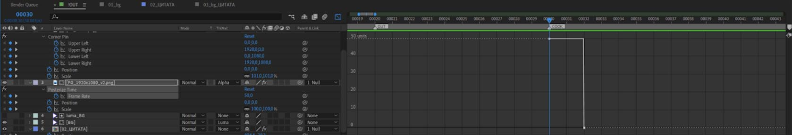

#### Работа с текстовыми блоками

##### Текстовые блоки, их возможности и ограничения

**Поддерживаемые параметры текстового слоя:**

- Поддерживаются: `Семейство шрифтов`, `Стиль шрифта`, `Размер шрифта`, `Треккинг (межбуквенное расстояние)`, `Интерлиньяж`, `Кернинг (исключительно "Metrics")`, `Обводка`, `Вертикальное масштабирование` и `Дополнительные стили (исключительно "Заглавные (All Caps)")`.
- Не импортируются: для `point text` переносы текста (*расставленные в After Effect*), посимвольные эффекты (*Text Animator*).
- При экспорте текстовых анимаций, созданных с использованием инструмента **Text Animator** в приложение **Template Preview** отсутствует поддержка работы параметров управления плавностью переходов анимации, таких как `Ease High` и `Ease Low`.
- При работе с текстовыми блоками необходимо учитывать что для отображений всего текстового блока в **Carrot** используется **стиль** **первого символа этого блока**

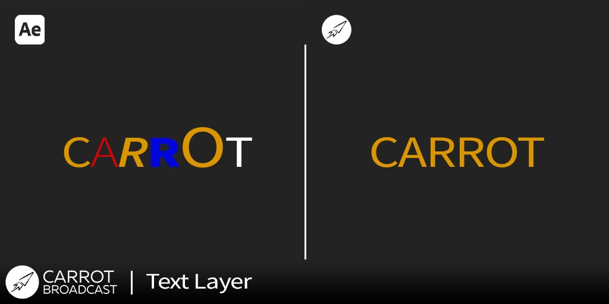

##### Особенности работы и ограничения работы со шрифтами

Используемые сторонние шрифты рекомендуется устанавливать в систему в формате `OTF`. Предварительно рекомендуется проверить отрисовку всех символов (*Ё,Й,Ж,Щ,О,0 и пр.*).

#### Работа с медиа (секвенциями, видео и сигналами SDI)

##### Работа с медиа ресурсами

**Ограничения:**

- Не поддерживаются: `Duration of clip` и `Remapping`.
- Видео должны быть в формате `HD`, `FHD`, `2K`, `4K` и т.д., либо разрешение должно быть **кратно** **степени** **двойки**.
- Рекомендованные кодеки: `H264`, `HVENC`, либо `PNG-секвенции`.
- Медиа в `H264`, `HVENC`, `Prores` должны иметь захлесты без содержимого в начале и конце видео на **5-10 кадров**. В противном случае, при последующих проигрываниях шаблона заново, могут появляться старые кадры видео.
- Медиа в высоком разрешении рекомендуется использовать в кодеке `HVENC`, чтобы обрабатываться видеокартой и иметь высокую производительность, либо `png секвенцией`.

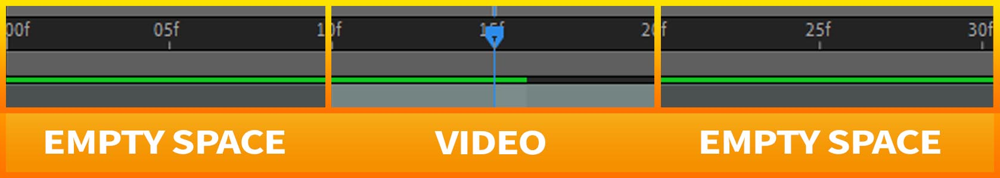

##### Работа с SDI сигналом

**Правила использования плейсхолдеров**

`Placeholder` - изображение, которое в дальнейшем будет использоваться **Carrot** для отображения содержимого других шаблонов, пользовательского медиа или входного сигнала. Должен иметь идентичные свойства (*разрешение*) используемых источников.

Используя в дальнейшем слой с плейсхолдером как переменную, содержимое будет заменяться на всех слоях, использующих эту `PNG`.

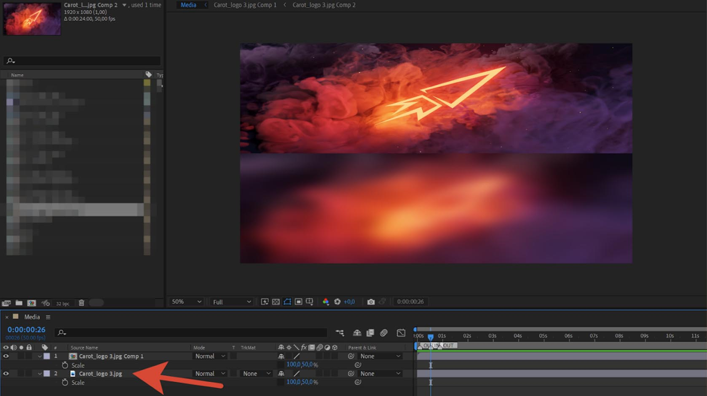

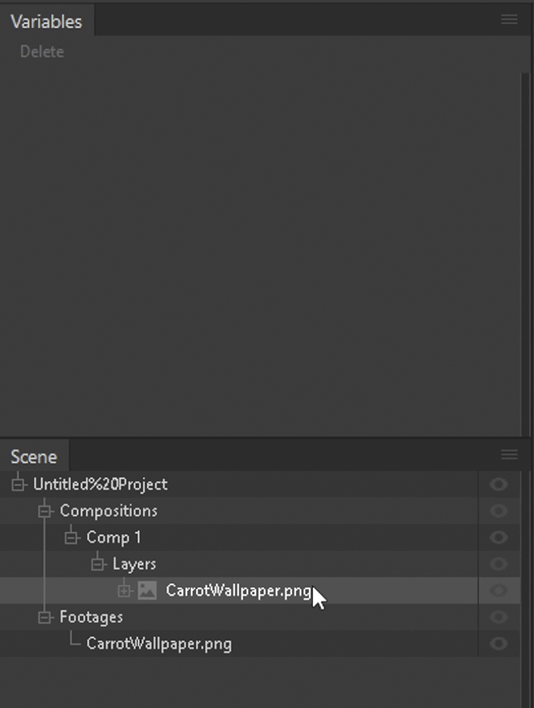


#### Работа с выражениями (Expression)

##### Особенности работы с выражениями

В рамках работы с выражениями через `Expressions` и `Carrot Scripts` поддерживаются следующие методы:

`Global:`
```
- comp(name)
- footage(name)
- thisProject
- thisComp
- thisLayer
- thisProperty
- time
- value
```

`Other Math:`
```
- degreesToRadians(degrees)
- radiansToDegrees(radians)
```

`Comp:`
```
- Comp.layer(index)
- Comp.layer(name)
- Comp.width
- Comp.height
- Comp.duration
- Comp.name
```

`Footage:`
```
- Footage.width
- Footage.height
- Footage.duration
- Footage.pixelAspect
- Footage.name
```

`Property:`
```
- value
```

`Layer Sub-objects:`
```
- Layer.effect(name)
- Layer.effect(index)
```

`Layer General:`
```
- Layer.width
- Layer.height
- Layer.index
- Layer.parent
- Layer.hasParent
- Layer.inPoint
- Layer.outPoint
- Layer.startTime
```

`Layer Properties:`
```
- Layer.anchorPoint
- Layer.position
- Layer.scale
- Layer.rotation
- Layer.opacity
- Layer.name
```

`Layer 3D:`
```
- Layer.orientation
- Layer.rotationX
- Layer.rotationY
- Layer.rotationZ
```

**Text:**

Text.Font - используйте TextSource.FontSize, т.к. Carrot использует свой метод отрисовки текста.

Поддержка остальных методов не гарантируется, но возможна после обращения в техническую поддержку.

Для выражений используется логика и синтаксис аналогично `JavaScript Expression Engine`, которая отличается от `ExtendScript`, который может быть выставлен по умолчанию.

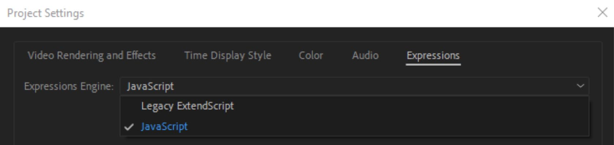

Подробнее по [ссылке.](https://helpx.adobe.com/au/after-effects/using/legacy-and-extend-script-engine.html)

**Особенности метрических систем Adobe After Effects и Carrot Engine/Unreal Engine!**

**SourceRectAtTime.width** (*получение ширины слоя в пикселях*), применяемый к текстовому слою вернет в **Carrot** значение аналогично **AE** (1000), если применять фунцию к **Solid** слою, вернется значение в **1000** меньше (*0,5 вместо 500*), соответственно расчёты станут неверными, если не делать доп преобразований.

Для необходимости сопоставления объектов с трекинг данными от трекинг систем (*stYpe, MoSys и т.д.*) в **Carrot** используется преобразование входящих значений в **unit**, где **1 unit = 1/1000px** (*система измерения AE*). Это преобразование не касается **Text Layer**.

На производительность влияет по большей части не содержание выражений, а их количество в проекте.

##### Расширенные [custom] выражения реализованные посредством Carrot Script. (примеры)

| **РАБОТА СО ВРЕМЕНЕМ** |               |                                                                                                      |
|:---------------------- |:--------------|:-----------------------------------------------------------------------------------------------------|
| **Команда**            | **Аргументы** | **Описание**                                                                                         |
| time                   | \-            | Возвращает значение времени AE композиции в секундах                                                 |
| thisComp.CurrentTime   | \-            | Возвращает значение времени AE композиции в секундах                                                 |
| st.hour                | \-            | Возвращает значение часа системного времени в формате от 0 до 59                                     |
| st.minute              | \-            | Возвращает значение минут системного времени в формате от 0 до 59                                    |
| st.second              | \-            | Возвращает значение секунд системного времени в формате от 0 до 59                                   |
| st.gethour()           | \-            | Возвращает значение часа системного времени в формате от 00 до 59                                    |
| st.getminute()         | \-            | Возвращает значение минут системного времени в формате от 00 до 59                                   |
| st.getsecond()         | \-            | Возвращает значение секунд системного времени в формате от 00 до 59                                  |
| st.gethouroffset       | (hh,mm,ss)    | Возвращает значение часа системного времени + смещение в формате от 00 до 59                         |
| st.getminuteoffset     | (hh,mm,ss)    | Возвращает значение минут системного времени + смещение в формате от 00 до 59                        |
| st.getsecondoffset     | (hh,mm,ss)    | Возвращает значение секунд системного времени + смещение в формате от 00 до 59                       |
| st.gethourinv          | (hh)          | Возвращает пользовательское значение - значение часа системного времени в формате от 00 до 59        |
| st.getminuteinv        | (mm)          | Возвращает пользовательское значение - значение минут системного времени в формате от 00 до 59       |
| st.getsecondinv        | (ss)          | Возвращает пользовательское значение - значение секунд системного времени в формате от 00 до 59      |
| st.getcounthour        | (hh,mm,ss)    | Возвращает разницу между пользовательским значением часа и текущим системным в формате от 00 до 59   |
| st.getcountminute      | (hh,mm,ss)    | Возвращает разницу между пользовательским значением минут и текущим системным в формате от 00 до 59  |
| st.getcountsecond      | (hh,mm,ss)    | Возвращает разницу между пользовательским значением секунд и текущим системным в формате от 00 до 59 |

| **РАБОТА С ТЕКСТОМ**            |                     |                                                                     |                                                                                                            |
|:--------------------------------|:--------------------|:--------------------------------------------------------------------|:-----------------------------------------------------------------------------------------------------------|
| **Команда**                     | **Аргументы**       | **Описание**                                                        | **Пример**                                                                                                 |
| TextSource.Text                 | \-                  | Возвращает/задает текстовое значение указанного текстового слоя     | thisComp.layer(1).TextSource.Text<br><br>comp("MainComp").layer("TextLayer").TextSource.Text = "TextValue" |
| TextSource.BoxTextSize          | \-                  | Возвращает размер Paragraph Text Box указанного текстового слоя     | thisComp.layer(1).TextSource.BoxTextSize                                                                   |
| TextSource.BoxTextSize.setValue | (\[width, height\]) | Задает размер Paragraph Text Box указанного текстового слоя         | thisComp.layer(1).TextSource.BoxTextSize.setValue(\[300, 100\])                                            |
| lastcharpos()                   | \-                  | Возвращает координаты последнего символа указанного текстового слоя | thisComp.layer(1).lastcharpos()                                                                            |
| charpos                         | (number)            | Возвращает координаты выбранного символа указанного текстового слоя | thisComp.layer(1).charpos(1)                                                                               |

| **РАБОТА С ЭФФЕКТАМИ**        |                  |                                                                                        |                                                                       |
|:------------------------------|:-----------------|:---------------------------------------------------------------------------------------|:----------------------------------------------------------------------|
| **Команда**                   | **Аргументы**    | **Описание**                                                                           | **Пример**                                                            |
| effect("Fill").Color          | \-               | Возвращает значение цвета эффекта "Fill" у указанного слоя                             | thisComp.layer(1).effect("Fill").Color                                |
| effect("Fill").Color.setValue | (\[R, G, B, A\]) | Задает значение цвета эффекта "Fill" у указанного слоя в формате Normalized Float RGBA | thisComp.layer(1).effect("Fill").Color.setValue(\[0.1, 0.5, 0.9, 0\]) |

#### Оптимизация

##### Правила оптимизации

Для сохранения производительности рекомендуется использовать `PNG`, как альтернативу `Solid` с круглыми масками и эффектом градиента.

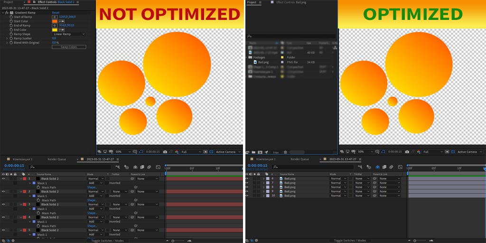

Используем вместо нескольких видео - **1 видеоатлас**.

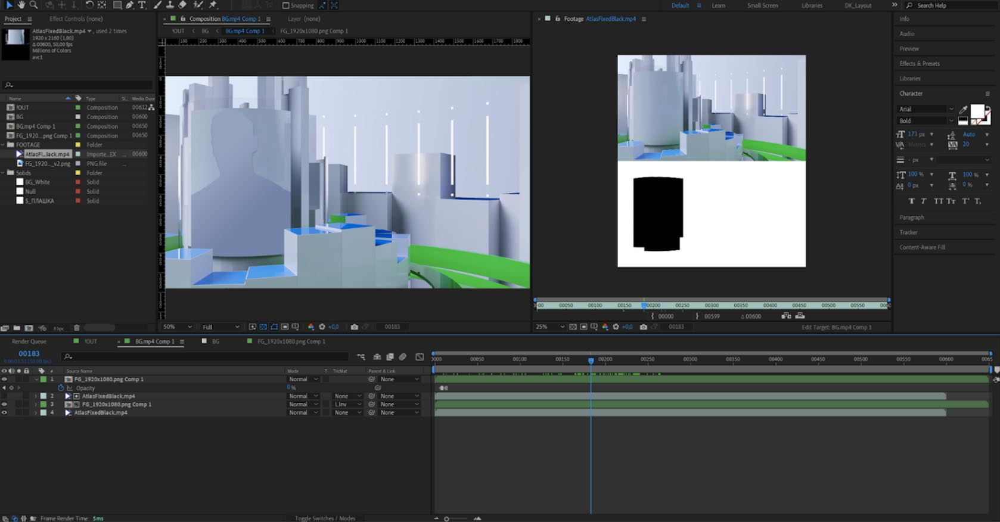

##### Уборка мусора

Перед экспортом надо нажать на головную композицию и сделать `File - Dependencies - Reduce Project`.

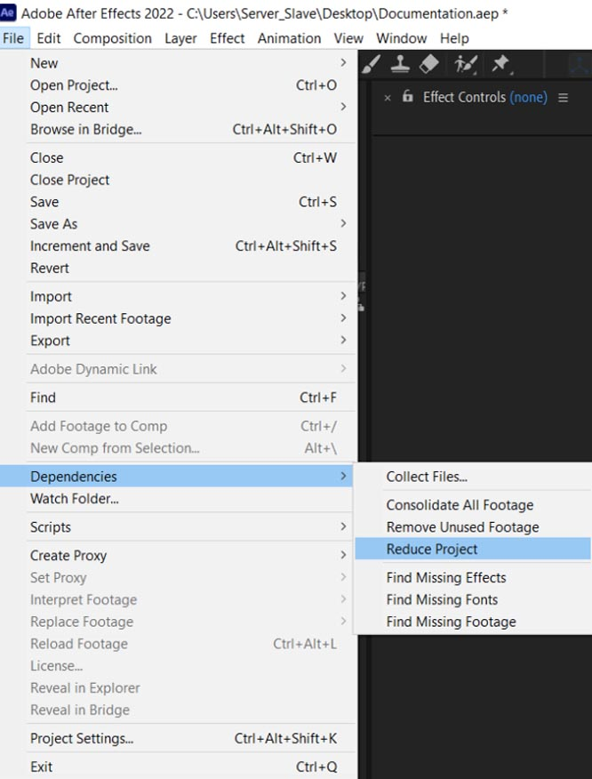

##### Размер и количество композиций

Рекомендуются избегать избыточных вложений `Precomposition` и держать глубину вложенности проекта в пределах **1-2 композиций**.

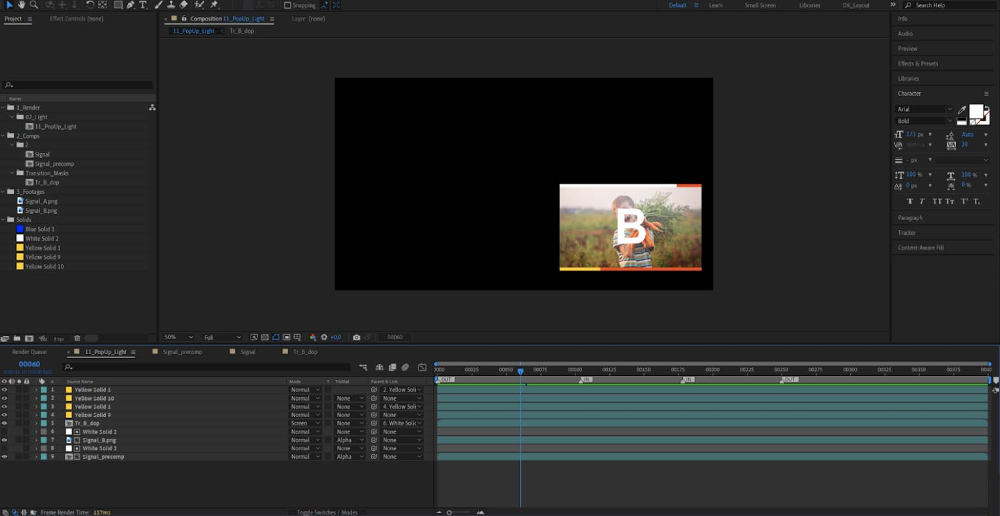

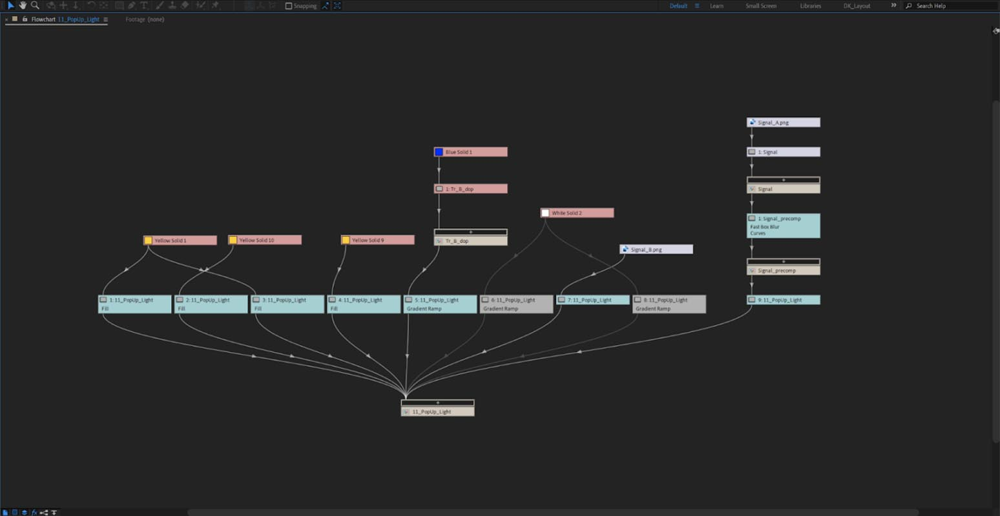

> Рекомендуется уменьшение общего числа композиций и количества одновременно используемых эффектов.

##### Работа с масками в кривых

Маски с кривыми могут негативно повлиять на производительность при больших разрешениях композиции, рекомендуется использовать острые углы или `png`.

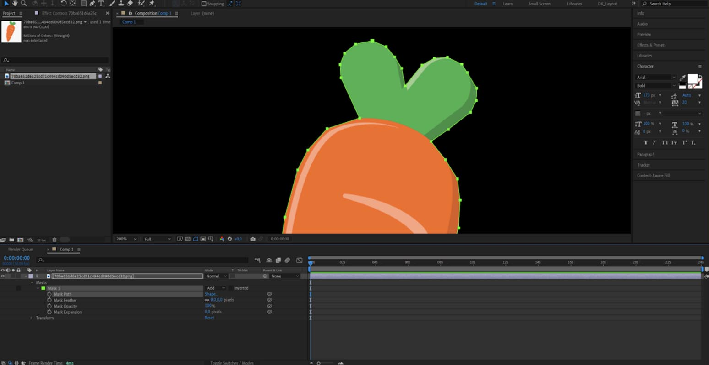

### Установка Carrot AE Plugin

**Carrot System Monitor** устанавливается на тех рабочих станциях, на которых установлен **After Effects** и которые предполагается использовать для экспорта шаблонов на **Carrot Server**.

**AE плагины:**

|Ревизия Carrot|Версия плагина|
|:-------------|:-------------|
|2864-по актуальную версию|AEGP_1.0.0_RC_3_2864|
|4165-по актуальную версию|AEGP_1.0.0_RC_4_4165 (добавлена проверка на недопустимые названия файлов при экспорте проекта из АЕ)|

Для установки **Carrot AE Plugin** необходимо выполнить следующее:

1. Скопируйте папку `AEGP` в директорию `C:/Program Files/Adobe/Common/Plug-ins/7.0/MediaCore`;

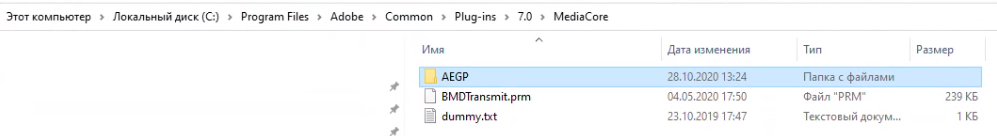

2. Запустите **InitSettings** в папке `Carrot/Bin` от имени администратора.

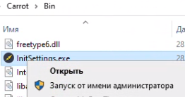

### Настройка Carrot AE Plugin

Для настройки **Carrot AE Plugin** необходимо выполнить следующее:

1. Запустите **Carrot Server** `ServerWS.exe`.
2. Убедитесь в том, что в настройках **Carrot Template Preview** указан адрес необходимого сервера и номер порта для получения трекинг данных.
3. Плагин готов к работе.

### Настройка AE проекта для Carrot

#### Настройки композиции

1. Запустите Adobe After Effects.
2. Откройте проект.
3. На панели **Project** откройте корневую композицию, которую хотите экспортировать.

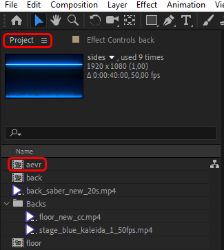

4. Выберите меню **Composition** > **Composition Settings...** или нажмите клавиши **CTRL**+**K**.

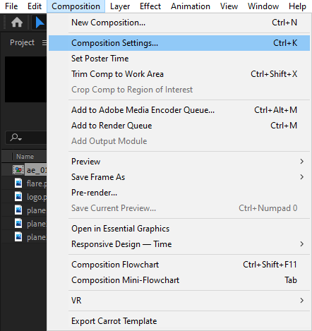

5. Проверьте разрешение и частоту кадров композиции.

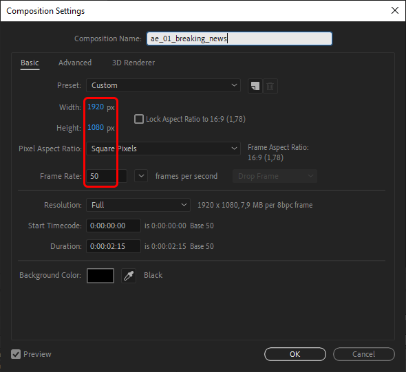

> Частота кадров композиции должна совпадать с частотой кадров видеотракта.
>
> Разрешение композиции должно совпадать с разрешением контейнера в схеме движка Carrot.
>
> 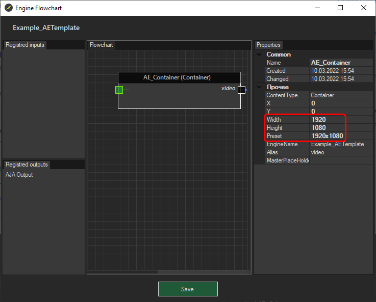

6. Удалите из проекта все неиспользуемые элементы. Для этого выберите **File** > **Dependencies** > **Remove Unused Footage**.

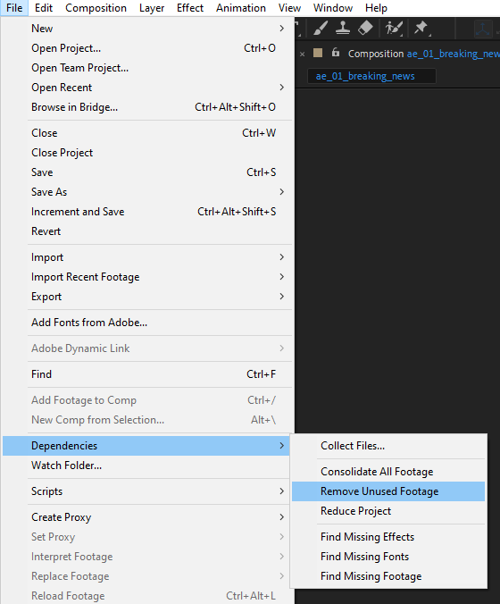

#### Указание точек входа и выхода анимации

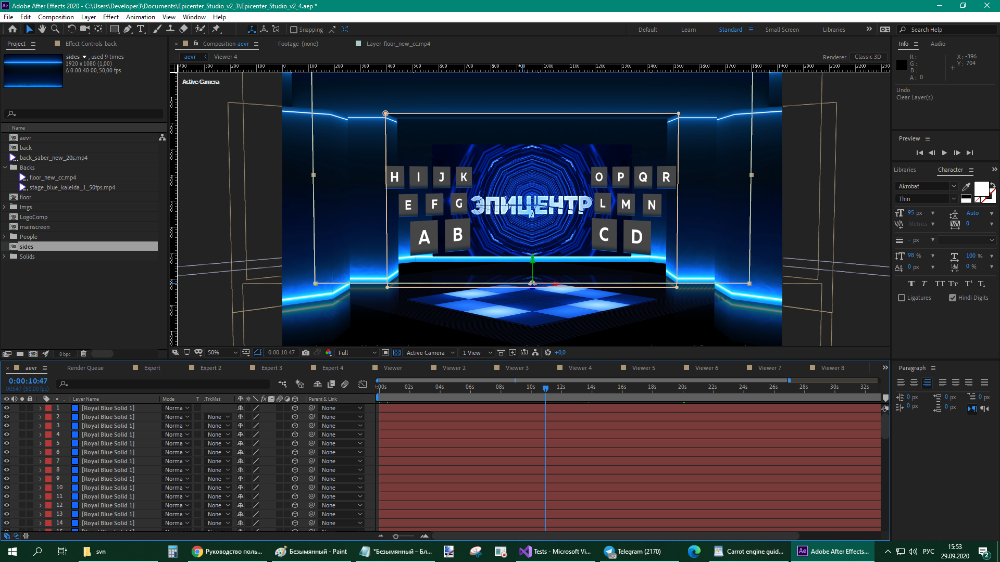

Для того, чтобы Carrot распознал отрезки анимации, пользователю требуется выставить маркеры композиции. Композиция должна содержать минимум 3 маркера. Если в других композициях присутствуют какие-либо маркеры, то их следует удалить.

Для того, чтобы добавить маркера:

1. Переместите ползунок в начало композиции (или анимации) и поставьте первый маркер с помощью клавиши **Numpad «\*»** на цифровой клавиатуре или выберите **Layer** > **Markers** > **Add Marker**:

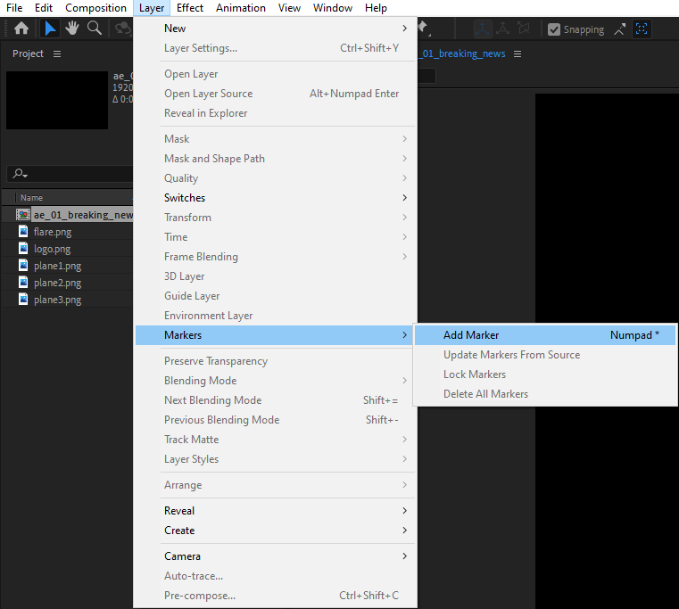

2. Щелкните правой кнопкой мыши по добавленному маркеру и выберите **Settings...**

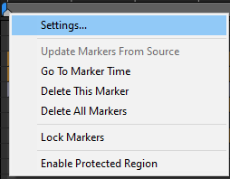

3. В открывшемся окне измените комментарий маркера на `OUT`.

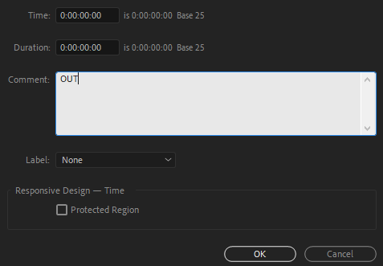

4. Переместите ползунок в середину композиции и поставьте следующий маркер.

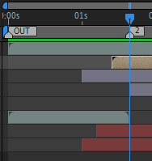

5. Измените комментарий маркера на `IN`

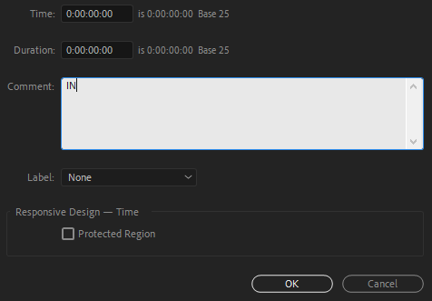

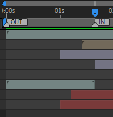

6. Переместите ползунок в конец композиции и поставьте следующий маркер.

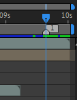

7. Измените комментарий маркера на `OUT`.


Расположение маркеров будет выглядеть следующим образом:

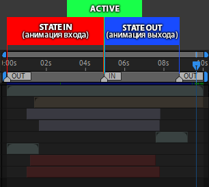

Здесь присутствуют два временных промежутка:

- `OUT` - `IN` (в движке именуется как `IN`)
- `IN` - `OUT` (в движке именуется как `OUT`)

Воспроизведение в движке этого шаблона будет выглядеть следующим образом:

- Шаблон не активен, графика не показывается.
- Шаблон активируется, проигрывается область между маркерами `OUT`-`IN`.
- Шаблон активен, графика остаётся на позиции маркера `IN` и именуется как `ACTIVE`.
- Шаблон деактивируется, проигрывается область между маркерами `IN`-`OUT`.

7. Сохраните проект.

> ***Важно!***
>
> Пользователю важно помнить, что при создании `Precomposition` необходимо исключать использование маркеров.

#### Указание точек дополнительных анимаций

Композиция также может содержать дополнительные анимации помимо стандартных для входа и выхода. Для них также следует добавить маркеры. Для этого:

1. Переместите ползунок в начало желаемой анимации и добавьте новый маркер.
2. Измените комментарий маркера.
3. Переместите ползунок в конец желаемой анимации и добавьте ещё один маркер.
4. Измените комментарий маркера на желаемый.

Пример:


Здесь присутствуют три временных промежутка:

- `OUT` - `IN` (в движке именуется как `IN`)
- `IN` - `ANIM` (в движке именуется как `ANIM`)
- `ANIM` - `OUT` (в движке именуется как `OUT`)

Область между маркерами с одинаковыми именами (в примере `ANIM`-`ANIM`) игнорируется в **Carrot Engine** и пропускается при воспроизведении.

#### Дополнительная информация и рекомендации

##### Проект

Каждый шаблон рекомендуется сохранять в свой отдельный проект **After Effects**.

> При экспорте шаблона из **After Effects** информация о всех композициях и контенте в проекте (в том числе неиспользуемых) передаётся и обрабатывается движком Carrot.

##### Эффекты

Поддерживаемые эффекты из **After Effects** в **Carrot Engine** в режиме реального времени:

- *Blur & Sharpen* - **Sharpen**
- *Generate* - **Fill**
- *Generate* - **Gradient Ramp**
- *Color Correction* - **Tritone**
- *Color Correction* - **Tint**
- *Color Correction* - **Levels**
- *Color Correction* - **Curves**
- *Expression Controls* - **3D Point Control**
- *Expression Controls* - **Angle Control**
- *Expression Controls* - **Checkbox Control**
- *Expression Controls* - **Color Control**
- *Expression Controls* - **Point Control**
- *Expression Controls* - **Slider Control**
- *Transition* - *Wipes* - **Linear Wipe**

##### Композиции и слои

- Ключи анимации должны располагаться по краям кадров.

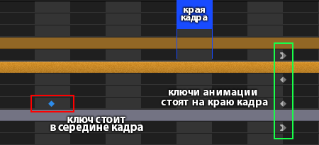

- Слои, отмеченные в композиции как `Guide Layer` следует скрыть или удалить перед экспортом.
- При использовании логики **IF ELSE** внутри выражений, для корректной обработки в **Carrot Engine**, структура должна выглядеть следующим образом:

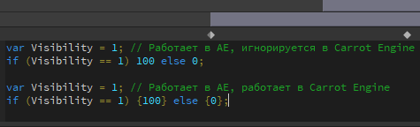

- Все выражения, которые не требуют обработки в реальном времени, рекомендуется конвертировать в ключи анимации перед экспортом.

Поддерживаемые типы слоев в композиции:

- **Null Layer**
- **Solid Layer**
- **Shape Layer**, конвертированные в кривые Безье (без операций с контурами)
- **Text Layer** (без эффектов аниматора)
- **Media Layer** (MP4, MOV, JPG, PNG, PSD и т.д.)

> В целях оптимизации шаблона и проекта PSD/AI слои внутри композиции рекомендуется заменить на Solid Layer, либо на готовое изображение PNG или JPG.

Поддерживаемые операции со слоями:

- **Track Matte** (Подложки отслеживания)
- **Parent Link** к другому слою или его свойствам (Привязка)
- **Blending Modes** (Режимы наложения)
- **Masking** (Маски)
- **Expressions** (Выражения)

##### Маски

- Маска в режиме наложения `None` скрывает отображение слоя в **Carrot Engine**.
- Единичную маску в режиме `Intersect` следует поменять на `Add`.
- Свойство `Mask Feather` по умолчанию в **Carrot Engine** использует бикубический режим сэмплинга.

##### Текст

- **Carrot Engine** считывает свойства текста (шрифта, размер, цвет, интервалы и т.д.) по первому символу и применяет их на все остальные символы.
- **Carrot Engine** принудительно применяет для кернинга текста тип `Metrics`.
- Используемые сторонние шрифты рекомендуется устанавливать в систему в формате **OTF**.

##### 3D слои

- **Carrot Engine** считывает систему измерений из After Effects в миллиметрах, т.е. 1000px в **After Effects** = 1000mm в **Carrot Engine**.
- Для вращения слоя следует использовать свойство **Orientation**.

### Экспорт шаблона из проекта After Effects

#### Экспорт шаблона

>***Важно!***
>
>Перед экспортом AE шаблона, пользователю важно убедиться, что проект After Effects сохранён на его рабочей станции, в противном случае, попытка экспорта AE шаблона будет неудачной.

1. Выберите меню `Composition` - `Export Carrot Template`.

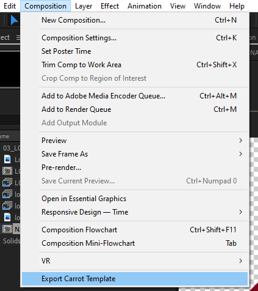

> Примечание: если этот пункт не активен, нажмите на раздел с композициями в нижней части интерфейса **After Effects**. 2. Появится окно **Template Preview**.

2. Откройте вкладку `Animation` в центральном разделе `Viewport`.

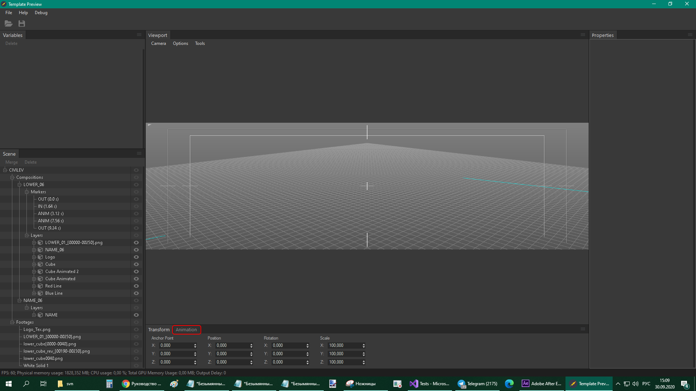

3. В поле `Composition` выберите композицию, которая была экспортирована:

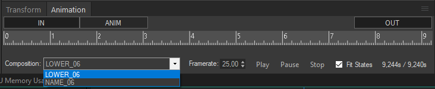

Благодаря маркерам здесь появились три стейта:

- `IN` (соответствует промежутку `OUT`-`IN`)
- `ANIM` (соответствует промежутку `IN`-`ANIM`)
- `OUT` (соответствует промежутку `ANIM`-`OUT`)

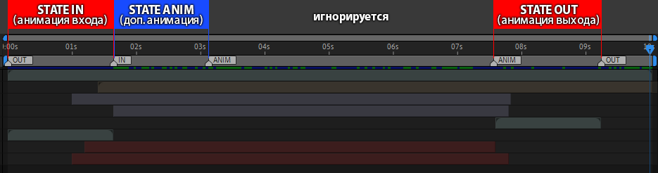

4. Проверьте правильность воспроизведения анимации:

- Нажмите на название стейта.

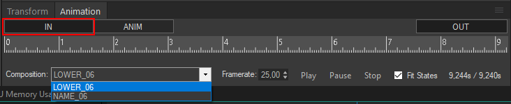

- Дождитесь завершения проигрывания.

5. Нажмите кнопку `Save Template`.


6. В новом окне выберите директорию для сохранения шаблона.

7. В поле `Name` задайте название шаблона.

8. Нажмите на поле `Container`.

9. В появившемся окне выберите нужную схему движка и укажите соответствующий контейнер.


10. Нажмите на кнопку **Save Template**.

11. Закройте **Template Preview**

#### Создание переменных

Текстовые или медиа слои могут выступать в качестве оперативно изменяемых параметров шаблона в **Carrot Web Playlist**:


Для назначения слоя в качестве переменной выполните следующее:

- Выберите требуемый слой
- Зажмите левую кнопку мыши и перетащите его в раздел **Variables**.


- Выберите созданную переменную
- В поле `Name` введите желаемое имя переменной.


- В поле `Type` укажите необходимый тип переменной.

#### Создание текстовой переменной


Для назначения текстового слоя в качестве переменной выполните следующее:

1. Раскройте слой и найдите свойство `Source Text`.
2. Зажмите левую кнопку мыши и перетащите его в раздел **Variables**.


- В поле `Name` введите желаемое имя переменной.
- В поле `Type` укажите тип `Text` или `RichText`.

> В случае, если указан тип `RichText`, к содержимому поля `DefaultValue` добавится тег изначального цвета текста:
>
> 

```xml
"<font color=\"#000000\">Text Sample</font>"
```

## Работа с Unreal Engine 5

В данном разделе можно ознакомиться с установкой **Unreal Engine 5**, а также обучиться созданию и настройке его проектов для взаимодействия с **Carrot**.

> Перед началом работы, необходимо произвести установку (инициализацию) и первоначальную настройку приложений **Carrot**.

### Установка Epic Games Launcher

Для установки **Epic Games Launcher** необходимо:

1. Перейти на сайт [`Epic Games Store`](https://store.epicgames.com/) и нажать на кнопку [`Загрузить/Download`](https://launcher-public-service-prod06.ol.epicgames.com/launcher/api/installer/download/EpicGamesLauncherInstaller.msi?trackingId=dc4b0d2024ff48528e324e6a3e5ba8cf) и дождаться завершения загрузки установщика.


2. После загрузки установщика **Epic Games Launcher** необходимо его запустить и провести процедуру инсталяции на локальную рабочую станцию.
3. Запустить установленный **Epic Games Launcher** и авторизоваться (создать или войти в учётную запись) в нём.


> В случае, если не удаётся войти в учётную запись при нажатии на кнопку `Войти позже` в окне авторизации, установка **Unreal Engine** будет невозможна.

4. С целью скрытия информации некасающейся работы с **Unreal Engine 5**, следует соблюсти следующие действия:

- перейти в раздел **"Параметры"**;


- включить параметры **"Скрыть игровую библиотеку"** и **"Запустить при включении компьютера"**;
- отключить параметры **"Отображать игровые уведомления"** и **"Показывать уведомления о новостях и специальных предложениях"**.


### Установка Unreal Engine 5

Для установки **Unreal Engine 5** необходимо:

1. Открыть **Epic Games Launcher**, перейти в раздел **Unreal Engine** и нажать на вкладку **"Библиотека"**.


2. Нажать кнопку `+` и выпадающем списке выбрать необходимую версию **Unreal Engine**.


3. Нажать кнопку `Установить` и дождаться окончания инсталляции **Unreal Engine**.

> В случае установки **Unreal Engine** впервые, после нажатия кнопки `Установить` отобразится окно **Параметры установки**. С целью оптимизации процесса установки, следует отключить компоненты, не будут использоваться при работе с **Carrot**, а именно: `Android`, `IOS` и `Linux`
>
> 

### Создание проекта Unreal Engine 5

Для создания проекта в **Unreal Engine 5**, необходимо:

1. Запустить установленный **Unreal Engine** с помощью соответствующей кнопки.


2. После запуска **Unreal Engine** откроется окно **"Unreal Project Browser"**, в котором необходимо присвоить проекту имя и соблюсти следующие действия:

- нажать на вкладку `Games` (1);
- нажать на шаблон `Blank` (2);
- в свойствах проекта выбрать режим `BLUEPRINT` (проект без кода) (3);
- убрать галочку с параметра `Starter Content` (4);
- нажать кнопку `Create` (5).


### Установка Carrot Unreal Engine Plugin

Перед установкой **Carrot Unreal Engine Plugin** необходимо закрыть запущенный проект.

> Актуальные версии плагинов для **Unreal Engine**.
>
> |Наименование плагина|Поддерживаемая версия Unreal Engine|Примечание|
> |-------------------|----------|----------|
> |UEPlugin4.27_3.1.0_172|Unreal Engine 4.27|Отсутствует поддержка **Carrot Variables**. Строго указаны параметры камеры в ноде `Carrot Macro`.|
> |UEPlugin5.1_5.0_172.zip|Unreal Engine 5.1|Отсутствует поддержка **Carrot Variables**. Строго указаны параметры камеры в ноде `Carrot Macro`.|
> |UEPlugin5.2_5.0_172|Unreal Engine 5.2|Отсутствует поддержка **Carrot Variables**. Строго указаны параметры камеры в ноде `Carrot Macro`.|

Для установки **Carrot Unreal Engine Plugin** необходимо:

1. Открыть содержимое папки **Carrot Unreal Engine Plugin**.
2. Скопировать папки **"Carrot"** и **"CarrotEditor"** в папку **"VirtualProduction"** установленного **Unreal Engine**.


> По умолчанию установленный **Unreal Engine** располагается в следующей директории:
>
> `C:\Program Files\Epic Games\Версия_Unreal_Engine\Engine\Plugins\VirualProduction`
>
> В случае, если папка с наименованием **"Plugins"** отсутствует в директории с проектом, необходимо её **создать**.
>
> Информацию об используемой версии плагина можно узнать в файле **"Rev.txt"** из папок **"Carrot"** и **"CarrotEditor"**.

3. Запустить созданный проект **Unreal Engine**, открыть раздел **Edit** и перейти в окно **"Plugins"**;
4. Найти установленные плагины **"Carrot"** и **"CarrotEditor"** путём ввода в поисковую строку **"сarrot"**, и убедиться в том, что они включены.


### Настройка проекта Unreal Engine 5

Перед настройкой проекта **Unreal Engine** необходимо закрыть запущенный проект и отредактировать файл **"DefaultEngine.ini"**.

> Файл **"DefaultEngine.ini"** по умолчанию располагается в директории созданного **Unreal Engine** проекта, а именно:  
>
> `C:\Users\Имя_Пользователя\Documents\Unreal Projects\Наименование_Проекта\Config\DefaultEngine.ini`

Для редактирования файла **"DefaultEngine.ini"** можно воспользоваться текстовым редактором и скопировать в него следующие команды:

```Текстовые команды
[/Script/Engine.Engine]
GameEngine=/Script/Carrot.CarrotGameEngine
GameViewportClientClassName=/Script/Carrot.CarrotViewportClient
CustomTimeStepClassName=/Script/Carrot.CarrotCustomTimeStep

[/Script/WindowsTargetPlatform.WindowsTargetSettings]
DefaultGraphicsRHI=DefaultGraphicsRHI_DX12
```

> В качестве текстовых редакторов могут использоваться встроенные приложения Windows, такие как: "Блокнот", "WordPad" и т.п.

Для настройки проекта **Unreal Engine** необходимо:

1. Открыть созданный проект **Unreal Engine**.
2. Открыть окно создания уровней с помощью сочетания клавиш `Ctrl + N`, выбрать `Empty Level` и нажать кнопку `Create`.


3. Сохранить созданный уровень с помощью сочетания клавиш `Ctrl + S`, откроется окно **Save Level As**, в котором в строке `Name` ввести наименование сохраняемого уровня (в примере указывается **MainScene**) и нажать кнопку `Save`.
4. В разделе `Edit` перейти в настройки `Editor Preferences`, в строку поиска ввести наименование параметра **"Use Less CPU when in Background"** и отключить его.
5. В разделе `Edit` перейти в настройки `Project Settings` и проверить (в случае необходимости настроить) используя поисковую строку следующие параметры в соответствии с таблицей ниже:

| Наименование параметра | Значение параметра     |
|------------------------|------------------------|
| Custom TimeStep        | `CarrotCustomTimeStep` |

> Значение `CarrotCustomTimeStep` параметра **Custom TimeStep** позволяет обеспечить покадровую синхронизацию **Carrot** c трекинг данными и видеосигналом проекта **Unreal Engine**. С данным значением, количество FPS при работе с проектом **Unreal Engine** будет низким до момента его отображения в **Carrot Engine** и запуска в режиме **Play Mode**. Для увеличения количества FPS, на **время работы** с проектом **Unreal Engine**, рекомендуется параметру **Custom TimeStep** присвоить значение `None`, но после окончания работ, необходимо обратно установить значение `CarrotCustomTimeStep` .

|                            |                                                |
|----------------------------|------------------------------------------------|
| Game Viewport Client Class | `CarrotViewportClient`                         |
| Editor Startup Map         | `MainScene (Наименование сохранённого уровня)` |
| Game Default Map           | `MainScene (Наименование сохранённого уровня)` |
| Frame Buffer Pixel Format  | `8bit RGBA`                                    |
| Anti-Aliasing Method       | `Temporal Anti-Aliasing (TAA)`                 |

> В случае присвоения параметру **Anti-Aliasing Method** значения **Temporal Super-Resolution (TSR)**, возможна некорректная обработка отдельных графических элементов при взаимодействии с **Carrot**. 

|                                                                |                            |
|----------------------------------------------------------------|----------------------------|
| Custom Depth-Stencil Pass                                      | `Enabled with Stencil`     |
| Enable alpha channel support in post processing (experimental) | `Allow through tonemapper` |

6. После настройки параметров и закрытия соответствующего окна, необходимо адаптировать рабочее пространство к отображению полного переченя рабочей информации, для этого в разделе `Window` добавить следующие окна представленные в таблице ниже.


| Наименование окна | Назначение                                           |
|-------------------|------------------------------------------------------|
| `Outliner`        | Отображение всех используемых компонентов в проекте. |
| `Levels`          | Разграничение используемых компонентов по уровням.   |
| `Layers`          | Объединение компонентов в одну группу по слоям.      |

> В **Unreal Engine 5** имеется возможность включить интерфейс **Unreal Engine 4**, для этого необходимо перейти в раздел `Window`, выбрать `Load Layout` и **включить** параметр `UE4 Classic Layout`.

7. В результате адаптации рабочего пространства, следует также настроить:

- в окне **Outliner** нажать на кнопку `⚙` и включить параметр `Only in Current Level`;
- открыть окно **Content Drawer/Content Browser**, нажать кнопку `⚙ Settings` и отключить все параметры в разделе **Content**, кроме `Show Plugin Content`.


### Подготовка проекта Unreal Engine для работы с Carrot

Для подготовки проекта **Unreal Engine** к работе с **Carrot** необходимо:

1. Добавить с помощью кнопки `Quickly add to the project` на сцену главного уровня следующие компоненты представленные в таблице:

| Наименование раздела | Наименование компонента | Количество |
|----------------------|-------------------------|------------|
| **Basic**            | `Actor`                 | 3 шт.      |
| **Cinematic**        | `Cine Camera Actor`     | 1 шт.      |
| **Volumes**          | `Post Process Volume`   | 1 шт.      |


2. В окне **Outliner** выделить все добавленные компоненты, перейти в окно **Details** и в разделе настроек `Transform` сбросить параметр `Location` с помощью кнопки `Reset`.


3. Сгруппировать, а затем переименовать (c помощью клавиши `F2` при выделении компонента) компоненты **CameraNull**, **CameraOffsets**, **CameraParent** и **CarrotCamera** путём их перемещения по следующей иерархической модели:


|Порядковый номер|Наименование компонента|Тип компонента|Назначение|
|-------------------|----------|----------|----------|
|1|**CameraNull**|`Actor`|Разграничение логики перемещения виртуальной камеры в проекте относительно других объектов. Используется для свободного перемещения камеры в пределах уровня.|
|2|**CameraOffsets**|`Actor`|Передача значений точек смещения (Offset: X, Y, Z. Rotation: Pan, Tilt, Roll) виртуальной камеры. Используется для точечного позиционирования в пределах уровня.|
|3|**CameraParent**|`Actor`|Приём значений точек смещения (Offset: X, Y, Z. Rotation: Pan, Tilt, Roll) камеры. Позволяет перемещать виртуальную камеру на основе полученных значений от трекинг системы камеры.|
|4|**CarrotCamera**|`CineCameraActor`|Приём технических характеристик камеры (фокусное расстояние, размер сенсора и т.п.). Позволяет присвоить принятые технические характеристики виртуальной камере.|

4. Выбрать компонент **CarrotCamera**, перейти в окно **Details**, найти в разделе `Current Camera Settings` настройку `Lens Settings` и параметру `Min Focal Length` выставить значение `0.001mm`.


5. Выбрать компонент **PostProcessVolume**, перейти в окно **Details**, перейти в раздел `Post Process Volume Settings` и включить настройку `Infinite Extent (Unbound)`, затем в разделе `Rendering Features` найти настройку `Post Process Materials` и **добавить** параметру `Array` **2 значения** с помощью кнопки `⊕`, а именно:

- **Значение № 1**: нажать `Choose`, выбрать `Asset reference` и присвоить используя поисковую строку значение `PostProcMat_Alpha`;

> Данное значение необходимо для реализации функционала работы **CustomStencil**.

- **Значение № 2**: нажать `Choose`, выбрать `Asset reference` и присвоить используя поисковую строку значение `PostProcMat_Frames`.

>Данное значение необходимо для синхронизации кадров между проектом **Unreal Engine** и **Carrot Engine**.


6. С помощью элемента `List of world Blueprints available to the user for editing or creation` нажать на кнопку `Open Level Blueprint`.


> В результате проделанных действий откроется **система визуального программирования (Level Blueprint)**, где в окне **Event Graph** отобразятся следующие ноды (блоки распределения и обработки данных, действий, а также событий), представленные в таблице:
>
> 
>
> |Наименование ноды|Назначение|
> |-------------------|----------|
> |`Event BeginPlay`|Однократная активация события при запуске уровня.|
> |`Event Tick`|Покадровая активация события.|

7. Из точки выхода ноды `Event BeginPlay` проложить связь (используя `левую кнопку мыши (ЛКМ)`) в свободное пространство окна **Level Blueprint**.


8. В появившемся окне **Executable actions** с помощью поисковой строки найти ноду `Carrot Macro` и добавить её.


9. Из проекта **Unreal Engine** переместить компоненты **CameraOffsets**, **CameraParent** и **CarrotCamera** в окно **Level Blueprint**, затем соединить все добавленные ноды с **Carrot Macro** в следующем порядке:

- ноду `Event Tick` с точкой входа `Event Tick`;
- ноду `CameraOffsets` с точкой входа `Tracking Offsets`;
- ноду `CameraParent` с точкой входа `Camera Parent`;
- ноду `CarrotCamera` с точкой входа `Cine Camera`.


10. Из точки выхода `Command Loop` ноды `Carrot Macro` проложить связь в свободное пространство окна **Level Blueprint**, в открывшемся окне с помощью поисковой строки найти ноду `Switch on String`, затем соединить точку выхода `Command` ноды `Carrot Macro` с точкой входа `Selection` у ноды `Switch on String`.


11. В ноде `Switch on String` с помощью команды `Add pin ⊕` создаём требуемое количество строк (ивентов). В качестве **примера** будут рассматриваться **5 строк (ивентов)**, представленные в таблице ниже.

|Наименование строки (ивента)|Назначение|
|-------------------|----------|
|`START`|"Пустой ивент". Используется для отображения уровня в Carrot Engine с объектива виртуальной камеры.|
|`SHOW`|Включение режима отображения графики.|
|`HIDE`|Отключение режима отображения графики.|
|`PLAY`|Воспроизведение анимации.|
|`RESET`|Сброс анимации.|


> **Переименовать** созданные строки (ивенты) можно в настройках `Pin Names` раздела `Pin Options` в окне **Details** (по умолчанию находится справа при выделении ноды). 
>
> **Во избежаение некорректной работы системы**, строку (ивент) `Default` следует **удалить**, путём нажатия на неё `правой кнопкой мыши (ПКМ)` и выбора команды `Remove Execution Pin`.
>
> Присвоенное строке имя, будет отображаться в Web Playlist (Carrot Dashboard) в качестве **ивента**.
>
> Созданная строка (ивент) в ноде **Switch on String** запускает созданный сценарий (используя другие ноды **Level Blueprint**) после себя, тем самым реализуя различный функционал, например: **воспроизведение и сброс анимации**, **включение режима отображения графики** и т.п.

12. **Нажать** кнопку `🖫` (`Save`) и **запустить** процесс компиляции с помощью соответствующей кнопки `Compile`.

> В случае, если после запуска процесса компиляции, отобразилось сообщение **ERROR!** у ноды `Carrot Macro`, необходимо убедиться в использовании **корректной** версии плагина (указаны в разделе **"Установка Carrot Unreal Engine Plugin"**).
>
> 
>
> Для исправления ошибки компиляции, необходимо нажать на точку входа `Settings` ноды **Carrot Macro** используя `правую кнопку мыши (ПКМ)`, выбрать `Split Struct Pin` и повторно запустить компиляцию с помощью кнопки `Compile`.
>
> 

13. Закрыть окно **Level Blueprint**.

### Создание RTT

**Render Target Texture (RTT)** - представляет из себя текстуру, в которую возможна передача медиа в режиме реального времени.

> 
>
> **RTT** возможно применить к любому объекту и материалу. В телеиндустрии наиболее распространено использование **RTT** в качестве имитации **плазменных панелей**.

Для создаания **RTT** необходимо:

1. Нажать в пустом месте окна **Content Drawer/Content Browser** `правую кнопку мыши (ПКМ)`, перейти в раздел `Texture` и выбрать объект `Render Target` задав ему имя (в качестве примера, используется имя объекта **RTT_01**).


> Количество используемых **Render Target** в проекте должно совпадать с количеством отображаемых изображений (видео-материалов).

2. **Открыть окно редактирования** созданного **RTT** объекта (**RTT_01**) используя двойное нажатие `левой кнопки мыши (ЛКМ)` на нём, перейти в окно **Details** и **присвоить** параметрам следующие значения представленные в таблице.

| Наименование параметра | Значение параметра |
|------------------------|--------------------|
| Min Gen Settings       | `NoMipmaps`        |
| Size X                 | `2048`             |
| Size Y                 | `2048`             |

> Значение параметров **Size X** и **Size Y** необходимо присваивать в соответствии с принимаемым разрешением сигнала.
>
> Пример:
>
> - если планируется приём SDI сигнала с разрешением **1920х1080**, значение параметров **Size X** и **Size Y** необходимо выставить `1920` и `1080` соответственно;
> - если планируется приём шаблона After Effects c разрешением **2547х782**, значение параметров **Size X** и **Size Y** необходимо выставить `2547` и `782` соответственно.
>
> В случае присвоения некорректных значений параметрам **Size X** и **Size Y** возможен сбой отображения принимаемого сигнала.

|                      |             |
|----------------------|-------------|
| Address X            | `Clamp`     |
| Address Y            | `Clamp`     |
| Render Target Format | `RTF RGBA8` |


3. **Нажать** кнопку `🖫` (`Save`) и закрыть **окно редактирования**.

> Перед использованием созданного **RTT** объекта (текстуры), необходимо создать **материал** в котором он будет задействоваться. В качестве примера, создадим материал имитирующий **плазменную панель** для этого необходимо:
>
> - нажать в пустом месте окна **Content Drawer/Content Browser** `правую кнопку мыши (ПКМ)`, перейти в раздел `Material` и выбрать `Material` задав ему имя (в примере используется **TV_01**);
> - перейти в окно **редактирования** двойным нажатием `левой кнопкой мыши (ЛКМ)` по созданному объекту (материалу);
> - создать ноду (используя `правую кнопки мыши (ПКМ)` при нажатии по пустому пространству окна **редактирования**) `Texture Sample`;
> - соединить точку выхода `RGB` ноды `Texture Sample` с точкой входа `Emissive Color` ноды материала `TV_01 (Используется в примере)`;
> - соединить точку выхода `А` ноды `Texture Sample` с точкой входа `Opacity` ноды материала `TV_01 (Используется в примере)`;
> - выбрать ноду `Texture Sample`, перейти в окно **Details**, в разделе `Material` параметру `Blend Mode` и `Shading Model` выбрать `Translucent` и `Unlit` соответственно, далее перейти в раздел `Material Expression Texture Base` и параметру `Texture` указать созданный ранее **RTT** (**RTT_01**).
> - **нажать** кнопку `🖫` (`Save`) и закрыть **окно редактирования**
>
> 

4. С помощью элемента `List of world Blueprints available to the user for editing or creation` открыть окно **Level Blueprint** путём нажатия на кнопку `Open Level Blueprint`.


> Далее рассматривается пример с учётом созданной ранее схемы  в **Level Blueprint** из раздела **Подготовка проекта Unreal Engine для работы с Carrot**

5. Из точки выхода **Begin Play Out** ноды **Carrot Масrо** проложить связь (используя `левую кнопку мыши (ЛКМ)`) в свободное пространство окна **Level Blueprint**.
6. В появившемся окне **Executable actions** с помощью поисковой строки найти ноду `Carrot Reciever` и добавить её.


7. В параметре `Texture Render Targer 2D` ноды `Carrot Reciever` выбрать созданный **RTT** (**RTT_01**), **запустить** процесс компиляции с помощью кнопки `Compile`, **нажать** кнопку `🖫` (`Save`) и закрыть окно **Level Blueprint**.


8. Нажать на кнопку `Quickly add to the project`, перейти в раздел `Shapes` и добавить элемент `Plane (Плоскость)` напротив компонента **CarrotCamera**.


9. Открыть окно **Details** элемента `Plane` путём нажатия на него `левой кнопки мыши (ЛКМ)`, перейти в раздел `Materials` и параметру `Element 0` выбрать созданный **RTT** объект (**RTT_01**).

### Экспорт шаблона из проекта Unreal Engine 5

Экспорт шаблонов необходим для сохранения заготовленных проектов **Unreal Engine** в формате, позволяющему воспроизводить их Carrot Engine. Заготовленные шаблоны запускаются из Web Playlist (Carrot Dashboard).

> Перед экспортом шаблона необходимо запустить приложение `Carrot Server`.

Для экспорта шаблона из проекта **Unreal Engine** необходимо:

- нажать на кнопку **Export As Carrot Template** (1);
- в открывшемся окне **Template Preview** нажать кнопку `🖫` (`Save`) (2);
- откроется окно **Templates**, в котором необходимо присвоить имя экспортируемого шаблона в окне **Name** (в качестве примера, используется имя `MyProject`) и нажать на поле `Container` (3);
- в открывшемся окне выбрать **схему Carrot Engine** для запуска шаблонов **Unreal Engine** (4);
- отметить необходимый контейнер из списка доступных (5);

> В случае, если список доступных контейнеров отсутствует, необходимо убедиться в корректном составлении **схемы Carrot Engine** в приложении **Carrot** - **System Monitor**.

- нажать кнопку `ОК` (6);
- нажать кнопку `Save Template` в окне **Templates** (7).


### Создание ивентов Unreal Engine 5 в Web Playlist (Carrot Dashboard)

Для создания ивента **Unreal Engine** необходимо:

- открыть **окно "Editor"** (1);
- открыть **Template Manager** (2);
- выбрать экспортированный шаблон **Unreal Engine** `правой кнопкой мыши (ПКМ)` и нажать кнопку `Generate Events` (3);
- убедиться, что **Playlist** заполнился ивентами, указанными ранее в окне **Level Blueprint** у ноды **Switch on String** (`START`, `SHOW`, `HIDE`, `PLAY` и `RESET`) (4).


### Запуск ивента Unreal Engine 5

Для запуска ивента **Unreal Engine** через Web Playlist (Carrot Dashboard) необходимо:

1. Выбрать в **окне "Editor"** один из сгенерированных ивентов (в качестве примера используется ивент `START`).
2. Открыть **Event Properties**, нажать кнопку `≡` у созданного объекта **RTT** и в выпадающем списке выбрать `Browse`.
3. В открывшемся окне выбрать необходимый для отображения на объекте **RTT** медиа-файл (в примере используется файл формата `.png`).


4. Перед запуском ивента убедиться, что запущены и настроены все необходимые приложения Carrot (`Carrot Server`, `Web Playlist Server`, `Launcher` и `System Monitor`).


5. Открыть **окно "Playlist"**, выбрать с помощью `левой кнопкой мыши (ЛКМ)` необходимый для запуска ивент (в качестве примера выбран ивент `START`) и нажать клавишу `Пробел` на клавиатуре.
6. В окне **Carrot Engine** отобразится окончательный результат экспортированного проекта **Unreal Engine**.


### Создание и экспортирование переменных Carrot Variables

Одной из функциональных возможностей **Carrot** является изменение свойств объекта **Unreal Engine** при запущенном шаблоне (ивенте) в режиме реального времени. Для реализации данного функционала используются **Carrot Variables (переменные)**.

**Carrot Variables** включает в себя типы данных представленные в таблице ниже.

|Наименование переменной|Тип данных|Назначение|
|-------------------|----------|----------|
|`Carrot Get Boolean Variable`|Логический (Boolean).|Включение или отключение какого-либо события.|
|`Carrot Get Color Variable`|Число с плавающей точкой (Float)|Изменение цветовых значений по палитре **RGBA**. Пример: `R = 0,5`; `G = 0,5`; `B = 0,5`; `A = 1;`|
|`Carrot Get Text Variable`|Строковый (String).|Изменение тектовой информации.|
|`Carrot Get Float Variable`|Число с плавающей точкой (Float).|Изменение числового значения.|
|`Carrot Get Vector 2DVariable`|Число с плавающей точкой (Float).|Перемещение объекта в 2D пространстве по осям X, Y.|
|`Carrot Get Vector 3DVariable`|Число с плавающей точкой (Float).|Перемещение объекта в 3D пространстве по осям X, Y, Z.|

**Carrot Variables** доступны в системе визуального программирования (Level Blueprint).

> Перед использованием **Carrot Variables** необходимо убедиться, что установлен плагин **Carrot Unreal Engine Plugin**. Процесс установки плагина изложен в соответствующем разделе.

Для использования **Carrot Variables** необходимо:

1. С помощью элемента `List of world Blueprints available to the user for editing or creation` нажать на кнопку `Open Level Blueprint`.
2. Создать типовую схему взаимодействия **Unreal Engine** с **Carrot** с использованием следующих нод `Event BeginPlay`, `Event Tick` и `Carrot Macro`.


> Процесс создания типовой схемы взаимодействия **Unreal Engine** с **Carrot** изложен в разделе **"Подготовка проекта Unreal Engine для работы с Carrot"**.

3. Из точки выхода `Command` ноды `Carrot Macro` проложить связь в свободное пространство окна **Level Blueprint** и в открывшемся окне выбрать `Promote to variable`, затем соединить точку выхода `Command Loop` ноды `Carrot Macro` с точкой входа добавленной ноды `SET`.

> По результатам проделанных действий будет добавлена нода `SET` с переменной `Command`. В случае необходимости, при выделении ноды (используя `левую кнопку мыши (ЛКМ)`) обратившись к параметру `Variable Name` в разделе `Variable` окна **Details**, имеется возможность её переименования (в дальнейшем, в качестве примера будет использоваться переменная с наименованием `JSON Command`).

4. Аналогичным образом необходимо создать ноду `Sequence` из точки выхода `⏵` ноды `SET`, затем из точки выхода `Then 0` создать ноду `Switch on String` и из точки выхода `Then 1` создать одну из нод **Carrot Variables**, а затем создать другие из её точки выхода `Оutput Flow` в соответствии с рисунком.


> Также, в качестве демонстрационного варианта в окне **Content Drawer/Content Browser** был заранее создан **классовый блупринт (Class Blueprint)** объекта `Actor` с наименованием `VariableTest`, который далее был добавлен в уровень (в качестве объекта `Actor`) и **Level Blueprint**. В том числе была добавлена функция с наименованием `Func Var Text`, включающая в себя перечень переменных (точек входа) **Unreal Engine** в соответствии с добавленными нодами **Carrot Variables** и соединённая .
>
> Для удобства работы, рекомендуется добавить ноду, которая будет дублировать переменную `JSON Command (Используется в примере)` ноды `SET`. Для этого, в свободном пространстве окна **Level Blueprint** необходимо нажать `правую кнопку мыши (ПКМ)`, в открывшемся окне обратиться к поисковой строке, ввести `JSON Command (Используется в примере)` и выбрать ноду `Get JSON Command (Используется в примере)`. Далее добавленную ноду необходимо соединить с точкой входа `Command` добавленных нод **Carrot Variables**.

5. После создания схемы в **Level Blueprint** с применением **Carrot Variables** необходимо:

- присвоить имя переменным в нодах **Carrot Variables** (1);

> Каждая нода **Carrot Variables** имеет точку входа `Variable Name`, которая содержит информацию об имени переменной (в дальнейшем используется в Web Playlist (Carrot Dashboard)). Изменение имени переменной происходит в соответствующем окне точки входа `Variable Name`.

- произвести экспорт созданных переменных с помощью кнопки **Export As Carrot Template** в основном рабочем пространстве (окне) **Unreal Engine** (2);
- в открывшемся окне **Template Preview** нажать кнопку `≡` окна **Variables** и добавить переменные (3);
- выбрать одну из добавленных переменных (в качестве примера используется переменная `Switch`), перейти в окно **Properties** и изменить в поле **Name** раздела **Variable** наименование переменной в соответствии с используемым наименованием точки входа `Variable Name` ноды **Carrot Variables** (4);
- нажать кнопку `🖫` (`Save`) и произвести экспорт шаблона (5).


> Ознакомиться с процессом экспорта шаблона можно в соответствующем разделе.

6. В результате экспорта шаблона, необходимо открыть **Web Playlist (Carrot Dashboard)**, перейти в **окно Settings**, обратиться к разделу **Global settings** и включить параметр `Send non-saved active Event Changes to Engine`.


> Ознакомиться с назначением параметров **Web Playlist (Carrot Dashboard)** возможно в соответствующем разделе.

7. Создать (в случае необходимости) ивент **Unreal Engine**.

> С процессом создания ивентов **Unreal Engine** в **Web Playlist (Carrot Dashboard)** можно ознакомиться в соответствующем разделе.

8. Открыть **окно Editor**, выбрать один из добавленных ивентов (в примере используется ивент с именем `SHOW`), включить режим редактирования переменных `Allow Runtime Change` в разделе **Event Properties**  и нажать кнопку `Apply`.


> Работа параметра `Send non-saved active Event Changes to Engine` осуществляется при включённом режиме редактирования переменных `Allow Runtime Change`.

9. В разделе **Event Properties** отобразится перечень **Carrot Variables**, позволяющих изменять свойства объекта при запущенном шаблоне (ивенте) с помощью их параметров.

> В случае изменения значений параметров **Carrot Variables**, необходимо нажать кнопку `Apply` для их применения на объекте.
