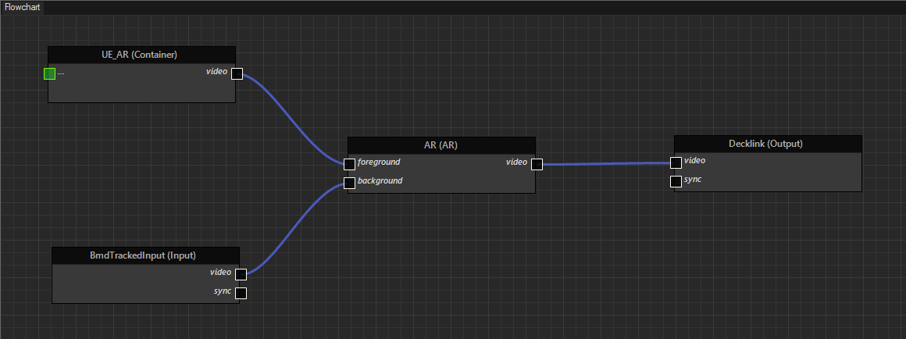

# Основы Carrot

В данном разделе можно ознакомиться с **пользовательским интерфейсом**, **работой** и **функциональными возможностями** приложений **Carrot**.

## Carrot Server

### Назначение

**Carrot Server** предназначен для формирования базы данных, хранения мультимедийной информации, а также обеспечения информационного взаимодействия между приложениями **Carrot**.

>В случае, если **Carrot Server** не запущен, то работа приложений **Carrot** (основных, дополнительных и интеграционных) **невозможна**.


### Функциональные возможности

Основными функциональными возможностями **Carrot Server** является:
- формирование базы данных, в том числе обеспечение её хранения, импорта и экспорта;
- обеспечение информационного взаимодействие между приложениями **Carrot**;
- поддержка работы в режиме репликации (синхронизации) данных;
- отображение списка запущенных приложений **Carrot** в формируемой локальной сети.


### Пользовательский интерфейс


Пользовательский интерфейс приложения **Carrot Server** состоит из следующих областей:
- **"Вспомогательные кнопки взаимодействия с Carrot Server"** (1);
- **"Основное рабочее пространство Carrot Server"** (2);
- **"Данные процесса репликации"** (3).

#### Область "Вспомогательные кнопки взаимодействия с Carrot Server"


Область **"Вспомогательные кнопки взаимодействия с Carrot Server"** включает в себя следующие кнопки:
- `File` (1);
- `Tools` (2);
- `Help` (3).

##### Кнопка `File`


При взаимодействии с кнопкой `File` отображаются два функциональных элемента, назначение которых представлено в таблице ниже.

| Наименование функционального элемента | Назначение                                                               |
| ------------------------------------- | ------------------------------------------------------------------------ |
| `Settings`                            | Открытие окна **"Settings"** для настройки параметров **Carrot Server**. |
| `Exit`                                | Завершение работы **Carrot Server**.                                     |

###### Функциональный элемент `Settings`

После взаимодействия с функциональным элементом `Settings` откроется окно **"Settings"**, предназначенное для настроек параметров **Carrot Server**.


Настраиваемые параметры **Carrot Server** распределены по разделы, перечень и назначение которых изложены в таблице ниже.


<table>
  <thead>
    <tr>
      <th style="text-align: center; vertical-align: middle">№ п/п</th>
      <th style="text-align: center; vertical-align: middle">Наименование параметра</th>
      <th style="text-align: center; vertical-align: middle">Назначение</th>
      <th style="text-align: center; vertical-align: middle">Примечание</th>
    </tr>
  </thead>
  <tbody>
    <tr>
      <td style="text-align: center; vertical-align: middle">1.</td>
      <td colspan="3" align="center"><code>Common</code></td>
    </tr>
    <tr>
      <td style="text-align: center; vertical-align: middle">1.1.</td>
      <td style="vertical-align: middle"><code>Server Name</code></td>
      <td style="vertical-align: middle">Присвоение персонального наименования рабочей станции, на которой запущен <b>Carrot Server</b>. Целью данного параметра является определение имени рабочей станции в случае, если произошла нештатная ситуация (прекращение работы, некорректная работа и т.п.).</td>
      <td style="vertical-align: middle">Наименование рабочей станции используется в приложении <b>System Monitor</b>.</td>
    </tr>
    <tr>
      <td style="text-align: center; vertical-align: middle">2.</td>
      <td colspan="3" align="center"><code>Data Base</code></td>
    </tr>
    <tr>
      <td style="text-align: center; vertical-align: middle">2.1.</td>
      <td style="vertical-align: middle"><code>Directory</code></td>
      <td style="vertical-align: middle">Указание директории (пути) к базе данных.</td>
      <td style="vertical-align: middle">В <b>базе данных</b> содержится основные файлы (AE шаблоны, .xml и .xlsx файлы и пр.), необходимые для работы <b>Carrot</b> в целом.</td>
    </tr>
    <tr>
      <td style="text-align: center; vertical-align: middle">2.2.</td>
      <td style="vertical-align: middle"><code>Backup Directory</code></td>
      <td style="vertical-align: middle">Указание директории (пути) к резервной копии базы данных. </td>
      <td style="vertical-align: middle">Применимо в случаях обновления базы данных.</td>
    </tr>
    <tr>
      <td style="text-align: center; vertical-align: middle">2.3.</td>
      <td style="vertical-align: middle"><code>Unique Event names</code></td>
      <td style="vertical-align: middle">Включение (True) / отключение (False) режима проверки на уникальность имени ивента в базе данных.</td>
      <td style="text-align: center; vertical-align: middle">---</td>
    </tr>
    <tr>
      <td style="text-align: center; vertical-align: middle">2.4.</td>
      <td style="vertical-align: middle"><code>Windows Restricted Chars</code></td>
      <td style="vertical-align: middle">Включение (True) / отключение (False) режима проверки имён ивентов и шаблонов на запрещённые символы Windows.</td>
      <td style="vertical-align: middle">Стоит учитывать, что при включении параметров <code>Windows Restricted Chars</code> и <code>Event Autonaming</code> (располагается в настройках веб-интерфейса <b>Web-Playlist (Carrot Dashboard)</b>) невозможно использовать настройку <b>"Use for Autonaming"</b> в шаблоне, содержащем переменные типа <b>RichText</b> и <b>Color</b>. В случае включения настройки <b>"Use for Autonaming"</b> наблюдается некорректная работа формируемых ивентов шаблона.</td>
    </tr>
    <tr>
      <td style="text-align: center; vertical-align: middle">2.5.</td>
      <td style="vertical-align: middle"><code>Skylark Integration</code></td>
      <td style="vertical-align: middle">Включение (True) / отключение (False) режима проверки уникальности имени ивента в базе данных playout-системы <b>Skylark</b> и <b>Carrot</b>.</td>
      <td>Включённый функционал параметров <code>Unique Event names</code>, <code>Windows Restricted Chars</code> и <code>Skylark Integration</code> необходим для взаимодействия с playout-системой <b>Skylark</b></td>
    </tr>
    <tr>
      <td style="text-align: center; vertical-align: middle">2.6.</td>
      <td style="vertical-align: middle"><code>Check Authorization And Roles</code></td>
      <td style="vertical-align: middle">Включение (True) / отключение (False) режима проверки авторизированной учётной записи на доступные ей функциональные возможности <b>Carrot</b>.</td>
      <td style="text-align: center; vertical-align: middle">---</td>
    </tr>
    <tr>
      <td style="text-align: center; vertical-align: middle">2.7.</td>
      <td style="vertical-align: middle"><code>Check user channels</code></td>
      <td style="vertical-align: middle">Включение (True) / отключение (False) режима разграничения уровня доступа учётных записей к объектам базы данных.</td>
      <td style="text-align: center; vertical-align: middle">---</td>
    </tr>
    <tr>
      <td style="text-align: center; vertical-align: middle">2.8.</td>
      <td style="vertical-align: middle"><code>Use unique event statuses</code></td>
      <td style="vertical-align: middle">Включение (True) / отключение (False) режима отображения уникального статуса ивента в плейлистах.</td>
      <td style="vertical-align: middle">Для работы параметра <code>Use unique event statuses</code>, необходимо произвести его дополнительную настройку в веб-интерфейсе <b>Web Playlist</b>, и приложениях <b>Carrot Engine</b> и <b>Launcher</b></td>
    </tr>
    <tr>
      <td style="text-align: center; vertical-align: middle">3.</td>
      <td colspan="3" align="center"><code>Digital Assets</code></td>
    </tr>
    <tr>
      <td style="text-align: center; vertical-align: middle">3.1.</td>
      <td style="vertical-align: middle"><code>Directory</code></td>
      <td style="vertical-align: middle">Указание директории (пути) к папке, в которую будет сохраняться вся мультимедийная информация.</td>
      <td style="text-align: center; vertical-align: middle">---</td>
    </tr>
    <tr>
      <td style="text-align: center; vertical-align: middle">3.2.</td>
      <td style="vertical-align: middle"><code>Copy Assets</code></td>
      <td style="vertical-align: middle">Включение (True) / отключение (False) режима передачи ассетов на <b>Carrot Server</b>. В случае если параметр выключен, то в момент создания ассета указывается только директория (путь) до самого файла, что повышает производительность в случае использования файлов большого объёма.</td>
      <td style="text-align: center; vertical-align: middle">---</td>
    </tr>
    <tr>
      <td style="text-align: center; vertical-align: middle">4.</td>
      <td colspan="3" align="center"><code>GPIO</code></td>
    </tr>
    <tr>
      <td style="text-align: center; vertical-align: middle">4.1.</td>
      <td style="vertical-align: middle"><code>Keep UE Event Active Status</code></td>
      <td style="vertical-align: middle">Вызов одного и того же состояния (стейта) при воспроизведения ивента из плейлиста.</td>
      <td style="text-align: center; vertical-align: middle">---</td>
    </tr>
    <tr>
      <td style="text-align: center; vertical-align: middle">5.</td>
      <td colspan="3" align="center"><code>III Protocol Commands</code></td>
    </tr>
    <tr>
      <td style="text-align: center; vertical-align: middle">5.1.</td>
      <td style="vertical-align: middle"><code>Use STOP</code></td>
      <td style="vertical-align: middle">Включение (True) / отключение (False) режима логики работы (воспроизведения медиа) playout системы <b>Dalet</b>. В случае отключения данного параметра, взаимодействие с <b>Dalet</b> происходит при помощи протокола III, позволяющего воспроизводить в последовательном режиме шаблоны (игнорируя внутреннюю команду STOP <b>Dalet</b>) без их обязательной остановки.</td>
      <td style="text-align: center; vertical-align: middle">---</td>
    </tr>
    <tr>
      <td style="text-align: center; vertical-align: middle">6.</td>
      <td colspan="3" align="center"><code>License</code></td>
    </tr>
    <tr>
      <td style="text-align: center; vertical-align: middle">6.1.</td>
      <td style="vertical-align: middle"><code>License Key</code></td>
      <td style="vertical-align: middle">Ввод лицензионного ключа Carrot</td>
      <td style="vertical-align: middle"><p>1. Лицензионный ключ необходим для получения доступа к функционалу работы <b>Carrot</b>. В случае отсутствия лицензионного ключа, функционал работы будет ограничен.</p> <p>2. Ввод лицензионного ключа <b>Carrot</b> рекомендуется проводить совместно со специалистами технической поддержки <b>Carrot Broadcast</b>.</p> <p>3. При работе с приложением <b>Carrot Server</b> без лицензионного ключа, необходимо убедиться, что у рабочей станции включена поддержка <b>Интернет протокола IPv6</b>.<p></td>
    </tr>
    <tr>
      <td style="text-align: center; vertical-align: middle">7.</td>
      <td colspan="3" align="center"><code>Miscellaneous</code></td>
    </tr>
    <tr>
      <td style="text-align: center; vertical-align: middle">7.1.</td>
      <td style="vertical-align: middle"><code>Hide to Tray</code></td>
      <td style="vertical-align: middle"> Включение (True) / отключение (False) режима, в котором при закрытии окна <b>Carrot Server</b> с помощью кнопки <code>✕</code> (используемая по умолчанию в стандартном окне Windows) происходит его скрытие в системную область уведомлений (панель управления).</td>
      <td style="text-align: center; vertical-align: middle">---</td>
    </tr>
    <tr>
      <td style="text-align: center; vertical-align: middle">8.</td>
      <td colspan="3" align="center"><code>Replication</code></td>
    </tr>
    <tr>
      <td style="text-align: center; vertical-align: middle">8.1.</td>
      <td style="vertical-align: middle"><code>Replication Hosts</code></td>
      <td style="vertical-align: middle">Указание IP-адресов рабочих станций задействованных в репликации (синхронизации) данных.</td>
      <td style="vertical-align: middle"><p>1. Для корректного запуска процесса репликации, необходимо убедиться, что на рабочих станциях запущено приложение <b>Carrot Server</b>.</p> <p>2. В параметре <code>Replication Hosts</code> первый указываемый IP-адрес <b>Carrot Server</b> является основным (мастером).</p></td>
    </tr>
    <tr>
      <td style="text-align: center; vertical-align: middle">8.2.</td>
      <td style="vertical-align: middle"><code>Local IP for Replication</code></td>
      <td style="vertical-align: middle">Указание локального (текущего) IP-адреса рабочей станции задействованной в репликации (синхронизации) данных.</td>
      <td style="text-align: center; vertical-align: middle">---</td>
    </tr>
    <tr>
      <td style="text-align: center; vertical-align: middle">9.</td>
      <td colspan="3" align="center"><code>Resource Manager</code></td>
    </tr>
    <tr>
      <td style="text-align: center; vertical-align: middle">9.1.</td>
      <td style="vertical-align: middle"><code>Use Preloading</code></td>
      <td style="vertical-align: middle">Включение (True) / отключение (False) режима предварительной загрузки ивентов в <b>Web Playlist (Carrot Dashboard)</b>.</td>
      <td style="text-align: center; vertical-align: middle">---</td>
    </tr>
    <tr>
      <td style="text-align: center; vertical-align: middle">9.2.</td>
      <td style="vertical-align: middle"><code>Preload Count</code></td>
      <td style="vertical-align: middle">Указание количества необходимых ивентов для их предварительной загрузки в <b>Web Playlist (Carrot Dashboard)</b>.</td>
      <td style="vertical-align: middle"><p>1. Функционал параметра <code>Preload Count</code> задействуется в случае включённого параметра <code>Use Preloading</code>. <p>2. Значение параметра  <code>Preload Count</code>  должно быть больше "0".</p></td>
    </tr>
    <tr>
      <td style="text-align: center; vertical-align: middle">9.3.</td>
      <td style="vertical-align: middle"><code>MOS Preload</code></td>
      <td style="vertical-align: middle">Включение режима предварительной загрузки ивентов по протоколу MOS в <b>Web Playlist (Carrot Dashboard)</b>.</td>
      <td style="text-align: center; vertical-align: middle">---</td>
    </tr>
    <tr>
      <td style="text-align: center; vertical-align: middle">10.</td>
      <td colspan="3" align="center"><code>Statistics</code></td>
    </tr>
    <tr>
      <td style="text-align: center; vertical-align: middle">10.1.</td>
      <td style="vertical-align: middle"><code>Collect Statistic</code></td>
      <td style="vertical-align: middle">Включение (True) / отключение (False) режима сбора статистических данных по используемой производительности аппаратной части.</td>
      <td style="vertical-align: middle">Статистические данные отображаются в приложении <b>System Monitor</b>.</td>
    </tr>
    <tr>
      <td style="text-align: center; vertical-align: middle">11.</td>
      <td colspan="3" align="center"><code>WebSocket</code></td>
    </tr>
    <tr>
      <td style="text-align: center; vertical-align: middle">11.1.</td>
      <td style="vertical-align: middle"><code>Certificate</code></td>
      <td style="vertical-align: middle">Указание директории (пути) к сертификату шифрования.</td>
      <td style="vertical-align: middle">Сертификат необходим для установления зашифрованного защищённого соединения. Сертификат представляет из себя файл формата <b>".pfx".</b></td>
    </tr>
    <tr>
      <td style="text-align: center; vertical-align: middle">11.2.</td>
      <td style="vertical-align: middle"><code>Certificate Password</code></td>
      <td style="vertical-align: middle">Ввод пароля сертификата шифрования.</td>
      <td style="text-align: center; vertical-align: middle">---</td>
    </tr>
    <tr>
      <td style="text-align: center; vertical-align: middle">11.3.</td>
      <td style="vertical-align: middle"><code>Secure Connection</code></td>
      <td style="vertical-align: middle">Включение (True) / отключение (False) режима зашифрованного соединения <b>Carrot Server</b>.</td>
      <td style="text-align: center; vertical-align: middle">---</td>
    </tr>
    <tr>
      <td style="text-align: center; vertical-align: middle">11.4.</td>
      <td style="vertical-align: middle"><code>Heartbeat interval, sec</code></td>
      <td style="vertical-align: middle">Указание временного интервала для отправки сообщений типа <b>"heartbeat"</b> с целью предотвращения обрыва соединения.</td>
      <td style="text-align: center; vertical-align: middle">---</td>
    </tr>
   <tbody>
</table>


###### Функциональный элемент `Exit`

После взаимодействия с функциональным элементом `Exit` завершается работа и закрывается окно приложения **Carrot Server**.

##### Кнопка `Tools`


При взаимодействии с кнопкой `Tools` отображается перечень функциональных элементов, назначение которых представлено в таблице ниже.

<table>
  <thead>
    <tr>
      <th style="text-align: center; vertical-align: middle">№ п/п</th>
      <th style="text-align: center; vertical-align: middle">Наименование функционального элемента</th>
      <th style="text-align: center; vertical-align: middle">Назначение</th>
      <th style="text-align: center; vertical-align: middle">Сочетание клавиш</th>
      <th style="text-align: center; vertical-align: middle">Примечание</th>
    </tr>
  </thead>
  <tbody>
    <tr>
      <td style="text-align: center; vertical-align: middle">1.</td>
      <td style="vertical-align: middle"><code>Change Administrator Password</code></td>
      <td style="vertical-align: middle">Смена пароля администратора.</td>
      <td style="text-align: center; vertical-align: middle">---</td>
      <td style="text-align: center; vertical-align: middle">---</td>
    </tr>
    <tr>
      <td style="text-align: center; vertical-align: middle">2.</td>
      <td style="vertical-align: middle"><code>Reset Event Status</code></td>
      <td style="vertical-align: middle">Обновление поля компонентов для корректного отображения активных приложений <b>Carrot</b>.</td>
      <td style="vertical-align: middle"><code>Ctrl+Shift+R</code></td>
      <td style="text-align: center; vertical-align: middle">---</td>
    </tr>
    <tr>
      <td style="text-align: center; vertical-align: middle">3.</td>
      <td style="vertical-align: middle"><code>Set Server As Master</code></td>
      <td style="vertical-align: middle">Определение текущего <b>Carrot Server</b> в качестве основного.</td>
      <td style="vertical-align: middle"><code>Ctrl+Shift+S</code></td>
      <td style="vertical-align: middle"><p>1. <b>Основной</b> сервер отображается в области <b>"Данные процесса репликации"</b> как <code>Replication Master = True</code>, а резервный (запасной) как <code>Replication Master = False</code></p> <p>2. Ввод лицензионного ключа <b>Carrot</b> рекомендуется проводить совместно со специалистами технической поддержки <b>Carrot Broadcast</b>.</p></td>
    </tr>
    <tr>
      <td style="text-align: center; vertical-align: middle">4.</td>
      <td style="vertical-align: middle"><code>Check Other Servers</code></td>
      <td style="vertical-align: middle">Проверка определения сервера в качестве <b>основного</b> или <b>резервного</b>.</td>
      <td style="text-align: center; vertical-align: middle">---</td>
      <td style="text-align: center; vertical-align: middle">---</td>
    </tr>
    <tr>
      <td style="text-align: center; vertical-align: middle">5.</td>
      <td style="vertical-align: middle"><code>Export DB file</code></td>
      <td style="vertical-align: middle">Экспорт базы данных <b>Carrot Server</b>.</td>
      <td style="text-align: center; vertical-align: middle">---</td>
      <td style="text-align: center; vertical-align: middle">---</td>
    </tr>
    <tr>
      <td style="text-align: center; vertical-align: middle">6.</td>
      <td style="vertical-align: middle"><code>Export DB objects</code></td>
      <td style="vertical-align: middle">Экспорт объектов базы данных <b>Carrot Server</b>.</td>
      <td style="text-align: center; vertical-align: middle">---</td>
      <td style="text-align: center; vertical-align: middle">---</td>
    </tr>
    <tr>
      <td style="text-align: center; vertical-align: middle">7.</td>
      <td style="vertical-align: middle"><code>Import DB file</code></td>
      <td style="vertical-align: middle">Импорт базы данных <b>Carrot Server</b>.</td>
      <td style="text-align: center; vertical-align: middle">---</td>
      <td style="text-align: center; vertical-align: middle">---</td>
    </tr>
    <tr>
      <td style="text-align: center; vertical-align: middle">8.</td>
      <td style="vertical-align: middle"><code>Import DB objects</code></td>
      <td style="vertical-align: middle">Импорт объектов базы данных <b>Carrot Server</b>.</td>
      <td style="text-align: center; vertical-align: middle">---</td>
      <td style="text-align: center; vertical-align: middle">---</td>
    </tr>
    <tr>
      <td style="text-align: center; vertical-align: middle">9.</td>
      <td style="vertical-align: middle"><code>Web</code></td>
      <td style="text-align: center; vertical-align: middle">---</td>
      <td style="text-align: center; vertical-align: middle">---</td>
      <td style="text-align: center; vertical-align: middle">---</td>
    </tr>
    <tr>
      <td style="text-align: center; vertical-align: middle">10.</td>
      <td style="vertical-align: middle"><code>DataStream</code></td>
      <td style="text-align: center; vertical-align: middle">---</td>
      <td style="text-align: center; vertical-align: middle">---</td>
      <td style="text-align: center; vertical-align: middle">---</td>
    </tr>
    <tr>
      <td style="text-align: center; vertical-align: middle">11.</td>
      <td style="vertical-align: middle"><code>Update DB to current Version</code></td>
      <td style="vertical-align: middle">Обновление базы данных до текущей версии <b>Carrot</b>.</td>
      <td style="text-align: center; vertical-align: middle"><code>Ctrl+U</code></td>
      <td style="vertical-align: middle"><p>1. При взаимодействии с кнопкой <code>Update DB to current Version</code>, отобразится окно <b>"Warning"</b> c содержанием о необходимости завершения запущенных сессий приложений <b>Carrot</b>.</p> <p>2. В рамках обновления базы данных создаётся резервная копия текущей базы данных, располагаемой в следующей директории <code>C:\Users\"ИМЯ_КОМПЬЮТЕРА"\AppData\Local\Carrot\backups</code> с наименованием вида <code>carrotDB_backup_дд_мм_гггг_чч-мм-сс-ффф</code>.</td>
    </tr>
    <tr>
      <td style="text-align: center; vertical-align: middle">12.</td>
      <td style="vertical-align: middle"><code>Remove Inaccessible DB Objects</code></td>
      <td style="vertical-align: middle">Удаление недоступных объектов в базе данных <b>Carrot Server</b>.</td>
      <td style="text-align: center; vertical-align: middle"><code>Ctrl+R</code></td>
      <td style="text-align: center; vertical-align: middle">---</td>
    </tr>
    <tr>
      <td style="text-align: center; vertical-align: middle">13.</td>
      <td style="vertical-align: middle"><code>Remove Unused Assets</code></td>
      <td style="text-align: center; vertical-align: middle">---</td>
      <td style="text-align: center; vertical-align: middle">---</td>
      <td style="text-align: center; vertical-align: middle">---</td>
    </tr>
   <tbody>
</table>


##### Кнопка `Help`


При взаимодействии с кнопкой `Help` отображается функциональный элемент `About...`, открывающий окно **"About Carrot Server"** содержащее сведения о текущей версии приложения **Carrot Server**.


#### Область "Основное рабочее пространство Carrot Server"


Область **"Основное рабочее пространство Carrot Server"** структурно состоит из элементов представленных в таблице ниже.

| Наименование элемента           | Назначение                                             |
| ------------------------------- | ------------------------------------------------------ |
| Кнопка `Disconect Selected` (1) | Отключение выбранного приложения от **Carrot Server**. |
| Кнопка `Refresh` (2)            | Обновление формируемого списка **поля подключений**.   |
>Применение кнопки `Refresh` необходимо в том случае, если известно, что подключение существует, но оно не отображается в **поле подключений**.
>
>При взаимодействии с кнопкой `Refresh` активируется цикл непрерывного обновления списка в **поле подключений**. В случае отображения всех подключений, необходимо прервать цикл, путём повторного взаимодействия с кнопкой.

| | |
|-------------------|----------|
| **Поле подключений** (3)   |   Отображение сведений о подключенных (запущенных) приложениях **Carrot**. |
>**"Поле подключений"** отображает следующие сведения о подключенных приложениях:
>- **IP-адрес** - отображение числового идентификатора рабочей станции или сервера на которых были запущены приложения **Carrot**;
>- **App** - отображение сведений о наименовании подключенного (запущенного) приложения **Carrot** на рабочей станции или сервере;
>- **Object** - отображение сведений о наименовании объекта, используемого в подключённом (запущенном) приложении **Carrot**;
>- **Last response** - отображение сведений о последнем полученном сообщении от подключенного (запущенного) приложения **Carrot**.

#### Область "Данные процесса репликации"


Область **"Данные процесса репликации"** предназначена для отображения сведений (параметров) о состоянии репликации (синхронизации) **Carrot Server**. Перечень отображаемых сведений (параметров) представлен в таблице ниже.

| Наименование сведения (параметра) | Назначение                                                                                              |
| --------------------------------- | ------------------------------------------------------------------------------------------------------- |
| **Replication Master**            | Отображение сведений о присвоенном состоянии (основной (True) или резервный (False)) **Carrot Server**. |
| **DB replication Progress**       | Отображение количества реплицируемых (синхронизируемых) данных.                                         |
>При завершении процесса репликации (синхронизации), у параметра **"DB replication Progress"** отобразится сообщение **"Replication Completed!"**.


### Настройка репликации

#### Назначение

Репликация (синхронизация) представляет из себя процесс копирования данных между серверами (рабочими станциями). Таким образом, изменения, сделанные в одной копии, учитываются и в других копиях.

>Репликация данных часто используется в целях резервного копирования информации.

#### Первоначальная настройка

Как было изложено ранее, в процессе репликации участвуют несколько серверов. 

>Стоит отметить, что настройка репликации часто зависит от условий конкретного проекта, количества используемой вычислительной техники и прочих факторов.

Рассмотрим пример с участием 2-х серверов со следующими IP-адресами:

* `192.168.1.1` - будет являться резервным серверном;
* `192.168.1.2` - будет являться мастер-сервером (основным).

В настройках `Carrot Server` каждого сервера необходимо найти раздел `Replication` со следующими параметрами:

* `Replication Hosts` - предназначен для указания IP-адреса(ов) резервного(ых) сервера(ов) с которым синхронизируется база данных Carrot Server;
* `Local IP for Replication` - предназначен для указания локального IP-адреса сервера, с целью репликации данных.

Внешний вид расположения раздела `Replication`:


В разделе `Replication` для сервера с IP-адресом `192.168.1.1` ввести:

|Наименование параметра|Значение|
|---------------------|---------|
|`Replication Hosts`|`192.168.1.2, 192.168.1.1`|
|`Local IP for Replication`|`192.168.1.1`|

>В случае, если необходимо указать несколько IP-адресов в параметре `Replication Hosts`, следует вводить исключительно номера сетей и узлов рабочих станций (IP-адреса) разделённых символом: `,`.
>
>Важно обратить внимание, что IP-адреса серверов вводятся в порядке функционального предназначения каждого.
>
>В случае, если введенён некорректный IP-адрес сервера, например для сервера с локальным IP-адресом `192.168.1.1` будет указан `192.168.1.2`, то произойдёт ошибка в определении сервера как "Мастера" при нештатной ситуации, таким образом сервер не возьмёт на себя *резервную* роль.

В результате введённых данных для сервера с IP-адресом `192.168.1.1` получим:


В разделе `Replication` для сервера с IP-адресом `192.168.1.2` ввести:

|Наименование параметра|Значение|
|---------------------|---------|
|`Replication Hosts`|`192.168.1.2, 192.168.1.1`|
|`Local IP for Replication`|`192.168.1.2`|

В результате введённых данных для сервера с IP-адресом `192.168.1.2` получим:


>В случае, если введены некорректные данные (не указан какой-либо из серверов, IP-адрес указан с ошибкой или т.п.) одного из сервера, то при пропытке запуска репликации мастер-сервер прерывает подключение и процесс прерывается.
>
>Если в проекте участвует более 2-х серверов, то процесс их настройки будет аналогичен изложенному, только с указанием нужного (большего) количества IP-адресов в параметре `Replication Hosts`.

В результате введённых настроек для каждого сервера получим, что при внезапном прекращении работы мастер-сервера (`192.168.1.2`), происходит переключение на резервный сервер (`192.168.1.1`).


>Когда сервер является "мастером", у него появляется статус `Replication Master = True` в статус баре Carrot Server.
>
>Стоит учитывать, что при наличии большего количества резервных серверов, процесс перехода на "резерв" будет происходить до самой последней.


#### Принцип работы в Carrot

Когда сервер находится в режиме репликации, он сравнивает в параметре `Replication Hosts` введённые данные об IP-адресах серверов поочерёдно, так, например, если мастер-сервер с IP-адресом `192.168.1.2` обнаруживает аналогичный IP-адрес, то он считает себя "главным" (мастер-сервером) и в статус-баре появляется соответствующее сообщение `Replication Master = True`.

В случае, если IP-адрес не совпадает, то сервером происходит подключение к другим введённым IP-аресам. Таким образом, возможно несколько вариантов определения сервера:

* В случае, если настраиваемый сервер успешно подключился к мастер-серверу (`Replication Master = True`), то он определяется как резервный со статусом `Replication Master = False`;
* В случае, если настраиваемый сервер успешно подключился к резервному серверу, то последний передаёт информацию о сервере со статусом "мастер", в результате чего, у настраиваемого сервера отсутствует необходимость в поиске конкретного IP-адреса среди введённых в параметр `Replication Hosts` и подключение осуществляется напрямую;
* В случае, если настраиваемому серверу не удаётся подключиться к одному из серверов по IP-адресу, то происходит подключение к следующему IP-адресу, введённому в параметр `Replication Hosts`.

>Основным функционалом сервера со статусом **"Мастер"** является обработка поступающих команд от клиентов.
>
>Основным функционалом резервного сервера является синхронизация актуальной базы данных и ассетов мастер-сервера.
>
>Во избежание некорректного запуска процесса репликации, рекомендуется запускать сервер в том порядке, который указан в параметре `Replication Hosts`.

#### Частые ситуации

##### Что делать, если у меня два "Мастера"?

В случае, если обнаружена ситуация, при которой два сервера определяются как "Мастер" (со статусом `Replication Master = True`), необходимо придерживаться следующих шагов:

* определить сервер, который будет выполнять функцию "Мастера";
* в Carrot Server, нажать кнопку по следующему пути `Tools`/`Check Other Servers`.


После указанных действий, сервер произведёт поиск других северов по указанным IP-адресам в параметре `Replication Hosts`. В случае установления успешного соединения, сервер примет статус "Резервный".

>Подобные ситуации, при которых два сервера определяются как "Мастер", как правило, возникают при не соблюдении порядка их запуска (не в соответствии с порядком, указанным в параметре `Replication Hosts`).

##### Как поменять "Мастера" и не выключать сервер?**

В случаях, когда необходимо изменить статус сервера с "Резервного" на "Мастер", следует придерживаться следующих шагов:

* определить сервер со статусом "Резервный", который будет выполнять функцию "Мастера";
* в Carrot Server, нажать кнопку по следующему пути `Tools`/`Set Server As Master`.


>Кнопка `Set Server As Master` имеет Hotkey `Ctrl+Shift+S`

В результате проделанных действий, резервный сервер запросит у мастер-сервера соответствующие права, после получения которых, произойдёт переключение клиентов и серверов к нему.

>Изложенная операция возможна, только в тех случаях, когда резервный сервер произвёл репликацию с мастер-сервером. 
>
>При успешном завершении репликации в статус-баре Carrot Server появится параметр `Replication Completed!`

##### Что делать, если я неправильно запустил сервера и у меня удалилась актуальная база данных?

В случае некорректного запуска серверов, важно помнить, что перед запуском репликации, акутальная версия базы данных упаковывается в архив формата .zip по следующей директории (пути):

`C:\Users\"ИМЯ_КОМПЬЮТЕРА"\AppData\Local\Carrot\backups\`

Для актуализации информации, необходимо распаковать архив в папку, в которой содержится текущая база данных. 


## Launcher


### Назначение

**Launcher** предназначен для регистрации рабочих станций и обеспечения запуска на них схем **Carrot Engine**.
### Пользовательский интерфейс


Пользовательский интерфейс приложения **Launcher** состоит из трёх кнопок, а именно:
- `File` (1);
- `Tools` (2);
- `Help` (3).

#### Кнопка `File`


При взаимодействии с кнопкой `File` отображаются два функциональных элемента, назначение которых представлено в таблице ниже.

<table>
    <thead>
      <tr>
        <th style="text-align: center; vertical-align: middle">№ п/п</th>
        <th style="text-align: center; vertical-align: middle">Наименование функционального элемента</th>
        <th style="text-align: center; vertical-align: middle">Назначение</th>
        <th style="text-align: center; vertical-align: middle">Сочетание клавиш</th>
      </tr>
    </thead>
    <tbody>
      <tr>
        <td style="text-align: center; vertical-align: middle">1.</td>
        <td style="vertical-align: middle"><code>Settings</code></td>
        <td style="vertical-align: middle">Открытие окна <b>"Settings"</b> для настройки параметров приложения <b>Carrot Engine</b>.</td>
        <td style="text-align: center; vertical-align: middle"><code>F4</code></td>
      </tr>
      <tr>
        <td style="text-align: center; vertical-align: middle">2.</td>
        <td style="vertical-align: middle"><code>Exit</code></td>
        <td style="vertical-align: middle">Завершение работы <b>Launcher</b>.</td>
        <td style="text-align: center; vertical-align: middle"><code>Alt+F4</code></td>
      </tr>
      </tbody>
</table>

##### Функциональный элемент `Settings`

После взаимодействия с функциональным элементом `Settings` откроется окно **"Settings"**, предназначенное для настроек параметров **Carrot Engine**.

Перечень настраиваемых параметров приложения **Carrot Engine** представлен в соответствующем разделе. 


##### Функциональный элемент `Exit`

После взаимодействия с функциональным элементом `Exit` завершается работа и закрывается окно приложения **Launcher**.

#### Кнопка `Tools`


При взаимодействии с кнопкой `Tools` отображается функциональный элемент `Workstation Registration` , предназначенный для регистрации рабочих станций и настройки её **input'ов** и **output'ов**.

##### Функциональный элемент `Workstation Registration`

После взаимодействия с функциональным элементом `Workstation Registration` откроется окно **"Workstation Registration"**.


Окно **"Workstation Registration"** структурно состоит из следующих элементов представленных в таблице ниже.

| Наименование элемента                                              | Назначение                                                                                                                         |
| ------------------------------------------------------------------ | ---------------------------------------------------------------------------------------------------------------------------------- |
| Кнопка `File` (1)                                                  | Импорт и экспорт настроек рабочей станции.                                                                                         |
| Область **"Регистрация рабочей станции"** (2)                      | Администрирование рабочих станций.                                                                                                 |
| Область **"Настройка модулей input и output рабочей станции"** (3) | Формирование модулей input и output рабочей станции, с целью дальнейшего их использования при проектировке схем **Carrot Engine**. |

###### Кнопка `File`


Кнопка `File` включает в себя функциональные элементы, перечень и назначение которых представлено в таблице ниже.

| Наименование функционального элемента | Назначение                                               |
| ------------------------------------- | -------------------------------------------------------- |
| `Import...`                           | Импортирование заготовленных настроек рабочей станции.   |
| `Export...`                           | Экспортирование сформированных настроек рабочей станции. |

###### Область **"Регистрация рабочей станции"**


Область **"Регистрация рабочей станции"** включает в себя функциональные элементы перечень и назначение которых представлены в таблице ниже.

| Наименование функционального элемента | Назначение                                                   |
| ------------------------------------- | ------------------------------------------------------------ |
| Поле `Name` (1)                       | Присвоение уникального имени (наименования) рабочей станции. |

>По умолчанию, в качестве наименования рабочей станции используется имя текущего устройства.

|                                |                                                                                                                 |
| ------------------------------ | --------------------------------------------------------------------------------------------------------------- |
| Кнопка `Register / Update` (2) | Регистрация рабочей станции, в том числе обновление её настроек (в случае, если не было изменено наименование). |

>После взаимодействия с кнопкой `Register / Update` отрывается окно **"Workstations"**. содержащее список зарегистрированных рабочих станций.
>
>
>Окно **"Workstations"** содержит **"список зарегистрированных рабочих станций"** (1). Для регистрации рабочей станции, необходимо нажать кнопку `ОК` (2).


|                         |                                                        |
| ----------------------- | ------------------------------------------------------ |
| Кнопка `Unregister` (3) | Удаление рабочей станции из списка зарегистрированных. |


###### Область **"Настройка модулей inputs и outputs рабочей станции"**


Область **"Настройка модулей input и output рабочей станции"** включает в себя функциональные элементы перечень и назначение которых представлены в таблице ниже.

| Наименование функционального элемента   | Назначение                                                                     |
| --------------------------------------- | ------------------------------------------------------------------------------ |
| Область **"Inputs"** (1)                | Добавление (`+`)/Удаление (`-`) модулей **Inputs**.                            |

>Перечень и назначение доступных модулей **"Inputs"** представлены в таблице ниже
>
>| Наименование модуля **Input**  | Назначение                                                                     |
>| ----------------------------- | -------------- |
>|`Aja Tracked Input`|Поддержка работы (приём входного видеосигнала) с картами видеозахвата **AJA**.|
>|`BMD Input`|Поддержка работы (приём входного видеосигнала) с картами видеозахвата **Blackmagic Design**.|
>|`BMD Tracked Input`|Поддержка работы (приём входного сигнала) с картами видеозахвата **Blackmagic Design** при приёме трекинговых данных по локальной сети.|
>|`Texture Input`|Вывод видео-сигнала или видеофайла на устройстве.|
>|`Combined Tracking Data`|Обработка данных позиционирования от двух трекинг систем.|
>|`Tracking Data`|Приём трекинг данных.|
>|`UE Input`|Отображение запущенной UE сцены c трекингом.|
>|`WebSocket Stream Input`|Используется для вывода видеосигнала или аудиосигнала с устройства подключённого к данной рабочей станции.|


| |                                                               |
| --------------------------------------- | ------------------------------------------------------------------------------ |
| Область **"Outputs"** (2)               | Добавление (`+`)/Удаление (`-`) модулей **Outputs** в рабочую станцию.         |

>Перечень и назначение доступных модулей **"Outputs"** представлены в таблице ниже
>
>| Наименование модуля **Output**  | Назначение                                                                     |
>| ----------------------------- | -------------- |
>|`AJA Output`|Вывод видео-сигнала на карту видеозахвата **AJA**.|
>|`Bmd Fill/Key Output`|Вывод `Fill` и `Key` сигналов на карту видеозахвата **Blackmagic Design, Decklink**.|
>|`Bmd Output`|Вывод видео-сигнала на карту видеозахвата **Blackmagic Design, Decklink**.|
>|`Screen Output`|Вывод видео-сигнала на экран рабочей станции.|
>|`WebSocket Stream Output`|Вывод видео-сигнала с одной рабочей станции на другую (в рамках локальной сети).|
>|`Stream Output`|Вывод видео-сигнала на стриминговый сервис.|


| |                                                               |
| --------------------------------------- | ------------------------------------------------------------------------------ |
| Область **"Properties"** (3)            | Настройка параметров модулей **Inputs** и **Outputs**.                         |

>Перечень и назначение параметров для модулей **"Inputs"** представлены в таблицах ниже.
>
>`AJA Tracked Input`
>
>
>Раздел **"AJA"**
>>
>>|Наименование параметра|Назначение|
>>|-------------------|----------|
>>|`Device`|Выбор карты видеозахвата **AJA** из списка подключенных для взаимодействия с **Carrot**.|
>>|`Mode`|Выбор формата изображения поступающего с камеры.|
>>|`Input Source`|Выбор интерфейса ввода (SDI) видео-сигнала.|
>>|`Frame Buffer Format`|Выбор способа обработки (кодировки) видео-сигнала.|
>>|`Flip Fields`|Включение режима поочерёдной обработки и отображения полей (для interlaced-сигнала). В случае если у изображения на выходе имеется эффект подрагивания, следует изменить режим работы параметра.|
>>
>>`Dimension`
>>
>>|Наименование параметра|Назначение|
>>|-------------------|----------|
>>|`Width`|Указание ширины обрабатываемого видео-сигнала. Измеряется в "пиксель".|
>>|`Height`|Указание высоты обрабатываемого видео-сигнала. Измеряется в "пиксель".|
>>
>>Раздел **"Dimension"**
>>
>>|Наименование параметра|Назначение|
>>|-------------------|----------|
>>|`Width`|Указание ширины обрабатываемого видео-сигнала. Измеряется в "пиксель".|
>>|`Height`|Указание высоты обрабатываемого видео-сигнала. Измеряется в "пиксель".|
>>
>>Раздел **"Input"**
>>
>>|Наименование параметра|Назначение|
>>|-------------------|----------|
>>|`Name`|Ввод имени модуля, отображаемого в **System Monitor** при проектировке схем **Carrot Engine**.|
>>
>>Раздел **"Process"**
>>
>>|Наименование параметра|Назначение|
>>|-------------------|----------|
>>|`Enable Secondary Video`|Включение режима использования отдельного изображения для передачи в UE, позволяющего указать задержку отличную от основного тракта. Применяется для виртуального пролёта камеры.|
>>|`Undistort Secondary Video`|Включение режима, при котором убирается эффект искажения линзы с камеры при виртуальном пролёте камеры.|
>>
>>Раздел **"Tracking"**
>>
>>|Наименование параметра|Назначение|
>>|-------------------|----------|
>>|`Correct Zoom`|Включение режима сглаживания неравномерности изменения зума по трекингу.|
>>|`Tracking Index`|Ввод ID трекинга. Применяется для точного определения используемых трекинг систем.|
>>|`Tracking Delay`|Указание входной задержки для трекинг данных.| 
>>|`Port`|Ввод порта, в который передаются трекинг данные.|
>>
>>>При вводе значения в параметр `Port` необходимо избегать его дублирования для приложений **Template Preview** и **Carrot Engine**.   
>>
>>|||
>>|-------------------|----------|
>>|`Use Delta MS`|Включение режима синхронизации. Измеряется в миллисекундах.| 
>
>`BMD Input`
>
>>Раздел **"DeckLink"**
>>
>>|Наименование параметра|Назначение|
>>|-------------------|----------|
>>|`Input Device`|Выбор устройства **BMD** из списка подключенных для взаимодействия с **Carrot**.|
>>|`Input Mode`|Выбор формата изображения поступающего с камеры.|
>>|`Delay`|Указание задержки входного видео-сигнала карты захвата **BMD**.|
>>|`Group ID`|Включение режима синхроннной работы (запуска и остановки) между **BMD Input**. Синхронная работа задействуется в том случае, когда параметр `Group ID` равен между собой и **больше 0**.|
>>|`Wait`|Включение режима привязки рендера графики к такту приходящих кадров в **Input**. В случае, если параметр выключен (False), то рендер графики становится привязан к такту вывода кадров на аутпуте.|
>>|`Use Resource Thread`|Включение режима работы параметра в ресурсном потоке (вне потока рендера). Параметр способствует снижению нагрузки на центральный процессор.|
>>|`Use MipMaps`|Включение метода MIP-текстурирования. Параметр способствует повышению быстродействия и снижению нагрузки на видеокарту, в том числе возможно его использование для размытия изображения.|
>>|`Use Audio Input`|Включение режима обработки аудиопотока на входе карты захвата **BMD**.|
>>
>>Раздел **"Dimension"**
>>
>>|Наименование параметра|Назначение|
>>|-------------------|----------|
>>|`Width`|Указание ширины обрабатываемого видео-сигнала. Измеряется в "пиксель".|
>>|`Height`|Указание высоты обрабатываемого видео-сигнала. Измеряется в "пиксель".|
>>
>>Раздел **"Input"**
>>
>>|Наименование параметра|Назначение|
>>|-------------------|----------|
>>|`Name`|Ввод имени модуля, отображаемого в **Carrot Flowchart**.|
>
>`BMD Tracked Input`
>
>>Раздел **"DeckLink"**
>>
>>|Наименование параметра|Назначение|
>>|-------------------|----------|
>>|`Device`|Выбор устройства **BMD** из списка подключенных для взаимодействия с **Carrot**.|
>>|`Mode`|Выбор формата изображения поступающего с камеры.|
>>|`Group ID`|Включение режима синхроннной работы (запуска и остановки) между **BMD Tracked Input**. Синхронная работа задействуется в том случае, когда параметр `Group ID` равен между собой и **больше 0**.|
>>|`Use MipMaps`|Включение метода MIP-текстурирования. Параметр способствует повышению быстродействия и снижению нагрузки на видеокарту, в том числе возможно его использование для размытия изображения.|
>>|`Use Audio Input`|Включение режима обработки аудиопотока на входе карты захвата **BMD**.|
>>
>>Раздел **"Dimension"**
>>
>>|Наименование параметра|Назначение|
>>|-------------------|----------|
>>|`Width`|Указание ширины обрабатываемого видео-сигнала. Измеряется в "пиксель".|
>>|`Height`|Указание высоты обрабатываемого видео-сигнала. Измеряется в "пиксель".|
>>
>>Раздел **"Input"**
>>
>>|Наименование параметра|Назначение|
>>|-------------------|----------|
>>|`Name`|Ввод имени модуля, отображаемого в **Carrot Flowchart**.|
>>
>>Раздел **"Process"**
>>
>>|Наименование параметра|Назначение|
>>|-------------------|----------|
>>|`Enable Secondary Video`|Включение режима использования отдельного изображения для передачи в UE, позволяющего указать задержку отличную от основного тракта. Применяется для виртуального пролёта камеры.|
>>|`Undistort Secondary Video`|Включение режима, при котором убирается эффект искажения линзы с камеры при виртуальном пролёте камеры.|
>>
>>Раздел **"Tracking"**
>>
>>|Наименование параметра|Назначение|
>>|-------------------|----------|
>>|`Correct Zoom`|Включение режима сглаживания неравномерности изменения зума по трекингу.|
>>|`Tracking Index`|Ввод ID трекинга. Применяется для точного определения используемых трекинг систем.|
>>|`Tracking Delay`|Указание входной задержки для трекинг данных.| 
>>|`Port`|Ввод порта, в который передаются трекинг данные.| 
>>
>>>При вводе значения в параметр `Port` необходимо избегать его дублирования для приложений **Template Preview** и **Carrot Engine**.   
>>
>>|||
>>|-------------------|----------|
>>|`Use Delta MS`|Включение режима синхронизации. Измеряется в миллисекундах.| 
>
>`Texture Input`
>
>>Раздел **"Dimension"**
>>
>>|Наименование параметра|Назначение|
>>|-------------------|----------|
>>|`Width`|Указание ширины обрабатываемого видео-сигнала. Измеряется в "пиксель".|
>>|`Height`|Указание высоты обрабатываемого видео-сигнала. Измеряется в "пиксель".|
>>
>>Раздел **"Input"**
>>
>>|Наименование параметра|Назначение|
>>|-------------------|----------|
>>|`Name`|Ввод имени модуля, отображаемого в **Carrot Flowchart**.|
>>
>>Раздел **"Прочее"**
>>
>>|Наименование параметра|Назначение|
>>|-------------------|----------|
>>|`Filename`|Указание директории (пути) к файлу используемого в качестве текстуры.|
>
>
>`Combined Tracking Data`
>
>>Раздел **"Dimension"**
>>
>>|Наименование параметра|Назначение|
>>|-------------------|----------|
>>|`Width`|Указание ширины обрабатываемого видео-сигнала. Измеряется в "пиксель".|
>>|`Height`|Указание высоты обрабатываемого видео-сигнала. Измеряется в "пиксель".|
>>
>>Раздел **"Input"**
>>
>>|Наименование параметра|Назначение|
>>|-------------------|----------|
>>|`Name`|Ввод имени модуля, отображаемого в **Carrot Flowchart**.|
>>
>>Раздел **"Process"**
>>
>>|Наименование параметра|Назначение|
>>|-------------------|----------|
>>|`Use Secondary Camera As`|Выбор режима обработки данных трекинг систем по их смещению. `XYZ` - используются данные смещения из параметра `First Tracked Input` в части позиционирования (координатам X, Y, Z). `PTR` - используются данные смещения из параметра `First Tracked Input` в части юстировки (Pan, Tilt, Roll). `XYZ + PTR` - данные смещения в части позиционирования (координатам X, Y, Z) и юстировки (Pan, Tilt, Roll) трекинг систем складываются друг с другом. |
>>
>>Раздел **"Process"**
>>
>>|Наименование параметра|Назначение|
>>|-------------------|----------|
>>|`First Tracked Input`|Выбор **input'a** `Tracking Data` соответствующего данным трекинг системы № 1.|
>>|`Second Tracked Input`|Выбор **input'a** `Tracking Data` соответствующего данным трекинг системы № 2.|
>>|`Tracking Index`|Ввод ID трекинга. Применяется для точного определения трекинг системы. Важно учитывать, чтобы значение параметра `Tracked Index` было меньше, чем аналогичное значение **input'ов** `Tracking Data` выбранных в параметрах `First Tracked Input` и `Second Tracked Input`.|
>
>`Tracking Data`
>
>>Раздел **"Input"**
>>
>>|Наименование параметра|Назначение|
>>|-------------------|----------|
>>|`Name`|Ввод имени модуля, отображаемого в **Carrot Flowchart**.|
>>
>>Раздел **"Process"**
>>
>>|Наименование параметра|Назначение|
>>|-------------------|----------|
>>|`Enable Secondary Video`|Включение режима использования отдельного изображения для передачи в UE, позволяющего указать задержку отличную от основного тракта. Применяется для виртуального пролёта камеры.|
>>|`Undistort Secondary Video`|Включение режима, при котором убирается эффект искажения линзы с камеры при виртуальном пролёте камеры.|
>>
>>Раздел **"Tracking"**
>>
>>|Наименование параметра|Назначение|
>>|-------------------|----------|
>>|`FPS`|Указание количества обрабатываемых кадров в секунду.|
>>|`Low Latency`|Включение режима минимальной задержки при обработке данных через сетевое соединение.|
>>|`Wait`|Включение режима привязки рендера графики к такту приходящих кадров в **Input**. В случае, если параметр выключен (False), то рендер графики становится привязан к такту вывода кадров на аутпуте.|
>>|`Correct Zoom`|Включение режима сглаживания неравномерности изменения зума по трекингу.|
>>|`Tracking Index`|Ввод ID трекинга. Применяется для точного определения используемых трекинг систем.|
>>|`Tracking Delay`|Указание входной задержки для трекинг данных.|
>>|`Port`|Ввод порта, в который передаются трекинг данные.| 
>>
>>>При вводе значения в параметр `Port` необходимо избегать его дублирования для приложений **Template Preview** и **Carrot Engine**.   
>>
>>|||
>>|-------------------|----------|
>>|`Use Delta MS`|Включение режима синхронизации. Измеряется в миллисекундах.| 
>
>`UE Input`
>
>>Раздел **"Input"**
>>
>>|Наименование параметра|Назначение|
>>|-------------------|----------|
>>|`Name`|Ввод имени модуля, отображаемого в **Carrot Flowchart**.|
>>
>>Раздел **"Process"**
>>
>>|Наименование параметра|Назначение|
>>|-------------------|----------|
>>|`Enable Secondary Video`|Включение режима использования отдельного изображения для передачи в UE, позволяющего указать задержку отличную от основного тракта. Применяется для виртуального пролёта камеры.|
>>|`Undistort Secondary Video`|Включение режима, при котором убирается эффект искажения линзы с камеры при виртуальном пролёте камеры.|
>>
>>Раздел **"Tracking"**
>>
>>|Наименование параметра|Назначение|
>>|-------------------|----------|
>>|`FPS`|Указание количества обрабатываемых кадров в секунду.|
>>|`Low Latency`|Включение режима минимальной задержки при обработке данных через сетевое соединение.|
>>|`Wait`|Включение режима привязки рендера графики к такту приходящих кадров в **Input**. В случае, если параметр выключен (False), то рендер графики становится привязан к такту вывода кадров на аутпуте.|
>>|`Correct Zoom`|Включение режима сглаживания неравномерности изменения зума по трекингу.|
>>|`Tracking Index`|Ввод ID трекинга. Применяется для точного определения используемых трекинг систем.|
>>|`Tracking Delay`|Указание входной задержки для трекинг данных.|
>>|`Port`|Ввод порта, в который передаются трекинг данные.|
>>
>>>При вводе значения в параметр `Port` необходимо избегать его дублирования для приложений **Template Preview** и **Carrot Engine**.   
>>
>>|||
>>|-------------------|----------|
>>|`Use Delta MS`|Включение режима синхронизации. Измеряется в миллисекундах.| 
>>
>>Раздел **"UE"**
>>
>>|Наименование параметра|Назначение|
>>|-------------------|----------|
>>|`Width`|Указание ширины обрабатываемого видео-сигнала. Измеряется в "пиксель".|
>>|`Height`|Указание высоты обрабатываемого видео-сигнала. Измеряется в "пиксель".|
>
>`WebSocket Stream Input`
>
>>Раздел **"Audio"**
>>
>>|Наименование параметра|Назначение|
>>|-------------------|----------|
>>|`Device`|Выбор аудио-устройства из списка подключенных для взаимодействия с **Carrot**.|
>>
>>Раздел **"Dimension"**
>>
>>|Наименование параметра|Назначение|
>>|-------------------|----------|
>>|`Width`|Указание ширины обрабатываемого видео-сигнала. Измеряется в "пиксель".|
>>|`Height`|Указание высоты обрабатываемого видео-сигнала. Измеряется в "пиксель".|
>>
>>Раздел **"Input"**
>>
>>|Наименование параметра|Назначение|
>>|-------------------|----------|
>>|`Name`|Ввод имени модуля, отображаемого в **Carrot Flowchart**.|
>>
>>Раздел **"Secure Connection"**
>>
>>|Наименование параметра|Назначение|
>>|-------------------|----------|
>>|`Certificate`|Указание директории (пути) к файлу сертификата формата **.pfx**. Применяется при использовании защифрованного соединения.|
>>|`Certificate Password`|Ввод пароля к сертификату зашифрованного соединения.|
>>|`Secure Connection`|Включение режима зашифрованного соединения.|
>>
>>Раздел **"Stream"**
>>
>>|Наименование параметра|Назначение|
>>|-------------------|----------|
>>|`Port`|Ввод порта, в который передаётся аудиосигнал.|
>>|`Audio Delay`|Указание входной задержки для аудио-сигнала.|
>>|`Codec Type`|Выбор способа обработки аудио-сигнала (кодека).|
>>|`Use GPU Decoder`|Включение режима использования **Decoder'a** графического процессора. При выключенном функционале, задействуется **3D**. Рекомендуется использовать при работе с **4K** изображением.|
>>
>>
>>
>Перечень и назначение параметров для модулей **"Outputs"** представлены в таблицах ниже.
>
>`AJA Tracked Input`
>
>>Раздел **"AJA"**
>>
>>|Наименование параметра|Назначение|
>>|-------------------|----------|
>>|`Device`|Выбор карты видеозахвата **AJA** из списка подключенных для взаимодействия с **Carrot**.|
>>|`Mode`|Выбор формата изображения поступающего с камеры.|
>>|`Output Destination`|Выбор интерфейса вывода (SDI) видео-сигнала.|
>>|`Frame Buffer Format`|Выбор способа обработки (кодировки) видео-сигнала.|
>>|`Buffer Count`|Ввод задержки на выходе карты видеозахвата **AJA**.|
>>
>>Раздел **"Audio Capture"**
>>
>>|Наименование параметра|Назначение|
>>|-------------------|----------|
>>|`Use Audio`|Включение режима обработки аудио.|
>>|`Win LoopBack`|Включение режима, где в выходной сигнал эмбедируется звук, записанный с аудиоустройства Windows. В случае отключения параметра, задействуется проходной (изначальный) эмбедированный аудиосигнал.| 
>>|`Device`|Выбор аудио-устройства из списка подключенных для взаимодействия с **Carrot**.| 
>>
>>Раздел **"Output"**
>>
>>|Наименование параметра|Назначение|
>>|-------------------|----------|
>>|`Name`|Ввод имени модуля, отображаемого в **Carrot Flowchart**.|
>>
>>Раздел **"Прочее"**
>>
>>|Наименование параметра|Назначение|
>>|-------------------|----------|
>>|`Output Type`|Отображение информации о модуле вывода. Нередактируемый параметр.|
>
>`Bmd Fill/Key Output`
>
>>Раздел **"DeckLink"**
>>
>>|Наименование параметра|Назначение|
>>|-------------------|----------|
>>|`FILL Output Device`|Выбор устройства для передачи в него **Fill-cигнала**.|
>>|`KEY Output Device`|Выбор устройства для передачи в него **Key-cигнала**.|
>>|`Output Mode`|Выбор формата вывода видео-сигнала.|
>>|`Delay`|Указание задержки выходного видео-сигнала карты захвата **BMD**.|
>>|`Fill Matte`|Выбор режима наложения. **Straight**, где информация о прозрачности содержится только в alpha-канале. **Premultiply**, где информация о прозрачности хранится в alpha-канале и в видимом RGB цветовом диапазоне, который в том числе накладываются на цвет фона.|
>>|`Low Latency`|Включение режима минимальной задержки при обработке данных через сетевое соединение.|
>>|`Group ID`|Включение режима синхроннной работы (запуска и остановки) между **Bmd Fill/Key Output**. Синхронная работа задействуется в том случае, когда параметр `Group ID` равен между собой и **больше 0**.|
>>
>>Раздел **"Output"**
>>
>>|Наименование параметра|Назначение|
>>|-------------------|----------|
>>|`Name`|Ввод имени модуля, отображаемого в **Carrot Flowchart**.|
>>
>>Раздел **"Прочее"**
>>
>>|Наименование параметра|Назначение|
>>|-------------------|----------|
>>|`Output Type`|Отображение информации о модуле вывода. Нередактируемый параметр.|
>
>`Bmd Output`
>
>>Раздел **"DeckLink"**
>>
>>|Наименование параметра|Назначение|
>>|-------------------|----------|
>>|`Output Device`|Выбор карты видеозахвата **BMD** из списка подключенных для взаимодействия с **Carrot**.|
>>|`Output Mode`|Выбор формата вывода видео-сигнала.|
>>|`Delay`|Указание задержки выходного видео-сигнала карты захвата **BMD**.|
>>|`Group ID`|Включение режима синхроннной работы (запуска и остановки) между **Bmd Output**. Синхронная работа задействуется в том случае, когда параметр `Group ID` равен между собой и **больше 0**.|
>>
>>Раздел **"Output"**
>>
>>|Наименование параметра|Назначение|
>>|-------------------|----------|
>>|`Name`|Ввод имени модуля, отображаемого в **Carrot Flowchart**.|
>>
>>Раздел **"Preview"**
>>
>>|Наименование параметра|Назначение|
>>|-------------------|----------|
>>|`Width`|Указание ширины обрабатываемого видео-сигнала. Измеряется в "пиксель".|
>>|`Height`|Указание высоты обрабатываемого видео-сигнала. Измеряется в "пиксель".|
>>
>>Раздел **"Прочее"**
>>
>>|Наименование параметра|Назначение|
>>|-------------------|----------|
>>|`Output Type`|Отображение информации о модуле вывода. Нередактируемый параметр.|
>
>`Screen Output`
>
>>Раздел **"Output"**
>>
>>|Наименование параметра|Назначение|
>>|-------------------|----------|
>>|`Name`|Ввод имени модуля, отображаемого в **Carrot Flowchart**.|
>>
>>Раздел **"Прочее"**
>>
>>|Наименование параметра|Назначение|
>>|-------------------|----------|
>>|`Output Type`|Отображение информации о модуле вывода. Нередактируемый параметр.|
>>|`Width`|Указание ширины отображаемого видео-сигнала. Измеряется в "пиксель".|
>>|`Height`|Указание высоты отображаемого видео-сигнала. Измеряется в "пиксель".|
>>|`VSync`|Включение режима вертикальной синхронизации.|
>
>`WebSocket Stream Output`
>
>>Раздел **"Output"**
>>
>>|Наименование параметра|Назначение|
>>|-------------------|----------|
>>|`Name`|Ввод имени модуля, отображаемого в **Carrot Flowchart**.|
>>
>>Раздел **"Secure Connection"**
>>
>>|Наименование параметра|Назначение|
>>|-------------------|----------|
>>|`Certificate`|Указание директории (пути) к файлу сертификата формата **.pfx**. Применяется при использовании защифрованного соединения.|
>>|`Certificate Password`|Ввод пароля к сертификату зашифрованного соединения.|
>>|`Secure Connection`|Включение режима зашифрованного соединения.|
>>
>>Раздел **"Stream"**
>>
>>|Наименование параметра|Назначение|
>>|-------------------|----------|
>>|`Width`|Указание ширины отображаемого видео-сигнала. Измеряется в "пиксель".|
>>|`Height`|Указание высоты отображаемого видео-сигнала. Измеряется в "пиксель".|
>>|`FPS`|Указание количества обрабатываемых кадров в секунду.|
>>|`Bitrate`|Указание скорости передачи видео-сигнала.|
>>|`MaxBitrate`|Указание максимальной скорости передачи видео-сигнала.|
>>|`Process Audio`|Включение режима вывода аудио-сигнала.|
>>|`Stream Port`|Указание номера порта **WebSocket Stream Output** другого движка (на который предполагается передача сигнала).|
>>|`Stream Host`|Указание IP-адреса рабочей станции принимающей видео-сигнал.|
>>|`Codec Type`|Выбор способа обработки видео-сигнала (кодека).|
>>|`Use GPU Encoder`|Включение режима использования **Decoder'a** графического процессора. При выключенном функционале, задействуется **3D**. Рекомендуется использовать при работе с **4K** изображением.|
>
>`Stream Output`
>
>>Раздел **"Output"**
>>
>>|Наименование параметра|Назначение|
>>|-------------------|----------|
>>|`Name`|Ввод имени модуля, отображаемого в **Carrot Flowchart**.|
>>|`Width`|Указание ширины отображаемого видео-сигнала. Измеряется в "пиксель".|
>>|`Height`|Указание высоты отображаемого видео-сигнала. Измеряется в "пиксель".|
>>|`FPS`|Указание количества обрабатываемых кадров в секунду.|
>>|`Bitrate`|Указание скорости передачи видео-сигнала.|
>>|`MaxBitrate`|Указание максимальной скорости передачи видео-сигнала.|
>>|`URL`|Указание адреса устройства для передачи видео-сигнала.|
>>
>>Раздел **"Прочее"**
>>
>>|Наименование параметра|Назначение|
>>|-------------------|----------|
>>|`Output Type`|Отображение информации о модуле вывода. Нередактируемый параметр.|

|                                         |                                                                                |
| --------------------------------------- | ------------------------------------------------------------------------------ |
| Область **"Справочная информация"** (4) | Отображение сведений о назначении параметров модулей **Inputs** и **Outputs**. |


#### Кнопка `Help`


При взаимодействии с кнопкой `Help` отображается функциональный элемент `About...`, открывающий окно **"About Carrot Launcher"** содержащее сведения о текущей версии приложения **Launcher**.


## System Monitor

### Назначение

**System Monitor** предназначен для создания **схем Carrot Engine** и привязки их к рабочим станциям, создания пользователей и пользовательских групп с определёнными правами (ролями), запуска рабочих станций, настройки каналов, а также отображения настроек Keyer.

>Перед началом работы с **System Monitor** необходимо запустить приложения **Carrot Server** и **Launcher**.


### Пользовательский интерфейс


Пользовательский интерфейс приложения **System Monitor** состоит из следующих областей:
- **"Вспомогательные кнопки взаимодействия с System Monitor"** (1);
- **"Основные вкладки System Monitor"** (2).

#### Область "Вспомогательные кнопки взаимодействия с System Monitor"


Область **"Вспомогательные кнопки взаимодействия с Carrot Server"** включает в себя следующие кнопки:
- `File` (1);
- `Help` (2).

##### Кнопка `File`


При взаимодействии с кнопкой `File` отображаются два функциональных элемента, назначение которых представлено в таблице ниже.

| Наименование функционального элемента | Назначение                                                                | Сочетание клавиш |
| ------------------------------------- | ------------------------------------------------------------------------- | ---------------- |
| `Settings`                            | Открытие окна **"Settings"** для настройки параметров **System Monitor**. | `F4`             |
| `Exit`                                | Завершение работы **System Monitor**.                                     | `Alt + F4`       |

###### Функциональный элемент `Settings`

После взаимодействия с функциональным элементом `Settings` откроется окно **"Settings"**, предназначенное для настроек параметров **System Monitor**.


Настраиваемые параметры **System Monitor** распределены по разделам, перечень и назначение которых изложено в таблице ниже.

<table>
    <thead>
    <tr>
        <th style="text-align: center; vertical-align: middle">№ п/п</th>
        <th style="text-align: center; vertical-align: middle">Наименование параметра</th>
        <th style="text-align: center; vertical-align: middle">Назначение</th>
        <th style="text-align: center; vertical-align: middle">Примечание</th>
    </tr> 
    </thead>
    <tbody>
    <tr>
        <td style="text-align: center; vertical-align: middle">1.</td>
        <td colspan="3" align="center"><code>Licence</code></td>
    </tr>
    <tr>
        <td style="text-align: center; vertical-align: middle">1.1.</td>
        <td style="vertical-align: middle"><code>License Key</code></td>
        <td style="vertical-align: middle">Ввод лицензионного ключа Carrot</td>
        <td style="vertical-align: middle"><p>1. Лицензионный ключ необходим для получения доступа к функционалу работы <b>Carrot</b>. В случае отсутствия лицензионного ключа, функционал работы будет ограничен.</p> <p>2. Ввод лицензионного ключа <b>Carrot</b> рекомендуется проводить совместно со специалистами технической поддержки <b>Carrot Broadcast</b>.</p></td>
    </tr>
    <tr>
        <td style="text-align: center; vertical-align: middle">2.</td>
        <td colspan="3" align="center"><code>Network</code></td>
        </tr>
     <tr>
        <td style="text-align: center; vertical-align: middle">2.1.</td>
        <td style="vertical-align: middle"><code>Server Host List</code></td>
        <td style="text-align: center; vertical-align: middle">Ввод одного или нескольких наименований / IP-адресов рабочей станции для отображения данных удалённой рабочей станции.</td>
        <td style="vertical-align: middle"><p>1. В случае использования локальной рабочей станции, в поле параметра <code>Server Host List</code> необходимо ввести значение <code>localhost</code> (данное значение содержит информацию об IP-адресе локальной рабочей станции).</p> <p>2. В параметре <code>Server Host List</code> реализована возможность объединения нескольких IP-адресов рабочих станций в группу, путём ввода записи вида <code>[Имя_группы_№_1]=[IP1],[IP2], ... [IPN] &amp; ... &amp; [Имя_группы_№_N]=[IP1],[IP2], ... [IPN]</code>.</td>
    </tr>
    <tr>
        <td style="text-align: center; vertical-align: middle">2.2.</td>
        <td style="vertical-align: middle"><code>Secure</code></td>
        <td style="vertical-align: middle">Включение (True) / Отключение (False) режима защищённого сетевого обмена.</td>
        <td style="vertical-align: middle">Дополнительную настройку параметра <code>Secure</code> необходимо осуществлять в параметрах приложения <b>Carrot Server</b>.</td>
    </tr>
    <tr>
        <td style="text-align: center; vertical-align: middle">3.</td>
        <td colspan="3" align="center"><code>UI</code></td>
    </tr>
    <tr>
        <td style="text-align: center; vertical-align: middle">3.1.</td>
        <td style="vertical-align: middle"><code>Show Connection Info</code></td>
        <td style="vertical-align: middle">Включение (True) / Отключение (False) режима отображения в главном окне информации о подключенном IP-адресе.</td>
        <td style="text-align: center; vertical-align: middle">---</td>
    </tr>
    <tr>
        <td style="text-align: center; vertical-align: middle">4.</td>
        <td colspan="3" align="center"><code>User</code></td>
    </tr>
    <tr>
        <td style="text-align: center; vertical-align: middle">4.1.</td>
        <td style="vertical-align: middle"><code>Auto Logon</code></td>
        <td style="vertical-align: middle">Включение (True) / Отключение (False) режима автоматической аутентификации.</td>
        <td style="text-align: center; vertical-align: middle">---</td>
    </tr>
    <tr>
        <td style="text-align: center; vertical-align: middle">4.2.</td>
        <td style="vertical-align: middle"><code>User Name</code></td>
        <td style="vertical-align: middle">Изменение идентификатора (логина) пользователя</td>
        <td style="text-align: center; vertical-align: middle">---</td>
    </tr>
    <tr>
        <td style="text-align: center; vertical-align: middle">4.3.</td>
        <td style="vertical-align: middle"><code>Password</code></td>
        <td style="vertical-align: middle">Изменения пароля пользователя</td>
        <td style="text-align: center; vertical-align: middle">---</td>
    </tr>
    </tbody>
</table>


###### Функциональный элемент `Exit`

После взаимодействия с функциональным элементом `Exit` завершается работа и закрывается окно приложения **System Monitor**.

##### Кнопка `Help`


При взаимодействии с кнопкой `Help` отображается функциональный элемент `About...`, открывающий окно **"About Carrot System Monitor"** содержащее сведения о текущей версии приложения **System Monitor**.


#### Область "Основные вкладки System Monitor"


Область **"Основные вкладки System Monitor"** включает в себя функциональные окна, назначение которых представлено в таблице ниже.

| Порядковый номер | Наименование окна | Назначение                                                                                                              |
| ---------------- | ----------------- | ----------------------------------------------------------------------------------------------------------------------- |
| 1                | Workstations      | Создание папок хранения рабочих станций (Workstations) в базе данных и привязка схем Carrot Engine к ним.               |
| 2                | Engines           | Создание и редактирование схем Carrot Engine, папок их хранения, а также привязка рабочих станций (Workstations).       |
| 3                | Users & Groups    | Создание пользователей и пользовательских групп, в том числе назначение прав (ролей).                                   |
| 4                | Launcher          | Запуск рабочих станциях (Workstations) с привязанными схемами Carrot Engine.                                            |
| 5                | Keyer settings    | Отображение используемых настроек нод "Keyer" в схемах Carrot Engine.                                                   |
| 6                | Channels          | Создание каналов для разграничения пользователей по правам взаимодействия с плейлистом Web Playlist (Carrot Dashboard). |

##### Функциональное окно "Workstations"


Функциональное окно **"Workstations"** состоит из следующих областей:
- **"Рабочие станции"** (1);
- **"Связанные схемы Carrot Enginе"** (2).

###### Область "Рабочие станции"


Область **"Рабочие станции"** предназначена для отображения списка зарегистрированных рабочих станций разграниченным по папкам хранения.

>Регистрация рабочих станций осуществляется в приложении **Launcher**.


Область **"Рабочие станции"** включает в себя следующие элементы, представленные в таблице ниже.

| Наименование элемента   | Назначение                                                                         |
| ----------------------- | ---------------------------------------------------------------------------------- |
| Кнопка `Add Folder` (1) | Открытие окна создания папок для разграничения зарегистрированных рабочих станций. |

>Внешний вид окна создания папок после взаимодействия с кнопкой `Add Folder` представлен на рисунке ниже.
>
>
>Для создания папки, необходимо в поле **"Enter folder name"** ввести требуемое наименование и нажать кнопку `OK`. 
>
>Для прерывания процесса создания папки, необходимо нажать кнопку `Cancel`.


|                                                 |                                                                                                                         |
| ----------------------------------------------- | ----------------------------------------------------------------------------------------------------------------------- |
| Перечень зарегистрированных рабочих станций (2) | Отображение списка содержащего сведения о зарегистрированных рабочих станциях разграниченных по соответствующим папкам. |


###### Область "Связанные схемы Carrot Enginе"


Область **"Связанные схемы Carrot Enginе"** предназначена для отображения перечня доступных для запуска на рабочей станции схем **Carrot Engine**.

>Для получения доступа к области **"Связанные схемы Carrot Enginе"**, необходимо выбрать зарегистрированную рабочую станцию (Workstation).


Область **"Связанные схемы Carrot Enginе"** включает в себя следующие элементы, представленные в таблице ниже.

| Наименование элемента               | Назначение                                                                                                                        |
| ----------------------------------- | --------------------------------------------------------------------------------------------------------------------------------- |
| Поле **"Name"** (1)                 | Отображение наименования выбранной рабочей станции.                                                                               |
| Перечень схем **Carrot Engine** (2) | Отображение списка содержащего сведения о связанных с рабочей станцией схем **Carrot Engine**.                                    |
| Кнопка `Clear Cache` (3)            | Удаление загруженной (используемой) в приложении **Carrot Engine** информации из папок **AdditionalAssets** и **OriginalAssets**. |

>По умолчанию, папки **AdditionalAssets** и **OriginalAssets** располагаются по следующей директории (пути):
>
>`C:\Users\Имя_Пользователя\AppData\Local\Carrot`
>
>Рекомендуется своевременно удалять накапливаемую информацию с помощью кнопки `Clear Cache` из папок **AdditionalAssets** и **OriginalAssets** во избежание случаев переполнения накопителей информации рабочей станции.


##### Функциональное окно "Engines"


Функциональное окно **"Engines"** состоит из следующих областей:
- **"Cхемы Carrot Engine"** (1);
- **"Связанные рабочие станции"** (2).

###### Область "Схемы Carrot Engine"


Область **"Схемы Carrot Engine"** предназначена для отображения, создания и редактирования списка схем **Carrot Engine**, в том числе их разграничения по папкам хранения.


Область **"Схемы Carrot Engine"** включает в себя следующие элементы, представленные в таблице ниже.

| Наименование элемента   | Назначение                                                                       |
| ----------------------- | -------------------------------------------------------------------------------- |
| Кнопка `Add Folder` (1) | Открытие окна создания папок для разграничения созданных схем **Carrot Engine**. |

>Внешний вид окна создания папок после взаимодействия с кнопкой `Add Folder` представлен на рисунке ниже.
>
>
>Для создания папки, необходимо в поле **"Enter folder name"** ввести требуемое наименование и нажать кнопку `OK`. 
>
>Для прерывания процесса создания папки, необходимо нажать кнопку `Cancel`.

|                         |                                                |
| ----------------------- | ---------------------------------------------- |
| Кнопка `Add Engine` (2) | Открытие окна создания схем **Carrot Engine**. |

>Создание схем **Carrot Engine** возможно исключительно в папках. При первичной инициализации **Carrot** создаётся папка с наименованием **"Engines".**
>
>Внешний вид окна создания схем **Carrot Engine** после взаимодействия с кнопкой `Add Folder` представлен на рисунке ниже.
>
>
>Для создания схемы **Carrot Engine**, необходимо в поле **"Enter engine name"** ввести требуемое наименование и нажать кнопку `OK`. 
>
>Для прерывания процесса создания папки, необходимо нажать кнопку `Cancel`.


|                          |                                                                                                                    |
| ------------------------ | ------------------------------------------------------------------------------------------------------------------ |
| Кнопка `Edit Scheme` (3) | Редактирование выбранной схемы **Carrot Engine** в системе визуальной обработки видеосигнала **Engine FlowChart**. |

>Описание пользовательского интерфейса системы визуальной обработки видеосигнала **Engine Flowchart** представлено в соответствующем разделе.

|                                               |                                                                                                                   |
| --------------------------------------------- | ----------------------------------------------------------------------------------------------------------------- |
| Перечень созданных схем **Carrot Engine** (4) | Отображение списка содержащего сведения о созданных схемах **Carrot Engine** с разграничением по папкам хранения. |

>В случае, если созданная схема **Carrot Engine** не отображается в папке, необходимо переключиться между функциональными окнами **System Monitor** для обновления содержимого функционального окна **"Engines"**.

###### Область "Связанные рабочие станции"


Область **"Связанные рабочие станции"** предназначена для добавления выбранной схеме **Carrot Engine** рабочих станций, с целью дальнейшего воспроизведения на них обработанного видеосигнала.


Область **"Связанные рабочие станции"** включает в себя следующие элементы, представленные в таблице ниже.

| Наименование элемента      | Назначение                                                                       |
| -------------------------- | -------------------------------------------------------------------------------- |
| Поле **"Engine ID"** (1)   | Отображение уникального идентификатора (ID) выбранной схемы **Carrot Engine**.   |
| Поле **"External ID"** (2) | Ввод внешнего уникального идентификатора (ID) выбранной схемы **Carrot Engine**. |

>**Внешний уникальный идентификатор** схемы Carrot Engine используется для взаимодействия с **"playout-системами"**.
>
>При вводе **внешнего уникального идентификатора** необходимо учитывать атрибут **регистрозависимости** , так как данная характеристика применяется при осуществлении доступа к соответствующему объекту.
>
>После ввода **внешнего уникального идентификатора** для **схемы Carrot Engine**, необходимо осуществить перезапуск приложения **Carrot Engine**.

|                              |                                                                                                                   |
| ---------------------------- | ----------------------------------------------------------------------------------------------------------------- |
| Поле **"Name"** (3)          | Отображение и редактирование наименования выбранной схемы **Carrot Engine**.                                      |
| Кнопка `Add Workstation` (4) | Добавление зарегистрированных рабочих станций в область **"Workstations"** для выбранной схемы **Carrot Engine**. |

>После взаимодействия с кнопкой `Add Workstation` открывается окно **"Workstations"** с перечнем зарегистрированных рабочих станций.
>
>Внешний вид окна **"Workstations"** представлен на рисунке ниже.
>
>
>


|                                |                                                                                    |
| ------------------------------ | ---------------------------------------------------------------------------------- |
| Область **"Workstations"** (5) | Отображение списка связанных рабочих станций с выбранной схемой **Carrot Engine**. |


###### Описание пользовательского интерфейса "Engine Flowchart"


**"Engine Flowchart"** доступна после взаимодействия с кнопкой `Edit Scheme` располагаемой в области **"Схемы Carrot Engine"** и включает в себя следующие элементы, представленные в таблице ниже.

| Наименование элемента                              | Назначение                                                                 |
| -------------------------------------------------- | -------------------------------------------------------------------------- |
| Область **"Наименование схемы Carrot Engine"** (1) | Отображение сведений о наименовании редактируемой схемы **Carrot Engine**. |
| Область **"Registred inputs"** (2)                 | Отображение перечня зарегистрированных для рабочей станции **"input"**.    |

> Перечень доступных для регистрации **"input"** изложен в соответствующем [разделе](https://carrotsoftware.github.io/docs/0000/#/Launcher?id=_2-%d0%a0%d0%b0%d0%b7%d0%b4%d0%b5%d0%bb-tools).

|                                     |                                                                          |
| ----------------------------------- | ------------------------------------------------------------------------ |
| Область **"Registred outputs"** (3) | Отображение перечня зарегистрированных для рабочей станции **"output"**. |

> Перечень доступных для регистрации **"output"** изложен в соответствующем [разделе](https://carrotsoftware.github.io/docs/0000/#/Launcher?id=_2-%d0%a0%d0%b0%d0%b7%d0%b4%d0%b5%d0%bb-tools).

|                             |                                  |
| --------------------------- | -------------------------------- |
| Область **"Flowchart"** (4) | Создание схем **Carrot Engine**. |

>Создание схем **Carrot Engine** представляет из себя процесс добавления **"input"**, **"output"**, **"нод обработки видеосигнала"** и построения взаимосвязей между ними.
>
> Минимальный перечень нод при создании схемы **Carrot Engine** должен включать в себя **"нода обработки видеосигнала"** и **"output"**.
>
>При проектировке схем **Carrot Engine**, стоит учитывать, что входной сигнал (реализуемый с помощью **"input"**) должен быть связан с **"нодой обработки видеосигнала"**.
>
>При проектировке схем **Carrot Engine** также необходимо учитывать ключевые свойства мультимедийной информации и параметры **нод обработки видеосигнала** для обеспечения корректного воспроизведения и интеграции мультимедийных потоков информации. 
>Так, например параметр `BlendingMode`, настраиваемый в приложении **Template Preview**, определяет режим наложения мультимедийного контента. В режиме `Normal`, используемая мультимедийная информация смешивается с другими потоками, а в режиме `None` смешивание не выполняется, и контент обрабатывается в исходном виде без наложения.
>В свою очередь, параметр `Alpha Mode` ноды `Viewport` управляет обработкой альфа-канала видеосигнала. Назначение и допустимые значения данного параметра описаны в соответствующем разделе документации, что также требует учёта при формировании схем **Carrot Engine**.

|                              |                                  |
| ---------------------------- | -------------------------------- |
| Область **"Properties"** (5) | Отображение свойств (параметров) выбранной ноды.                                 |

>**"input"** и **"output"** содержат свойство (параметр) `Name`, отображающее сведения о присвоенных им наименовании.
>
>>Редактирование свойства (параметра) `Name` возможно при первоначальной регистрации **"input"** и **"output"** рабочей станции в приложении **Launcher**.
>
>**"Ноды обработки видеосигнала"** содержат следующие редактируемые свойства (параметры) представленные в таблице ниже
>
>>Раздел **"Common"**
>>
>>| Наименование свойства (параметра) ноды обработки видеосигнала | Назначение |
>>|----------------------|-|
>>|`Name`|Отображение и редактирование наименования ноды обработки видеосигнала.|
>>|`Created`|Отображение даты создания ноды обработки видеосигнала.|
>>|`Changed`|Отображение даты последнего изменения ноды обработки видеосигнала.|
>>
>>Раздел **"Audio Capture"**
>>
>>| Наименование свойства (параметра) ноды обработки видеосигнала | Назначение |
>>|----------------------|-|
>>|`ContentType`|Отображение типа ноды обработки видеосигнала.|
>>|`Width`|Указание ширины отображаемой мультимедийной информации.|
>>|`Height`|Указание высоты отображаемой мультимедийной информации.|
>>|`Preset`|Выбор стандартного разрешения для отображения мультимедийной информации, в том числе отображение разрешения, указанного в свойствах (параметрах) `Width` и `Height`.|
>>|`EngineName`|Отображение наименования схемы Carrot Engine, в которой используется выбранная нода обработки видеосигнала.|
>>
>>Нода обработки видеосигнала `Viewport` включает в себя возможность редактирования свойства (параметра) `Alpha Mode`, предназначенного для выбора способа обработки альфа-канала обрабатываемого видеосигнала. Свойство (параметр) `Alpha Mode` содержит следующие способы обработки видеосигнала:
>>
>>- `Default` - не обрабатывается альфа-канал принимаемого видеосигнала (параметр выключен);
>>- `Keep source alpha` - обработка альфа-канала принимамого видеосигнала у первой (по счёту сверху вниз) точки входа ноды;
>>- `Keep distance alpha` - обработка альфа-канала принимамого видеосигнала у последней (по счёту сверху вниз) точки входа ноды.

|                              |                                  |
| ---------------------------- | -------------------------------- |
| Кнопка `Save` (6)            | Сохранение созданной и изменённой схемы **Carrot Engine**                              |


**"Ноды обработки видеосигнала"** доступны при нажатии `правой кнопкой мыши (ПКМ)` в свободном пространстве области **"Flowchart"**, внешний вид которых представлен на рисунке ниже.


Назначение **"нод обработки видеосигнала"** изложено в таблице ниже.

| Порядковый номер | Наименование ноды обработки видеосигнала | Назначение                                                                  |
| ---------------- | ---------------------------------------- | --------------------------------------------------------------------------- |
| 1                | `Container`                              | Сохранение экспортируемого шаблона **After Effects** или **Unreal Engine**. |

>**"Нода обработки видеосигнала"** `Container` позволяет сохранять (экспортировать) только один шаблон. 
>
>При формировании **схем Carrot Engine** включающих в себя использование **"ноды обработки видеосигнала"** `Container` необходимо учитывать, что свою работу она осуществляет непосредственно с объектом (например текстурой) который изначально был инициализирован (запущен ивент в **Web-Playlist (Carrot Dashboard)**). Таким образом, в случае изменения **"нодами обработки видеосигнала"** инициализированного объекта на другой, запущенная **схема Carrot Engine** будет некорректно функционировать. 
>
>В связи с чем, в случае наблюдения некорректного функционирования **схемы Carrot Engine** при работе с сохранённым шаблоном, рекомендуется перезагрузить ивент (используя последовательно кнопки `Unload` и `Load`) в **Web-Playlist (Carrot Dashboard)** или использовать в **схеме Carrot Engine** **"ноду обработки видеосигнала"** `Viewport` в соответствии с рисунком ниже
>
>


| | | |
|------------------|----------------------|-|
|2|`Viewport`|Объединение нескольких видеосигналов в один.|

>**"Нода обработки видеосигнала"** `Viewport` включает в себя функциональную возможность обработки одного видеосигнала.

|     |         |                                                                                                           |
| --- | ------- | --------------------------------------------------------------------------------------------------------- |
| 3   | `Keyer` | Выполнение функций "Кеера" (выделение цвета аддитивной модели RGB, в том числе его замена на видеосигнал) |
| 4   | `AR`    | Наложение подготовленных шаблонов After Effects и Unreal Engine.                                          |

>Нода обработки видеосигнала `AR` содержит точки входа **Background** и **Foreground**.
>Точка входа **Background** предназначена для приёма сигнала с видеокамеры.
>Точка входа **Foreground** предназначена для приёма видеосигнала, содержащего подготовленные графические шаблоны. 

|     |        |                                                                                |
| --- | ------ | ------------------------------------------------------------------------------ |
| 5   | `Luma` | Наложение видеосигнала с выделенной областью (маской) на основной видеосигнал. |
| 6   | `Blur` | Наложение графического эффекта **"размытие"** на видеосигнал                   |

>Применение графического эффекта **"Размытие"** на видеосигнал осуществляется с использованием MIP-текстурирования.
>
>Настройки ноды `Blur` доступны (при её использовании в схеме Carrot Engine) в разделе **Contents Settings** вкладки **Tools** приложения **Carrot Engine**

|     |                         |                                                                                                     |
| --- | ----------------------- | --------------------------------------------------------------------------------------------------- |
| 7   | `Distortion`            | Искажение видеосигнала путём добавления (имитации) эффекта линзы видеокамеры.                       |
| 8   | `Undistorted UE Source` | Искажение видеосигнала шаблона Unreal Engine путём добавления (имитации) эффекта линзы видеокамеры. |

>При отсутствии настроек у **"ноды обработки видеосигнала"** `Undistorted UE Source`, выходной видеосигнал отображается без искажений.

| | | |
|------------------|----------------------|-|
|9|`Undistort`|Обработка (выравнивание) видеосигнала от искажений линзы видеокамеры.|
|10|`Resize`|Масштабирование видеосигнала.|
|11|`Image Tracker`|Перемещение объекта (видеосигнала) в обозначенной области, в том числе отображение сведений о нём.|

>**"Ноды обработки видеосигнала"** содержат неограниченное количество точек входа для подключений.


##### Функциональное окно "Users & Groups"


Функциональное окно **"Users & Groups"** состоит из следующих областей:
- **"Пользовательские группы (Groups)"** (1);
- **"Предоставляемые права (роли) (Role)"** (2);
- **"Пользователи (Users)"** (3);
- **"Пользовательские данные"** (4).

###### Область "Пользовательские группы (Groups)"


Область **"Пользовательские группы (Groups)"** предназначена для создания **пользовательских групп**. **Пользовательская группа** позволяет осуществлять регистрацию (добавление) пользователей, а также производить настройку их прав (ролей) доступа к функциональным возможностям **Carrot**.


Область **"Пользовательские группы (Groups)"** состоит из следующих элементов, представленных в таблице ниже.

| Наименование элемента  | Назначение                                         |
| ---------------------- | -------------------------------------------------- |
| Кнопка `Add Group` (1) | Открытие окна создания **пользовательских групп**. |

>Внешний вид окна создания **пользовательских групп** после взаимодействия с кнопкой `Add Group` представлен на рисунке ниже.
>
>
>Для создания **пользовательской группы**, необходимо в поле **"Enter user group name"** ввести требуемое наименование и нажать кнопку `OK`. 
>
>Для прерывания процесса создания **пользовательской группы**, необходимо нажать кнопку `Cancel`.


|                          |                                                           |
| ------------------------ | --------------------------------------------------------- |
| Область **"Groups"** (1) | Отображения списка созданных **пользовательских групп** . |


###### Область "Предоставляемые права (роли) (Role)"


**Область "Предоставляемые права (роли) (Role)"** предназначена для указания прав (ролей) выбранной пользовательской группе.


Область **"Предоставляемые права (роли) (Role)"** состоит из следующих элементов, представленных в таблице ниже.

| Наименование элемента  | Назначение                                                                                  |
| ---------------------- | ------------------------------------------------------------------------------------------- |
| Поле **"Name"** (1)    | Отображение и редактирование сведений о наименовании выбранной **пользовательской группы**. |
| Область **"Role"** (2) | Выбор прав (ролей) для пользовательской группы.                                             |

>При изменении прав (роли) пользовательской группы, необходимо произвести повторную аутентификацию пользователя в **Web Playlist (Carrot Dashboard)**.
>
>Перечень доступных доступных прав (ролей) представлен в таблице ниже.
>
>| Наименование права (роли) | Назначение |
>|----------------------|-|
>|`SystemEdit`|Возможность взаимодействия с пользователями, пользовательскими группами и каналами в приложении **System Monitor**.|
>
>>Функционирование права (роли) `SystemEdit` осуществляется совместно с ролью `SystemView`.
>
>|||
>|-|-|
>|`PlaylistEditor`|Возможность редактирования плейлистов в **Web Playlist (Carrot Dashboard)**.|
> 
>>Функционирование права (роли) `PlaylistEditor` осуществляется совместно с ролью `PlaylistView`.
>
>|||
>|-|-|
>|`TemplateEdit`|Возможность редактирования шаблона **After Effects** в приложении **Template Preview**.|
>
>>Функционирование права (роли) `TemplateEdit` осуществляется совместно с ролью `TemplateView`.
>
>|||
>|-|-|
>|`SystemView`|Возможность просмотра созданных пользователей, пользовательских групп и каналов в приложении **System Monitor**.|
>|`PlaylistView`|Возможность просмотра содержимого плейлистов в **Web Playlist (Carrot Dashboard)**.|
>|`TemplateView`|Возможность просмотра просмотра содержимого шаблона After Effects в приложении **Template Preview**.|
>|`GlobalVarEdit`|Возможность редактирования глобальных переменных ивента плейлиста в **Web Playlist (Carrot Dashboard)**, формируемых при создании шаблона, а также ячеек приложения **DataStream Server**.|
>|`PlaylistTaker`|Возможность воспроизведения подготовленной графики (ивенты, шаблоны) в плейлисте **Web Playlist (Carrot Dashboard)**.|


###### Область "Пользователи (Users)"


**Область "Пользователи (Users)"** предназначена для создания пользовательских аккаунтов в выбранной пользовательской группе.

>Перечень предоставляемых пользователю прав (ролей) определяется пользовательской группой, в которую он был добавлен.


Область **"Пользователи (Users)"** состоит из следующих элементов, представленных в таблице ниже.

| Наименование элемента | Назначение                                                                                 |
| --------------------- | ------------------------------------------------------------------------------------------ |
| Кнопка `Add User` (1) | Открытие окна создания **пользовательского аккаунта** в выбранной пользовательской группе. |

>Внешний вид окна создания **пользовательского аккаунта** после взаимодействия с кнопкой `Add User` представлен на рисунке ниже.
>
>
>Для создания **пользовательского аккаунта** в выбранной пользовательской группе, необходимо заполнить следующие поля:
>- **Enter user name** - ввод наименования пользовательского аккаунта;
>- **Entre login** - ввод идентификатора (логина) пользовательского аккаунта; 
>- **Enter password** - ввод пароля пользовательского аккаунта.
>
>Для сохранения регистрационных данных **пользовательского аккаунта**, необходимо нажать кнопку `OK`. Чтобы прервать процесс создания **пользовательского аккаунта**, необходимо нажать кнопку `Cancel`

|                         |                                                                                            |
| ----------------------- | ------------------------------------------------------------------------------------------ |
| Область **"Users"** (1) | Отображения списка созданных пользовательских аккаунтов выбранной пользовательской группы. |


>Количество создаваемых пользователей не ограничено.
>
>Для удаления выбранного **пользовательского аккаунта** необходимо воспользоваться клавишей `Delete` на клавиатуре и в открывшемся окне **Delete User** подтвердить действие путём взаимодействия с кнопкой `Да`.


###### Область "Пользовательские данные"


Область **"Пользовательские данные"** предназначена для отображения и редактирования регистрационных сведений выбранного пользовательского аккаунта.


Область **"Пользовательские данные"** состоит из следующих элементов, представленных в таблице ниже.

| Наименование элемента   | Назначение                                                                                   |
| ----------------------- | -------------------------------------------------------------------------------------------- |
| Поле **"Name"** (1)     | Отображение и редактирование сведений о наименовании пользовательского аккаунта.             |
| Поле **"Login"** (2)    | Отображение и редактирование сведений об идентификаторе (логине) пользовательского аккаунта. |
| Поле **"Password"** (3) | Отображение и редактирование сведений о пароле пользовательского аккаунта.                   |

>В случае редактирования сведений пользовательского аккаунта, в области **"Пользовательские данные"** отобразится кнопка `Save`, взаимодействие c которой сохранит введённые изменения.


##### Функциональное окно "Launcher"


Функциональное окно **"Launcher"** состоит из следующих областей:
- **"Схемы Carrot Engine"** (1);
- **"Рабочие станции (Workstations)"** (2).

###### Область "Схемы Carrot Engine"


Область **"Схемы Carrot Engine"** предназначена для отображения разграниченного по папкам перечня созданных схем **Carrot Enginе**, подготовленных для дальнейшего их воспроизведения на **рабочей станции**.

>По умолчанию, создаваемые схемы **Carrot Engine** сохраняются в папку с наименованием **Engines**.

###### Область "Рабочие станции (Workstations)"


Область **"Рабочие станции (Workstations)"** предназначена для запуска связанных рабочих станций со схемой **Carrot Engine**.


Область **"Рабочие станции (Workstations)"** состоит из следующих элементов, представленных в таблице ниже.

| Наименование элемента          | Назначение                                                        |
| ------------------------------ | ----------------------------------------------------------------- |
| Область **"Workstations"** (1) | Отображение перечня подготовленных к запуску **рабочих станций**. |

>Для запуска подготовленных **рабочих станций** следует обращать внимание на их световую индикацию. Световая индикация **рабочих станций** включает в себя отображение следующих состояний:
>
> <span style="color:gray">Серый</span> - **рабочая станция** не подготовлена к запуску;
>
> <span style="color:yellow">Жёлтый</span> - **рабочая станция** подготовлена и ожидает запуска;
>
> <span style="color:green">Зелёный</span> - **рабочая станция** запущена.
>
>
>
>При запуске **рабочей станции** отображается общая производительность используемая **Carrot Engine** при обработке видеосигнала, перечень которой представлен в таблице ниже.
>
>| Наименование  | Назначение |
>|----------------------|-|
>|`FPS`|Количество кадров в единицу времени.|
>|`VRAM`|Общее использование видеопамяни в процентном соотношении.|
>|`RAM`|Количество используемой Carrot Engine оперативной памяти.|
>|`Output Delay`|Выходная задержка видеосигнала.|
>|`CPU`|Общее использование вычислительных мощностей центрального процессора Carrot Engine в процентном соотношении.|
>|`Input Delay`|Входная задержка видеосигнала.|
>|`Tracking Delay`|Входная задержка по трекингу.|

|                            |                                                                                |
| -------------------------- | ------------------------------------------------------------------------------ |
| Кнопка `Stop` (2)          | Остановка работы рабочей станции в части обработки и отображения видеосигнала. |
| Кнопка `Reset Buffers` (3) | Сброс накопленных задержек выбранной схемы **Carrot Engine**.                  |
| Кнопка `Start` (4)         | Запуск выбранной рабочей станции в части обработки и отображения видеосигнала. |


>Перед запуском **рабочей станции** необходимо убедиться что её световая индикация в состоянии **"Жёлтый"** (Подготовлена и ожидает запуска).
>
>После запуска выбранной **рабочей станции** путём взаимодействия с кнопкой `Start` открывается приложение **Carrot Engine** с обработанный видеосигналом в соответствии со схемой **Carrot Engine**.


##### Функциональное окно "Keyer settings"


Функциональное окно **"Keyer settings"** состоит из следующих областей:
- **"Перечень используемых нод Keyer"** (1);
- **"Параметры ноды Keyer"** (2).
###### Область "Перечень используемых нод Keyer"


Область **"Перечень используемых нод Keyer"** предназначена для отображения перечня наименований нод Keyer, задействованных в схемах **Carrot Engine**.


Область **"Перечень используемых нод Keyer"** состоит из следующих элементов, представленных в таблице ниже.

| Наименование элемента        | Назначение                                  |
| ---------------------------- | ------------------------------------------- |
| Кнопка `Delete settings` (1) | Удаление настроек выбранной ноды **Keyer**. |

>Кнопка `Delete settings` доступна для взаимодействия при выборе ноды **Keyer**.
>
>Используемые настройки **Keyer** удаляются в том числе и в схемах **Carrot Enigne**.


|                                    |                                                                              |
| ---------------------------------- | ---------------------------------------------------------------------------- |
| Область **"Список нод Keyer"** (2) | Отображение переченя нод **Keyer**, используемых в схемах **Carrot Engine**. |


###### Область "Параметры ноды Keyer"


Область **"Параметры ноды Keyer"** предназначена для отображения применяемых настроек к выбранной ноде **Keyer**.


##### Функциональное окно "Channels"


Функциональное окно **"Launcher"** состоит из следующих областей:
- **"Каналы"** (1);
- **"Пользовательские группы"** (2);
- **"Пользователи"** (3).

###### Область "Каналы"


Область **"Каналы"** предназначена для создания каналов и взаимодействия с ними.


Область **"Перечень используемых нод Keyer"** состоит из следующих элементов, представленных в таблице ниже.

| Наименование элемента       | Назначение                  |
| --------------------------- | --------------------------- |
| Кнопка `Delete Channel` (1) | Удаление выбранного канала. |

>Кнопка `Delete Channel` доступна при выборе одного из созданных каналов

|                          |                                     |
| ------------------------ | ----------------------------------- |
| Кнопка `Add Channel` (2) | Открытие окна создания **каналов**. |

>Внешний вид окна создания **каналов** после взаимодействия с кнопкой `Add Channel` представлен на рисунке ниже.
>
>
>
>Для создания **канала**, необходимо в поле **"Enter channel name"** ввести требуемое наименование и нажать кнопку `OK`. 
>
>Для прерывания процесса создания **канала**, необходимо нажать кнопку `Cancel`.

|                                            |                                           |
| ------------------------------------------ | ----------------------------------------- |
| Область **"Список созданных каналов"** (2) | Отображения списка созданных **каналов**. |


###### Область "Пользовательские группы"


Область **"Пользовательские группы"** предназначена для отображения списка созданных пользовательских групп.

###### Область "Пользователи"


Область **"Пользователи"** предназначена для выбора пользователей из списка выбранной пользовательской группы с целью разграничения прав доступа к объектам **Web Playlist (Carrot Dashboard)**.


## Web Playlist Server

### Назначение

**Web Playlist Server** представляет из себя серверное приложение обеспечивающее централизованный доступ зарегистрированных пользователей к веб-интерфейсу организации и управления контентом **Web Playlist (Carrot Dashboard)**.

>Для формирования **Web Playlist (Carrot Dashboard)** необходимо поочерёдно запустить приложения **Carrot Server** и **Web Playlist Server**.

### Общие сведения

Для получения доступа к **Web Playlist (Carrot Dashboard)** необходимо:

1. Запустить приложение **Web Playlist Server**;

2. Открыть браузер рабочей станции;

>Для корректной работы **Web Playlist (Carrot Dashboard)**, рекомендуется использовать браузер **Google Chrome**.

3. В адресную строку браузера ввести: `IP-address:Port`

>`IP-address` - IP-адрес **рабочей станции**, на которой развёрнут **Web Playlist (Carrot Dashboard)**, в частности приложений поддерживающих его функционал (**Carrot Server** и **Web Playlist Server**).
>
>IP-адрес присваивается индивидуально и указывается в сопроводительной документации.
>
>В случае, если **Web Playlist (Carrot Dashboard)** запущен на локальной **рабочей станции**, возможен ввод значения `localhost` в адресной строке браузера, исключая при этом необходимость поиска или ввода соответствующего **рабочей станции** IP-адреса.
>
>`Port` - порт **рабочей станции** присваиваемый индивидуально (указан в сопроводительной документации). По умолчанию, порту рабочей станции присвоено значение `8088`.


3. Ввести логин и пароль от учётной записи **Web Playlist (Carrot Dashboard)** и нажать кнопку `Log In`.

### Пользовательский интерфейс

Пользовательский интерфейс приложения **Web Playlist Server**, представляет собой консольное приложение, внешний вид которого **(при корректном запуске)** представлен на рисунке ниже.


Внешний вид пользовательского интерфейса **Web Playlist (Carrot Dashboard)** после успешной авторизации представлен на рисунке ниже.


Пользовательский интерфейс **Web Playlist (Carrot Dashboard)** состоит из вкладок, включающих в себя следующие функциональные окна:
- **"Сведения о пользователе"** (1);
- **"Playlist"** (2);
- **"Editor"** (3);
- **"Browser"** (4);
- **"Settings"** (5).

>Область функциональных окон возможно уменьшить путём взаимодействия по ней `правой кнопкой мыши (ПКМ)` и выбора кнопки `Collapse` или последовательного ввода с клавиатуры "горячих" клавиш `Shift + M`.


#### Функциональное окно "Сведения о пользователе"

Функциональное окно **"Сведения о пользователе"** предназначено для отображения идентификационных сведений об авторизированном пользователе. Внешний вид функционального окна **"Сведения о пользователе"** представлен на рисунке ниже


После взаимодействия с функциональным окном **"Сведения о пользователе"**, раскрывается перечень элементов, доступных для взаимодействия. Назначение элементов функционального окна **"Сведения о пользователе"** представлено в таблице ниже

| Наименование элемента                                   | Назначение                                                                                 |
| ------------------------------------------------------- | ------------------------------------------------------------------------------------------ |
| Область **"Идентификационные данные пользователя"** (1) | Отображение наименования **пользовательского аккаунта** и его пользовательской **группы**. |

>Принадлежность пользователя к одной из **групп** определяет перечень доступных ему функциональных возможностей для взаимодействия с **Web Playlist (Carrot Dashboard)**. Основным примером, реализуемым с помощью пользовательской **группы** является разграничение уровня доступа по выдаче графики в эфир.

|                     |                                               |
| ------------------- | --------------------------------------------- |
| Кнопка `Logout` (2) | Выход из **Web Playlist (Carrot Dashboard)**. |

>При взаимодействии с кнопкой `Logout`, открывается окно **аутентификации пользователя**.

#### Функциональное окно "Playlist"


Функциональное окно **"Playlist"** состоит из следующих областей:
- **"Кнопки взаимодействия с ивентами"** (1);
- **"Директория плейлиста"** (2);
- **"Взаимодействие с плейлистом"** (3).

##### Область "Кнопки взаимодействия с ивентами"


Область **"Кнопки взаимодействия с ивентами"** предназначена для взаимодействия с выбранными ивентами плейлиста с помощью соответствующих кнопок.


Перечень и назначение кнопок области **"Кнопки взаимодействия с ивентами"**, представлены в таблице ниже.

| Наименование кнопки | Назначение                                                           |
| ------------------- | -------------------------------------------------------------------- |
| `Load (1)`          | **Загрузка** выбранного ивента в плейлист.                           |
| `Load all (2)`      | **Загрузка** всех ивентов в плейлист.                                |
| `IN (3)`            | **Воспроизведение** выбранного ивента в плейлисте.                   |
| `Next (4)`          | **Остановка** выбранного ивента и воспроизведение следующего за ним. |
| `OUT (5)`           | **Остановка** выбранного ивента.                                     |
| `Unload (6)`        | **Выгрузка** выбранного ивента из плейлиста.                         |
| `Unload all (7)`    | **Выгрузка** всех ивентов из плейлиста.                              |
| `Panic (8)`         | **Принудительная остановка** запущенных ивентов в плейлисте.         |

##### Область "Директория плейлиста"


Область **"Директория плейлиста"** предназначена для отображения сведений о наименовании открытого плейлиста и располагаемой директории (пути). 


Область **"Директория плейлиста"** состоит из следующих элементов, представленных в таблице ниже.

| Наименование элемента | Назначение                                                                  |
| --------------------- | --------------------------------------------------------------------------- |
| Кнопка `🗁` (1)       | Открытие окна **"Выбор существующего плейлиста (Open existing playlist)"**. |


>Внешний вид окна **"Выбор существующего плейлиста (Open existing playlist)"** после взаимодействия с кнопкой `🗁` представлен на рисунке ниже.
>
>
>
> Окно **"Выбор существующего плейлиста (Open existing playlist)"** состоит из следующих элементов:
>
>- поле **"Сортировка"** (1);
>>Сортировка плейлистов возможна по следующим способам:
>>- в порядке возрастания по первой буквы имени плейлиста;
>>- в порядке убывания по первой буквы имени плейлиста;
>>- в порядке возрастания от даты создания плейлиста;
>>- в порядке убывания от даты создания плейлиста.
>- область **"Сведения о плейлисте"** (2);
>- область **"Recent playlist"** (3);
>- поле **"Enter Playlist name"** (4);
>- кнопка `Open` для создания плейлиста (5);
>- кнопка `Cancel` для отмены процедуры создания плейлиста (6).
>
>Для открытия плейлиста, необходимо в области **"Сведения о плейлисте"** или в **"Recent playlist"** выбрать подготовленный и нажать кнопку `Open`.

|                                                         |                                                               |
| ------------------------------------------------------- | ------------------------------------------------------------- |
| Область **"Директория (путь) открытого плейлиста"** (2) | Отображение сведений о директории (пути) открытого плейлиста. |


##### Область "Взаимодействие с плейлистом"


Область **"Взаимодействие с плейлистом"** предназначена для отображения общей и вспомогательной информации об используемых ивентах в плейлисте. 


Область **"Взаимодействие с плейлистом"** состоит из следующих элементов, представленных в таблице ниже.

| Наименование элемента                         | Назначение                                                          |
| --------------------------------------------- | ------------------------------------------------------------------- |
| Область **"Общая информация об ивентах"** (1) | Отображение основных сведений  об используемых ивентах в плейлисте. |

>
>
>
>Область **"Общая информация об ивентах"** может отображать сведения об ивентах, представленные в таблице ниже.
>
>|Тип отображаемой информации|Назначение|
>|-------------------|----------|
>|`Name`|Отображение сведений о **наименовании** ивента.|
>|`Comment`|Отображение справочной информации об ивенте (комментарий).|
>|`Template name`|Отображение сведений о наименовании шаблона в котором используется выбранный ивент.|
>|`Status`|Отображение сведений о **состоянии** **Status** ивента.|
>
>>Каждый ивент может находиться в следующих **состояниях** (**Status**):
>>
>><span style="color:gray">Unloaded</span> - ивент не загружен в плейлист;
>>
>><span style="color:orange">Loading</span> - загрузка ивента в плейлист;
>>
>> <span style="color:purple">Ready</span> - ивент загружен и готов к запуску;
>>
>> <span style="color:green">Active</span> - ивент запущен.
>
>| | |
>|-------------------|----------|
>|`Content`|Отображение имени "контейнера", к которому привязан ивент.|
>|`Id`|Уникальный идентификатор ивента. По умолчанию отображение параметра отключено.|
>|`External Id`|Отображение внешнего уникального идентификатора ивента. По умолчанию отображение параметра отключено.|
>
>>**Внешний уникальный идентификатор** ивента используется для  взаимодействия с **"playout-системами"**. 
>
>| | |
>|-------------------|----------|
>|`Current State`|По умолчанию отображение параметра отключено.|

|                                                            |                                        |
| ---------------------------------------------------------- | -------------------------------------- |
| Область **"Справочная информация о выбранном ивенте"** (2) | Отображение свойств выбранного ивента. |

>Область функциональных окон возможно уменьшить путём взаимодействия по ней `правой кнопкой мыши (ПКМ)` и выбора кнопки `Collapse` или последовательного ввода с клавиатуры "горячих" клавиш `Shift + V`.

#### Функциональное окно "Editor"


Функциональное окно **"Editor"** состоит из следующих элементов:
- кнопка `New Playlist` (1);
- кнопка `Open Playlist` (2);
- область **"Доступные плейлисты"** (3).

##### Кнопка "New Playlist"


Кнопка `New Playlist` предназначена для создания плейлистов.

После взаимодействия с кнопкой `New Playlist` открывается окно **"Создание пустого плейлиста"** (**"Create an empty playlist"**), внешний вид которого представлен на рисунке ниже.


>
>Окно **"Создание пустого плейлиста"** (**"Create an empty playlist"**) состоит из следующих элементов, представленных в таблице ниже.
>
>| Наименование элемента        | Назначение                                  |
>| ---------------------------- | ------------------------------------------- |
>| Кнопка `Sort by` (1) |Выбор способа сортировки доступных плейлистов. |
>> 
>> Сортировка плейлистов возможна следующими способами:
>> - в порядке возрастания по первой букве имени плейлиста;
>> - в порядке убывания по первой букве имени плейлиста;
>> - в порядке возрастания от даты создания плейлиста;
>> - в порядке убывания от даты создания плейлиста.
>
>| | |
>|-------------------|----------|
>| Область **"Доступные плейлисты"** (2) | Отображение сведений о доступных для использования в **Web Playlist (Carrot Dashboard)** плейлистах.|
>| Поле **"Enter Playlist name"** (3) | Ввод наименования создаваемого плейлиста.|
>| Кнопка `OK` (4) | Создание плейлиста.|
>| Кнопка `Cancel` (5) | Прерывание процесса создания плейлиста. |
>
>Для создания плейлиста, необходимо в поле **"Enter Playlist name"** ввести необходимое наименование и нажать кнопку `OK`.


##### Кнопка "Open Playlist"


Кнопка `Open Playlist` предназначена для открытия созданных (подготовленных) плейлистов.

>После взаимодействия с кнопкой `Open Playlist` отобразится окно **"Выбор существующего плейлиста (Open existing playlist)"**, описание которого изложено разделе **"Область "Директория плейлиста"**.


##### Область "Доступные плейлисты"


>Для взаимодействия с областью **"Доступные плейлисты"** необходимо создать плейлист (путём взаимодействия с кнопкой `New Playlist`) или открыть уже существующий (путём взаимодействия с кнопкой `Open Playlist`). 


Область **"Доступные плейлисты"*** состоит из следующих элементов:

- область **"Свойства плейлиста"** (1);
- область **"Управление плейлистом"** (2).

###### Область "Свойства плейлиста"


Область **"Свойства плейлиста"** состоит из следующих элементов, представленных в таблице ниже.

>В области **"Свойства плейлиста"** реализована возможность выделения нескольких шаблонов (ивентов) с помощью клавиш `Ctrl` (или `Shift`) и `левой кнопки мыши (ЛКМ)` (или клавишами `↑` и `↓`). При этом, стоит отметить, что запуск ивентов необходимо осуществлять поочерёдно.

| Наименование элемента       | Назначение                                       |
| --------------------------- | ------------------------------------------------ |
| Кнопка `Expand stories` (1) | Отображение содержимого **"историй"** плейлиста. |

>**"История"** представляет из себя **папку**, предназначенную для разграничения информации с целью обеспечения удобства работы с ивентами.


|                                        |                                                      |
| -------------------------------------- | ---------------------------------------------------- |
| Кнопка `Collapse stories` (2)          | Скрыть содержимое **"историй"** плейлиста.           |
| Меню **"Функциональные элементы"** (3) | Отображение меню кнопок взаимодействия с плейлистом. |

>После взаимодействия с меню **"Функциональные элементы"** отобразятся кнопки взаимодействия с плейлистом, перечень и назначение которых представлено в таблице ниже.
>
>|Наименование кнопки|Назначение|
>|-------------------|----------|
>|`Add Story`|Создание пустой истории.|
>|`Group Events`|Группировка выбранных ивентов.|
>|`Ungroup Events`|Разгруппировка выбранных ивентов. Появляется в случае выбора уже состоящих в одной группе ивентов.|
>|`Rename Story`|Переименование выбранной истории.|
>|`Remove event(s)`|Удаление выбранного(ых) ивента(ов).|
>|`Remove story`|Удаление выбранной истории.|
>|`Duplicate event(s)`|Дублирование выбранного(ых) ивента(ов).|
>|`Add Special Event`|Добавление специального ивента `Text Command`.|
>>`Text Command` представлет из себя текстовую команду, которая напрямую передаётся в **Carrot Engine**. Список текстовых команд:
>>
>>|Наименование текстовой команды|Назначение|Формат текстовой команды|Пример|
>>|-------------------|----------|----------|----------|
>>|`ApplySettingsToContent`|Применение настроек к контенту типа Keyer (используется в Carrot Flowchart) с помощью заготовленного файла .xml|%Command=[ApplySettingsToContent] %ContentName=[Наименование контента в схеме] %SettingsPath=[Директория файла формата .xml] %SaveSettingsToDB=[True/False]|%Command=[ApplySettingsToContent] %ContentName=[Keyer] %SettingsPath=[D:\KeyerSettings\key_test_14-01-22.xml] %SaveSettingsToDB=[True]|
>>>
>>>В случае, если параметр `SaveSettingsToDB` принимает значение `True`, то настройки сохраняются в базе данных, что позволяет их применять при следующих запусках.
>>>
>>|||||
>>|-------------------|----------|----------|----------|
>>|`RestartContent`|Перезапуск контента "бегущая строка" типа Ticker (используется в Carrot Flowchart).|%Command=[RestartContent] %ContentName=[Наименование контента в схеме]|%Command=[RestartContent] %ContentName=[Ticker]|
>>|`TakeOutContainer`|Вызов `TakeOut` (прекращение работы с анимацией выхода) у шаблонов привязанных к индивидуальному контейнеру (используется в Carrot Flowchart).|%Command=[TakeOutContainer] %ContainerName=[Наименование контейнера в схеме Carrot Flowchart]|%Command=[TakeOutContainer] %ContainerName=[AE_2D]|
>>|`SetGlobalVar`|Изменение глобальной переменной привязанной к шаблону.|%Command=[SetGlobalVar] %GlobalVarName=[Наименование глобальной переменной] %GlobalVarValue=[Изменяемое значение переменной]|%Command=[SetGlobalVar] %GlobalVarName=[title] %GlobalVarValue=[Заголовок]|
>>|`OSC`|Отправка команд по протоколу Open Sound Control.|%Command=[OSC] %Address=[Директория отправки команды] %ArgumentType=[s] %ArgumentValue=[Строковое значение] %ArgumentType=[i] %ArgumentValue=[Целочисленное значение] %ArgumentType=[f] %ArgumentValue=[Вещественное значение]|%Command=[OSC] %Address=[/hog/playback/go/0/72] %ArgumentType=[s] %ArgumentValue=[stroka4] %ArgumentType=[i] %ArgumentValue=[102] %ArgumentType=[f] %ArgumentValue=[104,7]|
>>|`vMix`|Отправка команд по протоколу vMix.|%Command=[vMix] %ArgumentType=[Наименование функции] %ArgumentValue=[Значение параметра] %ArgumentType=[Наименование параметра] %ArgumentValue=[Значение параметра]|%Command=[vMix] %ArgumentType=[Function] %ArgumentValue=[Fade] %ArgumentType=[Duration] %ArgumentValue=[1000]|
>>>
>>>Ознакомиться с перечнем используемых параметров протокола **vMix**, в том числе присваиваемых к ним значениям можно в соответствии с предоставляемой на него [документацией](https://www.vmix.com/help21/index.htm?ShortcutFunctionReference.html).
>>>
>>|||||
>>|-------------------|----------|----------|----------|
>>|`StopPlaylist`|Принудительная остановка проигрываемого плейлиста.|%Command=[StopPlaylist] %Playlists=[Внешний ID плейлиста(ов)]|%Command=[StopPlaylist] %Playlists=[fbd7a92e-cc6e-4eae-b36d-0078ff954260, 1f09f006-7989-4577-b526-6a62da6e8b4e]|
>>>
>>>Функционал работы текстовой команды **StopPlaylist** аналогичен функционалу работы **кнопки "Panic"**.
>>>
>>>В случае необходимости остановки текущего плейлиста, указание его **внешнего уникального идентификатора (External ID)** в текстовой команде `StopPlaylist` является необязательным.
>>>
>>|||||
>>|-------------------|----------|----------|----------|
>>|`Reset`|Перезапуск схем(ы) Carrot Engine по внешнему ID.|%Command=[Reset] %Engines=[Внешний ID схем(ы) Carrot Engine]|%Command=[Reset] %Engines=[Education_1, Education_2]|
>>>
>>>**Внешний ID схемы Carrot Engine** присваивается в соответствующем окне приложения **System Monitor**.
>>>
>>>В случае, если **не указан** внешний ID схем(ы) Carrot Engine, то исполнение команды задействуется на всех запущенных **Carrot Engine**. 
>>>
>>|||||
>>|-------------------|----------|----------|----------|
>>|`Movicom`|Отправка команд по протоколу Movicom. Поддерживается два типа команд: `Запрос статуса` и `Запуск пресета`|`Запрос статуса:` %Command=[Movicom] %Type=[GetStatus]. `Запуск пресета:` %Command=[Movicom] %Type=[SetPreset] %RunState=[Run (Запуск) или Stop (Остановка)] %PresetType=[Position (выход в точку) или Path (Траектория)] %PresetNum=[Указание номера пресета (до 65535)]|`Запрос статуса:` %Command=[Movicom] %Type=[GetStatus]. `Запуск пресета:` %Command=[Movicom] %Type=[SetPreset] %RunState=[Run] %PresetType=[Position] %PresetNum=[23]|


###### Область "Управление плейлистом"


Область **"Управление плейлиста"** состоит из следующих разделов, представленных в таблице ниже.

| Наименование раздела       | Назначение                                      |
| -------------------------- | ----------------------------------------------- |
| **"Template Manager"** (1) | Отображение наименований существующих шаблонов. |

>
>Раздел **"Template Manager"** состоит из следующих элементов представленных в таблице ниже.
>
>| Наименование элемента            | Назначение                                                |
>| --------------------------------- | --------------------------------------------------------- |
>| Поле **"Search by Template name"** (1) | Поиск существующего шаблона по его наименованию. |
>| Область **"Менеджер шаблонов"** (2) | Отображение наименований существующих шаблонов.|
>
>> В области **"Менеджер шаблонов"** реализована возможность присвоения шаблонам статуса "Избранный".
>> 
>> Также, в области **"Менеджер шаблонов"** реализована возможность выделения нескольких шаблонов с помощью клавиш `Ctrl` и `левой кнопки мыши (ЛКМ)`. При выделении нескольких шаблонов возможно перемещение их в плейлист, а также генерация ивентов на их основе.


|                            |                                                       |
| -------------------------- | ----------------------------------------------------- |
| **"Event Manager"** (2)    | Отображение сведений о существующих ивентах.          |


>
>
>Раздел **"Event Manager"** состоит из следующих элементов представленных в таблице ниже.
>
>| Наименование элемента            | Назначение                                                |
>| --------------------------------- | --------------------------------------------------------- |
>| Поле **"Search by Playlist name / Search by Event name"** (1) | Поиск существующего плейлиста / ивента по его наименованию. |
>| Область **"Менеджер ивентов"** (2) | Предоставление доступа к единой системе хранения и взаимодействия с ивентами (**Global Event Pool**).|
>
>> В области **"Менеджер ивентов"** реализована возможность выделения нескольких шаблонов с помощью клавиш `Ctrl` (или `Sift`) и `левой кнопки мыши (ЛКМ)` для дальнейшего их перемещения в плейлист.
>
>**Global Event Pool** содержит все существующие ивенты распределённых по плейлистам и позволяет заимствовать уже готовые ивенты при формировании нового плейлиста.
>
>
>
>**Global Event Pool** состоит из следующих элементов:
>
>- кнопка `Remove Event(s)` (1);
>- кнопка `Unload Event(s)` (2);
>- область отображения общей информации (3);
>
>|Отображаемая информация|Назначение|
>|-------------------|----------|
>|`Event Name`|Отображение имени ивента.|
>|`Event status`|Отображение информации о **Status** ивента.|
>|`Template Name`|Отображение имени шаблона.|
>|`Last modified`|Отображение даты последней редакции.|
>
>>В области отображения общей информации имеется возможность выбора нескольких ивентов путём взаимодействия с ними сочетанием клавиш `левая кнопка мыши (ЛКМ) + Shift`.
>>
>>При взаимодействии с ивентом `правой кнопкой мыши (ПКМ)` имеется возможность его копирования в плейлист с помощью кнопки `Add selected Events to Playlist`.
>
>- кнопка `Get all Events From DB` / `Get events modified within last 2 weeks` (4).
>>Кнопка `Get all Events From DB` предназначена для загрузки всех ивентов из базы данных.
>>
>>Кнопка `Get events modified within last 2 weeks` предназначена для загрузки отредактированных ивентов в течение последних 2-х недель.
>>
>>Смена кнопок между `Get all Events From DB` и `Get events modified within last 2 weeks` происходит после взаимодействия с ними.


|                            |                                                       |
| -------------------------- | ----------------------------------------------------- |
| **"Event Properties"** (3) | Отображение и настройка свойств существующих ивентов. |


>
>
>Раздел **"Event Properties"** состоит из следующих элементов представленных в таблице ниже.
>
>| Наименование элемента            | Назначение                                                |
>| --------------------------------- | --------------------------------------------------------- |
>| Поле **"Search by variable name"** (1) | Поиск по наименованию переменной (параметра) ивента. |
>| Область **"Свойства ивента"** (2) | Отображение и настройка свойств ивента.|
>
>>В общем случае область **"Свойства ивента"**, содержит следующие элементы, представленные в таблице ниже.
>>
>>|Наименование элемента | Назначение|
>>|-------------------|----------|
>>|Поле **"Event Name"**|Присвоение имени ивенту.|
>>|Поле **"External ID"**|Присвоение внешнего уникального идентификатора ивенту.|
>>
>>>**Внешний уникальный идентификатор** ивента используется для  взаимодействия с **"playout-системами"**. 
>>>
>>>При вводе **внешнего уникального идентификатора** необходимо учитывать атрибут **регистрозависимости** , так как данная характеристика применяется при осуществлении доступа к соответствующему объекту.
>>
>>| | |
>>|-------------------|----------|
>>|Параметр `Allow Runtime Change`|Включение режима редактирования переменных при запущенном ивенте.|
>>|Поле **Text Command**|Ввода текстовых команд.|
>>|Поле **Comment** |Написание справочной информации об ивенте (комментарий).|
>>|Кнопка `Apply` |Применение изменённых свойств к ивенту.|
>>|Кнопка `Cancel` |Реверсия изменённых свойств ивента.|
>>
>>>При включённом параметре **"Send non-saved active Event changes to Engine"** и  **"Allow Runtime Change"** важно учитывать, что при изменении свойств ивента и последующем взаимодействии с кнопкой `Cancel`, реверсия значений данных свойств не осуществляется в приложении **Carrot Engine**, при этом, осуществляется их визуальное отображение в веб-интерфейсе **Web Playlist (Carrot Dashboard)**.
>>
>>| | |
>>|-------------------|----------|
>>|Кнопка `Pick Defaults` |Сброс изменённых свойств ивента до значений "по умолчанию".|
>>|Кнопка `Save as new` |Создание в плейлисте ивента с идентичными свойствами.|
>
>В случае, если запущено приложение **Carrot Preview Engine** и в **Web Playlist (Carrot Dashboard)**, в разделе **"Global settings"** функционального окна **"Settings"** параметру `Show preview player` присвоено значение `Enabled`, то в разделе **"Event Properties"** отобразится окно предварительного просмотра ивентов - **"State Viewer"**, в том числе способное отображать ивенты в режиме **"на весь экран"**.


#### Функциональное окно "Browser"


Функциональное окно **"Browser"** представляет из себя базу данных, состоящую из следующих элементов:

- область **"Кнопки взаимодействия с объектами"** (1);
- область **"Взаимодействие с объектами"** (2).

##### Область "Кнопки взаимодействия с объектами"


Область **"Кнопки взаимодействия с объектами"** предназначена для взаимодействия с выбранными объектами базы данных с помощью соответствующих кнопок.


Перечень и назначение кнопок области **"Кнопки взаимодействия с объектами"**, представлены в таблице ниже.

|Наименование кнопки|Назначение|
|-------------------|----------|
|`Add Playlist / Add Media (1)`|Добавление или создание нового плейлиста / медиа.|
|`Copy (2)`|Копирование выбранного элемента.|
|`Paste (3)`|Вставка скопированного элемента. Активируется после копирования элемента.|
|`Duplicate (4)`|Дублирование выбранного элемента.|
|`Cut (5)`|"Вырезать" выбранный элемент.|
|`Rename (6)`|Переименование выбранного элемента.|
|`Delete (7)`|Удаление выбранного элемента.|


##### Область "Взаимодействие с объектами"

Область **"Взаимодействие с объектами"** предназначена для отображения сведений о располагаемых в базе данных медиа, шаблонах и плейлистах в соответствующих разделах, а именно:

- **"Media"**;
- **"Templates"**;
- **"Playlists"**.

###### Раздел "Media"


Раздел **"Media"** содержит информацию о медиа представленную в таблице ниже.

| Отображаемая информация | Назначение                                            |
| ----------------------- | ----------------------------------------------------- |
| `Item Name`             | Отображение сведений о наименовании медиа.            |
| `External ID`           | Присвоение медиа внешнего уникального идентификатора. |

>**Внешний уникальный идентификатор** медиа используется для  взаимодействия с **"playout-системами"**. 
>
>При вводе **внешнего уникального идентификатора** необходимо учитывать атрибут **регистрозависимости** , так как данная характеристика применяется при осуществлении доступа к соответствующему объекту.

###### Раздел "Templates"


Раздел **"Templates"** содержит информацию о шаблонах представленную в таблице ниже.

| Отображаемая информация | Назначение                                                                    |
| ----------------------- | ----------------------------------------------------------------------------- |
| `Item Name`             | Отображение сведений о наименовании шаблона.                                  |
| `Content`               | Отображение сведений о наименовании "контейнера", к которому привязан шаблон. |
| `External ID`           | Присвоение шаблону внешнего уникального идентификатора .                      |

>**Внешний уникальный идентификатор** шаблона используется для  взаимодействия с **"playout-системами"**. 
>
>При вводе **внешнего уникального идентификатора** необходимо учитывать атрибут **регистрозависимости** , так как данная характеристика применяется при осуществлении доступа к соответствующему объекту.

|                |                                               |
| -------------- | --------------------------------------------- |
| `Date created` | Отображение сведений о дате создания шаблона. |

>В разделе **"Templates"** доступна сортировка шаблонов по следующим параметрам:
>- в порядке возрастания по первой букве имени шаблона;
>- в порядке убывания по первой букве имени шаблона;
>- в порядке возрастания от даты создания шаблона;
>- в порядке убывания от даты создания шаблона.

###### Раздел "Playlists"


Раздел **"Playlists"** содержит информацию о плейлистах представленную в таблице ниже.

| Отображаемая информация | Назначение                                                 |
| ----------------------- | ---------------------------------------------------------- |
| `Item Name`             | Отображение сведений о наименовании плейлиста.             |
| `External ID`           | Присвоение плейлисту внешнего уникального идентификатора. |

>**Внешний уникальный идентификатор** плейлиста используется для  взаимодействия с **"playout-системами"**.
> 
>При вводе **внешнего уникального идентификатора** необходимо учитывать атрибут **регистрозависимости** , так как данная характеристика применяется при осуществлении доступа к соответствующему объекту.

|                |                                                 |
| -------------- | ----------------------------------------------- |
| `Date created` | Отображение сведений о дате создания плейлиста. |

>В разделе **"Playlists"** доступна сортировка шаблонов по следующим параметрам:
>- в порядке возрастания по первой букве имени плейлиста;
>- в порядке убывания по первой букве имени плейлиста;
>- в порядке возрастания от даты создания плейлиста;
>- в порядке убывания от даты создания плейлиста.


#### Функциональное окно "Settings"


Функциональное окно **"Settings"** предназначено для настройки параметров отображения, включения вспомогательного функционала в **Web Playlist (Carrot Dashboard)**, в том числе настройки "горячих клавиш".


Функциональное окно **"Settings"** включается в себя следующие разделы для настройки:
- **"Global settings"** (1);
- **"Experimental settings"** (2);
- **"Hotkeys"** (3).

<table>
    <thead>
    <tr>
        <th style="text-align: center; vertical-align: middle">№ п/п</th>
        <th style="text-align: center; vertical-align: middle">Наименование параметра</th>
        <th style="text-align: center; vertical-align: middle">Назначение</th>
        <th style="text-align: center; vertical-align: middle">Примечание</th>
    </tr> 
    </thead>
    <tbody>
    <tr>
        <td style="text-align: center; vertical-align: middle">1.</td>
        <td colspan="3" align="center"><code>Global settings</code></td>
    </tr>
    <tr>
        <td style="text-align: center; vertical-align: middle">1.1.</td>
        <td style="vertical-align: middle"><code>Clear expanded Stories</code></td>
        <td style="vertical-align: middle">Сброс состояния для всех используемых историй. Применимо в случае проблем с производительностью.</td>
        <td style="text-align: center; vertical-align: middle">---</td>
    </tr>
    <tr>
        <td style="text-align: center; vertical-align: middle">1.2.</td>
        <td style="vertical-align: middle"><code>Show tooltips</code></td>
        <td style="vertical-align: middle">Включение поясняющих сообщений (подсказок) в веб-интерфейсе <b>Web Playlist (Carrot Dashboard)</b>.</td>
        <td style="text-align: center; vertical-align: middle">---</td>
    </tr>
    <tr>
        <td style="text-align: center; vertical-align: middle">1.3.</td>
        <td style="vertical-align: middle"><code>Enable force Load</code></td>
        <td style="vertical-align: middle">Включение режима принудительной загрузки ассетов ивента с Carrot Server на Carrot Engine пока подгружается ивент.</td>
        <td style="text-align: center; vertical-align: middle">---</td>
    </tr>
    <tr>
        <td style="text-align: center; vertical-align: middle">1.4.</td>
        <td style="vertical-align: middle"><code>Event Autonaming</code></td>
        <td style="vertical-align: middle">Включение режима, при котором генерируется наименование ивента на основе имени его шаблона и значений переменных в нём.</td>
        <td style="vertical-align: middle">Стоит учитывать, что при включении параметров <code>Windows Restricted Chars</code> (располагается в настройках приложения <b>Carrot Server</b>) и <code>Event Autonaming</code> невозможно использовать настройку <b>"Use for Autonaming"</b> в шаблоне, содержащем переменные типа <b>RichText</b> и <b>Color</b>. В случае включения настройки <b>"Use for Autonaming"</b> наблюдается некорректная работа формируемых ивентов шаблона.</td>
    </tr>
    <tr>
        <td style="text-align: center; vertical-align: middle">1.5.</td>
        <td style="vertical-align: middle"><code>Always show Event states</code></td>
        <td style="vertical-align: middle">Включение режима, при котором отображается состояние события с двойным состоянием.</td>
        <td style="text-align: center; vertical-align: middle">---</td>
    </tr>
    <tr>
        <td style="text-align: center; vertical-align: middle">1.6.</td>
        <td style="vertical-align: middle"><code>Enable Scenario Only mode</code></td>
        <td style="vertical-align: middle">Включение режима применения функционала кнопок к текущей выбранной "истории".</td>
        <td style="text-align: center; vertical-align: middle">---</td>
    </tr>
    <tr>
        <td style="text-align: center; vertical-align: middle">1.7.</td>
        <td style="vertical-align: middle"><code>Send non-saved active Event changes to Engine</code></td>
        <td style="vertical-align: middle">Включение режима, при котором любой изменяемый параметр активного ивента будет применён и отправлен в Carrot Engine (работоспособен в случае установленной настройки <b>AllowRuntimeChange</b>).</td>
        <td style="vertical-align: middle">Применимо в случае работы с 3D-графикой.</td>
    </tr>
    <tr>
        <td style="text-align: center; vertical-align: middle">1.8.</td>
        <td style="vertical-align: middle"><code>Show preview player</code></td>
        <td style="vertical-align: middle">Включение предварительного просмотра событий во вкладке свойств ивента на странице "Editor".</td>
        <td style="text-align: center; vertical-align: middle"><p>1. Параметр <code>Show preview player</code> осуществляет функционирование совместно с приложением <b>Carrot Preview Engine</b>.</p> <p>2. В случае использования функционала параметра <code>Show preview player</code> на удалённой рабочей станции, необходимо произвести настройку параметров <code>Server Host List</code> (указать IP-адрес рабочей станции, на которой запущен <b>Carrot Server</b>) и <code>Stream Host</code> (указать IP-адрес рабочей станции, на которой запущен <b>Carrot Preview Engine</b>) приложения <b>Carrot Preview Engine</b>.</p> <p>3. Важно учитывать, что при использовании функциональных возможностей параметра <code>Show preview player</code>, его цветовое отображение может не соответствовать генерируемому видеосигналу в приложении <b>Carrot Engine</b>.</p></td>
    </tr>
    <tr>
        <td style="text-align: center; vertical-align: middle">2.</td>
        <td colspan="3" align="center"><code>Experimental settings</code></td>
    </tr>
    <tr>
        <td style="text-align: center; vertical-align: middle">2.1.</td>
        <td style="vertical-align: middle"><code>Enable System Monitor Page</code></td>
        <td style="vertical-align: middle">Включение режима отображения страницы System Monitor.</td>
        <td style="text-align: center; vertical-align: middle">---</td>
    </tr>
    <tr>
        <td style="text-align: center; vertical-align: middle">2.2.</td>
        <td style="vertical-align: middle"><code>Enable Carrot Event Deck mode</code></td>
        <td style="vertical-align: middle"></td>
        <td style="text-align: center; vertical-align: middle"></td>
    </tr>
    <tr>
        <td style="text-align: center; vertical-align: middle">2.3.</td>
        <td style="vertical-align: middle"><code>Show text variable line numbers</code></td>
        <td style="vertical-align: middle">Включение режима отображения номера строк для многострочных текстовых переменных во вкладке свойств ивента на странице "Editor". Стабильная работа прослеживается в случае наличия меньшего количества строк.</td>
        <td style="text-align: center; vertical-align: middle">---</td>
    </tr>
    <tr>
        <td style="text-align: center; vertical-align: middle">2.4.</td>
        <td style="vertical-align: middle"><code>Use unique event statuses</code></td>
        <td style="vertical-align: middle"></td>
        <td style="text-align: center; vertical-align: middle"></td>
    </tr>
    <tr>
        <td style="text-align: center; vertical-align: middle">2.5.</td>
        <td style="vertical-align: middle"><code>One-Man-Show</code></td>
        <td style="vertical-align: middle"></td>
        <td style="text-align: center; vertical-align: middle"></td>
    </tr>
    <tr>
        <td style="text-align: center; vertical-align: middle">3.</td>
        <td colspan="3" align="center"><code>Hotkeys</code></td>
    </tr>
    <tr>
        <td style="text-align: center; vertical-align: middle">3.1.</td>
        <td style="vertical-align: middle"><code>Load Event</code></td>
        <td style="vertical-align: middle">Загрузка ивента. По умолчанию клавиша <b>"L"</b>.</td>
        <td style="text-align: center; vertical-align: middle">---</td>
    </tr>
    <tr>
        <td style="text-align: center; vertical-align: middle">3.2.</td>
        <td style="vertical-align: middle"><code>Load All Events</code></td>
        <td style="vertical-align: middle">Загрузка всех ивентов. По умолчанию сочетание клавиш <b>"Shift + L"</b>.</td>
        <td style="text-align: center; vertical-align: middle">---</td>
    </tr>
    <tr>
        <td style="text-align: center; vertical-align: middle">3.3.</td>
        <td style="vertical-align: middle"><code>Unload Event</code></td>
        <td style="vertical-align: middle">Выгрузка ивента. По умолчанию клавиша <b>"U"</b>.</td>
        <td style="text-align: center; vertical-align: middle">---</td>
    </tr>
    <tr>
        <td style="text-align: center; vertical-align: middle">3.4.</td>
        <td style="vertical-align: middle"><code>Unload All Events</code></td>
        <td style="vertical-align: middle">Выгрузка всех ивентов. По умолчанию сочетание клавиш <b>"Shift + U"</b>.</td>
        <td style="text-align: center; vertical-align: middle">---</td>
    </tr>
    <tr>
        <td style="text-align: center; vertical-align: middle">3.5.</td>
        <td style="vertical-align: middle"><code>Take In Current Event</code></td>
        <td style="vertical-align: middle">Запуск текущего ивента. По умолчанию сочетание клавиш <b>"Ctrl + Space"</b>.</td>
        <td style="text-align: center; vertical-align: middle">---</td>
    </tr>
    <tr>
        <td style="text-align: center; vertical-align: middle">3.6.</td>
        <td style="vertical-align: middle"><code>Take Out Current Event</code></td>
        <td style="vertical-align: middle">Остановка текущего ивента. По умолчанию сочетание клавиш <b>"Shift + Space"</b>.</td>
        <td style="text-align: center; vertical-align: middle">---</td>
    </tr>
    <tr>
        <td style="text-align: center; vertical-align: middle">3.7.</td>
        <td style="vertical-align: middle"><code>Take In Take Out Current Event</code></td>
        <td style="vertical-align: middle">Запуск/остановка текущего ивента. По умолчанию клавиша <b>"Space"</b>.</td>
        <td style="text-align: center; vertical-align: middle">---</td>
    </tr>
    <tr>
        <td style="text-align: center; vertical-align: middle">3.8.</td>
        <td style="vertical-align: middle"><code>Take In Next Event</code></td>
        <td style="vertical-align: middle">Запуск следующего ивента. По умолчанию клавиша <b>"Enter"</b>.</td>
        <td style="text-align: center; vertical-align: middle">---</td>
    </tr>
    </tbody>
</table>


### Назначение комбинаций клавиш

#### Общие сведения

Одним из основных способов взаимодействия с ивентами в веб-интерфейсе **Web Playlist (Carrot Dashboard)** является использование **комбинаций клавиш**. **Комбинации клавиш** оптимизируют процесс работы, что позволяет оперативно принимать решения в рамках использования различных команд взаимодействия с ивентами. Перечень основных команд взаимодействия с ивентами и их комбинаций клавиш представлен в таблице ниже.

<table>
    <thead>
    <tr>
        <th style="text-align: center; vertical-align: middle">№ п/п</th>
        <th style="text-align: center; vertical-align: middle">Наименование команды</th>
        <th style="text-align: center; vertical-align: middle">Назначение</th>
        <th style="text-align: center; vertical-align: middle">Комбинация клавиш</th>
    </tr> 
    </thead>
    <tbody>
    <tr>
        <td style="text-align: center; vertical-align: middle">1.</td>
        <td style="vertical-align: middle"><code>Load</code></td>
        <td style="vertical-align: middle">Загрузка ивента.</td>
        <td style="text-align: center; vertical-align: middle"><code>L</code></td>
    </tr>
    <tr>
        <td style="text-align: center; vertical-align: middle">2.</td>
        <td style="vertical-align: middle"><code>Load All</code></td>
        <td style="vertical-align: middle">Загрузка всех ивентов.</td>
        <td style="text-align: center; vertical-align: middle"><code>Shift + L</code></td>
    </tr>
    <tr>
        <td style="text-align: center; vertical-align: middle">3.</td>
        <td style="vertical-align: middle"><code>Unload</code></td>
        <td style="vertical-align: middle">Выгрузка ивента.</td>
        <td style="text-align: center; vertical-align: middle"><code>U</code></td>
    </tr>
    <tr>
        <td style="text-align: center; vertical-align: middle">4.</td>
        <td style="vertical-align: middle"><code>Unload All</code></td>
        <td style="vertical-align: middle">Выгрузка всех ивентов.</td>
        <td style="text-align: center; vertical-align: middle"><code>Shift + U</code></td>
    </tr>
    <tr>
        <td style="text-align: center; vertical-align: middle">5.</td>
        <td style="vertical-align: middle"><code>Take In</code></td>
        <td style="vertical-align: middle">Запуск текущего ивента.</td>
        <td style="text-align: center; vertical-align: middle"><code>Ctrl + Space</code></td>
    </tr>
    <tr>
        <td style="text-align: center; vertical-align: middle">6.</td>
        <td style="vertical-align: middle"><code>Take Out</code></td>
        <td style="vertical-align: middle">Остановка текущего ивента.</td>
        <td style="text-align: center; vertical-align: middle"><code>Shift + Space</code></td>
    </tr>
    <tr>
        <td style="text-align: center; vertical-align: middle">7.</td>
        <td style="vertical-align: middle"><code>Take In Take Out</code></td>
        <td style="vertical-align: middle">Запуск/остановка текущего ивента.</td>
        <td style="text-align: center; vertical-align: middle"><code>Space</code>
    </tr>
    <tr>
        <td style="text-align: center; vertical-align: middle">8.</td>
        <td style="vertical-align: middle"><code>Take In Next</code></td>
        <td style="vertical-align: middle">Запуск следующего ивента.</td>
        <td style="text-align: center; vertical-align: middle"><code>Enter</code>
    </tr>
    </tbody>
</table>


#### Назначение комбинаций клавиш

В веб-интерфейсе **Web Playlist (Carrot Dashboard)** имеется возможность назначить новые комбинации клавиш для команд взаимодействия с ивентами. Для назначения новых комбинаций клавиш, необходимо:
- **Шаг № 1**. Открыть функциональное окно **"Settings"** в веб-интерфейсе **Web Playlist (Carrot Dashboard)**;
- **Шаг № 2**. Перейти в раздел **"Hotkeys"**;
- **Шаг № 3**. Провзаимодействовать с полем одной из команд, путём нажатия на него `левой кнопки мыши (ЛКМ)` и ввести предпочитаемую к использованию клавишу (комбинацию клавиш) с клавиатуры;
- **Шаг № 4**. Убедиться в успешном назначении клавиши (комбинации клавиш).

>В случае успешного назначения новой клавиши (комбинации клавиш) для команды взаимодействия с ивентами, отобразится сообщение **"Hotkey saved"**. При назначении уже существующей клавиши (комбинации клавиш) отобразится сообщение **"Combination [наименование клавиши] is already assigned"**.

Процесс назначения **комбинаций клавиш** для команд взаимодействия с ивентами представлена на рисунке ниже.


На данном этапе, процесс назначения **комбинаций клавиш** для команд взаимодействия с ивентами считается завершённым.


### Работа с самоподписанным сертификат Windows

#### Создание и экспорт самоподписанного сертификата Windows

Для создания самоподписанного сертификата для **Carrot Playlist** необходимо выполнить следующие действия:

1. Запустите **PowerShell** с правами **Администратора**.
2. Скопируйте имя компьютера (ПКМ по **Этот компьютер** → **Свойства** → **Имя устройства**).
3. Введите в консоль **PowerShell** (имя компьютера необходимо ввести без кавычек)  
   `$thumbprint=New-SelfSignedCertificate -DnsName "Имя компьютера" -CertStoreLocation cert:\LocalMachine\My |ForEach-Object{ $_.Thumbprint}`
4. Создайте папку для хранения сертификатов прим. `C:\Certificates`.
5. Создайте переменную пути сертификата консольной командой `$certpath = "Путь файла с кавычками прим. C:\Certificates\pc1.pfx"`.
6. Создайте переменную пароля консольной командой `$mypwd = ConvertTo-SecureString -String 123 -Force –AsPlainText` где `123` должен быть ваш пароль.
7. Введите в консоль **PowerShell**  
   `Export-PfxCertificate -FilePath $certpath -Cert cert:\localmachine\My\$thumbprint -Password $mypwd`.
8. Для импорта сертификата на текущем компьютере введите команду `Import-PfxCertificate -FilePath  $certpath -Password $mypwd -CertStoreLocation cert:\LocalMachine\Root`

#### Импорт самоподписанного сертификата

Для импорта самоподписанного сертификата для **Carrot Playlist** необходимо выполнить следующее:

1. Запустите **PowerShell** с правами **Администратора**.
2. Создайте переменную пути сертификата консольной командой `$certpath = "Путь файла с кавычками прим. C:\Certificates\pc1.pfx"`.
3. Создайте переменную пароля консольной командой `$mypwd = ConvertTo-SecureString -String 123 -Force –AsPlainText` где `123` должен быть ваш пароль.
4. Импортируйте сертификат командой `Import-PfxCertificate -FilePath $certpath -Password $mypwd -CertStoreLocation cert:\LocalMachine\Root`


## Template Preview


### Пользовательский интерфейс


Пользовательский интерфейс приложения System Monitor состоит из следующих областей представленных в таблице ниже.

| Порядковый номер | Наименование области                                     |
| ---------------- | -------------------------------------------------------- |
| 1                | Вспомогательные кнопки взаимодействия с Template Preview |
| 2                | Variables                                                |
| 3                | Scene                                                    |
| 4                | Данные потребляемой производительности рабочей стации    |
| 5                | Viewport                                                 |
| 6                | Properties                                               |


#### Область "Вспомогательные кнопки взаимодействия с Template Preview"


Область **"Вспомогательные кнопки взаимодействия с Template Preview"** включает в себя кнопки, представленные в таблице ниже

| Порядковый номер | Наименование кнопки |
| ---------------- | ------------------- |
| 1                | `File`              |
| 2                | `Edit`              |
| 3                | `Tools`             |
| 4                | `Help`              |
| 5                | `🗁`                |
| 6                | `🖫`                |
| 7                | `Engine Link`       |

##### Кнопка "File"


При взаимодействии с кнопкой `File` отображаются девять функциональных элементов, перечень и назначение которых представлено в таблице ниже.

| Порядковый номер | Наименование функционального элемента | Назначение                                                                                  | Сочетание клавиш   |
| ---------------- | ------------------------------------- | ------------------------------------------------------------------------------------------- | ------------------ |
| 1                | `Open`                                | Открытие подготовленного шаблона.                                                           | `Ctrl + O`         |
| 2                | `Renew`                               |                                                                                             | `Ctrl + Shift + O` |
| 3                | `Save`                                | Сохранение шаблона.                                                                         | `Ctrl + S`         |
| 4                | `Save As...`                          | Сохранение шаблона с возможностью изменения его наименования и присваиваемого "контейнера". | `Ctrl + Shift + O` |
| 5                | `Import`                              |                                                                                             | `Ctrl + I`         |
| 6                | `Export`                              |                                                                                             | ---                |
| 7                | `Create Reference`                    | Создание референса шаблона.                                                                 | `Ctrl + J`         |
| 8                | `Settings`                            | Открытие окна **"Settings"** для настройки параметров приложения **Template Preview**.      | ---                |
| 9                | `Exit`                                | Завершение работы приложения **Template Preview**.                                          | `Alt + F4`         |


###### Функциональный элемент `Create Reference`


После взаимодействия с функциональным элементом `Create Reference` открывается окно **"Templates"** структурно состоящее из **семи** элементов, перечень и назначение которых представлено в таблице ниже.

| Порядковый номер | Тип элемента | Наименование элемента     | Назначение                                                              |
| ---------------- | ------------ | ------------------------- | ----------------------------------------------------------------------- |
| 1                | Кнопка       | `Add Folder`              | Создание папки для хранения шаблонов.                                   |
| 2                | Область      | **"Референсные шаблоны"** | Отображение перечня сохранённых референсных шаблонов.                   |
| 3                | Область      | **"Точки анимации"**      | Формирование перечня используемых точек анимации в референсном шаблоне. |
| 4                | Область      | **"Переменные"**          | Формирование перечня используемых переменных в референсном шаблоне.     |
| 5                | Поле         | **"Name"**                | Ввод наименования формируемого референсного шаблона.                    |

>По умолчанию в поле **"Name"** при формировании референсного шаблона отображается наименование основного шаблона с постфиксом **"(REF)"**.

|     |        |                 |                                                                                           |
| --- | ------ | --------------- | ----------------------------------------------------------------------------------------- |
| 6   | Поле   | **"Container"** | Отображение сведений об используемой ноде обработки видеосинала **"Container"** шаблоном. |
| 7   | Кнопка | `Save Template` | Сохранение сформированного референсного шаблона.                                          |


##### Кнопка "Edit"


При взаимодействии с кнопкой `Edit` отображаются два функциональных элемента, перечень и назначение которых представлено в таблице ниже.

| Порядковый номер | Наименование функционального элемента | Назначение                                                                       | Сочетание клавиш |
| ---------------- | ------------------------------------- | -------------------------------------------------------------------------------- | ---------------- |
| 1                | `State Logic`                         | Открытие окна **"State Logic Flowchart"** для формирования **логики состояний**. | `Ctrl + L`       |
| 2                | `Scripts`                             | Открытие окна **"Script Editor"** для формирования **сценариев**.                | `Ctrl + N`       |


#### Область "Scene"


В разделе **"Footages"** реализована возможность замены использующихся в **шаблоне After Effects** мультимедийных компонентов (футажей), путём взаимодействия с кнопкой `Replace Source`.

>Кнопка `Replace Source` доступна при взаимодействии `правой кнопкой мыши (ПКМ)` по мультимедийному компоненту (футажу). Внешний вид кнопки `Replace Source` представлен на рисунке ниже.
>
>


В область **"Scene"** возможно импортирование трёхмерных объектов формата **".fbx"** из файловой системы рабочей станции, при наличии 3D-слоя "нулевого объекта" в проекте After Effects.

Импорт трёхмерных объектов формата **".fbx"** осуществляется путём взаимодействия с кнопкой `Import FBX` во вкладке **"Layers"**. 

>Кнопка `Import FBX` доступна при взаимодействии `правой кнопкой мыши (ПКМ)` по 3D-слою "нулевого объекта". Внешний вид кнопки `Import FBX` представлен на рисунке ниже.
>
>

В результате импорта трёхмерного объекта формата **".fbx"** в 3D-слой "нулевого объекта", становится доступно взаимодействие со следующими кнопками, перечень и назначение которых представлено в таблице ниже.

| Порядковый номер | Наименование кнопки | Назначение                                                                     |
| ---------------- | ------------------- | ------------------------------------------------------------------------------ |
| 1                | `Edit FBX`          | Открытие окна **"FBX Editor"** для редактирования свойств трёхмерного объекта. |
| 2                | `Remove FBX`        | Удаление трёхмерного объекта из 3D-слоя                                        |


>Кнопки `Edit FBX` и `Remove FBX` доступны при взаимодействии `правой кнопкой мыши (ПКМ)` по 3D-слою, внешний вид которых представлен на рисунке ниже.
>
>


##### Окно "FBX Editor"

Внешний вид окна окна **"FBX Editor"** представлен на рисунке ниже.


Окно **"FBX Editor"** состоит из следующих областей:
- **"Элементы трёхмерного объекта"** (1);
- **"Свойства элемента"** (2).

###### Область "Элементы трёхмерного объекта"


Область **"Элементы трёхмерного объекта"** предназначена для отображения перечня элементов трёхмерного объекта и включает в себя разделы, представленные в таблице ниже.

| Порядковый номер | Наименование раздела | Назначение                                                     |
| ---------------- | -------------------- | -------------------------------------------------------------- |
| 1                | Nodes                | Отображение сведений об используемых **компонентах** элемента. |

>**Компонентами** являются объекты импортированного файла формата **".fbx"**.

|     |              |                                                               |
| --- | ------------ | ------------------------------------------------------------- |
| 2   | Materials    | Отображение сведений об используемых **материалах** элемента. |
| 3   | Textures     | Отображение сведений об используемых **текстурах** элемента.  |


###### Область "Свойства элемента"


Область **"Свойства элемента"** предназначена для настройки параметров выбранного компонента элемента трёхмерного объекта.

>Перечень настраиваемых параметров зависит от выбранного типа элемента трёхмерного объекта

Перечень настраиваемых параметров представлен в таблице ниже 

**Общие свойства компонентов**

| Порядковый номер | Наименование параметра | Назначение                                                            |
| ---------------- | ---------------------- | --------------------------------------------------------------------- |
| 1                | Name                   | Изменение **наименования** компонента.                                |
| 2                | Position               | Настройка **позиционирования** компонента относительно осей X, Y и Z. |
| 3                | Rotation               | Настройка **юстировки** компонента относительно осей X, Y и Z.        |
| 4                | Scale                  | Настройка **масштаба** компонента относительно осей X, Y и Z.         |


**Компонент "Трёхмерный объект"** 

| Порядковый номер | Наименование параметра | Назначение                                                        |
| ---------------- | ---------------------- | ----------------------------------------------------------------- |
| 1                | Name                   | Изменение наименования компонента.                                |
| 2                | Position               | Настройка позиционирования компонента относительно осей X, Y и Z. |
| 3                | Rotation               | Настройка юстировки компонента относительно осей X, Y и Z.        |
| 4                | Scale                  | Настройка масштаба компонента относительно осей X, Y и Z.         |
| 5                | Material               | Присвоение материала типа PBR.                                    |
| 6                | Color                  | Настройка основного цвета материала компонента.                   |
| 7                | Blend Mode             | Выбор метода наложения (смешивания) изображения.                  |

>Параметр **"Blend Mode"** включает в себя следующие методы наложения (смешивания):
>- `Normal` - текстура цвета смешанного слоя полностью перекрывает базовую (непрозрачность верхнего слоя определяет степень перекрытия нижнего); 
>- `Darken` - выбор наиболее тёмного цвета текстуры между смешанным и базовым слоем, путём их сравнения между собой; 
>- `Multiply` - перемножение значений цвета текстуры смешанного и базового слоя (результат всегда будет темнее или равен исходным цветам); 
>- `Color Burn` - создание эффекта "выженного" или перенасыщенного цвета текстуры, путём перемножения смешанного слоя на затемнённый базовый (основанный на цвете смешанного); 
>- `Linear Burn` - создание более насыщенного эффекта "выженного" или перенасыщенного цвета текстуры, путём линейного вычитания смешанного слоя и затемнённого базового слоя (основанного на цвете смешанного); 
>- `Darker Color` - выбор наиболее тёмной текстуры между смешанным и базовым слоем, путём сравнения суммарной величины значений цветовых каналов для совмещённого и основного цветов; 
>- `Add` - сложение цвета текстур смешанного и базового слоя (результат, как правило, светлее исходных цветов); 
>- `Lighten` - выбор наиболее светлого цвета текстуры между смешанным и базовым слоем, путём их сравнения между собой; 
>- `Screen` - создание эффекта "осветления", имитирующего проекцию света на экран, путём инвертирования результата перемножения инвертированных цветов текстуры смешанного и базового слоя; 
>- `Color Dodge` - создание эффекта "высветления", путём деления результата осветления базового и смешанного слоя, основываясь на цвете текстуры смешанного слоя; 
>- `Linear Dodge` - создание менее насыщенного эффекта "высветления", путём линейного сложения цвета текстуры базового и смешанного слоя; 
>- `Lighter Color` - выбор наиболее светлого цвета текстуры между смешанным и базовым слоем; 
>- `Overlay` - создание эффекта контрастного перекрытия, путём комбинирования методов смешивания `Multiply` и `Screen` (в случае, если цвет базового слоя темнее 50%, будет использоваться `Multiply`, если светлее `Screen`); 
>- `Soft Light` - создание "мягкого" и менее насыщенного эффекта контрастного перекрытия на текстуре, путём комбинирования эффектов `Multiply` и `Screen` (аналогично методу смешивания `Overlay`);
>- `Hard Light` - создание "жёсткого" и более насыщенного эффекта контрастного перекрытия на текстуре, путём комбинирования методов смешивания `Multiply` и `Screen` (аналогично методу смешивания `Overlay`); 
>- `Linear Light` - увеличение контрастности цвета текстуры, путём комбинирования методов смешивания `Linear Burn` и `Linear Dodge`; 
>- `Vivid Light` - затемнение или осветление цвета текстуры в зависимости от результата их совмещения. В случае, если совмещённый цвет текстуры более светлый, то текстура становится светлее в результате уменьшения контраста, и наоборот,  в случае, если совмещённый цвет текстуры более тёмный - текстура становится темнее в результате увеличения контраста; 
>- `Pin Light` - создание эффекта "точечного освещения", путём изменения цвета текстуры базового слоя цветом смешанного (в случае, если он темнее или светлее определённого порога);
>- `Hard Mix` - создание эффекта "пастеризации", путём добавления значений цветовых каналов (красного, зелёного и синего) к смешиваемым цветам текстуры; 
>- `Difference` - вычитание смешанного цвета текстуры из базового или наоборот в зависимости от того, у какого цвета большее значение яркости; 
>- `Exclusion` - более контрастный результат вычитания смешанного цвета текстуры из базового или наоборот в зависимости от того, у какого цвета большее значение яркости; 
>- `Subtract` - создание цвета текстуры на основе вычитания смешанного цвета из базового, путём анализа каждого цветового канала (красный, зелёный, синий); 
>- `Minus NV` - создание эффекта затемнения с менее насыщенным результатом, путём вычитания цвета текстуры базового слоя из цвета смешанного слоя; 
>- `Divide` - создание эффекта осветления путём отделения цвета текстуры смешанного слоя от цвета базового слоя путём анализа каждого цветового канала (красный, зелёный, синий); 
>- `Hue` - создание цвета на основе текстуры базового слоя и цвета смешанного слоя, сохраняя при этом их насыщенность и яркость; 
>- `Saturation` - создание цвета на основе текстуры базового слоя и цвета смешанного слоя, сохраняя при этом цвет и яркость; 
>- `Color` - создание цвета текстуры на основе яркости базового и смешанного (сохраняя в том числе его насыщенность) слоя; 
>- `Luminosity` - создание цвета текстуры на основе яркости базового (сохраняя в том числе его насыщенность) и смешанного слоя; 
>- `Stencil Alpha` - использование альфа-канала верхнего слоя в качестве основного для нижнего слоя; 
>- `Stencil Luma` - использование яркости смешанного слоя текстуры в качестве основного для базового; 
>- `Silhouette Alpha` - создание проекции цвета текстуры базового слоя, путём использования прозрачности (альфа-канала) смешанного слоя; 
>- `Silhouette Luma` - создание проекции цвета текстуры базового слоя, путём использования яркости смешанного слоя; 
>- `Subtract Inv` - инвертирование результата создания цвета текстуры на основе вычитания смешанного цвета из базового, путём анализа каждого цветового канала (красный, зелёный, синий); 
>- `Color Add` - добавление цвета текстуры смешанного слоя к цвету базового слоя; 
>- `Color Subtract` - создание цвета текстуры на основе вычитания базового цвета из смешанного, путём анализа каждого цветового канала (красный, зелёный, синий); 
>- `Manual` - возможность пользовательской настройки метода смешивания; 
>- `None` - отсутствие эффекта смешивания. 

|     |           |                                    |
| --- | --------- | ---------------------------------- |
| 8   | Draw Mode | Выбор режима отрисовки компонента. |

>Параметр **"Draw Mode"** включает в себя следующие режимы отрисовки элемента:
>- `TRIANGLES` - отображение элемента методом множества треугольников;
>- `LINES` - отображение элемента видом множества линий;
>- `POINTS` - отображение элемента видом множества точек, соответствующим вершинам объекта.

|     |                        |                                                                                                         |
| --- | ---------------------- | ------------------------------------------------------------------------------------------------------- |
| 9   | Z-Order                | Определение порядка отрисовки компонента относительно других.                                           |
| 10  | Visible To Camera      | Включение/отключение режима отображения компонента для камеры.                                          |
| 11  | Visible To Reflections | Включение/отключение режима отображения компонента в зеркальных отражениях или отражающих поверхностях. |
| 12  | Frustum Check          | Включение/отключение режима отрисовки компонента в пределах зоны видимости камеры.                      |
| 13  | Cull Back Faces        | Включение/отключение режима отрисовки компонента за зоной видимости камеры.                             |
| 14  | Cast Shadows           | Включение/отключение режима отображения теней компонента на других поверхностях.                        |
| 15  | Receive Shadows        | Включение/отключение режима отображения теней на компоненте от других поверхностей.                     |


**Компонент "Материал"** 

| Порядковый номер | Наименование параметра | Назначение                                                                          |
| ---------------- | ---------------------- | ----------------------------------------------------------------------------------- |
| 1                | Name                   | Изменение наименования компонента.                                                  |
| 2                | Albedo                 | Включение/отключение режима применения настроек по отображению цвета материала.     |
| 3                | Albedo Color           | Настройка цвета материала.                                                          |
| 4                | Albedo Map             | Присвоение поверхности текстурной карты цвета.                                      |
| 5                | Albedo Map Intensity   | Настройка коэффициента смешивания параметров **"Albedo Color"** и **"Albedo Map"**. |
| 6                | Diffusion              | Выбор модели распределения света по поверхности материала.                          |

>Параметр **"Diffusion"** включает в себя следующие модели распределения света по поверхности материала:
>- `None` - отсутствие модели;
>- `Lambertian` - Ламбертовская модель (равномерное рассеивание во всех направлениях) распределения света. Ламбертовская модель, как правило, используется для создания гладких и неметаллических поверхностей (создаёт эффект **матовой** или **рассеяно отражающей поверхности**);
>- `Microfiber` - учитывает микроструктуру поверхности (создаёт более сложное рассеивание света, имитируя эффект **"пушистости"**), состоящую из множества волокон (ткань, бархат и т.п.). 

|     |                      |                                                                                                                     |
| --- | -------------------- | ------------------------------------------------------------------------------------------------------------------- |
| 7   | Fuzz Color           | Настройка цвета рассеивания света (блеска).                                                                         |
| 8   | Fuzz Intensity       | Настройка коэффициента интенсивности рассеивания света (блеска).                                                    |
| 9   | Fuzz Scatter         | Настройка коэффициента интенсивности рассеивания света (блеска) внутри материала.                                   |
| 10  | Fuzz Occlusion       | Настройка коэффициента интенсивности затенения рассеивания света (блеска).                                          |
| 11  | Mask Fuzz with Gloss | Настройка коэффициента уменьшения интенсивности рассеивания света на глянцевых участках поверхности.                |
| 12  | Microsurface         | Включение/отключение режима применения настроек микрорельефа поверхности и её взаимодействия со светом.             |
| 13  | Gloss                | Настройка коэффициента глянцевитости поверхности (чем выше коэффициент, тем более гладкая и блестящая поверхность). |
| 14  | Gloss Map            | Присвоение поверхности текстурной карты глянцевитости.                                                              |
| 15  | Horizon Smoothing    | Настройка коэффициента сглаживания границ участков рассеянного света и затененных участков поверхности.             |


>Параметр **"Horizon Smoothing"** осуществляет функционирование исключительно при работе параметра **"Reflections"** со значениями `BlinnPhong` и `GGX`.
 

|     |                       |                                                                                                                                         |
| --- | --------------------- | --------------------------------------------------------------------------------------------------------------------------------------- |
| 16  | Reflectivity          | Выбор модели отражения света от поверхности материала.                                                                                  |

>Параметр **"Reflectivity"** включает в себя следующие модели отражения света от поверхности материала:
>- `None` - отсутствие модели (отражения). Применяется к материалам, которые не имеют отражающего эффекта (матовые или не металлически поверхности).;
>- `Specular` - применение модели спекулярного отражения. Спекулярное отражение представляет собой отражение света на гладкой поверхности. При выборе данной модели необходимо учитывать угол падения света, тип используемого материала и его микроструктуру;
>- `Metallness` - применение модели "металлический материал". Модель "металлический материал" указывает что данный материал является металлическим, особенностью которого является отражение всего падающего света с искажёнными цветами в отражениях.


|     |                |                                    |
| --- | -------------- | ---------------------------------- |
| 17  | Specular Color | Настройка цвета отражаемого света. |

>Параметр **"Specular Color"** осуществляет функционирование исключительно при работе параметра **"Refectivity"** со значением `Specular`.


|     |                       |                                                                                                                                         |
| --- | --------------------- | --------------------------------------------------------------------------------------------------------------------------------------- |
| 18  | Specular Map          | Присвоение поверхности текстурной карты отражаемого света.                                                                              |
| 19  | Specular Intensity    | Настройка коэффициента интенсивности отражаемого света.                                                                                 |
| 20  | Fresnel Color         | Настройка цвета отражаемого света в зависимости в зависимости от угла его падения.                                                    |

>Параметр **"Specular Color"** осуществляет функционирование исключительно при работе параметра **"Refectivity"** со значением `Specular`.

|     |                       |                                                                                                                                         |
| --- | --------------------- | --------------------------------------------------------------------------------------------------------------------------------------- |
| 21  | Fresnel Intensity     | Настройка коэффициента интенсивности отражаемого света в зависимости от угла его падения.                                             |

> Параметры **"Fresnel Color"** и **"Fresnel Intensity"** основаны на **эффекте Френеля**.
> 
> **Эффект Френеля** - это физическое явление, которое описывает изменение отражательной способности поверхности в зависимости от угла падения света. Основная суть данного эффекта в том, что чем больше угол падения света, тем больше света отражается от поверхности, то есть блик кажется более ярким. 

|     |                       |                                                                                                                                         |
| --- | --------------------- | --------------------------------------------------------------------------------------------------------------------------------------- |
| 22  | Conserve Energy       | Настройка коэффициента ограничения уровня отражаемого света в зависимости от угла его падения.                                                          |
| 23  | Reflection            | Выбор способа обработки отражения света от поверхности материала. |

>Параметр **"Reflection"** включает в себя следующие модели отражения света от поверхности материала:
>- `None` - отсутствие обработки;
>- `BlinnPhong` - обработка отражения света от поверхности материала по модели Блинн-Фонг, основанной на интерполяции нормалей к поверхности с учётом зеркального и диффузного отражения света. Создаёт блики, характерные для гладких поверхностей (металл, пластик и т.п.);
>- `GGX` - обработка отражения света от поверхности материала на основе Гауссово распределения. Создаёт более реалистичные блики на шероховатых поверхностях, учитывая микроструктуру материала; 
>- `Anisotropic` - обработка отражения света от поверхности материала на основе анизотропной микроструктуры. Создаёт блики вытянутой формы в определённом направлении;
>- `Mirror` - обработка отражения света от поверхности материала на основе зеркального отражения. Создание зеркального отражения (не подходит для большинства материалов, так как абсолютных зеркальных поверхностей практически не существует).


|     |                       |                                                                                                                                         |
| --- | --------------------- | --------------------------------------------------------------------------------------------------------------------------------------- |
| 24  | Horizon Occlusion     | Настройка коэффициента затенения.                                                                     |
| 25  | Anisotropy Map        | Присвоение поверхности текстурной карты анизотропного отражения.                     |
| 26  | Anisotropy            | Настройка коэффициента анизотропного отражения.                                                                                   |
| 27  | Anisotropy Direction  | Настройка коэффициента направления анизотропного отражения.                                                                               |
| 28  | Emissive              | Выбор модели излучения материалом света.                                                                                    |

>Параметр **"Emissive"** включает в себя следующие модели излучения материалом света:
>- `None` - отсутствие модели;
>- `Emissive` - модель стандартной эмиссии. Создаёт равномерное излучение света по всей поверхности объекта (применима к простым светящимся объектам, таких как лампочки или экраны);
>- `ColorOverlay` - модель наложения цвета. Способ наложения настроенного цвета (параметр **"Emissive Color"**) на основной цвет материала. Применим для создания более сложных эффектов свечения, когда цвет излучения зависит от основного цвета материала;
>- `SelfIllumination` - модель самоосвещения объекта. Способ создания самоосвещения объекта, путём имитирования процесса самоосвещения светящихся объектов. Применимо для создания более реалистичных и объёмных объектов, особенно в условиях недостаточного освещения.


|     |                       |                                                                                                                                         |
| --- | --------------------- | --------------------------------------------------------------------------------------------------------------------------------------- |
| 29  | Emissive Color        | Настройка цвета излучаемого материалом света.                                                                                                                 |
| 30  | Emissive Map          | Присвоение поверхности текстурной карты излучаемого материалом света.                                      |
| 31  | Emissive Intensity    | Настройка коэффициента интенсивности излучаемого материалом света.                                                                                      |
| 32  | Transparency          | Выбор модели обработки прозрачности материала.                                                                                        |

>Параметр **"Transparency"** включает в себя следующие модели обработки прозрачности материала:
>- `None` - отсутствие модели;
>- `Alpha` - модель основанная на использовании альфа-канала текстуры (присваивается в параметре **"Alpha Map"**). Используется для создания полупрозрачных объектов (стекло и т.п.);
>- `Cutout` - модель основанная на эффекте "вырезанной" прозрачности. Используется для создания эффекта перфорированной поверхности или для оптимизации производительности;
>- `OIT` - модель основанная на независимости порядка отрисовки прозрачных объектов. Позволяет оптимизировать процесс наложения прозрачных объектов друг на друга.

|     |                       |                                                                                                       |
| --- | --------------------- | ----------------------------------------------------------------------------------------------------- |
| 33  | Alpha Map             | Присвоение поверхности текстурной карты прозрачности материала.                                       |
| 34  | Alpha                 | Настройка коэффициента прозрачности материала (1 - полностью непрозрачный, 0 - полностью прозрачный). |
| 35  | Alpha Threshold       | Настройка коэффициента определения порога прозрачности материала.                                     |
| 36  | Displacement          | Включение/отключение режима смещения вершин поверхности на основе текстуры.                           |
| 37  | Displacement Map      | Присвоение поверхности текстурной карты смещения вершин.                                              |
| 38  | Displacement Strength | Настройка коэффициента интенсивности смещения вершин.                                                 |
| 39  | Displacement Offset   | Настройка коэффициента смещения вершины поверхности (исходных точек).                                 |
| 40  | Surface               | Выбор модели имитации деталей меньшего масштаба.                                                      |

>Параметр **"Surface"** включает в себя следующие модели имитации деталей меньшего масштаба:
>- `None` - отсутствие модели;
>- `Normals` - модель основанная на использовании текстурной карты (присваивается в параметре **"Parallax Height Map"**) нормалей для имитации деталей меньшего масштаба у поверхности, которые трудно заметны на уровне геометрии. Карта нормалей позволяет создать иллюзию рельефа и добавить детализации без необходимости увеличения количества полигонов;
>
>>При использовании модели `Normals`, необходимо убедиться, что **".fbx"** объект был экспортирован с учётом поддержки локальной системы координат к поверхности полигона (параметр `Tangent Space`). В случае отсутствия данной поддержки, применяемая текстурная карта к **".fbx"** объекту будет отображаться некорректно.
>
>- `Parallax` - модель основанная на использовании карты высот для создания эффекта "параллакса", который имитирует глубину поверхности. Эффект "Параллакс" позволяет создавать более реалистичные материалы с выраженным рельефом (кирпичная кладка, "грубая" ткань).

|     |                       |                                                                                                  |
| --- | --------------------- | ------------------------------------------------------------------------------------------------ |
| 41  | Normal Map            | Присвоение поверхности текстурной карты деталей меньшего масштаба.                               |
| 42  | Parallax Height Map   | Присвоение поверхности текстурной карты для создания эффекта "параллакса".                       |
| 43  | Height Map Intensity  | Настройка коэффициента интенсивности текстурной карты деталей меньшего масштаба.                 |
| 44  | Parallax Depth        | Настройка глубины эффекта "параллакса".                                                          |
| 45  | Parallax Depth Center | Настройка глубины смещения центра эффекта "параллакса".                                          |
| 46  | Environment Map       | Присвоение поверхности текстурной карты для имитации отражения окружения на поверхности объекта. |
| 47  | Occlusion             | Включение/отключение режима применения эффекта "окклюзии" (затенения).                           |
| 48  | Occlusion Map         | Присвоение поверхности текстурной карты затенения.                                               |
| 49  | Occlusion Intensity   | Настройка коэффициента интенсивности затенения.                                                  |
| 50  | Cavity Map            | Присвоение поверхности текстурной карты формы и глубины микрорельефа.                            |
| 51  | Diffuse Cavity        | Настройка коэффициента освещения форм и глубины микрорельефа.                                    |
| 52  | Specular Cavity       | Настройка коэффициента воздействия форм и глубины микрорельефа на отражение.                     |
| 53  | Shadows (baked)       | Включение/отключение режима применения текстурных затенений (запеченных теней).                  |
| 54  | Shadows Map           | Присвоение поверхности текстурной карты затенений (запеченных теней).                            |
| 55  | Shadows Intensity     | Настройка коэффициента интенсивности применения текстурных затенений (запеченных теней).         |
| 56  | Colorize              | Выбор режима наложения цвета поверхности.                                                        |

>Параметр **"Colorize"** включает в себя следующие режимы наложения цвета поверхности:
>- `None` - отсутствие модели;
>- `SoftLight` - режим наложения настроенного цвета поверх исходного цвета, создавая эффект "мягкого" окрашивания. Используется для создания "лёгких" цветовых акцентов или для изменения оттенка объекта;
>- `Color` - режим изменения исходного цвета на настроенный цвет. Используется для случаев, когда необходимо полностью изменить цвет объекта, например, при перекрашивании или создания цветовых вариаций.

### Создание референсного шаблона

#### Что такое "референсный шаблон"?

**Референсный шаблон** - шаблон состоящий из ограниченного перечня **переменных** и **точек анимации основного шаблона**. 

Использование **референсных шаблонов**, как правило, необходимо в том случае, когда перечень **переменных** и **точек анимации основного шаблона** слишком избыточен или их использование не планируются в процессе работы с **Carrot**. 

>Важно учитывать, что **референсный шаблон** не является полноценным, а лишь ссылается на структуру **основного**, при этом, ему присваивается **уникальный внешний идентификатор (External ID)** и **наименование** (добавляется постфикс "**(REF)**"). 

#### Формирование референсного шаблона

В качестве демонстрационного примера, рассмотрим процесс формирования **референсного шаблона** на основе подготовленного **проекта After Effects** со свойствами, представленными в таблице ниже.

<table>
  <thead>
    <tr>
      <th>Порядковый номер</th>
      <th>Свойство</th>
      <th colspan="2">Значение</th>
    </tr>
  </thead>
  <tbody>
    <tr>
      <td>1.</td>
      <td>Наименование проекта (шаблона)</td>
      <td colspan="2">Education for Using TP</td>
    </tr>
    <tr>
      <td>2.1.</td>
      <td rowspan="4">Наименование слоя</td>
      <td>Text</td>
      <td rowspan="4">4 шт.</td>
    </tr>
    <tr>
      <td>2.2.</td>
      <td>Picture_A</td>
    </tr>
    <tr>
      <td>2.3.</td>
      <td>Picture_B</td>
    </tr>
    <tr>
      <td>2.4.</td>
      <td>Picture_C</td>
    </tr>
    <tr>
      <td>3.1.</td>
      <td rowspan="8">Наименование точки анимации</td>
      <td>OUT</td>
      <td rowspan="8">8 шт.</td>
    </tr>
    <tr>
      <td>3.2.</td>
      <td>IN</td>
    </tr>
    <tr>
      <td>3.3.</td>
      <td>AB</td>
    </tr>
    <tr>
      <td>3.4.</td>
      <td>BC</td>
    </tr>
    <tr>
      <td>3.5.</td>
      <td>CA</td>
    </tr>
    <tr>
      <td>3.6.</td>
      <td>AB</td>
    </tr>
    <tr>
      <td>3.7.</td>
      <td>TEXT</td>
    </tr>
    <tr>
      <td>3.8.</td>
      <td>OUT</td>
    </tr>
  </tbody>
</table>

Внешний вид экспортированного **шаблона After Effects** в приложение **Template Preview** представлен на рисунке ниже.


>Процесс экспорта **шаблона проекта After Effects** изложен в соответствующем разделе.

С целью систематизации навыков работы и обеспечения комплексного представления назначения **референсных шаблонов**, сформируем переменные на основе слоёв **"Picture_A"**, **"Picture_B"** и **"Picture_C"**. Для их формирования, необходимо выделить соответствующие слои и переместить их с помощью `левой кнопкой мыши (ЛКМ)` в область **"Variables"** из области **"Scene"**. Внешний вид **шаблона After Effects** после формирования переменных представлен на рисунке ниже.


Далее необходимо сохранить **шаблон After Effects** с помощью следующих действий:
- провзаимодействовать с кнопкой `🖫`, располагаемой в области **"Вспомогательные кнопки взаимодействия с Template Preview"**;
- в открывшемся окне **"Templates"** выбрать папку в которую планируется сохранение **шаблона After Effects** (в качестве демонстрационного примера используется папка с наименованием **"NewFolder"**), а затем провзаимодействовать с полем **"Container"**;
-  в открывшемся окне необходимо выбрать **схему Carrot Engine** и  ноду обработки видеосигнала **"Container"** (в качестве демонстрационного примера используется **схема Carrot Engine** с наименованием **"AE_Education"** и нода обработки видеосигнала **"Container"** с наименованием **"AE_Container"**);
- в окне **"Templates"** осуществить взаимодействие с кнопкой `Save Template` и ознакомиться с информационным окном **"Notification"** об успешном сохранении **шаблона After Effects** с помощью кнопки `OK`.

>Структурная **схема Carrot Engine**, используемая в качестве демонстрационного примера представлена на рисунке ниже.
>
>

Последовательность действий по сохранению **шаблона After Effects** представлена на рисунке ниже.


>В случае, если **шаблон After Effects**  не был сохранён, но была произведена попытка формирования **референсного шаблона** на его основе, то отобразится окно **"Error"** с соответствующим уведомлением (**"Can't create reference from Template that's not been saved"**), внешний вид которого представлен на рисунке ниже.
>
>


 Для формирования **референсного шаблона** необходимо:
 - в области **Вспомогательные кнопки взаимодействия  с Template Preview"** приложения **Template Preview** нажать кнопку `File`;
 - в открывшемся списке кнопки `File` выбрать функциональный элемент `Create Reference`.
 
>Окно формирования **референсного шаблона**, в том числе доступно при вводе с клавиатуры сочетания клавиш `Ctrl + J`.   

Последовательность действий по открытию окна формирования **референсного шаблона** представлена на рисунке ниже


В результате проделанных действий, откроется окно формирования **референсных шаблонов**, внешний вид которого представлен на рисунке ниже.


В качестве демонстрационного примера работы, сформируем **два** **референсных шаблонов** шаблона, включающих в себя определённый перечень точек анимации и переменных, в соответствии с таблицей ниже.  

<table>
  <thead>
    <tr>
      <th>Порядковый номер</th>
      <th>Наименование формируемого референсного шаблона</th>
      <th>Точки анимации</th>
      <th>Переменные</th>
    </tr>
  </thead>
  <tbody>
    <tr>
      <td>1.1.</td>
      <td rowspan="5">Education for Using TP (REF)</td>
      <td>IN</td>
      <td rowspan="5">Picture_A, Picture_B</td>
    </tr>
    <tr>
      <td>1.2.</td>
      <td>BC</td>
    </tr>
    <tr>
      <td>1.3.</td>
      <td>CA</td>
    </tr>
    <tr>
      <td>1.4.</td>
      <td>AB</td>
    </tr>
    <tr>
      <td>1.5.</td>
      <td>OUT</td>
    </tr>
    <tr>
      <td>2.1.</td>
      <td rowspan="5">Education for Using TP (REF1)</td>
      <td>IN</td>
      <td rowspan="5">Picture_A, Picture_B</td>
    </tr>
    <tr>
      <td>2.2.</td>
      <td>BC</td>
    </tr>
    <tr>
      <td>2.3.</td>
      <td>CA</td>
    </tr>
    <tr>
      <td>2.4.</td>
      <td>AB</td>
    </tr>
    <tr>
      <td>2.5.</td>
      <td>OUT</td>
    </tr>
  </tbody>
</table>

Процесс формирования **референсного шаблона** с наименованием **"Education for Using TP (REF)"** представлен на рисунке ниже.


Процесс формирования **референсного шаблона** с наименованием **"Education for Using TP (REF 1)"** представлен на рисунке ниже.


В результате проделанных действий, в разделе **"Template Manager"** области **"Управление плейлистом"**, располагаемой в функциональном окне **"Editor"** веб-интерфейса **Web Playlist (Carrot Dashboard)** будут отображены сохранённые и сформированные ранее шаблоны, а именно:
-  **Education for Using TP**;
-  **Education for Using TP (REF)**;
-  **Education for Using TP (REF1)**.

>Стоит учитывать, что если были изменены свойства **основного шаблона**, например **скорректирован** порядок переменных или точек анимации, то при его повторном сохранении, изменения будут осуществлены в том числе и в **референсных шаблонах** сформированных на его основе. В случае, если были **добавлены** новые переменные или точки анимации в **основной шаблон**, то **референсные шаблоны** необходимо сформировывать повторно (при их необходимости).
>
>В случае если не осуществить повторное сохранение **основного шаблона** при изменении его свойств, то отобразится окно **"Error"** с соответствующим уведомлением (**"Can't create reference from Template that's been edited, but not saved"**), внешний вид которого представлен на рисунке ниже.
>
>


Внешний вид шаблонов располагаемых в разделе **"Template Manager"** представлен на рисунке ниже.


Сформировав плейлист из шаблонов **"Education for Using TP"**, **"Education for Using TP (REF)"** и **"Education for Using TP (REF1)"** стоит убедиться, что они содержат все необходимые свойства.

>Перечень свойств шаблона располагается в разделе **"Event Properties"** области **"Управление плейлистом"**.

Далее рассмотрим демонстрационный пример запуска шаблонов, предварительно осуществив их настройку, а именно:
- в свойствах **основного шаблона "Education for Using TP"** и **референсного шаблона "Education for Using TP (REF1)"** выбрать в параметрах **"State"** точку анимации - **"AB"**;

>Внешний вид настроенных свойств **основного шаблона "Education for Using TP"** представлен на рисунке ниже.
>
>
>
>Внешний вид настроенных свойств **референсного шаблона "Education for Using TP (REF1)"** представлен на рисунке ниже.
>
>


- в свойствах **референсного шаблона "Education for Using TP (REF)"** переменной **"Picture_B"** присвоить изображение (в демонстрационном примере используется изображение с наименованием **"Leopard.png"**) и параметру **"State"** выбрать точку анимации - **"AB"**.

>Внешний вид настроенных свойств **референсного шаблона "Education for Using TP (REF)"** представлен на рисунке ниже.
>
>

В результате проделанных действий, следует воспроизвести, а затем остановить ивенты в следующей последовательности:
- **основной шаблон "Education for Using TP"** - отобразится анимация перехода из изображения **"А"** (**"Picture_A"**) в изображение **"B"** (**"Picture_B"**) с последующим затемнением текста **"Спасибо за внимание!"**;

>Демонстрация запуска и остановки **основного шаблона "Education for Using TP"** представлена на анимационном мультимедийном материале ниже.
>
>


-  **референсный шаблон "Education for Using TP (REF)"** - отобразится анимация перехода из изображения **"А"** (**"Picture_A"**) в изменённое изображение **"B"** (**"Picture_B"** с присвоенным изображением **"Leopard.png"**) с последующим затемнением текста **"Спасибо за внимание!"**;

>Демонстрация запуска и остановки **референсного шаблона "Education for Using TP (REF)"** представлена на анимационном мультимедийном материале ниже.
>
>

-  **референсный шаблон "Education for Using TP (REF1)"** - отобразится анимация перехода из изображения **"А"** (**"Picture_A"**) в изменённое изображение **"B"** (**"Picture_B"** с присвоенным изображением **"Leopard.png"**) с последующим затемнением текста **"Спасибо за внимание!"**.
 
>Демонстрация запуска и остановки **референсного шаблона "Education for Using TP (REF1)"** представлена на анимационном мультимедийном материале ниже.
>
>

В результате проделанных действий, можно убедиться, что изменение свойств одного **шаблона** напрямую влияет на их отображение в других, в том случае, если у них отсутствует переменная, которая была изменена. 

В демонстрационном примере, у **референсного шаблона "Education for Using TP (REF1)"** отсутствовала переменная **"Picture_B"**, но в рамках **референсного шаблона "Education for Using TP (REF)"** ей было присвоено изображение с наименованием **"Leopard.png"**. Несмотря на различия свойств **референсных шаблонов**, стоит понимать, что данные **шаблоны** изменяют исключительно структуру **основного**, а именно **"Education for Using TP"**.

>Стоит учитывать, что если в свойствах **референсного шаблона** была изменена переменная, например **"Picture_B"** у **"Education for Using TP (REF)"**, но сам ивент **шаблона** не был воспроизведён, то изменения учитываться не будут при воспроизведении аналогичных точек анимации в других **референсных шаблонах**.


### Работа со State Logic

#### Что такое State Logic (Логика состояний)?

**State Logic (Логика Состояний)** – концепция, используемая в различных областях для описания логики поведения системы в зависимости от состояния, в котором она находится. Иными словами – система принимает решение, в зависимости от её текущего состояния.

В **Carrot**, мы используем концепцию **State Logic** для описания поведения **мастер шаблона (Master Template)**, в зависимости от состояний **дочерних шаблонов (Child Templates)**.

>**Мастер шаблон** - экспортируемый шаблон проекта **After Effects** или **Unreal Engine** в котором формируется поведение его логики состояний.
>
>**Дочерний шаблон** – шаблон проекта **After Effects** или **Unreal Engine** используемый для формирования логики состояния мастер шаблона.

В данной концепции, мастер шаблон связан с поведением дочернего шаблона, что позволяет при запуске **состояний дочерних шаблонов** осуществлять запуск **состояний мастер шаблона**. Таким образом, формируется автоматизированная система запуска ивентов в Carrot Dashboard.

>**Состояние (State)** – точки анимаций или событий, формируемых при создании проектов After Effects или Unreal Engine.
>
>**Ивент (Event)** – состояние шаблона After Effects или Unreal Engineв Carrot Dashboard.

#### Открытие окна формирования логики состояний "State Logic Flowchart" 

>Работа со **State Logic** осуществляется при экспорте шаблона подготовленного проекта **Unreal Engine** или **After Effects**.

Для работы со **State Logic**, необходимо в области **"Вспомогательные кнопки взаимодействия с System Monitor"** осуществить взаимодействие с кнопкой `Edit` , а затем выбрать функциональный элемент `State Logic`.

>Перед открытием окна формирования **логики состояний (State Logic)** **"State Logic Flowchart"**, необходимо убедиться, что приложение **Carrot Server** запущено.
>
>Для **быстрого** доступа к окну формирования **логики состояний (State Logic)** **"State Logic Flowchart"** можно воспользоваться сочетанием клавиш `Ctrl + L` на клавиатуре.

Последовательность действий по запуску рабочей станции представлена на рисунке ниже.


В результате проделанных действий откроется окно **"State Logic Flowchart"**, внешний вид которого, представлен на рисунке ниже.


>В качестве экспортируемого шаблона, используется проект **After Effects** с заготовленными состояниями (точками анимации) **"BC"**, **"СA"**, **"AB"**, **"ТEXT"** и **"OUT"**.

#### Добавление дочерних шаблонов

Окно **"State Logic Flowchart"** содержит область **"Flowchart"**, в которой происходит формирование и управление логикой состояний. При экспорте шаблона проекта **After Effects** или **Unreal Engine**, в области **"Registred outputs"** отображается перечень созданных состояний (точек анимаций) для данного **мастер шаблона**.

Используя `правую кнопку мыши (ПКМ)` в области **"Flowchart"**, отобразится окно добавления **дочернего шаблона** и **логических операторов**, с помощью которых и формируется логика состояний (поведения шаблона).

Внешний вид окна добавления **дочернего шаблона** и **логических операторов** представлено на рисунке ниже.


Назначение элементов окна добавления **дочернего шаблона** и **логических операторов** представлено в таблице ниже

| Порядковый номер | Наименование элемента | Назначение                                                                                                                                                                                                                                                                                                                                           |
| ---------------- | --------------------- | ---------------------------------------------------------------------------------------------------------------------------------------------------------------------------------------------------------------------------------------------------------------------------------------------------------------------------------------------------- |
| 1                | Child Template        | Открытие окна **"Templates"** для выбора дочерних шаблонов **After Effects** и **Unreal Engine**.                                                                                                                                                                                                                                                    |
| 2                | OR                    | Выполнение **логического сложения** (**"ИЛИ"**).<br><br>Логический оператор будет генерировать событие в случае, если одно из подключенных состояний дочерних шаблонов было проинициализировано.                                                                                                                                                     |
| 3                | AND                   | Выполнение **логического умножения** (**"И"**).<br><br>Логический оператор будет генерировать событие в случае, если все подключенные состояния дочерних шаблонов были проинициализированы.                                                                                                                                                          |
| 4                | NOT                   | Выполнение **логического отрицания** (**"НЕ"**).<br><br>Логический оператор будет генерировать событие в случае, если подключенное состояние дочернего шаблона не было проинициализировано (инверсия работы подключенных состояний).                                                                                                                 |
| 5                | XOR                   | Выполнение **логического сложения по модулю 2** (**"Исключающее ИЛИ"**).<br><br>Логический оператор будет генерировать событие в случае, если одно из подключенных состояний дочерних шаблонов было проинициализировано, и не будет, в случае, если были проинициализированы оба (истинна тогда и только тогда, когда значения переменных различны). |
| 6                | TRIGGER               | Логический оператор будет генерировать и **фиксировать** ("запоминать") событие в случае, если одно из подключенных состояний дочернего шаблона было проинициализировано.<br><br>Сброс **фиксации** ("запоминания") события осуществляется в том случае, если логический оператор не был проинициализирован более одного раза.                       |


Добавим в область **"Flowchart"** дочерние шаблоны из окна **"Templates"**, путём взаимодействия с кнопкой `Child Template`. 

Последовательность действий по добавлению дочернего шаблона в область **"Flowchart"** представлена на рисунке ниже.


>В качестве **дочерних шаблонов** будут использоваться сформированные шаблоны **After Effects** с наименованием **"Child Template № 1"** и **"Child Template № 2"** включающих в себя состояния (точки анимаций) .

Внешний вид добавленных дочерних шаблонов в область **"Flowchart"** окна **"State Logic Flowchart"** представлен на рисунке ниже.


Таким образом, нода добавленного **дочернего шаблона "Child Template № 1"** содержит состояния (точки анимации) **"State 1"**, **"State 2"**, **"State 3"** и **"OUT"**, а нода  **"Child Template № 2"** -  **"State 1"**, **"State 2"** и **"OUT"**.

В заключении, добавим состояние (точку анимации) **"BC"** мастер шаблона в область **"Flowchart"**, путём его перемещения `левой кнопкой мыши (ЛКМ)` из области **"Registred outputs"** .

Результат проделанных действий по добавлению состояния (точки анимации) **"BC"** мастер шаблона в область **"Flowchart"** представлен на рисунке ниже.


#### Работа с логическими операторами

Рассмотрим примеры формирования логики состояний с применением каждого из доступных логических операторов.

В первую очередь, следует рассмотреть логику состояний **без использования логических операторов**, для этого соединим состояние **"State 1"** дочернего шаблона **"Child Template № 1"** с состоянием **"BC"** мастер шаблона в соответствии с рисунком ниже.


>**Соединение** состояний дочерних и мастер шаблонов осуществляется путём нажатия `левой кнопкой мыши (ЛКМ)` по одному из состояний шаблона и перемещения формируемой линии связи к другому.

В результате, сформированная логика состояний без использования логических операторов функционирует таким образом, что при инициализации состояния **"State 1"** дочернего шаблона **"Child Template № 1"** воспроизводится состояние **"BC"** мастер шаблона.

>При формировании логики состояний важно учитывать, что дочерний и мастер шаблоны могут воспроизводить только по **одному состоянию**.

Результат тестирования сформированной логики состояний без использования логических операторов представлена на рисунке ниже.


>Для тестирования созданной логики состояний, необходимо воспользоваться кнопкой `Test` располагаемой в левом нижнем углу окна **"State Logic Flowchart"**.
>
>В случае **корректного** формирования логики состояний, состояние мастер шаблона подсвечивается <span style="color:green">зелёным цветом</span>.

Далее рассмотрим пример формирования логики состояний с использованием логического оператора **"OR"**, для этого соединим состояния **"State 1"** дочерних шаблонов **"Child Template № 1"** и **"Child Template № 2"** с состоянием **"BC"** мастер шаблона через логический оператор в соответствии с рисунком ниже.


>Для **удаления** ноды или линии связи между ними, необходимо выделить `левой кнопкой мыши (ЛКМ)` интересующий объект и нажать кнопку `Delete` на клавиатуре.

Функционал сформированной логики состояний с использованием логического оператора **"OR"** реализован таким образом, что при инициализации состояний **"State 1"** дочерних шаблонов **"Child Template № 1"** или **"Child Template № 2"**, происходит генерация логическим оператором сигнала, воспроизводящего состояние **"BC"** мастер шаблона. 

Результат тестирования сформированной логики состояний с использованием логического оператора **"OR"** представлен на рисунке ниже.


Затем сформируем логику состояний с использованием логического оператора **"AND"**, для этого соединим состояния **"State 1"** дочерних шаблонов **"Child Template № 1"** и **"Child Template № 2"** с состоянием **"BC"** мастер шаблона через логический оператор в соответствии с рисунком ниже.


Сформированная логика состояний с использованием логического оператора **"AND"** реализована таким образом, что при инициализации состояний **"State 1"** дочерних шаблонов  **"Child Template № 1"** и **"Child Template № 2"**, происходит генерация логическим оператором сигнала, воспроизводящего состояние **"BC"** мастер шаблона. 

Результат тестирования сформированной логики состояний с использованием логического оператора **"AND"** представлен на рисунке ниже.


Рассмотрим пример формирования логики состояний с использованием логического оператора **"NOT"**. Для более наглядной демонстрации его работы, в схему следует добавить два логических оператора, затем соединить через них состояния **"State 1"** дочерних шаблонов **"Child Template № 1"** и **"Child Template № 2"** с состоянием **"BC"** мастер шаблона в соответствии с рисунком ниже.


В результате сформированного функционала логики состояний с использованием логических операторов **"NOT"** получим, что при инициализации состояний  **"State 1"** дочерних шаблонов **«Child Template № 1»** и **«Child Template № 2»** первый в очереди (слева направо) логический оператор **"NOT"** передаёт инвертированный сигнал на следующий за ним логический оператор **"NOT"**, а он в свою очередь повторно инвертирует полученный сигнал и передаёт его для воспроизведения состояния **"BC"** мастер шаблона. 

Результат тестирования сформированной логики состояний с использованием логических операторов **"NOT"** представлен на рисунке.


#### Пример работы логики состояний с использованием логических операторов "AND", "OR" и "NOT"

Рассмотрим работу сформированной логики состояний с использованием логических операторов **"AND"**, **"OR"** и **"NOT"**, внешний вид которой представлен на рисунке ниже.


Перечень реализованных взаимосвязей сформированной логики состояний с использованием логических операторов **"AND"**, **"OR"** и **"NOT"**, а также состояний дочерних и мастер шаблонов представлен в таблице ниже.


<table>
  <thead>
    <tr>
      <th>Наименование дочернего шаблона</th>
      <th>Наименование состояния дочернего шаблона</th>
      <th colspan="2">Наименование логического оператора</th>
      <th>Наименование состояния мастер шаблона</th>
    </tr>
  </thead>
  <tbody>
    <tr>
      <td rowspan="8">Child Template № 1</td>
      <td rowspan="2">State 1</td>
      <td colspan="2">---</td>
      <td>BC</td>
    </tr>
    <tr>
      <td colspan="2">AND</td>
      <td>BC</td>
    </tr>
    <tr>
      <td rowspan="3">State 2</td>
      <td colspan="2">---</td>
      <td>CA</td>
    </tr>
    <tr>
      <td colspan="2">---</td>
      <td>CA</td>
    </tr>
    <tr>
      <td colspan="2">---</td>
      <td>AB</td>
    </tr>
    <tr>
      <td rowspan="2">State 3</td>
      <td colspan="2">---</td>
      <td>AB</td>
    </tr>
    <tr>
      <td colspan="2">---</td>
      <td>TEXT</td>
    </tr>
    <tr>
      <td>OUT</td>
      <td colspan="2">---</td>
      <td>OUT</td>
    </tr>
    <tr>
      <td rowspan="11">Child Template № 2</td>
      <td rowspan="3">State 1</td>
      <td colspan="2">---</td>
      <td>CA</td>
    </tr>
    <tr>
      <td rowspan="2">OR</td>
      <td>AND</td>
      <td>BC</td>
    </tr>
    <tr>
      <td>---</td>
      <td>TEXT</td>
    </tr>
    <tr>
      <td rowspan="3">State 2</td>
      <td colspan="2">---</td>
      <td>AB</td>
    </tr>
    <tr>
      <td rowspan="2">OR</td>
      <td>AND</td>
      <td>BC</td>
    </tr>
    <tr>
      <td>---</td>
      <td>TEXT</td>
    </tr>
    <tr>
      <td rowspan="5">OUT</td>
      <td colspan="2">---</td>
      <td>BC</td>
    </tr>
    <tr>
      <td colspan="2">---</td>
      <td>CA</td>
    </tr>
    <tr>
      <td colspan="2">---</td>
      <td>AB</td>
    </tr>
    <tr>
      <td colspan="2">OR</td>
      <td>OUT</td>
    </tr>
    <tr>
      <td>NOT</td>
      <td>OR</td>
      <td>OUT</td>
    </tr>
  </tbody>
</table>


В результате, сформированная логика состояний содержит функционал, представленный в таблице ниже.

<table>
  <thead>
    <tr>
      <th>Наименование инициализируемого состояния дочернего шаблона Child Template № 1</th>
      <th>Наименование инициализируемого состояния дочернего шаблона Child Template № 2</th>
      <th>Воспроизводимое состояние мастер шаблона</th>
  </thead>
  <tbody>
    <tr>
      <td rowspan="3">State 1</td>
      <td>State 1</td>
      <td rowspan="3">BC</td>
    </tr>
    <tr>
      <td>State 2</td>
    </tr>
    <tr>
      <td>OUT</td>
    </tr>
    <tr>
      <td rowspan="3">State 2</td>
      <td>State 1</td>
      <td>CA</td>
    </tr>
    <tr>
      <td>State 2</td>
      <td>AB</td>
    </tr>
    <tr>
      <td>OUT</td>
      <td>CA</td>
    </tr>
    <tr>
      <td rowspan="3">State 3</td>
      <td>State 1</td>
      <td rowspan="2">TEXT</td>
    </tr>
    <tr>
      <td>State 2</td>
    </tr>
    <tr>
      <td>OUT</td>
      <td>AB</td>
    </tr>
	<tr>
      <td rowspan="3">OUT</td>
      <td>State 1</td>
      <td rowspan="3">OUT</td>
    </tr>
    <tr>
      <td>State 2</td>
    </tr>
    <tr>
      <td>OUT</td>
    </tr>
  </tbody>
</table>


## Carrot Engine

### Назначение

**Carrot Engine** представляет собой специализированное программное обеспечение, предназначенное для **генерации видеосигнала** и обеспечения его непрерывного вывода в режиме реального времени в различных мультимедийных системах (вещательные платформы, виртуальные студии, интерактивные инсталляции и т.п.).

В рамках термина **"генерация видеосигнала"** подразумевается процесс создания мультимедийной информации (титры, графические объекты, анимации и пр.) на основе заранее подготовленных шаблонов **After Effects** и **Unreal Engine**.

**Carrot Engine** осуществляет своё функционирование на основе предварительно заданной структуры данных, включающую в себя схемы **Carrot Engine** и соответствующие шаблоны **After Effects** и **Unreal Engine**, что в свою очередь, обеспечивает автоматизированный процесс генерации видеосигнала.

### Функциональные возможности

Основными функциональными возможностями **Carrot Engine** являются:
- генерация видеосигнала в режиме реального времени;
- интеграция со сторонним программным обеспечением **Adobe After Effects** и **Unreal Engine**;
- интеграция с **NRCS** и **playout** системами;
- поддержка стандартов кодировки **MPEG-1 & MPEG 2**, **VC-1 & MPEG-4**, **H.264/AVCHD**, **H.265/HEVC**, **VP9**;
- поддержка процесса отделения переднего плана (актёров, объектов) от выбранного цвета аддитивной цветовой подсветки (кеинга);
- поддержка технологии **XR (Extended Reality)** и **AR (Augmented Reality)** виртуальных студий.

### Пользовательский интерфейс


Пользовательский интерфейс приложения **Carrot Engine** состоит из следующих областей:
- **"Вспомогательные кнопки взаимодействия с Carrot Engine"**;
- **"Область отображения видеосигнала"**;
- **"Данные производительности системы"**.

#### Область "Вспомогательные кнопки взаимодействия с Carrot Engine"


Область **"Вспомогательные кнопки взаимодействия с Carrot Engine"** включает в себя следующие кнопки:
- `File` (1);
- `View` (2);
- `Delays` (3);
- `Tools` (4);
- `Help` (5);


##### Кнопка `File`


При взаимодействии с кнопкой `File` отображаются два функциональных элемента, назначение которых представлено в таблице ниже.

<table>
    <thead>
      <tr>
        <th style="text-align: center; vertical-align: middle">№ п/п</th>
        <th style="text-align: center; vertical-align: middle">Наименование функционального элемента</th>
        <th style="text-align: center; vertical-align: middle">Назначение</th>
        <th style="text-align: center; vertical-align: middle">Сочетание клавиш</th>
      </tr>
    </thead>
    <tbody>
      <tr>
        <td style="text-align: center; vertical-align: middle">1.</td>
        <td style="vertical-align: middle"><code>Settings</code></td>
        <td style="vertical-align: middle">Открытие окна <b>"Settings"</b> для настройки параметров <b>Carrot Engine</b>.</td>
        <td style="text-align: center; vertical-align: middle"><code>F4</code></td>
      </tr>
      <tr>
        <td style="text-align: center; vertical-align: middle">2.</td>
        <td style="vertical-align: middle"><code>Exit</code></td>
        <td style="vertical-align: middle">Завершение работы <b>Carrot Engine</b>.</td>
        <td style="text-align: center; vertical-align: middle"><code>Alt+F4</code></td>
      </tr>
      </tbody>
</table>


###### Функциональный элемент `Settings`

При взаимодействии с функциональным элементом `Settings` открывается окно **"Settings"**, предназначенное для настроек параметров **Carrot Engine**, внешний вид которого представлен на рисунке ниже.


Настраиваемые параметры **Carrot Engine** распределены по разделам, перечень и назначение которых изложен в таблице ниже.

<table>
    <thead>
    <tr>
        <th style="text-align: center; vertical-align: middle">№ п/п</th>
        <th style="text-align: center; vertical-align: middle">Наименование параметра</th>
        <th style="text-align: center; vertical-align: middle">Назначение</th>
        <th style="text-align: center; vertical-align: middle">Примечание</th>
    </tr> 
    </thead>
    <tbody>
    <tr>
        <td style="text-align: center; vertical-align: middle">1.</td>
        <td colspan="3" align="center"><code>Assets</code></td>
    </tr>
        <tr>
        <td style="text-align: center; vertical-align: middle">1.1.</td>
        <td style="vertical-align: middle"><code>Additional Assets</code></td>
        <td style="vertical-align: middle">Указание директории (пути) к вспомогательной мультимедийной информации.</td>
        <td style="vertical-align: middle">К вспомогательной мультимедийной информации относятся объекты, которые используются в <b>Web Playlist (Carrot Dashboard)</b> (изображения, аудио и видео материалы).</td>
    </tr>
    <tr>
        <td style="text-align: center; vertical-align: middle">1.2.</td>
        <td style="vertical-align: middle"><code>Original Assets</code></td>
        <td style="vertical-align: middle">Указание директории (пути) к основным объекта.</td>
        <td style="vertical-align: middle">К основным объектам относятся экспортированные из <b>Unreal Engine</b> и <b>Adobe After Effects</b> в базу данных <b>Carrot</b> шаблоны.</td>
    </tr>
    <tr>
        <td style="text-align: center; vertical-align: middle">2.</td>
        <td colspan="3" align="center"><code>Data Base</code></td>
        </tr>
        <tr>
        <td style="text-align: center; vertical-align: middle">2.1.</td>
        <td style="vertical-align: middle"><code>Use unique event statuses</code></td>
        <td style="vertical-align: middle">Включение (True) / Отключение (False) режима отображения уникального статуса ивента в плейлистах.</td>
        <td style="vertical-align: middle">Для работы параметра <code>Use unique event statuses</code>, необходимо произвести его дополнительную настройку в веб-интерфейсе <b>Web Playlist</b>, и приложениях <b>Launcher</b> и <b>Carrot Server</b>.</td>
    </tr>
    <tr>
        <td style="text-align: center; vertical-align: middle">3.</td>
        <td colspan="3" align="center"><code>Delays</code></td>
    </tr>
    <tr>
        <td style="text-align: center; vertical-align: middle">3.1.</td>
        <td style="vertical-align: middle"><code>Input Delay</code></td>
        <td style="vertical-align: middle">Установка входной задержки для видео.</td>
        <td style="vertical-align: middle">Используется при работе с <b>BmdTrackedInput</b> и <b>AJATrackedInput</b>.</td>
    </tr>
    <tr>
        <td style="text-align: center; vertical-align: middle">3.2.</td>
        <td style="vertical-align: middle"><code>Secondary Delay</code></td>
        <td style="vertical-align: middle">Установка задержки для изображения. В зависимости от использования, применимо к <b>BmdTrackedInput</b> и <b>AJATrackedInput</b></td>
        <td style="text-align: center; vertical-align: middle">---</td>
    </tr>
    <tr>
        <td style="text-align: center; vertical-align: middle">3.3.</td>
        <td style="vertical-align: middle"><code>AE Delay</code></td>
        <td style="vertical-align: middle">Установка задержки трекинга для AE шаблонов.</td>
        <td style="text-align: center; vertical-align: middle">---</td>
    </tr>
    <tr>
        <td style="text-align: center; vertical-align: middle">3.4.</td>
        <td style="vertical-align: middle"><code>Keyer Delay</code></td>
        <td style="vertical-align: middle">Установка задержки трекинга от Keyer.</td>
        <td style="text-align: center; vertical-align: middle">---</td>
    </tr>
    <tr>
        <td style="text-align: center; vertical-align: middle">3.5.</td>
        <td style="vertical-align: middle"><code>Audio Delay, ms</code></td>
        <td style="vertical-align: middle">Установка задержки для звука при использовании <b>AJA</b> (измеряется в "мс" (миллисекунды)).</td>
        <td style="text-align: center; vertical-align: middle">---</td>
    </tr>
    <tr>
        <td style="text-align: center; vertical-align: middle">3.6.</td>
        <td style="vertical-align: middle"><code>XR Delay</code></td>
        <td style="vertical-align: middle">Установка задержки отображения изображения на LED панели при работе с XR.</td>
        <td style="vertical-align: middle">Задержка применяется к ноде <code>LED Panel</code> схемы Carrot Engine.</td>
    </tr>
        <td style="text-align: center; vertical-align: middle">3.7.</td>
        <td style="vertical-align: middle"><code>AR Texture Delay</code></td>
        <td style="vertical-align: middle">Установка задержки отображения графического окружения при работе с XR.</td>
        <td style="text-align: center; vertical-align: middle">Задержка применяется к ноде <code>AR</code> схемы Carrot Engine.</td>
    <tr>
        <td style="text-align: center; vertical-align: middle">3.8.</td>
        <td style="vertical-align: middle"><code>UE Draw Delay</code></td>
        <td style="vertical-align: middle">Установка задержки обработки проекта Unreal Engine при работе с XR.</td>
        <td style="text-align: center; vertical-align: middle">---</td>
    </tr>
    <tr>
        <td style="text-align: center; vertical-align: middle">3.9.</td>
        <td style="vertical-align: middle"><code>Max UE draw Delay Buffer</code></td>
        <td style="vertical-align: middle">Установка максимальной задержки обработки проекта Unreal Engine при работе с XR.</td>
        <td style="text-align: center; vertical-align: middle">---</td>
    </tr>
    <tr>
        <td style="text-align: center; vertical-align: middle">3.10.</td>
        <td style="vertical-align: middle"><code>DistortionDelay</code></td>
        <td style="vertical-align: middle">Установка задержки на передачу коэффициента дисторсии от видеокамеры при работе с XR.</td>
        <td style="text-align: center; vertical-align: middle"></td>
    </tr>
    <tr>
        <td style="text-align: center; vertical-align: middle">3.11.</td>
        <td style="vertical-align: middle"><code>Show all Delays</code></td>
        <td style="vertical-align: middle">Включение (True) / Отключение (False) режима отображения в Carrot Engine настроек задержки, а именно: <b>Tracking Delay AE</b>, <b>Secondary Delay</b> и <b>Audio Delay, ms</b>.</td>
        <td style="text-align: center; vertical-align: middle">---</td>
    </tr>
    <tr>
        <td style="text-align: center; vertical-align: middle">4.</td>
        <td colspan="3" align="center"><code>Input</code></td>
    </tr>
    <tr>
        <td style="text-align: center; vertical-align: middle">4.1.</td>
        <td style="vertical-align: middle"><code>GPIO Enabled</code></td>
        <td style="vertical-align: middle">Включение (True) / Отключение (False) интерфейса связи GPIO.</td>
        <td style="text-align: center; vertical-align: middle">---</td>
    </tr>
    <tr>
        <td style="text-align: center; vertical-align: middle">4.2.</td>
        <td style="vertical-align: middle"><code>MIDI Enabled</code></td>
        <td style="vertical-align: middle">Включение (True) / Отключение (False) протокола передачи данных MIDI.</td>
        <td style="text-align: center; vertical-align: middle">---</td>
    </tr>
    <tr>
        <td style="text-align: center; vertical-align: middle">4.3.</td>
        <td style="vertical-align: middle"><code>Macro Enabled</code></td>
        <td style="vertical-align: middle">Включение (True) / Отключение (False) поддержки макросов (команд) для управления устройствами с программируемыми клавишами (Stream Deck и др.).</td>
        <td style="vertical-align: middle">Во избежание некорректного взаимодействия с устройствами при применении параметров <code>GPIO Enabled</code>, <code>MIDI Enabled</code> и <code>Macro Enabled</code>, рекомендуется использовать приложение <b>Input Devices</b>.</td>
    </tr>
    <tr>
        <td style="text-align: center; vertical-align: middle">5.</td>
        <td colspan="3" align="center"><code>Launch</code></td>
    </tr>
    <tr>
        <td style="text-align: center; vertical-align: middle">5.1.</td>
        <td style="vertical-align: middle"><code>Folder Path</code></td>
        <td style="vertical-align: middle">Выбор директории (пути) для запуска Carrot Engine.</td>
        <td style="vertical-align: middle"><p>Параметр <b>Folder Path</b> состоит из двух настроек:</p> <p>1.)<code>Registry</code> - использование файлов из директории (пути) в реестре (инициализация пути происходит через <b>Init Settings</b>);</p> <p>2.)<code>Local</code> - использует файлы из папки в которой был запущен <b>Launcher</b>. Применение данной настройки используется при работе с различными версиями <b>Carrot</b>.</p></td>
    </tr>
    <tr>
        <td style="text-align: center; vertical-align: middle">6.</td>
        <td colspan="3" align="center"><code>Licence</code></td>
    </tr>
    <tr>
        <td style="text-align: center; vertical-align: middle">6.1.</td>
        <td style="vertical-align: middle"><code>License Key</code></td>
        <td style="vertical-align: middle">Ввод лицензионного ключа Carrot</td>
        <td style="vertical-align: middle"><p>1. Лицензионный ключ необходим для получения доступа к функционалу работы <b>Carrot</b>. В случае отсутствия лицензионного ключа, функционал работы будет ограничен.</p> <p>2. Ввод лицензионного ключа <b>Carrot</b> рекомендуется проводить совместно со специалистами технической поддержки <b>Carrot Broadcast</b>.</p></td>
    </tr>
    <tr>
        <td style="text-align: center; vertical-align: middle">7.</td>
        <td colspan="3" align="center"><code>Network</code></td>
    </tr>
    <tr>
        <td style="text-align: center; vertical-align: middle">7.1.</td>
        <td style="vertical-align: middle"><code>Silent</code></td>
        <td style="vertical-align: middle">Включение (True) / Отключение (False) режима подключения к серверу без отображения сообщений об ошибках.</td>
        <td style="text-align: center; vertical-align: middle">---</td>
    </tr>
     <tr>
        <td style="text-align: center; vertical-align: middle">7.2.</td>
        <td style="vertical-align: middle"><code>Server Host List</code></td>
        <td style="text-align: center; vertical-align: middle">Ввод одного или нескольких наименований / IP-адресов рабочей станции для отображения данных удалённой рабочей станции.</td>
        <td style="vertical-align: middle"><p>1. В случае использования локальной рабочей станции, в поле параметра <code>Server Host List</code> необходимо ввести значение <code>localhost</code> (данное значение содержит информацию об IP-адресе локальной рабочей станции).</p> <p>2. В параметре <code>Server Host List</code> реализована возможность объединения нескольких IP-адресов рабочих станций в группу, путём ввода записи вида <code>[Имя_группы_№_1]=[IP1],[IP2], ... [IPN] &amp; ... &amp; [Имя_группы_№_N]=[IP1],[IP2], ... [IPN]</code>.</td>
    </tr>
    <tr>
        <td style="text-align: center; vertical-align: middle">7.3.</td>
        <td style="vertical-align: middle"><code>Secure</code></td>
        <td style="vertical-align: middle">Включение (True) / Отключение (False) режима защищённого сетевого обмена.</td>
        <td style="vertical-align: middle">Дополнительную настройку параметра <code>Secure</code> необходимо осуществлять в параметрах приложения <b>Carrot Server</b>.</td>
    </tr>
    <tr>
        <td style="text-align: center; vertical-align: middle">8.</td>
        <td colspan="3" align="center"><code>Processing</code></td>
    </tr>
    <tr>
        <td style="text-align: center; vertical-align: middle">8.1.</td>
        <td style="vertical-align: middle"><code>Watermark Filepath</code></td>
        <td style="vertical-align: middle"> Указание директории (пути) к "водяному знаку".</td>
        <td style="vertical-align: middle">В качестве водяного знака возможно использование любого изображения, которое отображается в приложении <b>Carrot Engine</b>.</td>
    </tr>
    <tr>
        <td style="text-align: center; vertical-align: middle">8.2.</td>
        <td style="vertical-align: middle"><code>Dummy Filepath</code></td>
        <td style="vertical-align: middle"> Указание директории (пути) к изображению, заменяющему основной выход генерируемого сигнала <b>Carrot Engine</b>. Применимо для проведения технической профилактики.</td>
        <td style="vertical-align: middle">Присвоенное изображение параметру <code>Dummy Filepath</code>, используется при взаимодействии с кнопкой <code>Dummy Output</code> в приложении <b>Carrot Engine</b>.</td>
    </tr>
    <tr>
        <td style="text-align: center; vertical-align: middle">8.3.</td>
        <td style="vertical-align: middle"><code>Video Threads Count</code></td>
        <td style="vertical-align: middle"> Указание количества логических процессов (параллельных потоков) для декодировки видео.</td>
        <td style="vertical-align: middle">По умолчанию в поле Video Threads Count указывается значение <b>"6"</b>.</td>
    </tr>
    <tr>
        <td style="text-align: center; vertical-align: middle">8.4.</td>
        <td style="vertical-align: middle"><code>Dedicated Processing</code></td>
        <td style="vertical-align: middle"> Включение (True) / Отключение (False) режима использования потока для декодировки видео.</td>
        <td style="text-align: center; vertical-align: middle">---</td>
    </tr>
    <tr>
        <td style="text-align: center; vertical-align: middle">8.5.</td>
        <td style="vertical-align: middle"><code>GPU decoder Dedicated Processing</code></td>
        <td style="vertical-align: middle">Включение (True) / Отключение (False) режима выделенной обработки декодирования графическим устройством (видеокартой).</td>
        <td style="vertical-align: middle"><p>При указании значения <code>False</code>, декодирование видеокадров выполняется в потоке рендера графики. В данном случае, обеспечивается высокая кадровая точность воспроизведения, однако данный режим работы может привести к снижению производительности рабочей стации, особенно при обработке излишне нагруженных шаблонов Unreal Engine и After Effects.</p> <p>При указании значения <code>True</code>, декодирование видеокадров выполняется в отдельном буфере графического устройства (видеокарты), что снижает нагрузку на рендер-поток, но приводит  к их асинхронному воспроизведению (воспроизведение видеосигнала может начинаться с задержкой), приводящее к потере кадровой точности. Также при воспроизведении различных шаблонов возможно отображение артефактов в виде остаточных кадров предыдущего видеопотока.</p></td>
    </tr>
    <tr>
        <td style="text-align: center; vertical-align: middle">8.6.</td>
        <td style="vertical-align: middle"><code>Use Video Buffer</code></td>
        <td style="vertical-align: middle"> Включение (True) / Отключение (False) режима, при котором используются заранее подготовленные буферы кадров, способствующие воспроизведению видео с нулевого кадра без задержки и падения производительности.</td>
        <td style="text-align: center; vertical-align: middle">---</td>
    </tr>
    <tr>
        <td style="text-align: center; vertical-align: middle">8.7.</td>
        <td style="vertical-align: middle"><code>Use Video GPU Decoder</code></td>
        <td style="vertical-align: middle">Включение (True) / Отключение (False) режима декодировки видео с помощью видеокарты.</td>
        <td style="vertical-align: middle">Использование вычислительных мощностей видеокарты возможно исключительно при обработке кодеков H.265 в шаблонах Adobe After Effects.</td>
    </tr>
    <tr>
        <td style="text-align: center; vertical-align: middle">8.8.</td>
        <td style="vertical-align: middle"><code>Foreground</code></td>
        <td style="vertical-align: middle"> Включение (True) / Отключение (False) режима при котором окно <b>Carrot Engine</b> открывается каждые 10 секунд. Открытие окна рендер-движка происходит поверх других окон.</td>
        <td style="text-align: center; vertical-align: middle">---</td>
    </tr>
    <tr>
        <td style="text-align: center; vertical-align: middle">8.9.</td>
        <td style="vertical-align: middle"><code>Use GPU Memory</code></td>
        <td style="vertical-align: middle">Включение (True) / Отключение (False) режима использования видеопамяти (памяти видеокарты) для работы с PNG-секвенциями. Данный режим положительно сказывается на производительности (ускорение загрузки и уменьшение нагрузки на систему), но при этом задействует больший объём видеопамяти.</td>
        <td style="text-align: center; vertical-align: middle">---</td>
    </tr>
    <tr>
        <td style="text-align: center; vertical-align: middle">8.10.</td>
        <td style="vertical-align: middle"><code>Upload Contexts Count</code></td>
        <td style="vertical-align: middle">Определение количества параллельных потоков, обрабатывающих входящие видеосигналы в случае, если в настройках input <code>BmdInput</code> используется параметр <code>Use Resource Thread</code>.</td>
        <td style="text-align: center; vertical-align: middle">---</td>
    </tr>
    <tr>
        <td style="text-align: center; vertical-align: middle">9.</td>
        <td colspan="3" align="center"><code>Recording</code></td>
    </tr>
    <tr>
        <td style="text-align: center; vertical-align: middle">9.1.</td>
        <td style="vertical-align: middle"><code>Allow Recording</code></td>
        <td style="vertical-align: middle">Включение (True) / Отключение (False) режима записи видеосигнала в <b>Carrot Engine</b>.</td>
        <td style="vertical-align: middle">Для записи видеосигнала в <b>Carrot Engine</b> реализована с помощью кнопки <b>F9</b>.</td>
    </tr>
    <tr>
        <td style="text-align: center; vertical-align: middle">9.2.</td>
        <td style="vertical-align: middle"><code>Recording Directory</code></td>
        <td style="vertical-align: middle">Указание директории (пути) для сохранения записанного видеосигнала.</td>
        <td style="text-align: center; vertical-align: middle">---</td>
    </tr>
    <tr>
        <td style="text-align: center; vertical-align: middle">9.3.</td>
        <td style="vertical-align: middle"><code>Recording FPS</code></td>
        <td style="vertical-align: middle">Настройка количества кадров в секунду при записи видеосигнала.</td>
        <td style="text-align: center; vertical-align: middle">---</td>
    </tr>
    <tr>
        <td style="text-align: center; vertical-align: middle">9.4.</td>
        <td style="vertical-align: middle"><code>Recording Bitrate</code></td>
        <td style="vertical-align: middle">Указание среднего битрейта при записи видеосигнала. Измеряется в "кбит/с".</td>
        <td style="text-align: center; vertical-align: middle">---</td>
    </tr>
    <tr>
        <td style="text-align: center; vertical-align: middle">9.5.</td>
        <td style="vertical-align: middle"><code>Max Bitrate</code></td>
        <td style="vertical-align: middle">Указание максимального битрейта при записи видеосигнала. Измеряется в "кбит/с".</td>
        <td style="text-align: center; vertical-align: middle">---</td>
    </tr>
    <tr>
        <td style="text-align: center; vertical-align: middle">10.</td>
        <td colspan="3" align="center"><code>Render</code></td>
    </tr>
    <tr>
        <td style="text-align: center; vertical-align: middle">10.1.</td>
        <td style="vertical-align: middle"><code>Initial Render Target Width</code></td>
        <td style="vertical-align: middle">Указание ширины <b>рендер таргета</b>. Измеряется в "пиксель".</td>
        <td style="text-align: center; vertical-align: middle">---</td>
    </tr>
    <tr>
        <td style="text-align: center; vertical-align: middle">10.2.</td>
        <td style="vertical-align: middle"><code>Initial Render Target Height</code></td>
        <td style="vertical-align: middle">Указание высоты <b>рендер таргета</b>. Измеряется в "пиксель".</td>
        <td style="vertical-align: middle"><b>Рендер таргет</b> - термин, используемый в Unreal Engine, представляющий из себя текстуру, на которую производится вывод изображения. Параметры <code>Initial Render Target Width</code> и <code>Initial Render Target Height</code> задают первоначальный размер текстуры, который должен быть равен наибольшему размеру среди нод схемы и композиций запускаемых шаблонов. В случае не соблюдения изложенных условий, система создаёт текстуру необходимого размера в автоматическом режиме (снижает производительность).</td>
    </tr>
    <tr>
        <td style="text-align: center; vertical-align: middle">10.3.</td>
        <td style="vertical-align: middle"><code>Propagation of Invisibility</code></td>
        <td style="vertical-align: middle">Включение (True) / Отключение (False) режима, при котором неиспользуемые слои, в том числе с выключенной видимостью не обрабатываются (применимо для улучшения производительности).</td>
        <td style="text-align: center; vertical-align: middle">---</td>
    </tr>
    <tr>
        <td style="text-align: center; vertical-align: middle">11.</td>
        <td colspan="3" align="center"><code>Resource Manager</code></td>
    </tr>
    <tr>
        <td style="text-align: center; vertical-align: middle">11.1.</td>
        <td style="vertical-align: middle"><code>Unloading Event Type</code></td>
        <td style="vertical-align: middle">Выбор способа выгрузки шаблона в состояние "Unloaded".</td>
        <td style="vertical-align: middle"><p>Параметр <code>Unloading Event Type</code> содержит несколько настроек выгрузки шаблона:</p>
            <p>- <code>Manual</code> - ручной способ (происходит по соответствующей команде в <b>Web Playlist (Carrot Dashboard)</b>);</p>
            <p>- <code>Immediatly</code> - сразу после проигрывания в <b>Web Playlist (Carrot Dashboard)</b> шаблона;</p>
            <p>- <code>After Timer</code> -  таймер выгрузки шаблона (установка необходимого времени производится в параметре <code>Unload Timer</code>);</p> 
            <p>- <code>EventsPlayedAfter</code> - после воспроизведения определённого количества ивентов (установка необходимого количества воспроизводимых ивентов указывается в параметре <code>Unload After N Events</code>).</p></td>
    </tr>
    <tr>
        <td style="text-align: center; vertical-align: middle">11.2.</td>
        <td style="vertical-align: middle"><code>Unload Timer</code></td>
        <td style="vertical-align: middle">Указывается время, необходимое для смены статуса ивента в состояние <b>"Unloaded"</b> после его установки.</td>
        <td style="vertical-align: middle">Функционал параметра <code>Unload Timer</code> задействуется в том случае, когда выбрана настройка <code>After Timer</code> параметра <code>Unloading Event Type</code>.</td>
    </tr>
    <tr>
        <td style="text-align: center; vertical-align: middle">11.3.</td>
        <td style="vertical-align: middle"><code>Unload After N Events</code></td>
        <td style="vertical-align: middle">Указывается количество воспроизводимых ивентов, необходимых для смены статуса ивента в состояние <b>"Unloaded"</b>.</td>
        <td style="vertical-align: middle">Функционал параметра <code>Unload After N Events</code> задействуется в том случае, когда выбрана настройка <code>EventsPlayedAfter</code> параметра <code>Unloading Event Type</code>.</td>
    </tr>
    <tr>
        <td style="text-align: center; vertical-align: middle">12.</td>
        <td colspan="3" align="center"><code>Scheduling</code></td>
    </tr>
    <tr>
        <td style="text-align: center; vertical-align: middle">12.1.</td>
        <td style="vertical-align: middle"><code>Skip Graphic After</code></td>
        <td style="vertical-align: middle">Указание временного интервала, после которого команда на показ графики будет игнорироваться. Измеряется в "мс" (миллисекундах). Применяется при взаимодействии с playout-системами.</td>
        <td style="vertical-align: middle">Например, если указать в параметре значение <code>500</code>, тогда в случае, если пришла команда показать графику в 13:49:23:120, а текущее время 13:49:23:740, то графика показываться не будет.</td>
    </tr>
    <tr>
        <td style="text-align: center; vertical-align: middle">13.</td>
        <td colspan="3" align="center"><code>Scripting</code></td>
    </tr>
    <tr>
        <td style="text-align: center; vertical-align: middle">13.1.</td>
        <td style="vertical-align: middle"><code>Enable Scripts Thread</code></td>
        <td style="vertical-align: middle">Включение (True) / Отключение (False) режима обработки скриптов шаблона в отдельном потоко передачи скриптов. Применимо для улучшения производительности, но запуск скрипта в текущем кадре не гарантируется.</td>
        <td style="text-align: center; vertical-align: middle">---</td>
    </tr>
    <tr>
        <td style="text-align: center; vertical-align: middle">13.2.</td>
        <td style="vertical-align: middle"><code>Examine Scripts</code></td>
        <td style="vertical-align: middle">Включение (True) / Отключение (False) режима проверки скрипта на ошибки перед загрузкой шаблона. В случае если обнаружены ошибки, то загрузка шаблона прервётся.</td>
        <td style="text-align: center; vertical-align: middle">---</td>
    </tr>
    <tr>
        <td style="text-align: center; vertical-align: middle">14.</td>
        <td colspan="3" align="center"><code>Statistics</code></td>
    </tr>
    <tr>
        <td style="text-align: center; vertical-align: middle">14.1.</td>
        <td style="vertical-align: middle"><code>Collect Statistics</code></td>
        <td style="vertical-align: middle">Включение (True)/Отключение (False) режима сбора статистических данных по задействованной производительности аппаратной части. Статистические данные отображаются в приложении <b>System Monitor</b></td>
        <td style="text-align: center; vertical-align: middle">---</td>
    </tr>
    <tr>
        <td style="text-align: center; vertical-align: middle">15.</td>
        <td colspan="3" align="center"><code>Tracking</code></td>
    </tr>
    <tr>
        <td style="text-align: center; vertical-align: middle">15.1.</td>
        <td style="vertical-align: middle"><code>Use Tracking Interpolation</code></td>
        <td style="vertical-align: middle">Включение (True) / Отключение (False) режима интерполяции приходящей трекинг информации. Применимо для обеспечения плавности движений объекта.</td>
        <td style="vertical-align: middle">Параметр функционирует в том случае, когда в настройках input'ов <b>BmdTrackedInput</b> или <b>AJATrackedInput</b> параметру <code>Use Delta MS</code> присвоено значение <code>False</code>.</td>
    </tr>
    <tr>
        <td style="text-align: center; vertical-align: middle">15.2.</td>
        <td style="vertical-align: middle"><code>Tracking Interpolation Type</code></td>
        <td style="vertical-align: middle">Выбор режима <code>Линейный</code> или <code>Фильтр Калмана</code> при интерполяции данных позиционирования.</td>
        <td style="vertical-align: middle">При отсутствии необходимого количества данных позиционирования, рекомендуется использовать режим <code>KalmanFilter</code>.</td>
    </tr>
    <tr>
        <td style="text-align: center; vertical-align: middle">15.3.</td>
        <td style="vertical-align: middle"><code>Use Adaptive Tracking Interpolation</code></td>
        <td style="vertical-align: middle">Включение (True) / Отключение (False) режима адаптивной интерполяции данных позиционирования.</td>
        <td style="vertical-align: middle"><p>При указании значения <code>False</code>, интерполяция данных применяется в постоянном режиме, однако, при её использовании возможно наблюдение визуального артефакта,  при котором изображение будет принимать вид искажённого или "дрожащего" (эффект "желе").</p> <p>При указании значения <code>True</code>, интерполяция данных применяется в адаптивном режиме, позволяющее задавать диапазон допустимых колебаний, таким образом, при выходе из него, интерполяция данных позиционирования автоматически отключается.  </p></td>
    </tr>
    <tr>
        <td style="text-align: center; vertical-align: middle">15.4.</td>
        <td style="vertical-align: middle"><code>Restore Buffer Count</code></td>
        <td style="vertical-align: middle">Включение (True)/Отключение (False) режима восстановления задержки по трекингу при неподвижной камере.</td>
        <td style="vertical-align: middle">Параметр функционирует в том случае, когда в настройках input'ов <b>BmdTrackedInput</b> или <b>AJATrackedInput</b> параметру <code>Use Delta MS</code> присвоено значение <code>False</code>.</td>
    </tr>
    <tr>
        <td style="text-align: center; vertical-align: middle">16.</td>
        <td colspan="3" align="center"><code>UI</code></td>
    </tr>
    <tr>
        <td style="text-align: center; vertical-align: middle">16.1.</td>
        <td style="vertical-align: middle"><code>Show Connection Info</code></td>
        <td style="vertical-align: middle">Включение (True) / Отключение (False) режима отображения в главном окне информации о подключенном IP-адресе.</td>
        <td style="text-align: center; vertical-align: middle">---</td>
    </tr>
    <tr>
        <td style="text-align: center; vertical-align: middle">16.2.</td>
        <td style="vertical-align: middle"><code>Keyer Fluent Scroll</code></td>
        <td style="vertical-align: middle">Включение (True)/Отключение (False) режима непрерывной прокрутки в настройка Keyer.</td>
        <td style="vertical-align: middle">В случае, если параметр отключён, то режим непрерывной прокрутки будет остановлен при наведении курсора мыши на один из выбираемых элементов управления.</td>
    </tr>
    <tr>
        <td style="text-align: center; vertical-align: middle">17.</td>
        <td colspan="3" align="center"><code>Videowall</code></td>
    </tr>
    <tr>
        <td style="text-align: center; vertical-align: middle">17.1.</td>
        <td style="vertical-align: middle"><code>Override</code></td>
        <td style="vertical-align: middle">Включение (True)/Отключение (False) режима отображения собственных параметров при режиме FullScreen (функциональная клавиша F2).</td>
        <td style="vertical-align: middle"> Изменение параметров отображения происходит с помощью настроек параметров <code>X</code>, <code>Y</code>, <code>Width</code> и <code>Height</code>.</td>
    </tr>
    <tr>
        <td style="text-align: center; vertical-align: middle">17.2.</td>
        <td style="vertical-align: middle"><code>X</code></td>
        <td style="vertical-align: middle">Указание отступа от левого края.</td>
        <td style="vertical-align: middle">Измеряется в "пиксель".</td>
    </tr>
    <tr>
        <td style="text-align: center; vertical-align: middle">17.3.</td>
        <td style="vertical-align: middle"><code>Y</code></td>
        <td style="vertical-align: middle">Указание отсупа от верхнего края.</td>
        <td style="vertical-align: middle">Измеряется в "пиксель".</td>
    </tr>
    <tr>
        <td style="text-align: center; vertical-align: middle">17.4.</td>
        <td style="vertical-align: middle"><code>Width</code></td>
        <td style="vertical-align: middle">Указание ширины изображения.</td>
        <td style="vertical-align: middle">Измеряется в "пиксель".</td>
    </tr>
    <tr>
        <td style="text-align: center; vertical-align: middle">17.5.</td>
        <td style="vertical-align: middle"><code>Height</code></td>
        <td style="vertical-align: middle">Указание высоты изображения.</td>
        <td style="vertical-align: middle">Измеряется в "пиксель".</td>
    </tr>
    </tbody>
</table>


###### Функциональный элемент `Exit`

После взаимодействия с функциональным элементом `Exit` завершается работа и закрывается окно приложения **Carrot Engine**.


##### Кнопка `View`


При взаимодействии с кнопкой `View` отображаются два функциональных элемента, назначение которых представлено в таблице ниже.

<table>
    <thead>
      <tr>
        <th style="text-align: center; vertical-align: middle">№ п/п</th>
        <th style="text-align: center; vertical-align: middle">Наименование функционального элемента</th>
        <th style="text-align: center; vertical-align: middle">Назначение</th>
        <th style="text-align: center; vertical-align: middle">Сочетание клавиш</th>
      </tr>
    </thead>
    <tbody>
      <tr>
        <td style="text-align: center; vertical-align: middle">1.</td>
        <td style="vertical-align: middle"><code>Full Screen</code></td>
        <td style="vertical-align: middle">Отображение видеосигнала в режиме <b>"на весь экран"</b>.</td>
        <td style="text-align: center; vertical-align: middle"><code>F2</code></td>
      </tr>
      <tr>
        <td style="text-align: center; vertical-align: middle">2.</td>
        <td style="vertical-align: middle"><code>Scale To Fit</code></td>
        <td style="vertical-align: middle">Включение режима маcштабирования видеосигнала под размеры окна приложения <b>Carrot Engine</b>.</td>
        <td style="text-align: center; vertical-align: middle"><code>F3</code></td>
      </tr>
      </tbody>
</table>


###### Функциональный элемент `Full Screen`


При взаимодействии с функциональным элементом `Full Screen` отображение видеосигнала осуществляется в режиме **"на весь экран"**, при этом пользовательский интерфейс приложения **Carrot Engine** скрывается.

Для выхода из режима **"на весь экран"**, необходимо провзаимодействовать с клавишей `F2` на клавиатуре.


###### Функциональный элемент `Scale To Fit`


При взаимодействии с функциональным элементом `Scale To Fit` отображение видеосигнала масштабируется под размеры окна приложения **Carrot Engine**.


##### Кнопка `Delays`


При взаимодействии с кнопкой `Delays` отображается функциональный элемент `Show Delays Form`, открывающий окно **"Delays"** содержащее перечень параметров для отладки задержек воспроизведения различной мультимедийной информации.

>Для получения оперативного доступа к функционалу кнопки `Show Delays Form`, необходимо осуществить нажатие клавиши `F8` на клавиатуре рабочей станции.

Внешний вид окна **"Delays"** представлен на рисунке ниже.


![[CE_Delays_Window.png]]

Окно **"Delays"** состоит из элементов, перечень и назначение которых представлено в таблице ниже.

<table>
    <thead>
      <tr>
        <th style="text-align: center; vertical-align: middle">№ п/п</th>
        <th style="text-align: center; vertical-align: middle">Тип элемента</th>
        <th style="text-align: center; vertical-align: middle">Наименование элемента</th>
        <th style="text-align: center; vertical-align: middle">Назначение</th>
        <th style="text-align: center; vertical-align: middle">Примечание</th>
      </tr>
    </thead>
    <tbody>
      <tr>
        <td style="text-align: center; vertical-align: middle">1.</td>
        <td style="vertical-align: middle">Поле</td>
        <td style="vertical-align: middle"><code>Input Delay Offset</code></td>
        <td style="vertical-align: middle"></td>
        <td style="text-align: center; vertical-align: middle">---</td>
      </tr>
      <tr>
        <td style="text-align: center; vertical-align: middle">2.</td>
        <td style="vertical-align: middle">Поле</td>
        <td style="vertical-align: middle"><code>Tracking Delay Keyer</code></td>
        <td style="vertical-align: middle"></td>
        <td style="text-align: center; vertical-align: middle">---</td>
      </tr>
       <tr>
        <td style="text-align: center; vertical-align: middle">3.</td>
        <td style="vertical-align: middle">Поле</td>
        <td style="vertical-align: middle"><code>Tracking Delay AE</code></td>
        <td style="vertical-align: middle"></td>
        <td style="text-align: center; vertical-align: middle">---</td>
      </tr>
       <tr>
        <td style="text-align: center; vertical-align: middle">4.</td>
        <td style="vertical-align: middle">Поле</td>
        <td style="vertical-align: middle"><code>Secondary Delay</code></td>
        <td style="vertical-align: middle"></td>
        <td style="text-align: center; vertical-align: middle">---</td>
      </tr>
       <tr>
        <td style="text-align: center; vertical-align: middle">5.</td>
        <td style="vertical-align: middle">Поле</td>
        <td style="vertical-align: middle"><code>Audio Delay, ms</code></td>
        <td style="vertical-align: middle"></td>
        <td style="text-align: center; vertical-align: middle">---</td>
      </tr>
       <tr>
        <td style="text-align: center; vertical-align: middle">6.</td>
        <td style="vertical-align: middle">Поле</td>
        <td style="vertical-align: middle"><code>XR Delay</code></td>
        <td style="vertical-align: middle"></td>
        <td style="text-align: center; vertical-align: middle">---</td>
      </tr>
       <tr>
        <td style="text-align: center; vertical-align: middle">7.</td>
        <td style="vertical-align: middle">Поле</td>
        <td style="vertical-align: middle"><code>UE Draw Delay</code></td>
        <td style="vertical-align: middle"></td>
        <td style="text-align: center; vertical-align: middle">---</td>
      </tr>
       <tr>
        <td style="text-align: center; vertical-align: middle">8.</td>
        <td style="vertical-align: middle">Поле</td>
        <td style="vertical-align: middle"><code>Ar Texture Delay</code></td>
        <td style="vertical-align: middle"></td>
        <td style="text-align: center; vertical-align: middle">---</td>
      </tr>
       <tr>
        <td style="text-align: center; vertical-align: middle">9.</td>
        <td style="vertical-align: middle">Кнопка</td>
        <td style="vertical-align: middle"><code>⟲</code></td>
        <td style="vertical-align: middle"></td>
        <td style="text-align: center; vertical-align: middle">---</td>
      </tr>
       <tr>
        <td style="text-align: center; vertical-align: middle">10.</td>
        <td style="vertical-align: middle">Кнопка</td>
        <td style="vertical-align: middle"><code>Apply</code></td>
        <td style="vertical-align: middle"></td>
        <td style="text-align: center; vertical-align: middle">---</td>
      </tr>
       <tr>
        <td style="text-align: center; vertical-align: middle">11.</td>
        <td style="vertical-align: middle">Кнопка</td>
        <td style="vertical-align: middle"><code>⟳</code></td>
        <td style="vertical-align: middle"></td>
        <td style="text-align: center; vertical-align: middle">---</td>
      </tr>
      </tbody>
</table>


##### Кнопка `Tools`

При взаимодействии с кнопкой `Tools` отображаются девять функциональных элементов, назначение которых представлено в таблице ниже.

<table>
    <thead>
      <tr>
        <th style="text-align: center; vertical-align: middle">№ п/п</th>
        <th style="text-align: center; vertical-align: middle">Наименование функционального элемента</th>
        <th style="text-align: center; vertical-align: middle">Назначение</th>
        <th style="text-align: center; vertical-align: middle">Сочетание клавиш</th>
        <th style="text-align: center; vertical-align: middle">Примечание</th>
      </tr>
    </thead>
    <tbody>
      <tr>
        <td style="text-align: center; vertical-align: middle">1.</td>
        <td style="vertical-align: middle"><code>Workstation Registration</code></td>
        <td style="vertical-align: middle">Открытие окна <b>"Workstation Registration"</b> для регистрации рабочих станций и настройки их <b>input'ов</b> и <b>output'ов</b>.</td>
        <td style="text-align: center; vertical-align: middle">---</td>
        <td style="text-align: center; vertical-align: middle">---</td>
      </tr>
      <tr>
        <td style="text-align: center; vertical-align: middle">2.</td>
        <td style="vertical-align: middle"><code>Contents Settings</code></td>
        <td style="text-align: center; vertical-align: middle">---</td>
        <td style="text-align: center; vertical-align: middle">---</td>
        <td style="text-align: center; vertical-align: middle">---</td>
      </tr>
      <tr>
        <td style="text-align: center; vertical-align: middle">3.</td>
        <td style="vertical-align: middle"><code>Dummy Output</code></td>
        <td style="vertical-align: middle">Отображение <b>"изображения заглушки"</b> поверх генерируемого сигнала.</td>
        <td style="text-align: center; vertical-align: middle"><code>F8</code></td>
        <td style="vertical-align: middle">Отображение <b>"изображения заглушки"</b> возможно в случае использования рабочей станцией в качестве <b>output'a</b> - <b>"BMD Output"</b>.</td>
      </tr>
      <tr>
        <td style="text-align: center; vertical-align: middle">4.</td>
        <td style="vertical-align: middle"><code>LUT Utils</code></td>
        <td style="text-align: center; vertical-align: middle">---</td>
        <td style="text-align: center; vertical-align: middle">---</td>
        <td style="text-align: center; vertical-align: middle">---</td>
      </tr>
      <tr>
        <td style="text-align: center; vertical-align: middle">5.</td>
        <td style="vertical-align: middle"><code>GPIO</code></td>
        <td style="vertical-align: middle">Открытие окна <b>"GPIO Settings"</b> для настройки устройств ввода-вывода с внешним интерфейсом GPIO.</td>
        <td style="text-align: center; vertical-align: middle">---</td>
        <td style="vertical-align: middle">Окно <b>"GPIO Settings"</b> является составной частью приложения <b>"Input Devices"</b>.</td>
      </tr>
      <tr>
        <td style="text-align: center; vertical-align: middle">6.</td>
        <td style="vertical-align: middle"><code>MIDI</code></td>
        <td style="vertical-align: middle">Открытие окна <b>"MIDI Settings"</b> для настройки устройств ввода-вывода с внешним интерфейсом MIDI.</td>
        <td style="text-align: center; vertical-align: middle">---</td>
        <td style="vertical-align: middle">Окно <b>"MIDI Settings"</b> является составной частью приложения <b>"Input Devices"</b>.</td>
      </tr>
      <tr>
        <td style="text-align: center; vertical-align: middle">7.</td>
        <td style="vertical-align: middle"><code>Macro</code></td>
        <td style="vertical-align: middle">Открытие окна <b>"Macro Keyboard Settings"</b> для настройки устройства ввода-вывода Stream Deck.</td>
        <td style="text-align: center; vertical-align: middle">---</td>
        <td style="vertical-align: middle">Окно <b>"Macro Keyboard Settings"</b> является составной частью приложения <b>"Input Devices"</b>.</td>
      </tr>
      <tr>
        <td style="text-align: center; vertical-align: middle">8.</td>
        <td style="vertical-align: middle"><code>LED Utils</code></td>
        <td style="vertical-align: middle">Открытие окна <b>"Led Utils"</b> позиционирования LED-экранов.</td>
        <td style="text-align: center; vertical-align: middle">---</td>
        <td style="vertical-align: middle">Применяется для настройки XR.</td>
      </tr>
      <tr>
        <td style="text-align: center; vertical-align: middle">9.</td>
        <td style="vertical-align: middle"><code>Reset</code></td>
        <td style="text-align: center; vertical-align: middle">---</td>
        <td style="text-align: center; vertical-align: middle"><code>Ctrl+R</code></td>
        <td style="text-align: center; vertical-align: middle">---</td>
      </tr>
      </tbody>
</table>


###### Функциональный элемент `Workstation Registration`

При взаимодействии с функциональным элементом `Workstation Registration` откроется окно **"Workstation Registration"**, предназначенное для регистрации рабочих станций и настройки их **input'ов** и **output'ов**. Описание элементов окна **"Workstation Registration"**, представлено в соответствующем разделе с описанием приложения **Launcher**.

###### Функциональный элемент `Contents Settings`


`Keyer Settings`

> Carrot Keyer - программный модуль позволяющий размещать нужный объект с зелёного фона на виртуальный (или любой другой) фон при помощи технологии рир-проекции.

*Входной сигнал*:


*Результат без настроек кеера*:


*После настройки кеера*:


1. Откройте **Carrot Engine**.
2. Выберите **Tools > Contents Settings > Keyer Settings** или нажмите клавишу **F7**, чтобы открыть все доступные окна настроек.
   <br>


> Для удобства настройки рекомендуется перейти в режим отображения **Mode > MultiView**, чтобы наблюдать за изменениями на всех этапах кеинга.
>
> Также для удобного переключения между режимами отображения вы можете использовать горячие клавиши (*для этого окно `Keyer`'а должно быть выбрано активным*):
> - `Shift` + `D` - DeNoise.
> - `Shift` + `E` - Enviroment Overlay.
> - `Shift` + `S` - Screen Mask.
> - `Shift` + `F` - Final Result.


- Foreground - отображение переднего плана.
- DeNoise - отображение Foreground с шумоподавлением.
- DeSpill - отображение Foreground с избавлением от цветовых рефлексов.
- Screen Restoration - отображение Foreground с восстановлением зеленого цвета.
- Alpha Mask - отображение маски объекта, который нужно прокеить.
- Screen Mask - отображение области кеинга.
- Shadows - отображение областей в которых происходит контрастирование теней.
- Highlights - отображение областей в которых происходит контрастирование отражений.
- Background - отображение заднего плана.
- Environment Overlay - это отображение цвета накладываемого на передний план.
- Environment Light - это отображение цвета накладываемого на контур объекта на переднем плане.

В правом нижнем углу для удобства расположены вектороскоп и гистограмма.


> Для наилучшего результата значения вектороскопа должны доходить до середины линии **_G_** или **_B_** в зависимости от цвета хромакея.<br>
> <br>Для наилучшего качества гистограмма должна быть максимально ровной, растянутой по всей границе и без пиков по краям.<br>
> <br>Нажатием **ЛКМ** или **ПКМ** по гистограмме можно посмотреть отдельно информацию по каждому цветовому каналу.

В начале нужно задать цвет хромакея, для этого:

1. Во вкладке **Alpha Mask** нажмите на кнопку `Pick` и с помощью **ЛКМ** щёлкните по любому участку хромакея на экране.
2. Оцените результат в окне режима _Alpha Mask._

**DeNoise**

Наблюдаем, что изображение в _Alpha Mask_ имеет много шума, избавиться от него можно при помощи инструмента **DeNoise**:<br>
Во вкладке **DeNoise** имеются два параметра:

1. `Threshold` - порог срабатывания, позволяющий сохранить четкие границы на объектах;
2. `Radius` - радиус размытия в пикселях (в обычных случаях хватает значений до `50`).

Выставите значение `Threshold` в `0` и понемногу увеличивайте до требуемого результата. По необходимости скорректируйте параметр `Radius`.

Результат:


> Чтобы вернуть настройки по умолчанию, нажмите **ПКМ** по области стрелок нужного счетчика.

Режим _Final Result_:


**DeSpill**

Картинка избавилась от лишнего шума, теперь необходимо убрать голубые границы с человека. Они возникли в результате того, что _DeSpill_ не соответствует заднему фону по тону и яркости.

> Если задний фон тёмный, а _DeSpill_ светлый, то на объекте будут видны белые границы и наоборот.

Чтобы исправить границы на объекте:

1. Переключите окно в режим отображения _DeSpill_.
   <br>Параметры вкладки **DeSpill**:
   - `Preset` - настройка соотношения красного и синего. В нашем случае лучше всего подошёл пресет **Average**.
     <br>Лучше всего добиться максимально серого цвета у **DeSpill** до наложения параметра `Saturation`.

- `Saturation` - смешивание с задним фоном по цвету.
- `Darken` и `Brighten` - изменение яркости тёмных и светлых областей.
  > Для наилучшего результата _DeSpill_ должен соответствовать по оттенкам и яркости изображению на _Background_.

Результат:


**Screen Restoration**

Сравните окно _Screen Restoration_ с _Foreground_, в итоге должен получиться зеленый цвет без лишних объектов. Для настройки этого окна используется вкладка **Inner Mask**:

> **Inner Mask** помогает справиться с проблемными и дефектными элементами на объекте (например, зелеными пуговицами на человеке и т.п.)

1. С помощью инструментов `Red Weight`, `Blue Weight` и `Mask Levels` сделайте максимально возможную непрозрачную маску для необходимых объектов.
2. Наблюдайте за результатом в окнах _Inner Mask_, _Alpha Mask_ и _Screen Restoration_.

Результат:<br>
_Inner Mask_

_Alpha Mask_

_Screen Restoration_


**Alpha Mask**

Теперь необходимо скорректировать саму маску. Для этого:

1. Во вкладке **Alpha Mask** выставите значение параметров `J Weight`, `Red Weight`, `Blue Weight`, `Inner Mask` на `0`.
2. Во вкладке **Alpha Mask (Advanced)** выберите `Key Type` - `UCS`.
   > У `RGB` параметры `Red Weight` и `Blue Weight` работают как процент вытеснения зелёного, т.е. в сумме эти два параметры должны, в идеале, составлять **единицу**.
3. За счёт параметров `Border Light` и `Border Dark` максимально проявите объект.

> `B. Feather` отвечает за смещение маски от границы **Inner Mask** до такого же расстояния снаружи объекта.

> `Floor Levels` отвечает за улучшения маски у объектов, помеченных как `Chromakey Floor` во вкладке **Mask.** 4. Во вкладке **`Alpha Mask`** начинаем подбирать параметр **`Inner Mask`** в районе значения `0,5`. 5. Далее мы изменяем значение параметров `Red Weight` и `Blue Weight` до `1`. Если маски не хватает, то мы начинаем добавлять значение `J Weight` (разность яркости с _Screen Restoration_ и _Foreground,_ работает только с `Key Type` _-_ `UCS`). Если визуально этот параметр не оказывает заметного эффекта на _Alpha Mask_, то лучше его отключить. С помощью `Mask Levels` можно “подчистить” маску, чтобы остались только необходимые объекты.

> Если видно мерцание кея, то его можно уменьшить через правки `Threshold` и `Radius` вкладки **Denoise.**

_Final Result_


**Shadows & Highlights**

Для усиления отображения теней и отражений можно использовать вкладки **Shadows** и **Highlights**, однако в данном примере эти настройки не требуются и остаются выключенными.

**Environment**

Для улучшения эффекта "вживления" объекта с окружением можно воспользоваться вкладкой **Environment** и режимами отображения _Environment Overlay_ и _Environment Light_:

1. `Overlay` - уровень наложения фона на объекты.
2. `Overlay Blur` - размытие фона, лучше оставлять детали до тех пор, пока это не будет заметно на объектах первого плана.
3. `Light Strength` - степень засветки по краям объектов.
4. `Light Blur` - размытие фона для засветки
5. `Light Levels` - корректировка уровней яркости фона для засветки

> Для наилучшего результатас помощью Light Levels нужно оставлять только те элементы, которые действительно в реальности могут давать засвет на края объекта.

_Environment Light_


_Environment Overlay_


Итоговый результат:


**Save / Save As**

Завершив настройку кеера не забудьте сохранить данные изменения. Для этого можно воспользоваться функцией `Save` / `Save As`, данные пресеты будут сохранены на сервере и могут быть использованы в любое удобное время.

`Save As` - при сохранении настроек (*если они до этого не были сохранены*) появится новое диалоговое окно.

`Save` - сохраняет настройки либо как новые, либо их можно сохранить в уже существующие, тем самым обновив их для всех устройств.

Настройки можно сохранить как новые так и в уже имеющиеся, обновив их для всех использующих **Keyer**'ов. Если настройки были сохранены до, они запишутся туда же.

Настройки для **Keyer**, **Luma** и **AR** разделены, поэтому установить настройки от **AR** в **Keyer** не получится.

Ненужные настройки можно будет удалить через **System Monitor**. В нем появилась вкладка `KeyerSettings`.


В левой части список всех настроек **Keyer**, **AR**, **Luma**. Справа список контейнеров, где применены эти настройки. Настройки можно удалять (возможно удаление сразу нескольких настроек). В случае удаления, настройки на устройствах сбросятся к дефолтным.


`AR`

> Дополненная реальность (AR) позволяет внедрить виртуальные 3D объекты и сцены в реальное окружение в реальном времени.

**Подготовка Engine Scheme для работы с AR:**

> Подробнее читайте в разделе [Создание схемы работы Carrot Engine](https://carrotsoftware.github.io/docs/4062/#/workflow?id=%d0%a1%d0%be%d0%b7%d0%b4%d0%b0%d0%bd%d0%b8%d0%b5-%d1%81%d1%85%d0%b5%d0%bc%d1%8b-%d1%80%d0%b0%d0%b1%d0%be%d1%82%d1%8b-carrot-engine).

1. Откройте Carrot SystemMonitor.
2. Создайте новую схему или выберите уже созданную.
3. Добавьте к схеме необходимую рабочую станцию.
4. нажмите `Edit Scheme` и перейдите в окно `Engine Flowchart`.


В окне `Engine Flowchart`:

1. Перетащите используемые вами ноды входного и выходного сигнал.
2. Добавьте контейнер для отображение контента из Unreal Engine и укажите ему имя (например, UE_AR).
3. Нажмите ПКМ и добавьте ноду `AR`.
4. Подсоедините контейнер UE_AR в `Foreground`, ноду с входящим видеосигналом в `Background`.
5. Пин `video` из ноды AR подключите к пину `video` выходного изображения, простейшая схема будет выглядеть как показано на скриншоте.<br>

**Подготовка проекта Unreal Engine для работы с AR**

Изначальная настройка проекта UE4 описана в пункте [Подготовка UE4 проекта к экспорту шаблона (новый плагин)](https://carrotsoftware.github.io/docs/4062/#/unrealengine?id=%d0%9d%d0%b0%d1%81%d1%82%d1%80%d0%be%d0%b9%d0%ba%d0%b0-ue-%d0%bf%d1%80%d0%be%d0%b5%d0%ba%d1%82%d0%b0-%d0%bd%d0%be%d0%b2%d1%8b%d0%b9-%d0%bf%d0%bb%d0%b0%d0%b3%d0%b8%d0%bd-%d1%86%d0%b2%d0%b5%d1%82%d0%bd%d0%b0%d1%8f-%d0%bf%d0%be%d0%bb%d0%be%d1%81%d0%ba%d0%b0).

`Carrot Engine` работает в режиме `AR` на основе метода наложения `Screen\Add` по серому цвету и масками через `Custom Stencil Buffer`. Для удобства работу рекомендуем все созданные сцены и объекты создавать в своих отдельных уровнях и потом подгружать их в основной уровень проекта, настроенный под вывод Carrot.

Для работы AR понадобятся следующие типы объектов:

- Геометрия циклорамы с серым эмиссивным материалом.
- Захватчик отражений и теней.

**Циклорама и материал**

`Циклорама` представляет из себя объект заполняющий весь видимый объем сцены. Это может быть куб, сфера либо заранее подготовленная модель с наложенным `Unlit` материалом.

Пример геометрии:<br>

Пример материала с вводом цвета через [Material Parameter Collection](https://docs.unrealengine.com/4.27/en-US/RenderingAndGraphics/Materials/ParameterCollections/):<br>.

**Захватчик отражений и теней**

`Захватчик отражений и теней` представляет из себя плоскость с настраиваемым материалом по Metallic и Roughness. Подбирая эти 2 значения, можно отображать только отражения, только тени или всё вместе. Вторая плоскость накладывается сверху с Unlit материалом серого цвета с плавным градиентом, чтобы избавиться от четких краев первой плоскости и смешаться с окружением.

Пример материала маски:<br>

Пример материала для теней и отражений:<br>

Пример Blueprint Actor:<br>

>Для получения зеркальных отражений без RayTracing можно использовать `PlanarReflection`.

**Настройка объектов**

Добавив объекты в сцену, нам нужно указать непрозрачным объектам `Custom Depth Pass`. В противном случае Carrot будет совмещать слои на основе метода наложения `Screen\Add`. Для этого:

1. Выделите нужные объекты на уровне/блупринте.
2. Наберите в строке поиска окна `Details` ключевое слово `"custom"`.
3. Поставьте галочку напротив свойства `Render CustomDepth Pass`.
4. Поставьте свойство `CustomDepth Stencil Value` - `255`.<br>

Результат работы в Carrot Engine с CustomStencil 255 и без:<br>

**Использование масок**

AR композитинг работает по схеме, когда изображение с графикой накладывается поверх изображения настоящего. Иногда появляется возможность виртуальные объекты "обрезать" по форме реальных декораций. Для этой задачи мы можем использовать маски.

1. Добавьте необходимую геометрию на уровень.
2. Поставьте ей тот же материал, что и на серой циклораме.
3. Поставьте галочку напротив свойства `Render CustomDepth Pass`.
4. Поставьте свойство `CustomDepth Stencil Value` - `0`.<br>

Результат работы масок:<br>

**Настройка AR в Carrot Engine**

Экспорт шаблона происходит так же, как описано в пункте [Экспорт шаблона из проекта UE4](https://carrotsoftware.github.io/docs/4062/#/workflow?id=Экспорт-шаблона-из-проекта-ue4).

Чтобы открыть панель настроек ноды `AR`:

1. Откройте окно `Carrot Engine`
2. Откройте сверху меню `Tools` - `Show Content Settings` - `AR`

   

   Откроется окно настроек AR

   

3. В разделе `Gamma Correction` - `AR BG Color` нажмите на кнопку `Pick`, если серый цвет циклорамы выбран правильно значения `RGB Gamma` должны быть максимально близки к `1.000` как показано на скриншоте выше.

   

   В настройках `Carrot Engine` поставьте галочки `Enable` в разделах `Shadows` и `Highlights`.

   Для получения наилучших результатов используйте ползунки `Levels` а также параметрами `Metallic` и `Roughness` в материале захватчика теней и отражений.

4. Дополнительная информация по настройкам сцен AR

   - Рекомендуем использовать `Skylight` c серой `Cubemap` как показано на скриншоте, чтобы получить равномерно подсвеченную картинку для отражений.

   

   - Убедитесь что у Вас отключен эффект `Vignette` в камере которую использует Carrot и в `PostProcessVolume` он приводит к артефактам по краям кадра как показано на скриншоте.

   

   - Обратите внимание, что используя цветокоррекцию в `PostProcessVolume`, также затрагивается и цвет серой циклорамы. Альтернативно, цветокоррекцию можно проводить в окне `AR` внутри `Carrot Engine` во вкладка `BG`.

`Luma`

`Luma` - это кеер, который формирует альфа маску из внешнего сигнала.

Текстура с `Luma` должна иметь два цвета: **белый** и **чёрный**, где **белый** - `Foreground`, а **чёрный** - `Background`.

1. Составим схему для работы с `Luma`. Для этого заведём изображение на `Foreground`, `Background`. В `Luma` добавим изображение с заготовленными полями для кеинга.


2. Запустим движок.


3. В запущенном движке видно градиент наложенный Luma.

4. Перейдём в настройки инструмента. `Tools` - `Content Settings` - `Luma Settings`.

5. Здесь можно настроить шумоподавление, а также альфу `Luma`.

6. Движение ползунка меняет преимущество белого и чёрного цвета на текстуре (при наличии градиента).


7. Итог.


`LUT`

>**Carrot Engine** имеет возможность создавать `LUT файлы` для дальнейшего использования их на посте или в движке на `Foreground` / `Background`.

1. Перейдём по пути `Tools` - `LUT Utils`.
2. Перед нами открылось окно `LUT Utils`, а во `Viewport`'е появились 24 разноцветные точки.

3. Используем цветовую палитру с 24-цветной шкалой, выставим её перед камерой так, чтобы квадраты с цветами попали в точки размещённые во `Viewport`'е.

4. В `LUT Utils` графе `Checker` нажмите на `Pick Checker Colors` для получения цветов из карточки.
5. В графе  `Process` нажать на `Process`.
6. Выберите формат для экспорта `LUT`. `PNG` для экспорта в Carrot. `.CUBE` для работы с прочими графическими редакторами.
7. Готово. Можно закрыть `LUT Utils`.
8. Если нужно наложить `LUT` на передний или задний план, перейдите в `Tools` - `Keyer`. Здесь выберите `FG` или `BG`.
9. В графе `FG` / `BG` найдите `LUT` - `Filename` и нажмите на `...`. 

10. Выберите экспортированный `LUT` файл.
11. Готово.


`GPIO, MIDI, Macro`

**Назначение команд с локального плейлиста**

Управление плейлистом Carrot возможно через контроллеры GPIO, MIDI, Macro. Для этого:

1. Подключите необходимый модуль к серверу.
2. В **Carrot Engine** нажмите `Tools` => `GPIO` / `MIDI` / `Macro`.
3. Перед вами откроется окно настроек контроллера.


4. Раскройте меню `Playlist`, чтобы выбрать плейлист для управления через контроллер.


5. Из региона `Playlist Events` перенесите события в регион `Assigned Events`.


6. Нажмите на клавишу контроллера. Если контроллер подключен правильно, то в графе `Cmd` вы должны получить значение отличное от `0`.

7. Назначьте полученное значение событию в правом регионе. Для этого нажмите на него через `ЛКМ` и в нижней графе `Cmd` введите полученое значение сверху. Нажмите `Enter` и кнопку `Save`. Если после введёного значения нажать на клавишу контроллера без предварительного `Save`, команда в графе `Cmd` сбросится.


8. Готово. Событие можно использовать с контроллера.

---

**Назначение команд с внешнего плейлиста**

>**В случае если плейлист находится на другом сервере, вы можете достучаться до него используя модуль `InputDevices`. Для этого нужно:**

1. В папке `Carrot` => `Bin` откройте приложение `InputDevices.exe`.
2. Оно не раскроется во `Viewport`'е, однако его можно найти в списке скрытых значков.
>
3. Нажмите `ПКМ` по иконке `InputDevices` и выберите графу `Settings`.
4. Активируйте `Input`, который предполагаете использовать.
5. Введите IP адрес хост-сервера, где расположен плейлист.

6. Запустите `GPIO` / `MIDI` / `Macro` через `ПКМ` по `InputDevices` и настройте его.

---

**Описание кнопок**

`Isolated Channels` - данный параметр позволяет каждому из 8-ми каналов обрабатываться отдельно. В этом случае при приходе сигнала будет отображаться не его значение, а номер канала, по которому он пришел.

Привязывать показ эвентов нужно следующим образом: 
- 1 - показ 1й плазмы;
- 2 - показ 2й плазмы;
- 3 - показ 3й плазмы.

Для отслеживания "отжатия" нужно привязать на другое событие номер канала со знаком `-`:
- -1 - скрытие 1й плазмы;
- -2 - скрытие 2й плазмы;
- -3 - скрытие 3й плазмы.

`Log` - в папке `Logs` в файле **InputDevices** будет записываться пришедшее значения и время прихода.

`Invert Input` отвечает за инвертирование значения (в битовом значении), которое пришло. Например, если галка активна, то приходящее значение (**1-1-1-0-0-0-0-0**) будет обрабатываться как (**0-0-0-0-0-1-1-1**).

`Invert Output` вывод инвертированного значения (в битовом значении), которое привязано на событие. Например, если галка активна, то отправляемое значение (**0-0-0-0-0-1-0-1**) будет передано как как (**1-0-1-0-0-0-0-0**).

Если галки `Invert Input` и `Invert Output` выключены, то, например, значение (**0-0-0-0-0-1-1-1**), привязанное к событию, будет передано на вывод без изменений при активации события.

###### Функциональный элемент `Dummy Output`

При взаимодействии с функциональным элементом `Dummy Output`, отображается **"изображение заглушка"** поверх генерируемого сигнала. Демонстрация процесса работы функционального элемента `Dummy Output` представлена на анимационном мультимедийном материале ниже.

###### Функциональный элемент `LUT Utils`

При взаимодействии с функциональным элементом `LUT Utils` открывается окно **"LUT Utils"**. Внешний вид окна **"LUT Utils"** представлен на рисунке ниже.


![[CE_LUT_Utils_Window.png]]

Окно **"LUT Utils"** состоит из элементов, распределённых по трём разделам, перечень и назначение которых представлено в таблице ниже.

<table>
    <thead>
    <tr>
        <th style="text-align: center; vertical-align: middle">№ п/п</th>
        <th style="text-align: center; vertical-align: middle">Тип элемента</th>
        <th style="text-align: center; vertical-align: middle">Наименование элемента</th>
        <th style="text-align: center; vertical-align: middle">Назначение</th>
        <th style="text-align: center; vertical-align: middle">Примечание</th>
    </tr> 
    </thead>
    <tbody>
    <tr>
        <td style="text-align: center; vertical-align: middle">1.</td>
        <td colspan="4" align="center"><code>Checker</code></td>
    </tr>
    <tr>
        <td style="text-align: center; vertical-align: middle">1.1.</td>
        <td style="vertical-align: middle">Кнопка</td>
        <td style="vertical-align: middle"><code>Pick Checker Colors</code></td>
        <td style="vertical-align: middle"></td>
        <td style="text-align: center; vertical-align: middle">---</td>
    </tr>
    <tr>
        <td style="text-align: center; vertical-align: middle">1.2.</td>
        <td style="vertical-align: middle">Кнопка</td>
        <td style="vertical-align: middle"><code>Reset Checker Colors</code></td>
        <td style="vertical-align: middle"></td>
        <td style="text-align: center; vertical-align: middle">---</td>
    </tr>
    <tr>
        <td style="text-align: center; vertical-align: middle">2.</td>
        <td colspan="4" align="center"><code>Process</code></td>
    </tr>
    <tr>
        <td style="text-align: center; vertical-align: middle">2.1.</td>
        <td style="vertical-align: middle">Кнопка</td>
        <td style="vertical-align: middle"><code>Preview</code></td>
        <td style="vertical-align: middle"></td>
        <td style="text-align: center; vertical-align: middle">---</td>
    </tr>
    <tr>
        <td style="text-align: center; vertical-align: middle">2.2.</td>
        <td style="vertical-align: middle">Кнопка</td>
        <td style="vertical-align: middle"><code>Correct Brightness</code></td>
        <td style="vertical-align: middle"></td>
        <td style="text-align: center; vertical-align: middle">---</td>
    </tr>
    <tr>
        <td style="text-align: center; vertical-align: middle">2.3.</td>
        <td style="vertical-align: middle">Кнопка</td>
        <td style="vertical-align: middle"><code>Shift Channels</code></td>
        <td style="vertical-align: middle"></td>
        <td style="text-align: center; vertical-align: middle">---</td>
    </tr>
    <tr>
        <td style="text-align: center; vertical-align: middle">2.4.</td>
        <td style="vertical-align: middle">Кнопка</td>
        <td style="vertical-align: middle"><code>Process</code></td>
        <td style="vertical-align: middle"></td>
        <td style="text-align: center; vertical-align: middle">---</td>
    </tr>
    <tr>
        <td style="text-align: center; vertical-align: middle">3.</td>
        <td colspan="4" align="center"><code>Export</code></td>
    </tr>
    <tr>
        <td style="text-align: center; vertical-align: middle">3.1.</td>
        <td style="vertical-align: middle">Поле</td>
        <td style="vertical-align: middle"><b>PNG Format</b></td>
        <td style="vertical-align: middle"></td>
        <td style="text-align: center; vertical-align: middle">---</td>
    </tr>
    <tr>
        <td style="text-align: center; vertical-align: middle">3.2.</td>
        <td style="vertical-align: middle">Кнопка</td>
        <td style="vertical-align: middle"><code>Save *.PNG</code></td>
        <td style="vertical-align: middle"></td>
        <td style="text-align: center; vertical-align: middle">---</td>
    </tr>
    <tr>
        <td style="text-align: center; vertical-align: middle">3.3.</td>
        <td style="vertical-align: middle">Поле</td>
        <td style="vertical-align: middle"><b>LUT Size</b></td>
        <td style="vertical-align: middle"></td>
        <td style="text-align: center; vertical-align: middle">---</td>
    </tr>
    <tr>
        <td style="text-align: center; vertical-align: middle">3.4.</td>
        <td style="vertical-align: middle">Кнопка</td>
        <td style="vertical-align: middle"><code>Save *.CUBE</code></td>
        <td style="vertical-align: middle"></td>
        <td style="text-align: center; vertical-align: middle">---</td>
    </tr>
    </tbody>
</table>


###### Функциональный элемент `GPIO`

При взаимодействии с функциональным элементом `GPIO` откроется окно  **"GPIO Settings"**, предназначенное для настройки устройств ввода-вывода с внешним интерфейсом GPIO. Описание элементов окна **"GPIO Settings"**, представлено в соответствующем разделе с описанием приложения **Input Devices**.

###### Функциональный элемент `MIDI`

При взаимодействии с функциональным элементом `MIDI` откроется окно  **"MIDI Settings"**, предназначенное для настройки устройств ввода-вывода с внешним интерфейсом MIDI. Описание элементов окна **"MIDI Settings"**, представлено в соответствующем разделе с описанием приложения **Input Devices**.

###### Функциональный элемент `Macro`

При взаимодействии с функциональным элементом `Macro` откроется окно  **"Macro Keyboard Settings"**, предназначенное для настройки устройств ввода-вывода Stream Deck. Описание элементов окна **"Macro Keyboard Settings"**, представлено в соответствующем разделе с описанием приложения **Input Devices**.

###### Функциональный элемент `LED Utils`

При взаимодействии с функциональным элементом `LED Utils` открывается окно **"Led Utils"**, предназначенное для позиционирования LED-экранов. Внешний вид окна **"Led Utils"** представлен на рисунке ниже.


![[CE_LED_Utils_Window.png]]

Окно **"LED Utils"** состоит из элементов, перечень и назначение которых представлено в таблице ниже.

<table>
    <thead>
    <tr>
        <th style="text-align: center; vertical-align: middle">№ п/п</th>
        <th style="text-align: center; vertical-align: middle">Тип элемента</th>
        <th style="text-align: center; vertical-align: middle">Наименование элемента</th>
        <th style="text-align: center; vertical-align: middle">Назначение</th>
        <th style="text-align: center; vertical-align: middle">Примечание</th>
    </tr> 
    </thead>
    <tbody>
    <tr>
        <td style="text-align: center; vertical-align: middle">1.</td>
        <td style="vertical-align: middle">Поле</td>
        <td style="vertical-align: middle"><b>Curve direction</b></td>
        <td style="vertical-align: middle"></td>
        <td style="text-align: center; vertical-align: middle">---</td>
    </tr>
    <tr>
        <td style="text-align: center; vertical-align: middle">2.</td>
        <td style="vertical-align: middle">Кнопка</td>
        <td style="vertical-align: middle"><code>Calculator</code></td>
        <td style="vertical-align: middle"></td>
        <td style="text-align: center; vertical-align: middle">---</td>
    </tr>
    <tr>
        <td style="text-align: center; vertical-align: middle">3.</td>
        <td style="vertical-align: middle">Кнопка</td>
        <td style="vertical-align: middle"><code>🛈</code></td>
        <td style="vertical-align: middle"></td>
        <td style="text-align: center; vertical-align: middle">---</td>
    </tr>
    <tr>
        <td style="text-align: center; vertical-align: middle">4.</td>
        <td style="vertical-align: middle">Поле</td>
        <td style="vertical-align: middle"><b>"Step count"</b></td>
        <td style="vertical-align: middle"></td>
        <td style="text-align: center; vertical-align: middle">---</td>
    </tr>
    <tr>
        <td style="text-align: center; vertical-align: middle">5.</td>
        <td style="vertical-align: middle">Кнопка</td>
        <td style="vertical-align: middle"><code>Add point</code></td>
        <td style="vertical-align: middle"></td>
        <td style="text-align: center; vertical-align: middle">---</td>
    </tr>
    <tr>
        <td style="text-align: center; vertical-align: middle">6.</td>
        <td style="vertical-align: middle">Поле</td>
        <td style="vertical-align: middle"><b>X</b></td>
        <td style="vertical-align: middle"></td>
        <td style="text-align: center; vertical-align: middle">---</td>
    </tr>
    <tr>
        <td style="text-align: center; vertical-align: middle">7.</td>
        <td style="vertical-align: middle">Поле</td>
        <td style="vertical-align: middle"><b>Y</b></td>
        <td style="vertical-align: middle"></td>
        <td style="text-align: center; vertical-align: middle">---</td>
    </tr>
    <tr>
        <td style="text-align: center; vertical-align: middle">8.</td>
        <td style="vertical-align: middle">Поле</td>
        <td style="vertical-align: middle"><b>Z</b></td>
        <td style="vertical-align: middle"></td>
        <td style="text-align: center; vertical-align: middle">---</td>
    </tr>
    <tr>
        <td style="text-align: center; vertical-align: middle">9.</td>
        <td style="vertical-align: middle">Поле</td>
        <td style="vertical-align: middle"><b>Pan</b></td>
        <td style="vertical-align: middle"></td>
        <td style="text-align: center; vertical-align: middle">---</td>
    </tr>
    <tr>
        <td style="text-align: center; vertical-align: middle">10.</td>
        <td style="vertical-align: middle">Поле</td>
        <td style="vertical-align: middle"><b>Tilt</b></td>
        <td style="vertical-align: middle"></td>
        <td style="text-align: center; vertical-align: middle">---</td>
    </tr>
    <tr>
        <td style="text-align: center; vertical-align: middle">11.</td>
        <td style="vertical-align: middle">Кнопка</td>
        <td style="vertical-align: middle"><code>Capture tracking</code></td>
        <td style="vertical-align: middle"></td>
        <td style="text-align: center; vertical-align: middle">---</td>
    </tr>
    <tr>
        <td style="text-align: center; vertical-align: middle">12.</td>
        <td style="vertical-align: middle">Поле</td>
        <td style="vertical-align: middle"><b>D</b></td>
        <td style="vertical-align: middle"></td>
        <td style="text-align: center; vertical-align: middle">---</td>
    </tr>
    <tr>
        <td style="text-align: center; vertical-align: middle">13.</td>
        <td style="vertical-align: middle">Кнопка</td>
        <td style="vertical-align: middle"><code>Save Settings</code></td>
        <td style="vertical-align: middle"></td>
        <td style="text-align: center; vertical-align: middle">---</td>
    </tr>
    <tr>
        <td style="text-align: center; vertical-align: middle">14.</td>
        <td style="vertical-align: middle">Кнопка</td>
        <td style="vertical-align: middle"><code>Load Settings</code></td>
        <td style="vertical-align: middle"></td>
        <td style="text-align: center; vertical-align: middle">---</td>
    </tr>
    <tr>
        <td style="text-align: center; vertical-align: middle">15.</td>
        <td style="vertical-align: middle">Кнопка</td>
        <td style="vertical-align: middle"><code>Build Mesh</code></td>
        <td style="vertical-align: middle"></td>
        <td style="text-align: center; vertical-align: middle">---</td>
    </tr>
    <tr>
        <td style="text-align: center; vertical-align: middle">16.</td>
        <td style="vertical-align: middle">Поле</td>
        <td style="vertical-align: middle"><b>Current camera</b></td>
        <td style="vertical-align: middle"></td>
        <td style="text-align: center; vertical-align: middle">---</td>
    </tr>
    <tr>
        <td style="text-align: center; vertical-align: middle">17.</td>
        <td style="vertical-align: middle">Кнопка</td>
        <td style="vertical-align: middle"><code>Use Overlay</code></td>
        <td style="vertical-align: middle"></td>
        <td style="text-align: center; vertical-align: middle">---</td>
    </tr>
    <tr>
        <td style="text-align: center; vertical-align: middle">18.</td>
        <td style="vertical-align: middle">Кнопка</td>
        <td style="vertical-align: middle"><code>Save Mesh</code></td>
        <td style="vertical-align: middle"></td>
        <td style="text-align: center; vertical-align: middle">---</td>
    </tr>
    </tbody>
</table>


###### Функциональный элемент `Reset`


##### Кнопка `Help`


При взаимодействии с кнопкой `Help` отображаются два функциональных элемента, назначение которых представлено в таблице ниже.


<table>
    <thead>
      <tr>
        <th style="text-align: center; vertical-align: middle">№ п/п</th>
        <th style="text-align: center; vertical-align: middle">Наименование функционального элемента</th>
        <th style="text-align: center; vertical-align: middle">Назначение</th>
        <th style="text-align: center; vertical-align: middle">Сочетание клавиш</th>
      </tr>
    </thead>
    <tbody>
      <tr>
        <td style="text-align: center; vertical-align: middle">1.</td>
        <td style="vertical-align: middle"><code>Documentation</code></td>
        <td style="vertical-align: middle">Открытие окна <b>"Documentation"</b> содержащего сведения о документации.</td>
        <td style="text-align: center; vertical-align: middle">---</td>
      </tr>
      <tr>
        <td style="text-align: center; vertical-align: middle">2.</td>
        <td style="vertical-align: middle"><code>About...</code></td>
        <td style="vertical-align: middle">Открытие окна <b>"About Carrot Engine"</b>, содержащего сведения о приложении <b>Carrot Engine</b>.</td>
        <td style="text-align: center; vertical-align: middle"><code>F7</code></td>
      </tr>
      </tbody>
</table>


###### Функциональный элемент `Documentation`


При взаимодействии с функциональным элементом `Documentation` открывается окно **"Documentation"** содержащее двухмерный штрихкод и кнопку `Open In Browser` с URL гиперссылками на официальную документацию **Carrot Broadcast**.


###### Функциональный элемент `About...`


При взаимодействии с функциональным элементом `About...` открывается окно **"About Carrot Engine"** содержащее сведения о наименовании приложения, его версии и правообладателе с периодом действия авторских прав.


#### Область "Область отображения видеосигнала"


#### Область "Данные производительности системы"

Область **"Данные производительности системы"** отображает сведения, перечень и назначение которых представлены в таблице ниже.

<table>
    <thead>
    <tr>
        <th style="text-align: center; vertical-align: middle">№ п/п</th>
        <th style="text-align: center; vertical-align: middle">Наименование параметра</th>
        <th style="text-align: center; vertical-align: middle">Назначение</th>
        <th style="text-align: center; vertical-align: middle">Примечание</th>
    </tr>
    </thead>
    <tbody>
    <tr>
        <td style="text-align: center; vertical-align: middle">1.</td>
        <td style="vertical-align: middle"><code>FPS</code></td>
        <td style="vertical-align: middle">Отображение частоты кадров воспроизведения мультимедийной информации в единицу времени.</td>
        <td style="text-align: center; vertical-align: middle">---</td>
    </tr>
    <tr>
        <td style="text-align: center; vertical-align: middle">2.</td>
        <td style="vertical-align: middle"><code>SysMem</code></td>
        <td style="vertical-align: middle">.</td>
        <td style="text-align: center; vertical-align: middle">---</td>
    </tr>
    <tr>
        <td style="text-align: center; vertical-align: middle">3.</td>
        <td style="vertical-align: middle"><code>CPU</code></td>
        <td style="vertical-align: middle">.</td>
        <td style="vertical-align: middle">Измеряется в процентном соотношении.</td>
    </tr>
    <tr>
        <td style="text-align: center; vertical-align: middle">4.</td>
        <td style="vertical-align: middle"><code>GPUMem</code></td>
        <td style="vertical-align: middle">.</td>
        <td style="text-align: center; vertical-align: middle">---</td>
    </tr>
    <tr>
        <td style="text-align: center; vertical-align: middle">5.</td>
        <td style="vertical-align: middle"><code>Output Delay</code></td>
        <td style="vertical-align: middle">.</td>
        <td style="vertical-align: middle">.</td>
    </tr>
    <tr>
        <td style="text-align: center; vertical-align: middle">6.</td>
        <td style="vertical-align: middle"><code>Input Delay</code></td>
        <td style="vertical-align: middle">.</td>
        <td style="vertical-align: middle">.</td>
    </tr>
    <tr>
        <td style="text-align: center; vertical-align: middle">7.</td>
        <td style="vertical-align: middle"><code>Tracking Delays</code></td>
        <td style="vertical-align: middle">.</td>
        <td style="vertical-align: middle">.</td>
    </tr>
    <tr>
        <td style="text-align: center; vertical-align: middle">8.</td>
        <td style="vertical-align: middle"><code>DelayAE</code></td>
        <td style="vertical-align: middle">.</td>
        <td style="vertical-align: middle">.</td>
    </tr>
    <tr>
        <td style="text-align: center; vertical-align: middle">9.</td>
        <td style="vertical-align: middle"><code>DelayKeyer</code></td>
        <td style="vertical-align: middle">.</td>
        <td style="vertical-align: middle">.</td>
    </tr>
    <tr>
        <td style="text-align: center; vertical-align: middle">10.</td>
        <td style="vertical-align: middle"><code>UEDrawDelay</code></td>
        <td style="vertical-align: middle">.</td>
        <td style="vertical-align: middle">.</td>
    </tr>
    <tr>
        <td style="text-align: center; vertical-align: middle">11.</td>
        <td style="vertical-align: middle"><code>XRDelay</code></td>
        <td style="vertical-align: middle">.</td>
        <td style="vertical-align: middle">.</td>
    </tr>
    <tr>
        <td style="text-align: center; vertical-align: middle">12.</td>
        <td style="vertical-align: middle"><code>ARTextureDelay</code></td>
        <td style="vertical-align: middle">.</td>
        <td style="vertical-align: middle">.</td>
    </tr>
      </tbody>
</table>


## DataStream Server

### Назначение

**DataStream Server** представляет собой специализированное программное обеспечение, предназначенное для редактирования переменных ивентов плейлиста с помощью подготовленных файлов формата **".XML"** и **".XLSX"**, а также взаимодействия со внешними источниками с применением соответствующих программных модулей (плагинов).

>Интеграция с внешними источниками осуществляется с помощью программного интерфейса (API) **DSInterfaces**.

Основной задачей **DataStream Server** является предоставление унифицированного механизма для приёма, обработки и дальнейшей визуализации данных в режиме реального времени.


### Функциональные возможности

Основными функциональными возможностями **DataStream Server** являются:
- приём и обработка данных из различных внешних источников;
- динамическое обновление переменных ивентов плейлиста;
- систематизированный учёт работы приложения, в том числе произведённые им изменения в переменных ивента плейлиста.

### Пользовательский интерфейс


Пользовательский интерфейс приложения **DataStream Server** состоит из следующих областей:

- **"Вспомогательные кнопки взаимодействия с DataStream Server"**;
- **"Основное рабочее пространство"**;
- **"Идентификационные данные"**.

#### Область "Вспомогательные кнопки взаимодействия с DataStream Server"


Область **"Вспомогательные кнопки взаимодействия с DataStream Server"** включает в себя следующие кнопки:
- `Tables` (1);
- `Plugins` (2);
- `Settings` (3).


##### Кнопка `Tables` 


При взаимодействии с кнопкой `Tables`, в области **"Основное рабочее пространство"** отображается окно взаимодействия с таблицами, которое включает в себя:
- - `Add Table` - добавить таблицу.
- - `Delete Table` - удалить таблицу.
- - `Table Name` - изменить название выбранной таблицы.
- - `Add Cell` - создать ячейку с переменной.
- - `Sort by` - сортировать по: дате создания, дате внесённых изменений, имени.
- - `Link Cells` - привязать ячейку к событию в плейлисте.
- - `Unlink Cells` - удалить все связи с плейлистом.
- - `Delete Cells` - удалить ячейку.
- - `Remove Link` - удалить выбранную связь (например: удаление изменения параметра внесённого текста в титре).
- - `Update Cell` - внесение изменений в ячейку (аналогично кнопке "Сохранить").
- - `Cell: Value` - значение переменной: текстовые и численные.
- - `Common: Changed` - дата изменения переменной.
- - `Common: Created` - дата создания переменной.
- - `Common: Name` - имя переменной.


##### Кнопка `Plugins` 


При взаимодействии с кнопкой `Plugins`, в области **"Основное рабочее пространство"** отображается окно взаимодействия с таблицами, которое включает в себя:
- - `Add Plugin` - добавить плагин.
- - `Delete Plugin` - удалить плагин.
- - `Plugin Name` - изменить название выбранного плагина.
- - `Add Rule` - создать правило. 
- - `Delete Rule` - удалить правило.
- - `Edit Cells` - добавляет выбранные ячейки для взаимодействия с данным правилом.
- - `Generate cells` - доступно только для **XLSX-таблиц**, создаёт задействованные ячейки в таблице в `DataStream` - `Tables`.
- - `Update Rule` - внесение изменений в правило (аналогично кнопке "Сохранить").
- - `Common: Changed` - дата изменения переменной.
- - `Common: Created` - дата создания переменной.
- - `Common: Name` - имя переменной.
- - `Rule: Enabled` - включить / выключить правило.
- - `XML Parser: Path` - местоположения файла с форматом **XML**. 
- - `XML Parser: Update Interval` - интервал проверки файла в секундах. 
- - `XLSX Parser: Excluder` - исключает выбранную ячейку или диапазон.
- - `XLSX Parser: Path` - местоположения файла с форматом **XLSX**. 
- - `XLSX Parser: Selector` - задаёт строгий диапазон или ячейку для внесения переменных.
- - `XLSX Parser: Sheet Name` - имя листа.
- - `XLSX Parser: Update Interval` - интервал проверки файла в секундах. 
- - `XLSX Parser: Update Type` - при использовании `ByTime` берёт интервал из параметра `Update Interval`, при использовании `ByChange` вносит изменения после каждого сохранения (данная функция работает не стабильно, рекомендуем использовать параметр `ByTime`). 


##### Кнопка `Settings` 

При взаимодействии с кнопкой `Settings`, открывается окно **"Settings"**, предназначенное для настроек параметров **DataStream Server**, внешний вид которого представлен на рисунке ниже.


Настраиваемые параметры **DataStream Server** распределены по разделам, перечень и назначение которых изложен в таблице ниже.


<table>
    <thead>
    <tr>
        <th style="text-align: center; vertical-align: middle">№ п/п</th>
        <th style="text-align: center; vertical-align: middle">Наименование параметра</th>
        <th style="text-align: center; vertical-align: middle">Назначение</th>
        <th style="text-align: center; vertical-align: middle">Примечание</th>
    </tr> 
    </thead>
    <tbody>
    <tr>
        <td style="text-align: center; vertical-align: middle">1.</td>
        <td colspan="3" align="center"><code>DataBase</code></td>
    </tr>
        <tr>
        <td style="text-align: center; vertical-align: middle">1.1.</td>
        <td style="vertical-align: middle"><code>DB Directory</code></td>
        <td style="vertical-align: middle">Указание директории (пути) к базе данных приложения <b>DataStream Server</b>.</td>
        <td style="text-align: center; vertical-align: middle">---</td>
    </tr>
    <tr>
        <td style="text-align: center; vertical-align: middle">1.2.</td>
        <td style="vertical-align: middle"><code>DB Autoreplication</code></td>
        <td style="vertical-align: middle">Включение (True) / Отключение (False) режима репликации (синхронизации) данных от основного сервера.</td>
        <td style="text-align: center; vertical-align: middle">---</td>
    </tr>
    <tr>
        <td style="text-align: center; vertical-align: middle">1.3.</td>
        <td style="vertical-align: middle"><code>Plugins Directory</code></td>
        <td style="vertical-align: middle">Указание директории (пути) расположения плагинов для приложения <b>DataStream Server</b>.</td>
        <td style="text-align: center; vertical-align: middle">---</td>
    </tr>
    <tr>
        <td style="text-align: center; vertical-align: middle">2.</td>
        <td colspan="3" align="center"><code>Licence</code></td>
        </tr>
        <tr>
        <td style="text-align: center; vertical-align: middle">2.1.</td>
        <td style="vertical-align: middle"><code>Licence Key</code></td>
        <td style="vertical-align: middle">Ввод лицензионного ключа Carrot</td>
        <td style="vertical-align: middle"><p>1. Лицензионный ключ необходим для получения доступа к функционалу работы <b>Carrot</b>. В случае отсутствия лицензионного ключа, функционал работы будет ограничен.</p> <p>2. Ввод лицензионного ключа <b>Carrot</b> рекомендуется проводить совместно со специалистами технической поддержки <b>Carrot Broadcast</b>.</p></td>
    </tr>
    <tr>
        <td style="text-align: center; vertical-align: middle">3.</td>
        <td colspan="3" align="center"><code>Network</code></td>
    </tr>
     <tr>
        <td style="text-align: center; vertical-align: middle">3.1.</td>
        <td style="vertical-align: middle"><code>Server Host List</code></td>
        <td style="text-align: center; vertical-align: middle">Ввод одного или нескольких наименований / IP-адресов рабочей станции для отображения данных удалённой рабочей станции.</td>
        <td style="vertical-align: middle"><p>1. В случае использования локальной рабочей станции, в поле параметра <code>Server Host List</code> необходимо ввести значение <code>localhost</code> (данное значение содержит информацию об IP-адресе локальной рабочей станции).</p> <p>2. В параметре <code>Server Host List</code> реализована возможность объединения нескольких IP-адресов рабочих станций в группу, путём ввода записи вида <code>[Имя_группы_№_1]=[IP1],[IP2], ... [IPN] &amp; ... &amp; [Имя_группы_№_N]=[IP1],[IP2], ... [IPN]</code>.</td>
    </tr>
    <tr>
        <td style="text-align: center; vertical-align: middle">3.2.</td>
        <td style="vertical-align: middle"><code>Secure</code></td>
        <td style="vertical-align: middle">Включение (True) / Отключение (False) режима защищённого сетевого обмена.</td>
        <td style="vertical-align: middle">Дополнительную настройку параметра <code>Secure</code> необходимо осуществлять в параметрах приложения <b>Carrot Server</b>.</td>
    </tr>
    <tr>
        <td style="text-align: center; vertical-align: middle">4.</td>
        <td colspan="3" align="center"><code>Plugins</code></td>
    </tr>
    <tr>
        <td style="text-align: center; vertical-align: middle">4.1.</td>
        <td style="vertical-align: middle"><code>Stop Plugin if Error</code></td>
        <td style="vertical-align: middle">Включение (True) / Отключение (False) режима остановки работы плагина при возникновении ошибки.</td>
        <td style="text-align: center; vertical-align: middle">---</td>
    </tr>
    <tr>
        <td style="text-align: center; vertical-align: middle">5.</td>
        <td colspan="3" align="center"><code>UI</code></td>
    </tr>
    <tr>
        <td style="text-align: center; vertical-align: middle">5.1.</td>
        <td style="vertical-align: middle"><code>Show Connection Info</code></td>
        <td style="vertical-align: middle">Включение (True) / Отключение (False) режима отображения в главном окне информации о подключенном IP-адресе.</td>
        <td style="text-align: center; vertical-align: middle">---</td>
    </tr>
    <tr>
        <td style="text-align: center; vertical-align: middle">6.</td>
        <td colspan="3" align="center"><code>User</code></td>
    </tr>
    <tr>
        <td style="text-align: center; vertical-align: middle">6.1.</td>
        <td style="vertical-align: middle"><code>Auto Logon</code></td>
        <td style="vertical-align: middle">Включение (True) / Отключение (False) режима автоматической аутентификации.</td>
        <td style="text-align: center; vertical-align: middle">---</td>
    </tr>
    <tr>
        <td style="text-align: center; vertical-align: middle">6.2.</td>
        <td style="vertical-align: middle"><code>User Name</code></td>
        <td style="vertical-align: middle">Изменение идентификатора (логина) пользователя</td>
        <td style="text-align: center; vertical-align: middle">---</td>
    </tr>
    <tr>
        <td style="text-align: center; vertical-align: middle">6.3.</td>
        <td style="vertical-align: middle"><code>Password</code></td>
        <td style="vertical-align: middle">Изменения пароля пользователя</td>
        <td style="text-align: center; vertical-align: middle">---</td>
    </tr>
    </tbody>
</table>


#### Работа с DataStream Server

Рассмотрим **три** типа смены данных в переменных шаблона.

##### Первый тип "Локальный"

1. Перейдём в раздел `Tables`.


2. Нажимаем `Add Table` (*Если необходимо удалить созданную таблицу нажимаем* `Delete Table`).


3. Нами была создана таблица с названием по умолчанию "**New Table**". Для удобства работы с таблицами, мы можем переименовать её во втором регионе в разделе `Table Name`. Вводим название, нажимаем `Apply`.


4. Далее создаём ячейку через нажатие кнопки `Add Cell`. Одна ячейка хранит одну переменную. Создадим необходимое количество ячеек.


5. Были созданы ячейки с названием по умолчанию "**NewCell**", для удобства использования переименуем ячейки под конкретные параметры. Для этого в третьем регионе в разделе `Common: Name` удалим старое название и напишем новое. После нажмём на `Update Cell`, чтобы сохранить изменения.


6. В `After Effects` перейдём в `Export Carrot Template`. 


7. Переносим нужные параметры в раздел переменные `Variables`. Даём название переменным. Сохраняем шаблон через кнопку `Save Template`.


8. Открываем `WebPlaylist`. Во вкладке `Editor`, выбираем необходимый параметр в шаблоне. Раскрываем меню, нажимаем `Browse`. Выбираем раздел `DataStream`. Перед нами раскрыт список с созданными ранее таблицами, выбираем необходимую. Далее выбираем созданную ранее ячейку. Данная переменная подключена к ячейке `DataStream`, теперь все значения автоматически переносятся из неё в `Playlist`.


9. В `DataStream` в третьем регионе мы видим используемые шаблоны и переменные, которые к ним подключены. Поменяем значение в параметре `Cell: Value`. Нажимаем `Update Cell`. **Готово** значение добавленно в переменную в `Playlist`.


10. Удалить ссылку на переменную можно несколькими способами:
    
    **Способ №1.** Открываем `Playlist`. Далее `Editor`. Выбираем нужный шаблон и переменную. В раскрывшемся меню нажимаем `Browse` - `DataStream` - Таблица (*с ячейкой*) - Ячейка (*подсвечена красным*) - `Unlink`.

    **Способ №2.** Открываем `DataStream`. Далее в третьем регионе выбираем нужный шаблон и переменную. Нажимаем `Remove Link` в правом верхнем углу.

    **Способ №3.** Выбираем ячейку и нажимаем `Unlink Cells`. Данный способ удаляем все связи в выбранной ячейке.


##### Второй тип "XML"

1. Аналогично первому типу, проделываем все шаги с [1 по 5](datastream.md#первый-тип-локальный). **Важно! При работе с XML плагином имена созданных ячеек не должны содержать пробелы.**

2. Перейдём в раздел `Plugins`. Добавим плагин через кнопку `Add Plugin`. В открывшемся окне нажимаем на `Set` и указываем путь к файлу. Плагин `XMLParser.dll` лежит в папке `Carrot` - `Bin`.


3. Добавим правило для данного плагина через кнопку `Add Rule`. Это необходимо, чтобы ячейки принимали значения с XML-файла. Данное правило будет работать только после перезапуска приложения `DataStream`. **ПРИМЕЧАНИЕ**: *Если после добавления правила в третьем регионе в разделе `PluginSettings` у вас не появились параметры - удалите плагин, перезапустите `DataStream` и снова добавьте его*.


4. Создадим текстовый документ. Внесём в него переменные через "<>". Вводим значения или текст. Сохраняем заменив `.txt` на `.xml`.


5. Чтобы активировать правило, необходимо:
- в `PluginSettings` в `Path` указать путь к XML-файлу;
- в `Update Interval` частоту проверки файла;
- выставить `Rule: Enabled` - `True`. 


6. Привяжем XML-файл к созданным ранее ячейкам. Для этого нажимаем `Edit Cells`. Выбираем таблицу. Переносим ячейки через `Add Chosen Table Cells`. Нажимаем `Apply`. Не забудем сохранить изменения через `Update Rule`.


7. Перейдём в `Tables`. Наши ячейки автоматически поменяли значения подставив их из XML-файла.


8. Проделаем действия из "Первого типа" [пункт 8](datastream.md#первый-тип-локальный).


##### Третий тип "XLSX"

1. В отличии от 1-го и 2-го типа, работу с 3-м нужно начинать с настройки плагина. Аналогично XML-плагину добавим XLSX через `Add Plugin`. Путь к файлу в папке `Carrot` - `Bin` - `XLSXParserV2.dll`.

2. Подготовим таблицу для DataStream. 


3. В `DataStream` добавим правило через `Add Rule` и перезапустим приложение.

4. Активируем плагин через `Rule: Enabled` - `True`. В `PluginSettings` в графе `Path` введём путь к XLSX таблице. В `Selector` указываем диапазон ячеек XLSX файла, которые будут использованы. В `Sheet Name` пропишем название листа с данными. 


5. Аналогично первому типу, проделываем все шаги с [1 по 5](datastream.md#первый-тип-локальный). **Важно! При работе с XLSX плагином имена созданных ячеек должны соответствовать ячейке XLSX таблицы, например: B1, C6, AZ12.**

6. Перезапустим `DataStream`, ячейки автоматически подцепили значения из таблицы. Если мы будем хотим добавить новую ячейку в `Tables` и XLSX файле, то после каждого подцепа нужно перезапускать `DataStream`.

7. Ручное добавление ячеек может быть неудобным, если необходимо вставить большой массив данных. В данном случае можно использовать функцию `Generate cells`. 


#### Справочная информация информация

##### Автоматизация проигрывания

`DataStream` имеет полезную функцию для автоматического проигрывания анимации с последующей заменой данных в переменной. Для его активации необходимо выполнить несколько простых действий при экспорте шаблона в `Carrot Template Preview`.

1. Перенесём переменные в раздел `Variables`.

2. В каждой перенесённой переменной выставим в графе `DataStream` - `Update Type` - `Call Back`.

3. `Update State` - выставим вариант проигрывания анимации после смены данных.

4. Экспортируем шаблон.


### DSInterfaces

#### Общие сведения

**DSInterfaces** представляет собой программный интерфейс (API), разработанный с целью формирования способов взаимодействия с приложением **DataStream Server**, посредством создания программных модулей (плагинов) на языке программирования **C#**.

Реализация программного интерфейса (API) **DSInterfaces** осуществлена в виде соответствующей библиотеки формата **".dll"**.

#### Требования к разрабатываемым программным модулям (плагинам)

Для разработки программных модулей с применением программного интерфейса (API) **DSInterfaces** на языке программирования **С#** необходимо использование модульной платформы **".NET"**, а именно:
- среды выполнения библиотек **"Microsoft .NET Framework 4.7.1 Runtime"**;
- программного пакета разработчика **"Microsoft .NET Framework 4.7.1 Developer Pack"**.

В рамках программного интерфейса (API) **DSInterfaces** реализована поддержка библиотек **"Newtonsoft.Json"**, **"System.Memory"** и **"System.Text.Json"**. Перечень поддерживаемых версий библиотек представлен в таблице ниже.


| № п/п | Наименование библиотеки | Версия библиотеки |
| ----- | ----------------------- | ----------------- |
| 1.    | Newtonsoft.Json         | 6.0.0.0           |
| 2.    | System.Memory           | 4.0.1.1           |
| 3.    | System.Text.Json        | 6.0.0.0           |

#### Составные части

Для взаимодействия с приложением **Datastream Server**, в рамках программного интерфейса (API) **DSInterfaces** был реализован набор программных функций - **методы API DSInterfaces**. Перечень и назначение **методов API DSInterfaces** представлено в таблице ниже.

| № п/п | Наименование метода     | Назначение                                                                                                                                              |
| ----- | ----------------------- | ------------------------------------------------------------------------------------------------------------------------------------------------------- |
| 1.    | `Name`                  | Возращение наименования программного модуля (плагина).                                                                                                  |
| 2.    | `OnCellsValuesChanged`  | Инициализация события, отображающего сведения об изменении программным модулем (плагином) значений ячеек таблиц **Datastream Server**.                  |
| 3.    | `OnError`               | Инициализация события, отображающего окно с текстом ошибки в результате работы программного модуля (плагина).                                           |
| 4.    | `Dispose`               | Освобождение ресурсов и завершение выполнения связанных потоков, задействованных при работе программного модуля (плагина).                              |
| 5.    | `GenerateCells`         | Автоматизированное создание списка ячеек таблицы **Datastream Server**.                                                                                 |
| 6.    | `GetSettingsObject`     | Обработка JSON-строки с конфигурационными данными программного модуля (плагина) и формирование объекта класса на их основе.                             |
| 7.    | `GetSettingsObjectJSON` | Формирование JSON-строки с конфигурационными данными программного модуля (плагина).                                                                     |
| 8.    | `LoadSettings`          | Обработка JSON-строки с конфигурационными данными программного модуля (плагина), формирование класса на их основе с дальнейшим использованием в работе. |
| 9.    | `Run`                   | Запуск программного модуля (плагина).                                                                                                                   |
| 10.   | `SetOutputDSCells`      | Обработка списка ячеек таблицы **Datastream Server**, определяя перечень объектов для дальнейшего взаимодействия.                                       |


#### Особенности работы

В случае работы с ячейками таблицы **Datastream Server**, необходимо соблюдать формат описания данных переменных в соответствии с таблицей ниже.

| № п/п | Тип данных | Форма записи                                                                                         | Последовательность | Пример                              |
| ----- | ---------- | ---------------------------------------------------------------------------------------------------- | ------------------ | ----------------------------------- |
| 1.    | `Media`    | Директория расположения мультимедийной информации.                                                   | ---                | C:\Users\User\Pictures\elephant.png |
| 2.    | `Float`    | Число с плавающей точкой.                                                                            | ---                | 0.345                               |
| 3.    | `Boolean`  | Целочисленное значение вида "0 (False)" или "1 (True)".                                              | ---                | 0                                   |
| 4.    | `Point2D`  | Последовательность из двух чисел с плавающей точкой, разделённые между собой символами `,` и `␣`.    | X, Y               | 0.345, 7.54                         |
| 5.    | `Point3D`  | Последовательность из трёх чисел с плавающей точкой, разделённые между собой символами `,` и `␣`.    | X, Y, Z            | 0.345, 7.54, 4.9                    |
| 6.    | `Color`    | Последовательность из четырёх чисел с плавающей точкой, разделённые между собой символами `,` и `␣`. | R, G, B, A         | 0.345, 0.54, 0.9, 0.3               |


## Mos Adapter Settings Bram

### Пользовательский интерфейс


Пользовательский интерфейс **Mos Adapter Settings Bram** представляет собой окно редактируемых параметров, перечень которых представлен в таблице ниже.

<table>
  <thead>
    <tr>
      <th>Наименование параметра</th>
      <th>Назначение</th>
    </tr>
  </thead>
  <tbody>
    <tr>
      <td colspan="2" align="center">Advanced</td>
    </tr>
    <tr>
      <td>Enable Message Log</td>
      <td></td>
    </tr>
    <tr>
      <td>Enable roReq Response Log</td>
      <td></td>
    </tr>
    <tr>
      <td>roReq Response Timeout</td>
      <td></td>
    </tr>
    <tr>
      <td colspan="2" align="center">DB</td>
    </tr>
    <tr>
      <td>DB file</td>
      <td></td>
    </tr>
    <tr>
      <td colspan="2" align="center">Licence</td>
    </tr>
    <tr>
      <td>Licence Key</td>
      <td>Ввод лицензионного ключа Carrot.</td>
    </tr>
    <tr>
      <td colspan="2" align="center">MOS Adapter</td>
    </tr>
    <tr>
      <td>MOS MOM Port</td>
      <td></td>
    </tr>
    <tr>
      <td>MOS RO Port</td>
      <td></td>
    </tr>
    <tr>
      <td>MOS Auxiliary Port</td>
      <td></td>
    </tr>
    <tr>
      <td>MOS ID</td>
      <td></td>
    </tr>
    <tr>
      <td>MOS Send TimeOut</td>
      <td></td>
    </tr>
    <tr>
      <td>Try Send Count</td>
      <td></td>
    </tr>
    <tr>
      <td>heartbeat interval</td>
      <td></td>
    </tr>
    <tr>
      <td colspan="2" align="center">MOS Common</td>
    </tr>
    <tr>
      <td>MOS Version</td>
      <td></td>
    </tr>
    <tr>
      <td colspan="2" align="center">NCS</td>
    </tr>
    <tr>
      <td>NCS Host</td>
      <td></td>
    </tr>
    <tr>
      <td>Reserve NCS Host</td>
      <td></td>
    </tr>
    <tr>
      <td>NCS MOM Port</td>
      <td></td>
    </tr>
    <tr>
      <td>NCS RO Port</td>
      <td></td>
    </tr>
    <tr>
      <td>NCS ID</td>
      <td></td>
    </tr>
    <tr>
      <td colspan="2" align="center">Network</td>
    </tr>
    <tr>
      <td>Server Host List</td>
      <td>Ввод IP-адреса рабочей станции для подключения к её базе данных.</td>
    </tr>
    <tr>
      <td>Secure</td>
      <td>Включение (True)/отключение (False) режима защищённого информационного обмена.</td>
    </tr>
    <tr>
      <td colspan="2" align="center">Playback</td>
    </tr>
    <tr>
      <td>FPS</td>
      <td></td>
    </tr>
    <tr>
      <td>Use duration</td>
      <td></td>
    </tr>
    <tr>
      <td colspan="2" align="center">Playlist Operations</td>
    </tr>
    <tr>
      <td>List Of roID Keep From Delete</td>
      <td>Ввод перечня уникальных идентификаторов плейлистов исключённых из удаления. При попытке удаления плейлиста, осуществляется процедура очистки его содержимого.<br>
      <br>
      Примечание: ввод уникальных идентификаторов плейлиста осуществляется в следующей форме "LIST 1", "LIST 2", ..., "LIST n" 
      </td>
    </tr>
    <tr>
      <td colspan="2" align="center">User</td>
    </tr>
    <tr>
      <td>User Name</td>
      <td>Изменение идентификатора (логина) пользователя</td>
    </tr>
    <tr>
      <td>Password</td>
      <td>Изменение пароля пользователя.</td>
    </tr>
   <tbody>
</table>


## Carrot Media Container

### Назначение

**Carrot Media Container** представляет собой специализированный мультимедийный контейнер, предназначенный для преобразования видеофайлов в формат с расширением **".cmc"**.

**Carrot Media Container** обеспечивает унифицированный подход к инкапсуляции мультимедийных данных, включая видеопотоки, аудиопотоки и метаданные, с целью упрощения их обработки и воспроизведения в рамках работы **Carrot**.

Применение **Carrot Media Container** ориентировано на использование его в высоконагруженных системах обработки мультимедийных данных, где требуется эффективное управление потоками (обеспечение низких задержек) и их преобразование без потери качества. 

### Функциональные возможности

Основными функциональными возможностями **Carrot Media Container** являются:
- инкапсуляция мультимедийных потоков информации;
- поддержка основных мультимедийных форматов и кодеков. 

>К основным поддерживаемым кодекам относится:
>- видеокодеки: **H.265 (HEVC)**, **H.264 (AVC)**, **VP8**, **VP9**, **MPEG-4 Part 2**, **AV1**;
>- аудиокодеки: **AAC**, **MP3**, **Opus**, **Vorbis**, **PCM**.
>
>К основным поддерживаемым форматам относится: **".mp4"**, **".avi"**, **".mov"**, **".mkv"**, **".flv"**, **".wmv"**, **".webm"**.

- транскодирование входной мультимедийной информации;
- управление метаданными (встраивание и извлечение информации о длительности, битрейте, разрешении и т.п.);
- конфигурирование потока (изменение битрейта).

### Пользовательский интерфейс взаимодействия


Пользовательский интерфейс взаимодействия с **Carrot Media Container** представляет собой командную строку с помощью которой осуществляется запуск исполнительного файла **"cmcon.exe"**.

>В качестве **командной строки** возможно использование стандартного приложения операционной системы **"Командная строка"** и средства автоматизации **"Windows PowerShell"**.

Запуск файла **"cmcon.exe"** осуществляется с помощью исполнительной команды, представленной в текстовом блоке ниже:

```
[Директория расположения исполнительного файла "cmcon.exe"] [-i <input file>] [-b <bitrate>] [-g <gop size>] [-o <output file>]
```


Исполнительная команда для запуска файла **"cmcon.exe"** содержит следующую структуру, представленную в таблице ниже.

<table>
  <thead>
    <tr>
      <th style="text-align: center; vertical-align: middle">№ п/п</th>
      <th style="text-align: center; vertical-align: middle">Наименование блока исполнительной команды</th>
      <th style="text-align: center; vertical-align: middle">Назначение</th>
      <th style="text-align: center; vertical-align: middle">Примечание</th>
    </tr>
  </thead>
  <tbody>
    <tr>
      <td style="text-align: center; vertical-align: middle">1.</td>
      <td style="text-align: center; vertical-align: middle"><code>[Директория расположения исполнительного файла "cmcon.exe"]</code></td>
      <td style="vertical-align: middle">Указание директории расположения исполнительного файла <b>"cmcon.exe"</b></td>
      <td style="text-align: center;" "vertical-align: middle">---</td>
    </tr>
    <tr>
      <td style="text-align: center; vertical-align: middle">2.</td>
      <td style="text-align: center; vertical-align: middle"><code>[-i &lt;input file&gt;]</code></td>
      <td style="vertical-align: middle">Указание директории расположения видеофайла</td>
      <td style="vertical-align: middle">Указанная директория должна быть заключена символами <code>"</code></td>
    </tr>
    <tr>
      <td style="text-align: center; vertical-align: middle">3.</td>
      <td style="text-align: center; vertical-align: middle"><code>[-b &lt;bitrate&gt;]</code></td>
      <td style="vertical-align: middle">Указание количества обрабатываемых бит (битрейта) в секунду</td>
      <td style="vertical-align: middle">Запись вида 40 000 000 будет соответствовать 40 МБит/с.</td>
    </tr>
    <tr>
      <td style="text-align: center; vertical-align: middle">4.</td>
      <td style="text-align: center; vertical-align: middle"><code>[-g &lt;gop size&gt;]</code></td>
      <td style="vertical-align: middle">Указание расстояния между ключевыми кадрами</td>
      <td style="text-align: center;" "vertical-align: middle">---</td>
    </tr>
    <tr>
      <td style="text-align: center; vertical-align: middle">5.</td>
      <td style="text-align: center; vertical-align: middle"><code>[-o &lt;output file&gt;]</code></td>
      <td style="vertical-align: middle">Указание директории сохранения видеофайла в формате <b>".cmc"</b></td>
      <td style="vertical-align: middle">Указанная директория должна быть заключена символами <code>"</code></td>
    </tr>
   <tbody>
</table>

Пример записи **исполнительной команды** для средства автоматизации **"Windows PowerShell"** представлен в текстовом блоке ниже:

```
Пример заполненной исполнительной команды для средства автоматизации "Windows PowerShell":
 & "C:\Users\User\Desktop\Carrot\Carrot 1.1.6.1\Bin\cmcon.exe" -i C:\Users\User\Videos\08.04.2025 15.21.59.mp4 -b 40000000 -g 1 -o C:\Users\User\Videos\08.04.2025 15.21.59.cmc
```

>**Битрейт:**
>
>Размер закодированного видеофайла формата **".cmc"** имеет линейную зависимость от установленного значения количества обрабатываемых бит (битрейта) в секунду. При увеличении данного значения пропорционален рост объёма данных, необходимых для хранения видеопотока.
>
>Стоит отметить, что более высокое значение количества обрабатываемых бит (битрейт) позволяет сохранить больше деталей, особенно в сценах с высокой динамической нагрузкой, в том числе минимизируя артефакты сжатия. Однако, при низком значении проявляются макроблоки, ухудшается качество изображения, уменьшается его чёткость и искажается цветопередача.
>
>Для достижения баланса между размером файла и качеством рекомендуется подбирать битрейт в зависимости от разрешения видео, частоты кадров и характера контента. Для статичных сцен (например, интервью) допустимы более низкие значения битрейта, тогда как для динамичных сцен (например, спортивные трансляции) требуется увеличение битрейта для сохранения качества.
>
>**Расстояние между ключевыми кадрами:**
>
>Увеличение **расстояния между ключевыми кадрами** уменьшает размер выходного файла. Так, например, при значении равном 120 (120 кадр - ключевой), объём данных, необходимых для хранения, будет меньше, чем при значении 30, что снижает общий размер файла. Однако, стоит отметить, что эффект уменьшения размера становится менее выраженным при очень больших значениях.
>
>**Расстояние между ключевыми кадрами** влияет на качество видео, особенно в сценах с высокой динамикой. Таким образом, чем меньше значение, тем обеспечивается более частое обновление ключевых кадров, а чем больше значение, тем увеличивается эффективность сжатия. Стоит учитывать, что указание большого значения приводит к снижению качества в динамических сценах, что проявляется в виде отображения различных графических артефактов. Для кодируемого видео в кодеке H.265 (используемом в **Carrot Media Container**), с частотой ~30 кадров/с и динамически нагруженными сценами, оптимальным значением **расстояния между ключевыми кадрами** будет от 30 до 60, что будет соответствовать ключевому кадру каждые 1-2 с.


### Работа с Carrot Media Container

Для преобразования видеофайлов в формат с расширением **".cmc"** необходимо выполнить следующую последовательность действий:
- **Шаг № 1**. Подготовить необходимый видеофайл в соответствии с поддерживаемыми форматами;

>При подготовке видеофайлов к кодированию,  необходимо учитывать ограничение кодека **H.265** на минимальное разрешение: файл должен иметь размер не менее **144×144** пикселей.
>
>Перечень поддерживаемых форматов видеофайлов, представлен в разделе **"Функциональные возможности"**.
>
>В качестве демонстрационного варианта, используется видеофайл с наименованием **"Example_Video"** и расширением **".mp4"**.

- **Шаг № 2**. Открыть средство автоматизации **"Windows PowerShell"**;
- **Шаг № 3**. Предварительно заполнить блоки исполнительной команды в текстовом редакторе (например "Блокнот") и осуществить запуск данной команды путём её ввода в средство автоматизации **"Windows PowerShell"** и взаимодействия с клавишей `Enter` на клавиатуре;

>Исполнительная команда используемая в качестве демонстрационного варианта: `& "C:\Users\User\Desktop\Carrot\Carrot 1.1.6.1\Bin\cmcon.exe" -i C:\Users\User\Desktop\Example_Video.mp4 -b 10000000 -g 30 -o C:\Users\User\Desktop\Example_Video.сmc`.
>
>В процессе выполнения команды, отображается информация о прогрессе её выполнения.

- **Шаг № 4**. Дождаться окончания процесса выполнения команды и убедиться в успешной конвертации видеофайла формата **".cmc"**.

Процесс конвертации видеофайла в формат с расширением **".cmc"** представлен на рисунке ниже.


## Preview Engine

### Назначение

**Preview Engine** представляет собой специализированное программное обеспечение, предназначенное для предварительного просмотра **2D шаблонов Adobe After Effects** в веб-интерфейсе **Web Playlist** (**Carrot Dashboard**).

**Preview Engine** осуществляет свою работу независимо от приложения **Carrot Engine**, что позволяет его использовать в различных сценариях разработки и тестирования различной мультимедийной информации, предварительной оценки качества шаблонов, их совместимости с заданными параметрами отображения и корректностью воспроизведения в веб-интерфейсе.

### Функциональные возможности

К основным функциональным возможностям **Preview Engine** относится:
- визуализация **2D шаблонов Adobe After Effects**;
- работоспособность приложения в качестве независимости (отсутствует необходимость запуска приложения **Carrot Engine**);
- настройка параметров предварительного просмотра мультимедийной информации;
- оценка (мониторинг) производительности системы.

### Пользовательский интерфейс


Пользовательский интерфейс приложения **Preview Engine** состоит из следующих областей:
- **"Вспомогательные кнопки взаимодействия с Preview Engine"**;
- **"Данные производительности системы"**


#### Область "Вспомогательные кнопки взаимодействия с Preview Engine"


Область **"Вспомогательные кнопки взаимодействия с Preview Engine"** включает в себя:
- `File` (1);
- `Help` (2).

##### Кнопка `File`


При взаимодействии с кнопкой `File` отображаются два функциональных элемента, назначение которых представлено в таблице ниже.


<table>
    <thead>
      <tr>
        <th style="text-align: center; vertical-align: middle">№ п/п</th>
        <th style="text-align: center; vertical-align: middle">Наименование функционального элемента</th>
        <th style="text-align: center; vertical-align: middle">Назначение</th>
        <th style="text-align: center; vertical-align: middle">Сочетание клавиш</th>
      </tr>
    </thead>
    <tbody>
      <tr>
        <td style="text-align: center; vertical-align: middle">1.</td>
        <td style="vertical-align: middle"><code>Settings</code></td>
        <td style="vertical-align: middle">Открытие окна <b>"Settings"</b> для настройки параметров <b>Preview Engine</b>.</td>
        <td style="text-align: center; vertical-align: middle"><code>F4</code></td>
      </tr>
      <tr>
        <td style="text-align: center; vertical-align: middle">2.</td>
        <td style="vertical-align: middle"><code>Exit</code></td>
        <td style="vertical-align: middle">Завершение работы <b>Preview Engine</b>.</td>
        <td style="text-align: center; vertical-align: middle"><code>Alt+F4</code></td>
      </tr>
      </tbody>
</table>


###### Функциональный элемент `Settings`


<table>
    <thead>
      <tr>
        <th style="text-align: center; vertical-align: middle">№ п/п</th>
        <th style="text-align: center; vertical-align: middle">Наименование параметра</th>
        <th style="text-align: center; vertical-align: middle">Назначение</th>
        <th style="text-align: center; vertical-align: middle">Примечание</th>
      </tr>
    </thead>
    <tbody>
      <tr>
        <td style="text-align: center; vertical-align: middle">1.</td>
        <td colspan="3" align="center"><code>Assets</code></td>
      </tr>
      <tr>
        <td style="text-align: center; vertical-align: middle">1.1.</td>
        <td style="vertical-align: middle"><code>Original Assets</code></td>
        <td style="vertical-align: middle">Указание директории (пути) к основным объектам.</td>
        <td style="vertical-align: middle">К основным объектам относятся экспортированные из <b>Unreal Engine</b> и <b>Adobe After Effects</b> в базу данных <b>Carrot</b> шаблоны.</td>
      </tr>
      <tr>
        <td style="text-align: center; vertical-align: middle">1.2.</td>
        <td style="vertical-align: middle"><code>Additional Assets</code></td>
        <td style="vertical-align: middle">Указание директории (пути) к вспомогательной мультимедийной информации.</td>
        <td style="vertical-align: middle">К вспомогательной мультимедийной информации относятся объекты, которые используются в <b>Web Playlist (Carrot Dashboard)</b> (изображения, аудио и видео материалы).</td>
      </tr>
      <tr>
        <td style="text-align: center; vertical-align: middle">2.</td>
        <td colspan="3" align="center"><code>Background</code></td>
      </tr>
      <tr>
        <td style="text-align: center; vertical-align: middle">2.1.</td>
        <td style="vertical-align: middle"><code>Background image</code></td>
        <td style="vertical-align: middle">Указание директории до фонового изображения, отображаемого в веб-интерфейсе <b>Web Playlist (Carrot Dashboard)</b></td>
        <td style="text-align: center; vertical-align: middle">---</td>
      </tr>
      <tr>
        <td style="text-align: center; vertical-align: middle">3.</td>
        <td colspan="3" align="center"><code>File</code></td>
      </tr>
      <tr>
        <td style="text-align: center; vertical-align: middle">3.1.</td>
        <td style="vertical-align: middle"><code>TempFolder</code></td>
        <td style="vertical-align: middle">Указание директории к временной папке "Temp".</td>
        <td style="vertical-align: middle">Папка "Temp" используется для загрузки с базы данных мультимедийной информации с целью их отображения при предварительном просмотре шаблонов.</td>
      </tr>
      <tr>
        <td style="text-align: center; vertical-align: middle">4.</td>
        <td colspan="3" align="center"><code>Licence</code></td>
      </tr>
      <tr>
        <td style="text-align: center; vertical-align: middle">4.1.</td>
        <td style="vertical-align: middle"><code>License Key</code></td>
        <td style="vertical-align: middle">Ввод лицензионного ключа Carrot</td>
        <td style="vertical-align: middle"><p>1. Лицензионный ключ необходим для получения доступа к функционалу работы <b>Carrot</b>. В случае отсутствия лицензионного ключа, функционал работы будет ограничен.</p> <p>2. Ввод лицензионного ключа <b>Carrot</b> рекомендуется проводить совместно со специалистами технической поддержки <b>Carrot Broadcast</b>.</p></td>
      </tr>
      <tr>
        <td style="text-align: center; vertical-align: middle">5.</td>
        <td colspan="3" align="center"><code>Network</code></td>
      </tr>
      <tr>
        <td style="text-align: center; vertical-align: middle">5.1.</td>
        <td style="vertical-align: middle"><code>Silent</code></td>
        <td style="vertical-align: middle">Включение (True) / Отключение (False) режима подключения к серверу без отображения сообщений об ошибках.</td>
        <td style="text-align: center; vertical-align: middle">---</td>
      </tr>
     <tr>
        <td style="text-align: center; vertical-align: middle">5.2.</td>
        <td style="vertical-align: middle"><code>Server Host List</code></td>
        <td style="text-align: center; vertical-align: middle">Ввод одного или нескольких наименований / IP-адресов рабочей станции для отображения данных удалённой рабочей станции.</td>
        <td style="vertical-align: middle"><p>1. В случае использования локальной рабочей станции, в поле параметра <code>Server Host List</code> необходимо ввести значение <code>localhost</code> (данное значение содержит информацию об IP-адресе локальной рабочей станции).</p> <p>2. В параметре <code>Server Host List</code> реализована возможность объединения нескольких IP-адресов рабочих станций в группу, путём ввода записи вида <code>[Имя_группы_№_1]=[IP1],[IP2], ... [IPN] &amp; ... &amp; [Имя_группы_№_N]=[IP1],[IP2], ... [IPN]</code>.</td>
    </tr>
      <tr>
        <td style="text-align: center; vertical-align: middle">5.3.</td>
        <td style="vertical-align: middle"><code>Secure</code></td>
        <td style="vertical-align: middle">Включение (True) / Отключение (False) режима защищённого сетевого обмена.</td>
        <td style="vertical-align: middle">Дополнительную настройку параметра <code>Secure</code> необходимо осуществлять в параметрах приложения <b>Carrot Server</b>.</td>
      </tr>
      <tr>
        <td style="text-align: center; vertical-align: middle">6.</td>
        <td colspan="3" align="center"><code>Processing</code></td>
      </tr>
      <tr>
        <td style="text-align: center; vertical-align: middle">6.1.</td>
        <td style="vertical-align: middle"><code>License Key</code></td>
        <td style="vertical-align: middle">Ввод лицензионного ключа Carrot</td>
        <td style="vertical-align: middle"><p>1. Лицензионный ключ необходим для получения доступа к функционалу работы <b>Carrot</b>. В случае отсутствия лицензионного ключа, функционал работы будет ограничен.</p> <p>2. Ввод лицензионного ключа <b>Carrot</b> рекомендуется проводить совместно со специалистами технической поддержки <b>Carrot Broadcast</b>.</p></td>
      </tr>
      <tr>
        <td style="text-align: center; vertical-align: middle">7.</td>
        <td colspan="3" align="center"><code>Network</code></td>
      </tr>
      <tr>
        <td style="text-align: center; vertical-align: middle">7.1.</td>
        <td style="vertical-align: middle"><code>Silent</code></td>
        <td style="vertical-align: middle">Включение (True) / Отключение (False) режима подключения к серверу без отображения сообщений об ошибках.</td>
        <td style="text-align: center; vertical-align: middle">---</td>
      </tr>
     <tr>
        <td style="text-align: center; vertical-align: middle">7.2.</td>
        <td style="vertical-align: middle"><code>Server Host List</code></td>
        <td style="text-align: center; vertical-align: middle">Ввод одного или нескольких наименований / IP-адресов рабочей станции для отображения данных удалённой рабочей станции.</td>
        <td style="vertical-align: middle"><p>1. В случае использования локальной рабочей станции, в поле параметра <code>Server Host List</code> необходимо ввести значение <code>localhost</code> (данное значение содержит информацию об IP-адресе локальной рабочей станции).</p> <p>2. В параметре <code>Server Host List</code> реализована возможность объединения нескольких IP-адресов рабочих станций в группу, путём ввода записи вида <code>[Имя_группы_№_1]=[IP1],[IP2], ... [IPN] &amp; ... &amp; [Имя_группы_№_N]=[IP1],[IP2], ... [IPN]</code>.</td>
    </tr>
      <tr>
        <td style="text-align: center; vertical-align: middle">7.3.</td>
        <td style="vertical-align: middle"><code>Secure</code></td>
        <td style="vertical-align: middle">Включение (True) / Отключение (False) режима защищённого сетевого обмена.</td>
        <td style="vertical-align: middle">Дополнительную настройку параметра <code>Secure</code> необходимо осуществлять в параметрах приложения <b>Carrot Server</b>.</td>
      </tr>
      <tr>
        <td style="text-align: center; vertical-align: middle">8.</td>
        <td colspan="3" align="center"><code>Processing</code></td>
      </tr>
      <tr>
        <td style="text-align: center; vertical-align: middle">8.1.</td>
        <td style="vertical-align: middle"><code>Watermark Filepath</code></td>
        <td style="vertical-align: middle"> Указание директории (пути) к "водяному знаку".</td>
        <td style="text-align: center; vertical-align: middle">---</td>
      </tr>
      <tr>
        <td style="text-align: center; vertical-align: middle">8.2.</td>
        <td style="vertical-align: middle"><code>Video Threads Count</code></td>
        <td style="vertical-align: middle"> Указание количества логических процессов (параллельных потоков) для декодировки видео.</td>
        <td style="vertical-align: middle">По умолчанию в поле Video Threads Count указывается значение <b>"6"</b>.</td>
      </tr>
      <tr>
        <td style="text-align: center; vertical-align: middle">8.3.</td>
        <td style="vertical-align: middle"><code>Dedicated Processing</code></td>
        <td style="vertical-align: middle"> Включение (True) / Отключение (False) режима использования потока для декодировки видео.</td>
        <td style="text-align: center; vertical-align: middle">---</td>
      </tr>
      <tr>
        <td style="text-align: center; vertical-align: middle">8.4.</td>
        <td style="vertical-align: middle"><code>Foreground</code></td>
        <td style="vertical-align: middle"> Включение (True) / Отключение (False) режима при котором окно <b>Preview Engine</b> открывается каждые 10 секунд. Открытие окна рендер-движка происходит поверх других окон.</td>
        <td style="text-align: center; vertical-align: middle">---</td>
      </tr>
      <tr>
        <td style="text-align: center; vertical-align: middle">8.5.</td>
        <td style="vertical-align: middle"><code>UnloadTemplates</code></td>
        <td style="vertical-align: middle">Включение (True) / Отключение (False) режима выгрузки шаблонов из оперативной и графической памяти рабочей станции.</td>
        <td style="vertical-align: middle"><p>При указании значения <code>False</code>, загружаемые шаблоны (шаблоны загружаются в том случае, когда открываются соответствующий элемент плейлиста) не выгружаются из оперативной и графической памяти рабочей станции.</p> <p>При указании значения <code>True</code> ранее загруженные шаблоны выгружаются из оперативной и графической памяти, рабочей станции.</p> <p>Следует избегать переполнения графической и оперативной памяти рабочей станции, в противном случае увеличивается вероятность непредвиденного завершения работы приложения <b>Preview Engine</b>.</p> </td>
      </tr>
      <tr>
        <td style="text-align: center; vertical-align: middle">9.</td>
        <td colspan="3" align="center"><code>Render</code></td>
      </tr>
      <tr>
        <td style="text-align: center; vertical-align: middle">9.1.</td>
        <td style="vertical-align: middle"><code>ShowLastFrame</code></td>
        <td style="vertical-align: middle">Включение (True) / Отключение (False) режима отображения начального кадра точки анимации ивента (шаблона) в веб-интерфейсе <b>Web Playlist (Carrot Dashboard)</b> при его предварительном просмотре.</td>
        <td style="text-align: center; vertical-align: middle">---</td>
      </tr>
      <tr>
        <td style="text-align: center; vertical-align: middle">10.</td>
        <td colspan="3" align="center"><code>Stream</code></td>
      </tr>
      <tr>
        <td style="text-align: center; vertical-align: middle">10.1.</td>
        <td style="vertical-align: middle"><code>Width</code></td>
        <td style="vertical-align: middle">Указание ширины для окна предварительного просмотра шаблонов.</td>
        <td style="vertical-align: middle">Значение не обходимо указывать в "пиксель".</td>
      </tr>
      <tr>
        <td style="text-align: center; vertical-align: middle">10.2.</td>
        <td style="vertical-align: middle"><code>Height</code></td>
        <td style="vertical-align: middle">Указание высоты для окна предварительного просмотра шаблонов.</td>
        <td style="vertical-align: middle">Значение не обходимо указывать в "пиксель".</td>
      </tr>
      <tr>
        <td style="text-align: center; vertical-align: middle">10.3.</td>
        <td style="vertical-align: middle"><code>FPS</code></td>
        <td style="vertical-align: middle">Указание частоты отображения кадров в секунду для воспроизводимого ивента в веб-интерфейсе <b>Web Playlist</b> (<b>Carrot Dashboard</b>). </td>
        <td style="vertical-align: middle">Указываемая частота отображения кадров должна соответствовать частоте кадров воспроизводимого ивента (шаблона).</td>
      </tr>
      <tr>
        <td style="text-align: center; vertical-align: middle">10.4.</td>
        <td style="vertical-align: middle"><code>Bitrate</code></td>
        <td style="vertical-align: middle">Указание среднего значения битрейта при воспроизведении шаблонов в окне предварительного просмотра.</td>
        <td style="text-align: center; vertical-align: middle">---</td>
      </tr>
      <tr>
        <td style="text-align: center; vertical-align: middle">10.5.</td>
        <td style="vertical-align: middle"><code>MaxBitrate</code></td>
        <td style="vertical-align: middle">Указание максимального значения битрейта при воспроизведении шаблонов в окне предварительного просмотра.</td>
        <td style="text-align: center; vertical-align: middle">---</td>
      </tr>
      <tr>
        <td style="text-align: center; vertical-align: middle">10.6.</td>
        <td style="vertical-align: middle"><code>Stream Port</code></td>
        <td style="vertical-align: middle">Указание порта пользователя веб-интерфейса <b>Web Playlist (Carrot Dashboard)</b> для приёма потоковой передачи мультимедийных данных с Preview Engine</td>
        <td style="vertical-align: middle"><p>Для каждого пользователя веб-интерфейса <b>Web Playlist (Carrot Dashboard)</b> необходимо указывать уникальный порт. В случае, если используется несколько пользователей, то значение порта инкрементируется на единицу относительно базового значения (например, базовый порт - 24900, следующий 24901).</p> <p>Данный параметр, требует предварительной настройки соответствующих портов при сетевом конфигурировании рабочей станции.</p></td>
      </tr>
      <tr>
        <td style="text-align: center; vertical-align: middle">10.7.</td>
        <td style="vertical-align: middle"><code>Stream Host</code></td>
        <td style="vertical-align: middle">Указание локального IP-адреса рабочей стации с запущенным приложением Preview Engine для организации потоковой передачи мультимедийных данных.</td>
        <td style="vertical-align: middle">При указании значения <code>localhost</code>, доступ к окну предварительного просмотра шаблонов возможен исключительно на локальной рабочей стации.</td>
      </tr>
      <tr>
        <td style="text-align: center; vertical-align: middle">10.8.</td>
        <td style="vertical-align: middle"><code>Certificate</code></td>
        <td style="vertical-align: middle">Указание директории (пути) к сертификату шифрования</td>
        <td style="vertical-align: middle">Сертификат необходим для установления зашифрованного защищённого соединения. Сертификат представляет из себя файл формата <b>".pfx".</b></td>
      </tr>
      <tr>
        <td style="text-align: center; vertical-align: middle">10.9.</td>
        <td style="vertical-align: middle"><code>Certificate Password</code></td>
        <td style="vertical-align: middle">Ввод пароля сертификата шифрования.</td>
        <td style="text-align: center; vertical-align: middle">---</td>
      </tr>
      <tr>
        <td style="text-align: center; vertical-align: middle">10.10.</td>
        <td style="vertical-align: middle"><code>Secure</code></td>
        <td style="vertical-align: middle">Включение (True) / отключение (False) режима зашифрованного соединения <b>Preview Engine</b>.</td>
        <td style="text-align: center; vertical-align: middle">---</td>
      </tr>
      <tr>
        <td style="text-align: center; vertical-align: middle">10.11.</td>
        <td style="vertical-align: middle"><code>Picture Fit Mode</code></td>
        <td style="vertical-align: middle">Управление режимом масштабирования шаблона в окне предварительного просмотра веб интерфейса <b>Web Playlist (Carrot Dashboard)</b>.</td>
        <td style="vertical-align: middle"><p>Параметру <code>Picture Fit Mode</code> возможно присвоить следующие значения:</p><p>- значение <code>Fill</code> масштабирует ивент (шаблон) под размеры окна предварительного просмотра;</p> <p>- значение <code>AsIs</code> отображает ивент (шаблон) в соответствии с его изначальными размерами;</p> <p>- значение <code>FitWidth</code> масштабирует ивент (шаблон) по ширине окна предварительного просмотра;</p> <p>- значение <code>FitHeight</code> масштабирует ивент (шаблон) по высоте окна предварительного просмотра.</p></td>
      </tr>
       <tr>
        <td style="text-align: center; vertical-align: middle">11.</td>
        <td colspan="3" align="center"><code>UI</code></td>
      </tr>
      <tr>
        <td style="text-align: center; vertical-align: middle">11.1.</td>
        <td style="vertical-align: middle"><code>Show Connection Info</code></td>
        <td style="vertical-align: middle">Включение (True) / Отключение (False) режима отображения в главном окне информации о подключенном IP-адресе.</td>
        <td style="text-align: center; vertical-align: middle">---</td>
      </tr>
       <tbody>
  </table>


###### Функциональный элемент `Exit`

После взаимодействия с функциональным элементом `Exit` завершается работа и закрывается окно приложения **Preview Engine**.

##### Кнопка `Help`


При взаимодействии с кнопкой `Tools` отображаются два функциональных элемента, назначение которых представлено в таблице ниже.


<table>
    <thead>
      <tr>
        <th style="text-align: center; vertical-align: middle">№ п/п</th>
        <th style="text-align: center; vertical-align: middle">Наименование функционального элемента</th>
        <th style="text-align: center; vertical-align: middle">Назначение</th>
        <th style="text-align: center; vertical-align: middle">Сочетание клавиш</th>
      </tr>
    </thead>
    <tbody>
      <tr>
        <td style="text-align: center; vertical-align: middle">1.</td>
        <td style="vertical-align: middle"><code>Documentation</code></td>
        <td style="vertical-align: middle">Открытие окна <b>"Documentation"</b> содержащего сведения о документации.</td>
        <td style="text-align: center; vertical-align: middle">---</td>
      </tr>
      <tr>
        <td style="text-align: center; vertical-align: middle">2.</td>
        <td style="vertical-align: middle"><code>About...</code></td>
        <td style="vertical-align: middle">Открытие окна <b>"About Carrot Preview Engine"</b>, содержащего сведения о приложении <b>Preview Engine</b>.</td>
        <td style="text-align: center; vertical-align: middle"><code>F7</code></td>
      </tr>
      </tbody>
</table>


###### Функциональный элемент `Documentation`


При взаимодействии с функциональным элементом `Documentation` открывается окно **"Documentation"** содержащее двухмерный штрихкод и кнопку `Open In Browser` с URL гиперссылками на официальную документацию **Carrot Broadcast**.


###### Функциональный элемент `About...`


При взаимодействии с функциональным элементом `About...` открывается окно **"About Carrot Preview Engine"** содержащее сведения о наименовании приложения, его версии и правообладателе с периодом действия авторских прав.


#### Область "Данные производительности системы"

Область **"Данные производительности системы"** отображает сведения, перечень и назначение которых представлены в таблице ниже.

<table>
    <thead>
      <tr>
        <th style="text-align: center; vertical-align: middle">№ п/п</th>
        <th style="text-align: center; vertical-align: middle">Наименование параметра</th>
        <th style="text-align: center; vertical-align: middle">Назначение</th>
        <th style="text-align: center; vertical-align: middle">Примечание</th>
      </tr>
    </thead>
    <tbody>
      <tr>
        <td style="text-align: center; vertical-align: middle">1.</td>
        <td style="vertical-align: middle"><code>FPS</code></td>
        <td style="vertical-align: middle">Отображение частоты кадров воспроизведения мультимедийной информации в единицу времени.</td>
        <td style="text-align: center; vertical-align: middle">---</td>
      </tr>
      <tr>
        <td style="text-align: center; vertical-align: middle">2.</td>
        <td style="vertical-align: middle"><code>Physical memory usage</code></td>
        <td style="vertical-align: middle">Отображение сведений об используемом объёме оперативной памяти приложением <b>Preview Engine</b>.</td>
        <td style="text-align: center; vertical-align: middle">---</td>
      </tr>
      <tr>
        <td style="text-align: center; vertical-align: middle">3.</td>
        <td style="vertical-align: middle"><code>Render Thread CPU usage</code></td>
        <td style="vertical-align: middle">Отображение сведений об загрузке центрального процессорного устройства.</td>
        <td style="vertical-align: middle">Измеряется в процентном соотношении</td>
      </tr>
      <tr>
        <td style="text-align: center; vertical-align: middle">4.</td>
        <td style="vertical-align: middle"><code>Total GPU Memory Usage</code></td>
        <td style="vertical-align: middle">Отображение сведений об используемом объёме графической памяти приложением <b>Preview Engine</b>.</td>
        <td style="text-align: center; vertical-align: middle">---</td>
      </tr>
        <tr>
        <td style="text-align: center; vertical-align: middle">5.</td>
        <td style="vertical-align: middle"><code>Output Delay</code></td>
        <td style="vertical-align: middle">Отображение сведений о кадровой задержке Preview Engine.</td>
        <td style="vertical-align: middle">Во избежание накопления задержек, необходимо учитывать значение параметра <code>processFPS</code>. Таким образом, в случае, если значение данного параметра будет меньше кадровой частоты ивента (шаблона), то кадровая задержка увеличивается.</td>
      </tr>
        <tr>
        <td style="text-align: center; vertical-align: middle">6.</td>
        <td style="vertical-align: middle"><code>Overall Users</code></td>
        <td style="vertical-align: middle">Отображение сведений об общем количеством пользователей, использующих приложение <b>Preview Engine</b>.</td>
        <td style="text-align: center; vertical-align: middle">---</td>
      </tr>
        <tr>
        <td style="text-align: center; vertical-align: middle">7.</td>
        <td style="vertical-align: middle"><code>processFPS</code></td>
        <td style="vertical-align: middle">Отображение сведений о кадровой скорости обработки ивентов (шаблонов) <b>Preview Engine</b>.</td>
        <td style="text-align: center; vertical-align: middle">---</td>
      </tr>
      </tbody>
</table>


## Input Devices

### Назначение

**Input Devices** предназначено для обеспечения интеграции и управления устройствами ввода-вывода информации с целью изменения состояния ивентов в веб-интерфейсе **Web Playlist (Carrot Dashboard)**.

**Input Devices** ориентировано на применение в профессиональных мультимедийных средах, где требуется высокая степень интерактивности и точности управления, включая студийные постановки и прямые трансляции.

### Функциональные возможности

К основным функциональным возможностям **Input Devices** относится:
- обеспечение приёма и интерпретации сигналов от устройств ввода-вывода информации;
- поддержка устройств с внешними интерфейсами типа **USB** (клавиатуры, Stream Deck), **GPIO** (режиссёрские пульты) и **MIDI**;
- конфигурирование и настройка команд управления ивентами плейлиста веб-интерфейса **Web Playlist (Carrot Dashboard)**.

### Пользовательский интерфейс

>Для получения доступа к пользовательскому интерфейсу приложения **Input Devices** необходимо провзаимодействовать `правой кнопкой мыши (ПКМ)` с его иконкой, располагаемой в области уведомлений операционной системы Windows.


Пользовательский интерфейс приложения **Input Devices** включает в себя перечень функциональных элементов, назначение которых представлено в таблице ниже.


<table>
    <thead>
      <tr>
        <th style="text-align: center; vertical-align: middle">№ п/п</th>
        <th style="text-align: center; vertical-align: middle">Наименование функционального элемента</th>
        <th style="text-align: center; vertical-align: middle">Назначение</th>
      </tr>
    </thead>
    <tbody>
      <tr>
        <td style="text-align: center; vertical-align: middle">1.</td>
        <td style="vertical-align: middle"><code>GPIO</code></td>
        <td style="vertical-align: middle">Открытие окна <b>"GPIO Settings"</b> для настройки устройств ввода-вывода с внешним интерфейсом GPIO.</td>
      </tr>
      <tr>
        <td style="text-align: center; vertical-align: middle">2.</td>
        <td style="vertical-align: middle"><code>MIDI</code></td>
        <td style="vertical-align: middle">Открытие окна <b>"MIDI Settings"</b> для настройки устройств ввода-вывода с внешним интерфейсом MIDI.</td>
      </tr>
       <tr>
        <td style="text-align: center; vertical-align: middle">3.</td>
        <td style="vertical-align: middle"><code>Macro</code></td>
        <td style="vertical-align: middle">Открытие окна <b>"Macro Keyboard Settings"</b> для настройки устройства ввода-вывода Stream Deck.</td>
      </tr>
       <tr>
        <td style="text-align: center; vertical-align: middle">4.</td>
        <td style="vertical-align: middle"><code>Keyboard</code></td>
        <td style="vertical-align: middle">Открытие окна <b>"Keyboard Settings"</b> для настройки устройства ввода-вывода типа "клавиатура".</td>
      </tr>
       <tr>
        <td style="text-align: center; vertical-align: middle">5.</td>
        <td style="vertical-align: middle"><code>Playlist</code></td>
        <td style="vertical-align: middle">Открытие окна <b>"Playlist"</b> для контроля состояний ивентов.</td>
      </tr>
       <tr>
        <td style="text-align: center; vertical-align: middle">6.</td>
        <td style="vertical-align: middle"><code>NCmds</code></td>
        <td style="vertical-align: middle">Открытие окна <b>"Network Commands"</b> для настройки процесса запуска ивентов на удалённой рабочей станции.</td>
      </tr>
       <tr>
        <td style="text-align: center; vertical-align: middle">7.</td>
        <td style="vertical-align: middle"><code>Settings</code></td>
        <td style="vertical-align: middle">Открытие окна <b>"Settings"</b> с настройками приложения "Input Devices".</td>
      </tr>
       <tr>
        <td style="text-align: center; vertical-align: middle">8.</td>
        <td style="vertical-align: middle"><code>Close</code></td>
        <td style="vertical-align: middle">Завершение работы приложения <b>"Input Devices"</b>.</td>
      </tr>
    </tbody>
</table>


#### Функциональный элемент GPIO

После взаимодействия с функциональным элементом `GPIO` откроется окно **"GPIO Settings"** предназначенное для настройки устройств ввода-вывода информации с внешним интерфейсом **GPIO** типа **"режиссёрский пульт"**.


Окно **"GPIO Settings"** состоит из следующих областей, перечень и назначение которых представлено в таблице ниже.

<table>
    <thead>
      <tr>
        <th style="text-align: center; vertical-align: middle">№ п/п</th>
        <th style="text-align: center; vertical-align: middle">Наименование области</th>
        <th style="text-align: center; vertical-align: middle">Назначение</th>
      </tr>
    </thead>
    <tbody>
      <tr>
        <td style="text-align: center; vertical-align: middle">1.</td>
        <td style="vertical-align: middle"><b>Управление параметрами GPIO</b></td>
        <td style="vertical-align: middle">Взаимодействие с элементами управления по настройке параметров GPIO.</td>
      </tr>
      <tr>
        <td style="text-align: center; vertical-align: middle">2.</td>
        <td style="vertical-align: middle"><b>Выбор плейлиста</b></td>
        <td style="vertical-align: middle">Выбор плейлиста для настройки ивентов.</td>
      </tr>
      <tr>
        <td style="text-align: center; vertical-align: middle">3.</td>
        <td style="vertical-align: middle"><b>Ивенты плейлиста</b></td>
        <td style="vertical-align: middle">Отображения сведений о содержащихся ивентах в плейлисте.</td>
      </tr>
      <tr>
        <td style="text-align: center; vertical-align: middle">4.</td>
        <td style="vertical-align: middle"><b>Используемые ивенты</b></td>
        <td style="vertical-align: middle">Отображение сведений о выбранных для конфигурирования ивентах.</td>
      </tr>
      <tr>
        <td style="text-align: center; vertical-align: middle">5.</td>
        <td style="vertical-align: middle"><b>Управление командами и ивентами</b></td>
        <td style="vertical-align: middle">Настройка и конфигурирование ивентов.</td>
      </tr>
    </tbody>
</table>

##### Область "Управления параметрами GPIO"


Область **"Управление параметрами GPIO"** состоит из следующих элементов, перечень и назначение которых представлено в таблице ниже.


<table>
    <thead>
      <tr>
        <th style="text-align: center; vertical-align: middle">№ п/п</th>
        <th style="text-align: center; vertical-align: middle">Тип элемента</th>
        <th style="text-align: center; vertical-align: middle">Наименование элемента</th>
        <th style="text-align: center; vertical-align: middle">Назначение</th>
        <th style="text-align: center; vertical-align: middle">Примечание</th>
      </tr>
    </thead>
    <tbody>
      <tr>
        <td style="text-align: center; vertical-align: middle">1.</td>
        <td style="vertical-align: middle">Поле</td>
        <td style="vertical-align: middle">Сmd</td>
        <td style="vertical-align: middle">Отображение сведений о входящем сообщении (команды).</td>
        <td style="text-align: center; vertical-align: middle">---</td>
      </tr>
      <tr>
        <td style="text-align: center; vertical-align: middle">2.</td>
        <td style="vertical-align: middle">Кнопка</td>
        <td style="vertical-align: middle"><code>Log</code></td>
        <td style="vertical-align: middle">Включение / отключение режима учёта (логирования) входящих сообщений (команд).</td>
        <td style="text-align: center; vertical-align: middle">---</td>
      </tr>
      <tr>
        <td style="text-align: center; vertical-align: middle">3.</td>
        <td style="vertical-align: middle">Кнопка</td>
        <td style="vertical-align: middle"><code>Isolated Channels</code></td>
        <td style="vertical-align: middle">Включение / отключение режима изолированных каналов интерфейса GPIO.</td>
        <td style="vertical-align: middle"><p>1. В отключенном состоянии, каждый канал интерфейса GPIO принимает значения в диапазоне от 0 до 255, что позволяет передавать до 256 различных команд.</p><p>2. Во включённом состоянии, каналы интерфейса GPIO работают в "бинарном" режиме, где каждый из восьми каналов интерфейса способен принимать две команды - "обычная" и "инвертированная", что обеспечивает возможность воспроизведения до 16 уникальных действий.</p></td>
      </tr>
      <tr>
        <td style="text-align: center; vertical-align: middle">4.</td>
        <td style="vertical-align: middle">Кнопка</td>
        <td style="vertical-align: middle"><code>Invert Input</code></td>
        <td style="vertical-align: middle">Включение / отключение режима реверсирования порядка входящей последовательности битов.</td>
        <td style="vertical-align: middle"><p>1. Пример: входящая последовательность битов представлена в следующем виде <code>00001000</code>, при включении параметра <code>Invert Input</code> она будет преобразована в сообщение вида <code>00010000</code>.</p><p>2. Данный параметр необходим для преобразования входящих сигналов интерфейса GPIO в том случае, если конструктивной особенностью интерфейса является передача реверсивной последовательности.</p></td>
      </tr>
      <tr>
        <td style="text-align: center; vertical-align: middle">5.</td>
        <td style="vertical-align: middle">Поле</td>
        <td style="vertical-align: middle">Delay</td>
        <td style="vertical-align: middle">Указание задержки (временного окна), в течение которой канал интерфейса GPIO остаётся активным для обработки сигнала.</td>
        <td style="vertical-align: middle"><p>Измеряется в "миллисекунды".</p></td>
      </tr>
      <tr>
        <td style="text-align: center; vertical-align: middle">6.</td>
        <td style="vertical-align: middle">Кнопка</td>
        <td style="vertical-align: middle"><code>Enable Output</code></td>
        <td style="vertical-align: middle">Включение / отключение режима передачи изменений состояний ивентов, выполненных в веб-интерфейсе <b>Web Playlist (Carrot Dashboard)</b>.</td>
        <td style="text-align: center; vertical-align: middle">---</td>
      </tr>
      <tr>
        <td style="text-align: center; vertical-align: middle">7.</td>
        <td style="vertical-align: middle">Кнопка</td>
        <td style="vertical-align: middle"><code>Invert Output</code></td>
        <td style="vertical-align: middle">Включение / отключение режима реверсирования порядка исходящей последовательности битов.</td>
        <td style="vertical-align: middle"><p>1. Пример: исходящая последовательность битов представлена в следующем виде <code>00001000</code>, при включении параметра <code>Invert Output</code> она будет преобразована в сообщение вида <code>00010000</code>.</p><p>2. Данный параметр необходим для преобразования исходящих сигналов для корректной передачи сообщений по интерфейсу GPIO в случае, если его конструктивной особенностью является приём реверсивной последовательности.</p></td>
      </tr>
      <tr>
        <td style="text-align: center; vertical-align: middle">8.</td>
        <td style="vertical-align: middle">Кнопка</td>
        <td style="vertical-align: middle"><code>Save</code></td>
        <td style="vertical-align: middle">Сохранение конфигурационных параметров.</td>
        <td style="text-align: center; vertical-align: middle">---</td>
      </tr>
    </tbody>
</table>


##### Область "Выбор плейлиста"


Область **"Выбор плейлиста"** включает в себя поле **"Playlist"** при взаимодействии с которым отображается перечень созданных в веб-интерфейсе **Web Playlist (Carrot Dashboard)** плейлистах.

##### Область "Ивенты плейлиста"


Область **"Ивенты плейлиста"** отображает перечень доступных ивентов плейлиста, выбранного в области **"Выбор плейлиста"**.

##### Область "Используемые ивенты"


Область **"Используемые ивенты"** отображает перечень используемых для конфигурирования ивентов плейлиста.

>Для добавления ивентов в область **"Используемые ивенты"**, необходимо переместить их из области **"Ивенты плейлиста"** путём взаимодействия с помощью `левой кнопки мыши (ЛКМ)`.

##### Область "Управление командами и ивентами"


Область **"Управление командами и ивентами"** состоит из следующих элементов, перечень и назначение которых представлено в таблице ниже.


<table>
    <thead>
      <tr>
        <th style="text-align: center; vertical-align: middle">№ п/п</th>
        <th style="text-align: center; vertical-align: middle">Тип элемента</th>
        <th style="text-align: center; vertical-align: middle">Наименование элемента</th>
        <th style="text-align: center; vertical-align: middle">Назначение</th>
        <th style="text-align: center; vertical-align: middle">Примечание</th>
      </tr>
    </thead>
    <tbody>
      <tr>
        <td style="text-align: center; vertical-align: middle">1.</td>
        <td style="vertical-align: middle">Поле</td>
        <td style="vertical-align: middle">Сmd</td>
        <td style="vertical-align: middle">Указание индекса команды для ивента.</td>
        <td style="vertical-align: middle"><p>1. При назначении команд ивентам, необходимо избегать случаев присваивания индексов аналогичных друг другу.</p> <p>2. При назначении одной команды для двух ивентов, необходимо убедиться, что их статус аналогичен друг другу.</p></td>
      </tr>
      <tr>
        <td style="text-align: center; vertical-align: middle">2.</td>
        <td style="vertical-align: middle">Поле</td>
        <td style="vertical-align: middle">Input Delay</td>
        <td style="vertical-align: middle">Указание входящей задержки на обработку команд (изменения состояний ивентов) от интерфейса GPIO.</td>
        <td style="vertical-align: middle">Измеряется в "миллисекунды"</td>
      </tr>
      <tr>
        <td style="text-align: center; vertical-align: middle">3.</td>
        <td style="vertical-align: middle">Поле</td>
        <td style="vertical-align: middle">Output Delay</td>
        <td style="vertical-align: middle">Указание исходящей задержки на обработку команд (изменения состояний ивентов) интерфейсом GPIO.</td>
        <td style="vertical-align: middle">Измеряется в "миллисекунды"</td>
      </tr>
    </tbody>
</table>


#### Функциональный элемент MIDI

После взаимодействия с функциональным элементом `MIDI` откроется окно **"MIDI Settings"** предназначенное для настройки устройств ввода-вывода информации с внешним интерфейсом **MIDI**.


Окно **"MIDI Settings"** состоит из следующих областей, перечень и назначение которых представлено в таблице ниже.

<table>
    <thead>
      <tr>
        <th style="text-align: center; vertical-align: middle">№ п/п</th>
        <th style="text-align: center; vertical-align: middle">Наименование области</th>
        <th style="text-align: center; vertical-align: middle">Назначение</th>
      </tr>
    </thead>
    <tbody>
      <tr>
        <td style="text-align: center; vertical-align: middle">1.</td>
        <td style="vertical-align: middle"><b>Взаимодействие с параметрами MIDI</b></td>
        <td style="vertical-align: middle">Отображение сведений и сохранения конфигурационных параметров MIDI.</td>
      </tr>
      <tr>
        <td style="text-align: center; vertical-align: middle">2.</td>
        <td style="vertical-align: middle"><b>Выбор плейлиста</b></td>
        <td style="vertical-align: middle">Выбор плейлиста для настройки ивентов.</td>
      </tr>
      <tr>
        <td style="text-align: center; vertical-align: middle">3.</td>
        <td style="vertical-align: middle"><b>Ивенты плейлиста</b></td>
        <td style="vertical-align: middle">Отображения сведений о содержащихся ивентах в плейлисте.</td>
      </tr>
      <tr>
        <td style="text-align: center; vertical-align: middle">4.</td>
        <td style="vertical-align: middle"><b>Используемые ивенты</b></td>
        <td style="vertical-align: middle">Отображение сведений о выбранных для конфигурирования ивентах.</td>
      </tr>
      <tr>
        <td style="text-align: center; vertical-align: middle">5.</td>
        <td style="vertical-align: middle"><b>Управление командами и ивентами</b></td>
        <td style="vertical-align: middle">Конфигурирование ивентов.</td>
      </tr>
    </tbody>
</table>


##### Область "Взаимодействие с параметрами MIDI"


Область **"Управление параметрами MIDI"** состоит из следующих элементов, перечень и назначение которых представлено в таблице ниже.


<table>
    <thead>
      <tr>
        <th style="text-align: center; vertical-align: middle">№ п/п</th>
        <th style="text-align: center; vertical-align: middle">Тип элемента</th>
        <th style="text-align: center; vertical-align: middle">Наименование элемента</th>
        <th style="text-align: center; vertical-align: middle">Назначение</th>
        <th style="text-align: center; vertical-align: middle">Примечание</th>
      </tr>
    </thead>
    <tbody>
      <tr>
        <td style="text-align: center; vertical-align: middle">1.</td>
        <td style="vertical-align: middle">Поле</td>
        <td style="vertical-align: middle">Сmd</td>
        <td style="vertical-align: middle">Отображение сведений о входящем сообщении (команды).</td>
        <td style="text-align: center; vertical-align: middle">---</td>
      </tr>
      <tr>
        <td style="text-align: center; vertical-align: middle">2.</td>
        <td style="vertical-align: middle">Кнопка</td>
        <td style="vertical-align: middle"><code>Save</code></td>
        <td style="vertical-align: middle">Сохранение конфигурационных параметров.</td>
        <td style="text-align: center; vertical-align: middle">---</td>
      </tr>
    </tbody>
</table>


##### Область "Выбор плейлиста"


Область **"Выбор плейлиста"** включает в себя поле **"Playlist"** при взаимодействии с которым отображается перечень созданных в веб-интерфейсе **Web Playlist (Carrot Dashboard)** плейлистах.


##### Область "Ивенты плейлиста"


Область **"Ивенты плейлиста"** отображает перечень доступных ивентов плейлиста, выбранного в области **"Выбор плейлиста"**.

##### Область "Используемые ивенты"


Область **"Используемые ивенты"** отображает перечень используемых для конфигурирования ивентов плейлиста.

>Для добавления ивентов в область **"Используемые ивенты"**, необходимо переместить их из области **"Ивенты плейлиста"** путём взаимодействия с помощью `левой кнопки мыши (ЛКМ)`.

##### Область "Управление командами и ивентами"


Область **"Управление командами и ивентами"** содержит поле **"Cmd"** предназначенное для указания ивентам конфигурационного индекса (команды).

>При назначении команд ивентам, необходимо избегать случаев присваивания индексов аналогичных друг другу.
>
>При назначении одной команды для двух ивентов, необходимо убедиться, что их статус аналогичен друг другу.

#### Функциональный элемент Macro


После взаимодействия с функциональным элементом `Macro` откроется окно **"Macro Keyboard Settings"** предназначенное для настройки устройства ввода-вывода информации **"Stream Deck"**.


Окно **"Macro Keyboard Settings"** состоит из следующих областей, перечень и назначение которых представлено в таблице ниже.

<table>
    <thead>
      <tr>
        <th style="text-align: center; vertical-align: middle">№ п/п</th>
        <th style="text-align: center; vertical-align: middle">Наименование области</th>
        <th style="text-align: center; vertical-align: middle">Назначение</th>
      </tr>
    </thead>
    <tbody>
      <tr>
        <td style="text-align: center; vertical-align: middle">1.</td>
        <td style="vertical-align: middle"><b>Управление параметрами "Stream Deck"</b></td>
        <td style="vertical-align: middle">Взаимодействие с элементами управления по настройке параметров "Stream Deck".</td>
      </tr>
      <tr>
        <td style="text-align: center; vertical-align: middle">2.</td>
        <td style="vertical-align: middle"><b>Выбор плейлиста</b></td>
        <td style="vertical-align: middle">Выбор плейлиста для настройки ивентов.</td>
      </tr>
      <tr>
        <td style="text-align: center; vertical-align: middle">3.</td>
        <td style="vertical-align: middle"><b>Ивенты плейлиста</b></td>
        <td style="vertical-align: middle">Отображения сведений о содержащихся ивентах в плейлисте.</td>
      </tr>
      <tr>
        <td style="text-align: center; vertical-align: middle">4.</td>
        <td style="vertical-align: middle"><b>Используемые ивенты</b></td>
        <td style="vertical-align: middle">Отображение сведений о выбранных для конфигурирования ивентах.</td>
      </tr>
      <tr>
        <td style="text-align: center; vertical-align: middle">5.</td>
        <td style="vertical-align: middle"><b>Управление командами и ивентами</b></td>
        <td style="vertical-align: middle">Конфигурирование ивентов.</td>
      </tr>
    </tbody>
</table>


##### Область "Управление параметрами "Stream Deck"


Область **"Управление параметрами "Stream Deck"** состоит из следующих элементов, перечень и назначение которых представлено в таблице ниже.


<table>
    <thead>
      <tr>
        <th style="text-align: center; vertical-align: middle">№ п/п</th>
        <th style="text-align: center; vertical-align: middle">Тип элемента</th>
        <th style="text-align: center; vertical-align: middle">Наименование элемента</th>
        <th style="text-align: center; vertical-align: middle">Назначение</th>
        <th style="text-align: center; vertical-align: middle">Примечание</th>
      </tr>
    </thead>
    <tbody>
      <tr>
        <td style="text-align: center; vertical-align: middle">1.</td>
        <td style="vertical-align: middle">Поле</td>
        <td style="vertical-align: middle">Сmd</td>
        <td style="vertical-align: middle">Отображение сведений о входящем сообщении (команды).</td>
        <td style="text-align: center; vertical-align: middle">---</td>
      </tr>
      <tr>
        <td style="text-align: center; vertical-align: middle">2.</td>
        <td style="vertical-align: middle">Поле</td>
        <td style="vertical-align: middle">Icons Path</td>
        <td style="vertical-align: middle">Отображение сведений о расположении директории с конфигурационным файлом.</td>
        <td style="text-align: center; vertical-align: middle">---</td>
      </tr>
      <tr>
        <td style="text-align: center; vertical-align: middle">3.</td>
        <td style="vertical-align: middle">Кнопка</td>
        <td style="vertical-align: middle"><code>...</code></td>
        <td style="vertical-align: middle">Выбор конфигурационного файла в файловой системе.</td>
        <td style="text-align: center; vertical-align: middle">---</td>
      </tr>
      <tr>
        <td style="text-align: center; vertical-align: middle">4.</td>
        <td style="vertical-align: middle">Кнопка</td>
        <td style="vertical-align: middle"><code>⟳</code></td>
        <td style="vertical-align: middle">Обновление содержимого директории с конфигурационным файлом.</td>
        <td style="text-align: center; vertical-align: middle">---</td>
      </tr>
      <tr>
        <td style="text-align: center; vertical-align: middle">5.</td>
        <td style="vertical-align: middle">Кнопка</td>
        <td style="vertical-align: middle"><code>Save</code></td>
        <td style="vertical-align: middle">Сохранение конфигурационных параметров.</td>
        <td style="text-align: center; vertical-align: middle">---</td>
      </tr>
    </tbody>
</table>


##### Область "Выбор плейлиста"


Область **"Выбор плейлиста"** состоит из следующих элементов, перечень и назначение которых представлено в таблице ниже.

<table>
    <thead>
      <tr>
        <th style="text-align: center; vertical-align: middle">№ п/п</th>
        <th style="text-align: center; vertical-align: middle">Тип элемента</th>
        <th style="text-align: center; vertical-align: middle">Наименование элемента</th>
        <th style="text-align: center; vertical-align: middle">Назначение</th>
      </tr>
    </thead>
    <tbody>
      <tr>
        <td style="text-align: center; vertical-align: middle">1.</td>
        <td style="vertical-align: middle">Поле</td>
        <td style="vertical-align: middle">Playlist</td>
        <td style="vertical-align: middle">Отображение сведений о созданных в веб-интерфейсе <b>Web Playlist (Carrot Dashboard)</b> плейлистах.</td>
      </tr>
      <tr>
        <td style="text-align: center; vertical-align: middle">2.</td>
        <td style="vertical-align: middle">Кнопка</td>
        <td style="vertical-align: middle"><code>⟳</code></td>
        <td style="vertical-align: middle">Обновление содержимого директории с конфигурационным файлом.</td>
      </tr>
    </tbody>
</table>


##### Область "Ивенты плейлиста"


Область **"Ивенты плейлиста"** отображает перечень доступных ивентов плейлиста, выбранного в области **"Выбор плейлиста"**.


##### Область "Используемые ивенты"


Область **"Используемые ивенты"** отображает перечень используемых для конфигурирования ивентов плейлиста.


>В области **"Используемые ивенты"** реализована возможность сортировки добавленных ивентов с помощью поля **"Sort by"**.
>
>Для добавления ивентов в область **"Используемые ивенты"**, необходимо переместить их из области **"Ивенты плейлиста"** путём взаимодействия с помощью `левой кнопки мыши (ЛКМ)`.


##### Область "Управление командами и ивентами"


Область **"Управление командами и ивентами"** содержит поле **"Cmd"** предназначенное для указания ивентам конфигурационного индекса (команды).

>При назначении команд ивентам, необходимо избегать случаев присваивания индексов аналогичных друг другу.
>
>При назначении одной команды для двух ивентов, необходимо убедиться, что их статус аналогичен друг другу.


#### Функциональный элемент Keyboard

После взаимодействия с функциональным элементом `Keyboard` откроется окно **"Keyboard Settings"** предназначенное для настройки устройств ввода-вывода информации с внешним интерфейсом **USB** типа **"клавиатура"**.


Окно **"Keyboard Settings"** состоит из следующих областей, перечень и назначение которых представлено в таблице ниже.

<table>
    <thead>
      <tr>
        <th style="text-align: center; vertical-align: middle">№ п/п</th>
        <th style="text-align: center; vertical-align: middle">Наименование области</th>
        <th style="text-align: center; vertical-align: middle">Назначение</th>
      </tr>
    </thead>
    <tbody>
      <tr>
        <td style="text-align: center; vertical-align: middle">1.</td>
        <td style="vertical-align: middle"><b>Управление параметрами "Keyboard".</b></td>
        <td style="vertical-align: middle">Взаимодействие с элементами управления по настройке параметров "Keyboard"</td>
      </tr>
      <tr>
        <td style="text-align: center; vertical-align: middle">2.</td>
        <td style="vertical-align: middle"><b>Выбор плейлиста</b></td>
        <td style="vertical-align: middle">Выбор плейлиста для настройки ивентов.</td>
      </tr>
      <tr>
        <td style="text-align: center; vertical-align: middle">3.</td>
        <td style="vertical-align: middle"><b>Ивенты плейлиста</b></td>
        <td style="vertical-align: middle">Отображения сведений о содержащихся ивентах в плейлисте.</td>
      </tr>
      <tr>
        <td style="text-align: center; vertical-align: middle">4.</td>
        <td style="vertical-align: middle"><b>Используемые ивенты</b></td>
        <td style="vertical-align: middle">Отображение сведений о выбранных для конфигурирования ивентах.</td>
      </tr>
      <tr>
        <td style="text-align: center; vertical-align: middle">5.</td>
        <td style="vertical-align: middle"><b>Управление командами и ивентами</b></td>
        <td style="vertical-align: middle">Конфигурирование ивентов.</td>
      </tr>
    </tbody>
</table>


##### Область "Управление параметрами "Keyboard"


Область **"Управление параметрами "Keyboard"** состоит из следующих элементов, перечень и назначение которых представлено в таблице ниже.


<table>
    <thead>
      <tr>
        <th style="text-align: center; vertical-align: middle">№ п/п</th>
        <th style="text-align: center; vertical-align: middle">Тип элемента</th>
        <th style="text-align: center; vertical-align: middle">Наименование элемента</th>
        <th style="text-align: center; vertical-align: middle">Назначение</th>
        <th style="text-align: center; vertical-align: middle">Примечание</th>
      </tr>
    </thead>
    <tbody>
      <tr>
        <td style="text-align: center; vertical-align: middle">1.</td>
        <td style="vertical-align: middle">Поле</td>
        <td style="vertical-align: middle">Сmd</td>
        <td style="vertical-align: middle">Отображение сведений о входящем сообщении (команды).</td>
        <td style="text-align: center; vertical-align: middle">---</td>
      </tr>
      <tr>
        <td style="text-align: center; vertical-align: middle">2.</td>
        <td style="vertical-align: middle">Кнопка</td>
        <td style="vertical-align: middle"><code>Save</code></td>
        <td style="vertical-align: middle">Сохранение конфигурационных параметров.</td>
        <td style="text-align: center; vertical-align: middle">---</td>
      </tr>
    </tbody>
</table>

##### Область "Выбор плейлиста"


Область **"Выбор плейлиста"** состоит из следующих элементов, перечень и назначение которых представлено в таблице ниже.

<table>
    <thead>
      <tr>
        <th style="text-align: center; vertical-align: middle">№ п/п</th>
        <th style="text-align: center; vertical-align: middle">Тип элемента</th>
        <th style="text-align: center; vertical-align: middle">Наименование элемента</th>
        <th style="text-align: center; vertical-align: middle">Назначение</th>
      </tr>
    </thead>
    <tbody>
      <tr>
        <td style="text-align: center; vertical-align: middle">1.</td>
        <td style="vertical-align: middle">Поле</td>
        <td style="vertical-align: middle">Playlist</td>
        <td style="vertical-align: middle">Отображение сведений о созданных в веб-интерфейсе <b>Web Playlist (Carrot Dashboard)</b> плейлистах.</td>
      </tr>
      <tr>
        <td style="text-align: center; vertical-align: middle">2.</td>
        <td style="vertical-align: middle">Кнопка</td>
        <td style="vertical-align: middle"><code>⟳</code></td>
        <td style="vertical-align: middle">Обновление содержимого директории с конфигурационным файлом.</td>
      </tr>
    </tbody>
</table>


##### Область "Ивенты плейлиста"


Область **"Ивенты плейлиста"** отображает перечень доступных ивентов плейлиста, выбранного в области **"Выбор плейлиста"**.


##### Область "Используемые ивенты"


Область **"Используемые ивенты"** отображает перечень используемых для конфигурирования ивентов плейлиста.


>В области **"Используемые ивенты"** реализована возможность сортировки добавленных ивентов с помощью поля **"Sort by"**.
>
>Для добавления ивентов в область **"Используемые ивенты"**, необходимо переместить их из области **"Ивенты плейлиста"** путём взаимодействия с помощью `левой кнопки мыши (ЛКМ)`.


##### Область "Управление командами и ивентами"


Область **"Управление командами и ивентами"** содержит поле **"Cmd"** предназначенное для указания ивентам конфигурационного индекса (команды).

>При назначении команд ивентам, необходимо избегать случаев присваивания индексов аналогичных друг другу.
>
>При назначении одной команды для двух ивентов, необходимо убедиться, что их статус аналогичен друг другу.


#### Функциональный элемент Playlist

После взаимодействия с функциональным элементом `Playlist` откроется окно **"Playlist"** предназначенное для взаимодействия с ивентами плейлистов с помощью специализированного пользовательского интерфейса.


Окно **"Keyboard Settings"** состоит из следующих областей, перечень и назначение которых представлено в таблице ниже.

<table>
    <thead>
      <tr>
        <th style="text-align: center; vertical-align: middle">№ п/п</th>
        <th style="text-align: center; vertical-align: middle">Наименование области</th>
        <th style="text-align: center; vertical-align: middle">Назначение</th>
      </tr>
    </thead>
    <tbody>
      <tr>
        <td style="text-align: center; vertical-align: middle">1.</td>
        <td style="vertical-align: middle"><b>Обновление плейлистов</b></td>
        <td style="vertical-align: middle">Обновление перечня плейлистов.</td>
      </tr>
      <tr>
        <td style="text-align: center; vertical-align: middle">2.</td>
        <td style="vertical-align: middle"><b>Перечень плейлистов</b></td>
        <td style="vertical-align: middle">Отображение сведений о доступных для взаимодействия плейлистов.</td>
      </tr>
    </tbody>
</table>


##### Область "Обновление плейлистов"


Область **"Обновление плейлистов"** содержит кнопку `⟳` предназначенную для обновления в области **"Перечень плейлистов"** списка плейлистов доступных для взаимодействия.


##### Область "Перечень плейлистов"


Область **"Перечень плейлистов"** содержит список кнопок с наименованием доступных для взаимодействия плейлистов.

>В случае, если список плейлистов превышает размеры доступной области отображения, оставшаяся его часть формируется в рамках новой страницы.
>
>Для переключения между страницами необходимо воспользоваться кнопкой `›`.

Для получения доступа к ивентам плейлиста, необходимо провзаимодействовать с соответствующей кнопкой плейлиста. Внешний вид открывшегося окна с перечнем ивентов плейлиста представлен на рисунке ниже.


Открывшееся окно ивентов плейлиста состоит из элементов, перечень и назначение которых представлено в таблице ниже.


<table>
    <thead>
      <tr>
        <th style="text-align: center; vertical-align: middle">№ п/п</th>
        <th style="text-align: center; vertical-align: middle">Наименование области</th>
        <th style="text-align: center; vertical-align: middle">Назначение</th>
        <th style="text-align: center; vertical-align: middle">Примечание</th>
      </tr>
    </thead>
    <tbody>
      <tr>
        <td style="text-align: center; vertical-align: middle">1.</td>
        <td style="vertical-align: middle"><b>Плейлист</b></td>
        <td style="vertical-align: middle">Отображение сведений о наименовании плейлиста.</td>
        <td style="vertical-align: middle">Для возвращения к области "Перечень плейлистов" необходимо провзаимодействовать с кнопкой <code>⮌</code>.</td>
      </tr>
      <tr>
        <td style="text-align: center; vertical-align: middle">2.</td>
        <td style="vertical-align: middle"><b>Перечень ивентов</b></td>
        <td style="vertical-align: middle">Отображение сведений о доступных для взаимодействия ивентов.</td>
        <td style="vertical-align: middle"><p>1. В случае, если список плейлистов превышает размеры доступной области отображения, оставшаяся его часть формируется в рамках новой страницы.</p> <p>2. Для переключения между страницами необходимо воспользоваться кнопкой <code>›</code>.</p></td>
      </tr>
    </tbody>
</table>


#### Функциональный элемент NCmds


После взаимодействия с функциональным элементом `NCmds` откроется окно **"Network Commands"** предназначенное для настройки процедуры удалённого запуска ивентов.


<table>
    <thead>
      <tr>
        <th style="text-align: center; vertical-align: middle">№ п/п</th>
        <th style="text-align: center; vertical-align: middle">Наименование области</th>
        <th style="text-align: center; vertical-align: middle">Назначение</th>
      </tr>
    </thead>
    <tbody>
      <tr>
        <td style="text-align: center; vertical-align: middle">1.</td>
        <td style="vertical-align: middle"><b>Управление параметрами "Network Commands".</b></td>
        <td style="vertical-align: middle">Настройка сетевых параметров для формирования сетевого взаимодействия.</td>
      </tr>
      <tr>
        <td style="text-align: center; vertical-align: middle">2.</td>
        <td style="vertical-align: middle"><b>Выбор плейлиста</b></td>
        <td style="vertical-align: middle">Выбор плейлиста для настройки ивентов.</td>
      </tr>
      <tr>
        <td style="text-align: center; vertical-align: middle">3.</td>
        <td style="vertical-align: middle"><b>Ивенты плейлиста</b></td>
        <td style="vertical-align: middle">Отображения сведений о содержащихся ивентах в плейлисте.</td>
      </tr>
      <tr>
        <td style="text-align: center; vertical-align: middle">4.</td>
        <td style="vertical-align: middle"><b>Используемые ивенты</b></td>
        <td style="vertical-align: middle">Отображение сведений о выбранных для конфигурирования ивентах.</td>
      </tr>
      <tr>
        <td style="text-align: center; vertical-align: middle">5.</td>
        <td style="vertical-align: middle"><b>Управление командами и ивентами</b></td>
        <td style="vertical-align: middle">Конфигурирование ивентов.</td>
      </tr>
    </tbody>
</table>


##### Область "Управление параметрами "Keyboard"


Область **"Управление параметрами GPIO"** состоит из следующих элементов, перечень и назначение которых представлено в таблице ниже.


<table>
    <thead>
      <tr>
        <th style="text-align: center; vertical-align: middle">№ п/п</th>
        <th style="text-align: center; vertical-align: middle">Тип элемента</th>
        <th style="text-align: center; vertical-align: middle">Наименование элемента</th>
        <th style="text-align: center; vertical-align: middle">Назначение</th>
      </tr>
    </thead>
    <tbody>
      <tr>
        <td style="text-align: center; vertical-align: middle">1.</td>
        <td style="vertical-align: middle">Поле</td>
        <td style="vertical-align: middle">Host</td>
        <td style="vertical-align: middle">Ввод IP-адреса и порта удалённой рабочей станции.</td>
      </tr>
      <tr>
        <td style="text-align: center; vertical-align: middle">2.</td>
        <td style="vertical-align: middle">Кнопка</td>
        <td style="vertical-align: middle"><code>⟳</code></td>
        <td style="vertical-align: middle">Обновление сетевого подключения.</td>
      </tr>
      <tr>
        <td style="text-align: center; vertical-align: middle">3.</td>
        <td style="vertical-align: middle">Кнопка</td>
        <td style="vertical-align: middle"><code>Save</code></td>
        <td style="vertical-align: middle">Сохранение конфигурационных параметров.</td>
      </tr>
    </tbody>
</table>


##### Область "Выбор плейлиста"


Область **"Выбор плейлиста"** состоит из следующих элементов, перечень и назначение которых представлено в таблице ниже.

<table>
    <thead>
      <tr>
        <th style="text-align: center; vertical-align: middle">№ п/п</th>
        <th style="text-align: center; vertical-align: middle">Тип элемента</th>
        <th style="text-align: center; vertical-align: middle">Наименование элемента</th>
        <th style="text-align: center; vertical-align: middle">Назначение</th>
      </tr>
    </thead>
    <tbody>
      <tr>
        <td style="text-align: center; vertical-align: middle">1.</td>
        <td style="vertical-align: middle">Поле</td>
        <td style="vertical-align: middle">Playlist</td>
        <td style="vertical-align: middle">Отображение сведений о созданных в веб-интерфейсе <b>Web Playlist (Carrot Dashboard)</b> плейлистах.</td>
      </tr>
      <tr>
        <td style="text-align: center; vertical-align: middle">2.</td>
        <td style="vertical-align: middle">Кнопка</td>
        <td style="vertical-align: middle"><code>⟳</code></td>
        <td style="vertical-align: middle">Обновление содержимого директории с конфигурационным файлом.</td>
      </tr>
    </tbody>
</table>


##### Область "Ивенты плейлиста"


Область **"Ивенты плейлиста"** отображает перечень доступных ивентов плейлиста, выбранного в области **"Выбор плейлиста"**.


##### Область "Используемые ивенты"


Область **"Используемые ивенты"** отображает перечень используемых для конфигурирования ивентов плейлиста.

>Для добавления ивентов в область **"Используемые ивенты"**, необходимо переместить их из области **"Ивенты плейлиста"** путём взаимодействия с помощью `левой кнопки мыши (ЛКМ)`.


##### Область "Управление командами и ивентами"


Область **"Управление командами и ивентами"** состоит из следующих элементов, перечень и назначение которых представлено в таблице ниже.


<table>
    <thead>
      <tr>
        <th style="text-align: center; vertical-align: middle">№ п/п</th>
        <th style="text-align: center; vertical-align: middle">Тип элемента</th>
        <th style="text-align: center; vertical-align: middle">Наименование элемента</th>
        <th style="text-align: center; vertical-align: middle">Назначение</th>
        <th style="text-align: center; vertical-align: middle">Примечание</th>
      </tr>
    </thead>
    <tbody>
      <tr>
        <td style="text-align: center; vertical-align: middle">1.</td>
        <td style="vertical-align: middle">Поле</td>
        <td style="vertical-align: middle">Сmd</td>
        <td style="vertical-align: middle">Указание индекса команды для ивента.</td>
        <td style="vertical-align: middle"><p>1. При назначении команд ивентам, необходимо избегать случаев присваивания индексов аналогичных друг другу.</p> <p>2. При назначении одной команды для двух ивентов, необходимо убедиться, что их статус аналогичен друг другу.</p></td>
      </tr>
      <tr>
        <td style="text-align: center; vertical-align: middle">2.</td>
        <td style="vertical-align: middle">Поле</td>
        <td style="vertical-align: middle">Delay (ms)</td>
        <td style="vertical-align: middle">Указание задержки на обработку команд.</td>
        <td style="vertical-align: middle">Измеряется в "миллисекундах"</td>
      </tr>
    </tbody>
</table>


#### Функциональный элемент Settings

После взаимодействия с функциональным элементом `Settings` открывается окно **"Settings"**, предназначенное для настройки параметров приложения **"Input Devices"**. Внешний вид окна **"Settings"** представлен на рисунке ниже.


Настраиваемые параметры приложения **"Input Devices"** распределены по разделам, перечень и назначение которых изложено в таблице ниже.

>При изменении параметров приложения **"Input Devices"** необходимо произвести его перезапуск.

<table>
  <thead>
    <tr>
      <th style="text-align: center; vertical-align: middle">№ п/п</th>
      <th style="text-align: center; vertical-align: middle">Наименование параметра</th>
      <th style="text-align: center; vertical-align: middle">Назначение</th>
      <th style="text-align: center; vertical-align: middle">Примечание</th>
    </tr>
  </thead>
  <tbody>
    <tr>
      <td style="text-align: center; vertical-align: middle">1.</td>
      <td colspan="3" align="center"><code>Data Base</code></td>
    </tr>
    <tr>
      <td style="text-align: center; vertical-align: middle">1.1.</td>
      <td style="vertical-align: middle"><code>Use unique event statuses</code></td>
      <td style="vertical-align: middle">Включение (True) / отключение (False) режима отображения уникального статуса ивента в плейлистах.</td>
      <td style="vertical-align: middle"><p>1. Для работы параметра <code>Use unique event statuses</code>, необходимо произвести его дополнительную настройку в веб-интерфейсе <b>Web Playlist</b>, и приложениях <b>Carrot Engine</b>, <b>Carrot Server</b> и <b>Launcher</b>.</p> <p>2. При изменении значения параметра <code>Use unique event statuses</code> необходимо повторно осуществить конфигурацию ивентов.</p></td>
    </tr>
    <tr>
      <td style="text-align: center; vertical-align: middle">2.</td>
      <td colspan="3" align="center"><code>Input</code></td>
    </tr>
    <tr>
      <td style="text-align: center; vertical-align: middle">2.1.</td>
      <td style="vertical-align: middle"><code>GPIO Enabled</code></td>
      <td style="vertical-align: middle">Включение (True) / Отключение (False) интерфейса связи GPIO.</td>
      <td style="vertical-align: middle">При запуске приложения "Input Devices" и включённом параметре <code>GPIO Enabled</code> дополнительно открывается окно "GPIO Commands".</td>
    </tr>
    <tr>
      <td style="text-align: center; vertical-align: middle">2.2.</td>
      <td style="vertical-align: middle"><code>MIDI Enabled</code></td>
      <td style="vertical-align: middle">Включение (True) / Отключение (False) интерфейса связи MIDI.</td>
      <td style="vertical-align: middle">При запуске приложения "Input Devices" и включённом параметре <code>MIDI Enabled</code> дополнительно открывается окно "MIDI Commands".</td>
    </tr>
    <tr>
      <td style="text-align: center; vertical-align: middle">2.3.</td>
      <td style="vertical-align: middle"><code>Macro Enabled</code></td>
      <td style="vertical-align: middle">Включение (True) / Отключение (False) интерфейса связи со Stream Deck.</td>
      <td style="vertical-align: middle">При запуске приложения "Input Devices" и включённом параметре <code>Macro Enabled</code> дополнительно открывается окно "Macro Commands".</td>
    </tr>
    <tr>
      <td style="text-align: center; vertical-align: middle">2.4.</td>
      <td style="vertical-align: middle"><code>Keyboard Enabled</code></td>
      <td style="vertical-align: middle">Включение (True) / Отключение (False) интерфейса связи с USB устройством типа "клавиатура".</td>
      <td style="vertical-align: middle">При запуске приложения "Input Devices" и включённом параметре <code>Keyboard Enabled</code> дополнительно открывается окно "Keyboard Commands".</td>
    </tr>
    <tr>
      <td style="text-align: center; vertical-align: middle">3.</td>
      <td colspan="3" align="center"><code>Licence</code></td>
    </tr>
    <tr>
      <td style="text-align: center; vertical-align: middle">3.1.</td>
      <td style="vertical-align: middle"><code>Licence Key</code></td>
      <td style="vertical-align: middle">Ввод лицензионного ключа Carrot.</td>
      <td style="vertical-align: middle"><p>1. Лицензионный ключ необходим для получения доступа к функционалу работы <b>Carrot</b>. В случае отсутствия лицензионного ключа, функционал работы будет ограничен.</p> <p>2. Ввод лицензионного ключа <b>Carrot</b> рекомендуется проводить совместно со специалистами технической поддержки <b>Carrot Broadcast</b>.</p></td>
    </tr>
    <tr>
      <td style="text-align: center; vertical-align: middle">4.</td>
      <td colspan="3" align="center"><code>Network</code></td>
    </tr>
    <tr>
      <td style="text-align: center; vertical-align: middle">4.1.</td>
      <td style="vertical-align: middle"><code>Server Host List</code></td>
      <td style="vertical-align: middle">Ввод одного или нескольких наименований / IP-адресов рабочей станции для отображения данных удалённой рабочей станции.</td>
      <td style="vertical-align: middle"><p>1. В случае использования локальной рабочей станции, в поле параметра <code>Server Host List</code> необходимо ввести значение <code>localhost</code> (данное значение содержит информацию об IP-адресе локальной рабочей станции).</p> <p>2. В параметре <code>Server Host List</code> реализована возможность объединения нескольких IP-адресов рабочих станций в группу, путём ввода записи вида <code>[Имя_группы_№_1]=[IP1],[IP2], ... [IPN] &amp; ... &amp; [Имя_группы_№_N]=[IP1],[IP2], ... [IPN]</code>.</p></td>
    </tr>
    <tr>
      <td style="text-align: center; vertical-align: middle">4.2.</td>
      <td style="vertical-align: middle"><code>Secure</code></td>
      <td style="vertical-align: middle">Включение (True) / Отключение (False) режима защищённого сетевого обмена.</td>
      <td style="vertical-align: middle">Дополнительную настройку параметра <code>Secure</code> необходимо осуществлять в параметрах приложения <b>Carrot Server</b>.</td>
    </tr>
    <tr>
      <td style="text-align: center; vertical-align: middle">5.</td>
      <td colspan="3" align="center"><code>Network Commands</code></td>
    </tr>
    <tr>
      <td style="text-align: center; vertical-align: middle">5.1.</td>
      <td style="vertical-align: middle"><code>NCmds Enabled</code></td>
      <td style="vertical-align: middle">Включение (True) / Отключение (False) интерфейса связи для работы с удалёнными рабочими станциями.</td>
      <td style="vertical-align: middle">При запуске приложения "Input Devices" и включённом параметре <code>NCmds Enabled</code> дополнительно открывается окно "Network Commands".</td>
    </tr>
    <tr>
      <td style="text-align: center; vertical-align: middle">6.</td>
      <td colspan="3" align="center"><code>Playlist</code></td>
    </tr>
    <tr>
      <td style="text-align: center; vertical-align: middle">6.1.</td>
      <td style="vertical-align: middle"><code>Playlist Enabled</code></td>
      <td style="vertical-align: middle">Включение (True) / Отключение (False) интерфейса связи для работы с ивентами плейлистов.</td>
      <td style="vertical-align: middle">При запуске приложения "Input Devices" и включённом параметре <code>Playlist Enabled</code> дополнительно открывается окно "Playlist".</td>
    </tr>
    <tr>
      <td style="text-align: center; vertical-align: middle">6.2.</td>
      <td style="vertical-align: middle"><code>Stories Enabled</code></td>
      <td style="vertical-align: middle">Включение (True) / Отключение (False) режима отображения в окне "Playlist" созданных историй плейлиста.</td>
      <td style="text-align: center; vertical-align: middle">---</td>
    </tr>
   <tbody>
</table>


#### Функциональный элемент Close


После взаимодействия с функциональным элементом `Close` завершается работа приложения **"Input Devices"**.


