# Обучающие и вспомогательные материалы

## Работа с XR

### Общие сведения

Работа **Carrot** c технологией **XR** основана на применении графических объектов, в том числе объектов дополненной реальности (AR) вблизи используемых LED-экранов (светодиодных видеостен) для формирования виртуального окружения вокруг сцены. Общее название технологии - **LED-based XR**.

### Перечень необходимого оборудования

Для реализации **XR** необходимо наличие следующего оборудования:

- LED экраны;
- Видеокамера;
- Система отслеживания позиционирования видеокамеры;
- Дальномер.

| Порядковый номер | Наименование оборудования | Назначение                                        |
| ---------------- | ------------------------- | ------------------------------------------------- |
| 1                | LED экран                 | Отображение объектов виртуального окружения.      |
| 2                | Видеокамера               | Передача изображения (видеосигнала) в **Carrot**. |
| 3                | Трекинг система           | Отслеживание позиционирования видеокамеры.        |
| 4                | Дальномер                 | Измерение расстояния до LED экрана.               |

### Первоначальная настройка оборудования

#### Расположение дальномера на видеокамере

**Измерение расстояния** от видеокамеры до LED экрана с помощью дальномера, является ключевым этапом при реализации технологии **XR**, поэтому от его правильного расположения на видеокамере и результатов проводимых измерений зависит корректность отображения финального изображения.

В качестве **дальномера** может использоваться как **встроенное** устройство измерения расстояний, так и **внешнее**. 

Для расположения **внешнего дальномера** на видеокамере необходимо:

- определить расположение **светочувствительного сенсора (матрицы)** на видеокамере;

>Расположение **светочувствительного сенсора (матрицы)** видеокамеры возможно узнать в сопроводительной документации или определить по соответствующему специальному опознавательному элементу представленному на рисунке ниже
>
>

- смонтировать **внешний дальномер** "точкой начала измерений" над областью расположения **светочувствительного сенсора (матрицы)** видеокамеры.

>**"Точка начала измерений"** - точка от которой производится измерение расстояния до объекта (в нашем случае - LED экран) **внешним дальномером**. 
>
>Стоит учитывать, что у **внешнего дальномера**, как правило, возможно измерение в двух режимах **"Измерение от лицевой плоскости"** и **"Измерение от обратной плоскости"**. Пример расположения дальномера дальномера на видеокамере, представлен на рисунке ниже.
>
>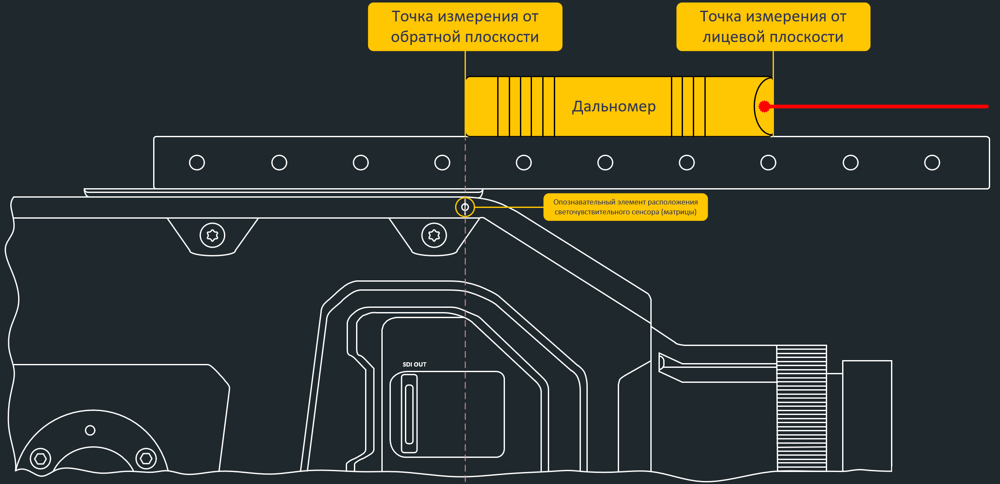
>
>В случае использования **встроенных** устройств измерения расстояний в видеокамере, необходимо, чтобы измеряемое расстояние производилось от располагаемой в ней **светочувствительного сенсора** (матрицы).

### Настройка XR

#### Создание схемы Carrot Engine для позиционирования LED-экрана

Создание **схемы Carrot Engine** для позиционирования LED-экрана осуществляется исходя из особенностей проекта.

>В нашем случае, создание **схемы Carrot Engine** будет производиться исходя из перечня используемого оборудования изложенного в разделе **"Перечень необходимого оборудования"**.

Для создания **cхемы Carrot Engine** необходимо перейти в окно **"Engine FlowChart"** приложения **System Monitor** и добавить ноды в область **"Flowchart"** в соответствии с таблицей ниже.

| Порядковый номер | Тип ноды                    | Наименование ноды | Назначение                                                     |
| ---------------- | --------------------------- | ----------------- | -------------------------------------------------------------- |
| 1                | Input                       | BMD Tracked Input | Приём видеосигнала и данных позиционирования видеокамеры.      |
| 2                | Нода обработки видеосигнала | Viewport          | Объединение видеосигала.                                       |
| 3                | Output                      | BMD Output        | Передача видеосигнала на выход карты видеозахвата изображения. |

Внешний вид расположения нод в окне **"Engine Flowchart"** представлен на рисунке ниже.

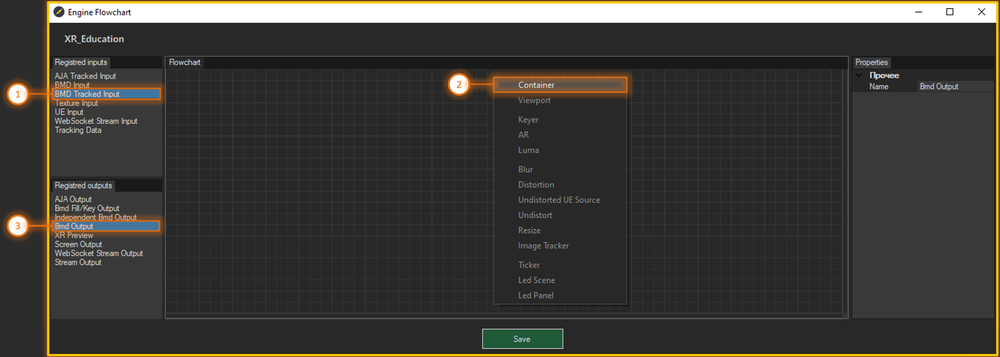

Далее, после добавления нод в область **"Flowchart"** окна **"Engine Flowchart"**, необходимо соединить их между собой в соответствии с рисунком ниже.

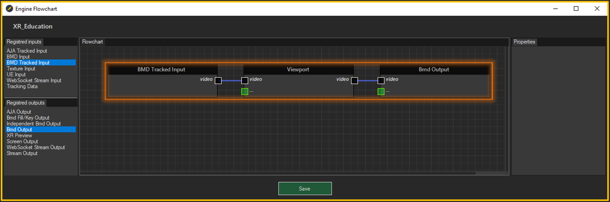

После соединения нод между собой, сохраняем созданную **схему Carrot Engine** путём взаимодействия с кнопкой `Save` и закрываем окно **"Engine Flowchart"**. Внешний вид и расположение кнопки `Save` представлено на рисунке ниже.

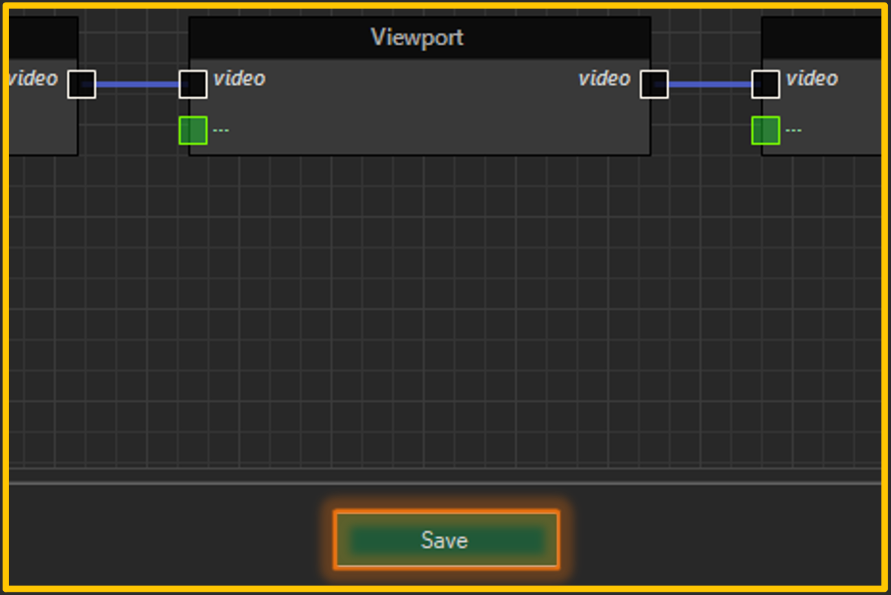

Закрыв окно **"Engine Flowchart"**, необходимо запустить **схему Carrot Engine** на зарегистрированной рабочей станции, выполнив следующие действия:

- открыть функциональное окно **"Launcher"**;
- в области **"Схемы Carrot Engine"** выбрать созданную **схему Carrot Engine**;
- в области **"Рабочие станции (Workstations)"** выбрать рабочую станцию и нажать кнопку `Start`.

>Регистрация рабочей станции осуществляется в приложении **Launcher**.

Последовательность действий по запуску рабочей станции представлена на рисунке ниже.

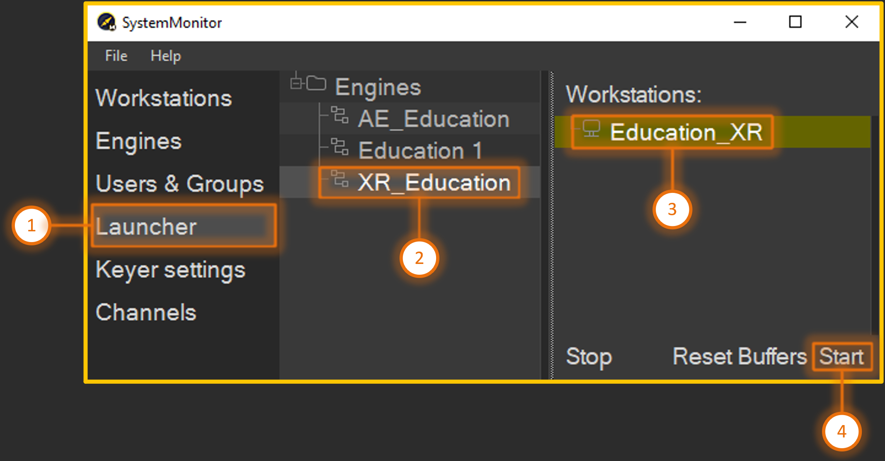

В результате проделанных действий, откроется приложения **Carrot Engine** с отображаемым в нём видеосигналом. Внешний вид запущенной схемы **Carrot Engine** на рабочей станции представлен на рисунке ниже.

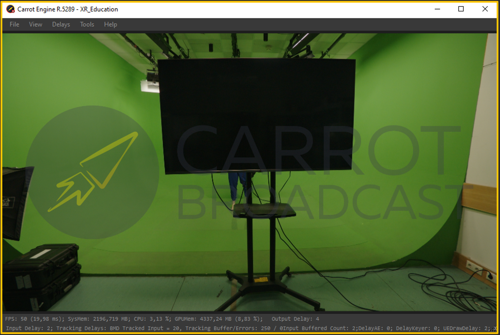

На данном этапе, процесс создания **схемы Carrot Engine** для позиционирования LED-экрана является **завершённым**.

#### Позиционирование LED экрана

После создания и запуска **схемы Carrot Engine** для позиционирования LED-экрана, необходимо произвести измерения расположения его крайних точек.

Для позиционирования LED-экрана используется специальный инструмент **"LED Utils"** приложения **Carrot Engine**, для открытия которого, необходимо:

- в области **"Вспомогательные кнопки взаимодействия c Carrot Engine"** приложения **Carrot Engine** нажать кнопку `Tools`;
- в открывшемся списке кнопки `Tools` провзаимодействовать с кнопкой `LED Utils`.

Последовательность действий для открытия инструмента **"LED Utils"** в приложении **Carrot Engine** представлена на рисунке ниже.

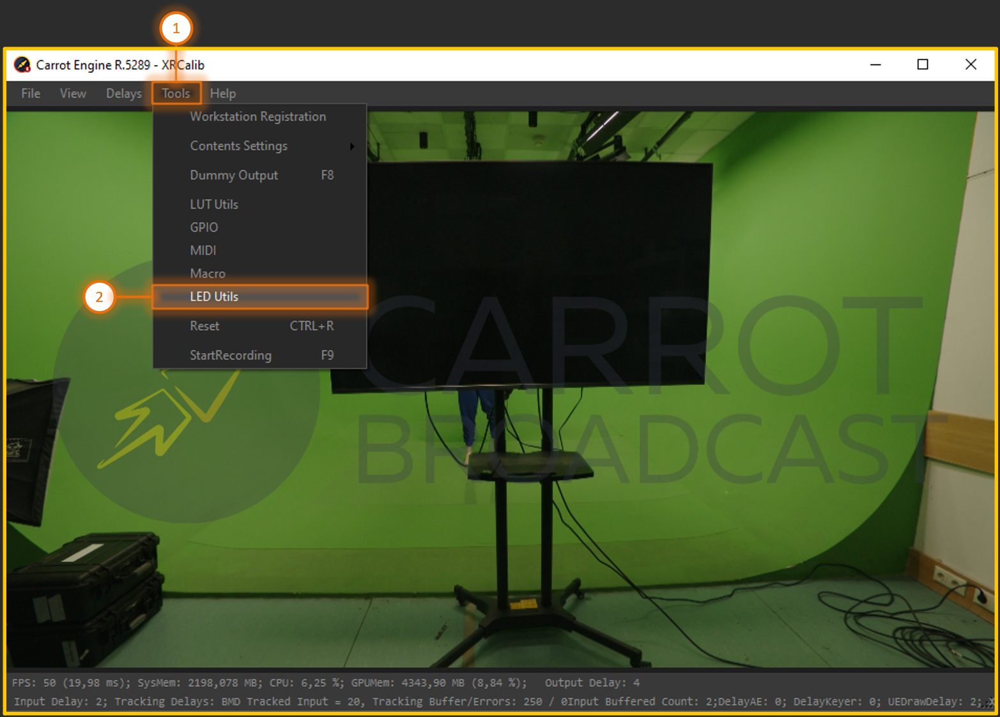

Далее, в поле **"Curve direction"** окна **"LED Utils"** необходимо выбрать форму LED-экрана.

>Ключевой особенностью LED-экранов является их возможность принимать различную форму в зависимости от требований отображения виртуального окружения. В **Carrot**, помимо настройки LED-экранов плоского типа, имеется возможность настраивать следующие:
>
>- LED-экран с отклонением от горизонтальной плоскости (**"Horizontal"**);
>- LED-экран с отклонением от вертикальной плоскости (**"Vertical"**);
>- комбинированные LED-экраны плоского типа (**"By points"**).

В рассматриваемом случае используемый LED-экран имеет форму **плоского типа** с соотношением сторон, где его ширина превышает высоту. В связи с чем, в поле **"Curve direction"** окна **"LED Utils"** необходимо выбрать параметр **"Horizontal"**.

Последовательность действий выбора параметра **"Horizontal"** в поле **"Curve direction"** окна **"LED Utils"** представлена на рисунке ниже.

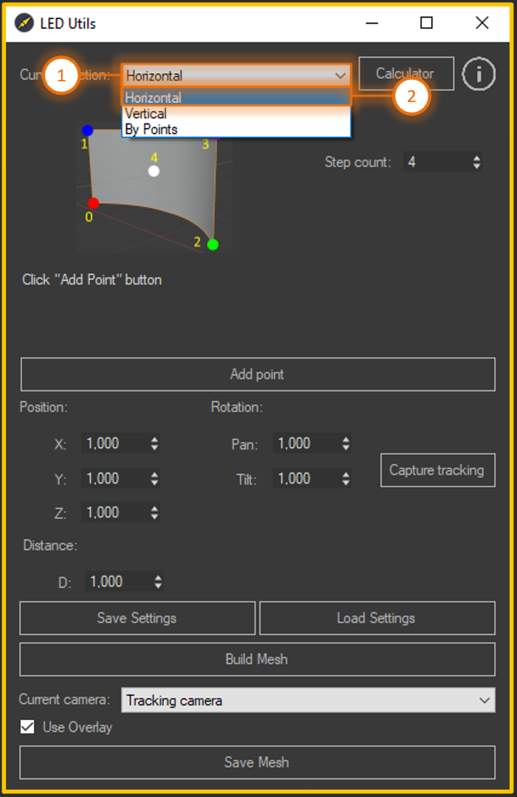

После выбора формы LED-экрана, необходимо произвести измерения с помощью дальномера, расположенного в соответствии с рекомендациями раздела **"Расположение дальномера на видеокамере"**.

> Перед позиционированием LED-экрана, также необходимо заблокировать калибровочные параметры линзы видеокамеры. Внешний вид заблокированных параметров ноды input **"BMD Tracked Input"** (используемой в **схеме Carrot Engine**) представлен на рисунке ниже.
>
>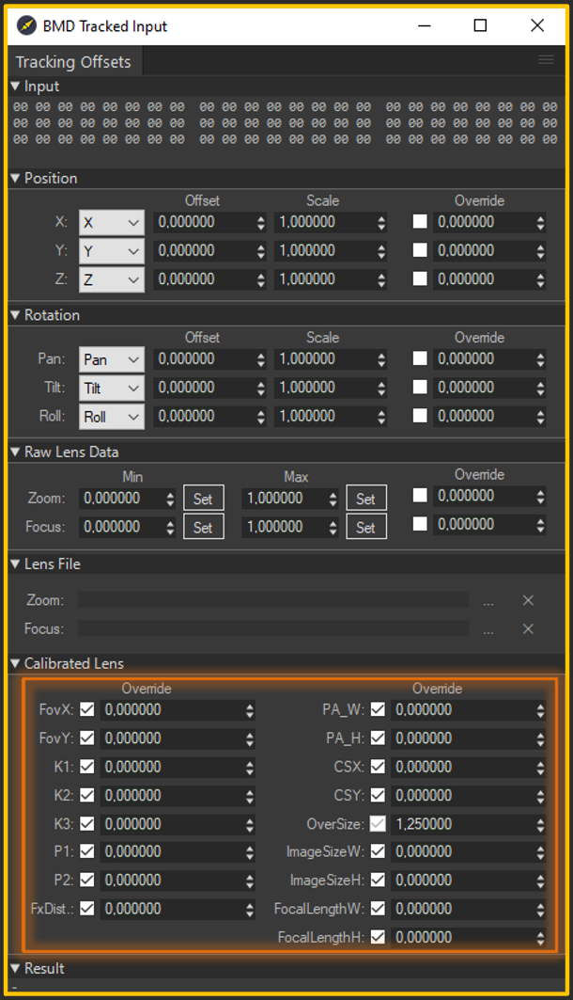
>
>Проводимые измерения, необходимо осуществлять в зависимости от используемой формы LED-экрана и в строгом соответствии с последовательностью действий, представленной на рисунках ниже:
>
>- LED экран с отклонением от горизонтальной плоскости (**"Horizontal"**):
>
>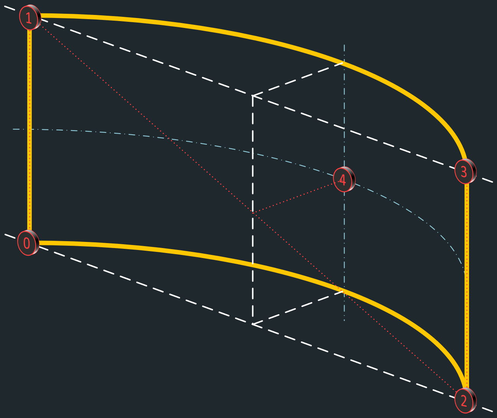
>
>- LED экран с отклонением от вертикальной плоскости (**"Vertical"**);
>
>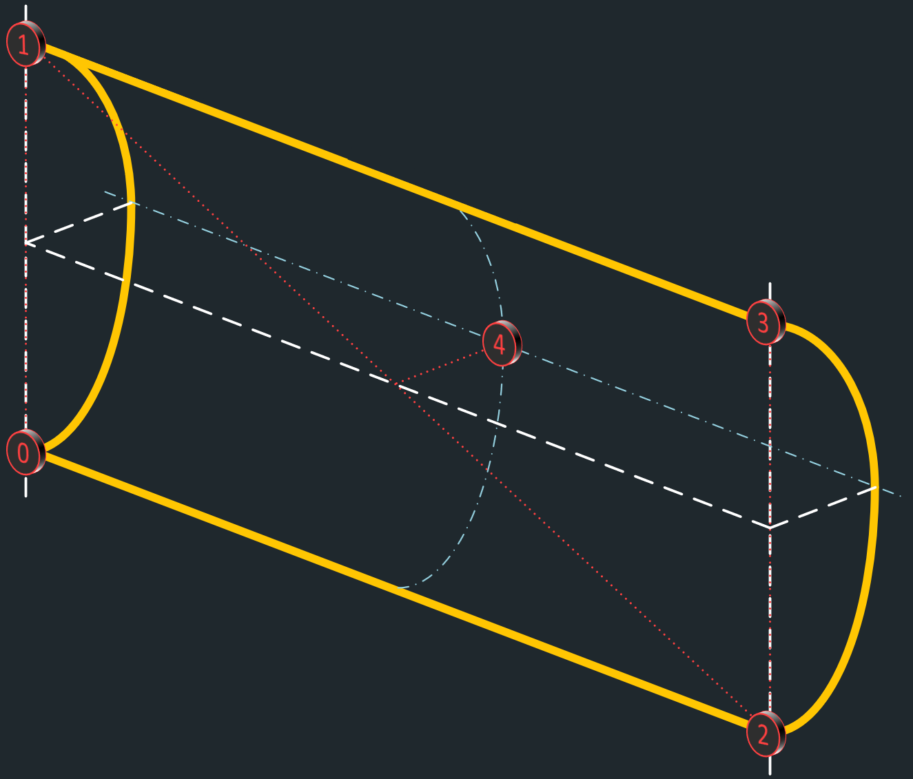
>
>- комбинированные LED-экраны плоского типа (**"By points"**).
>
>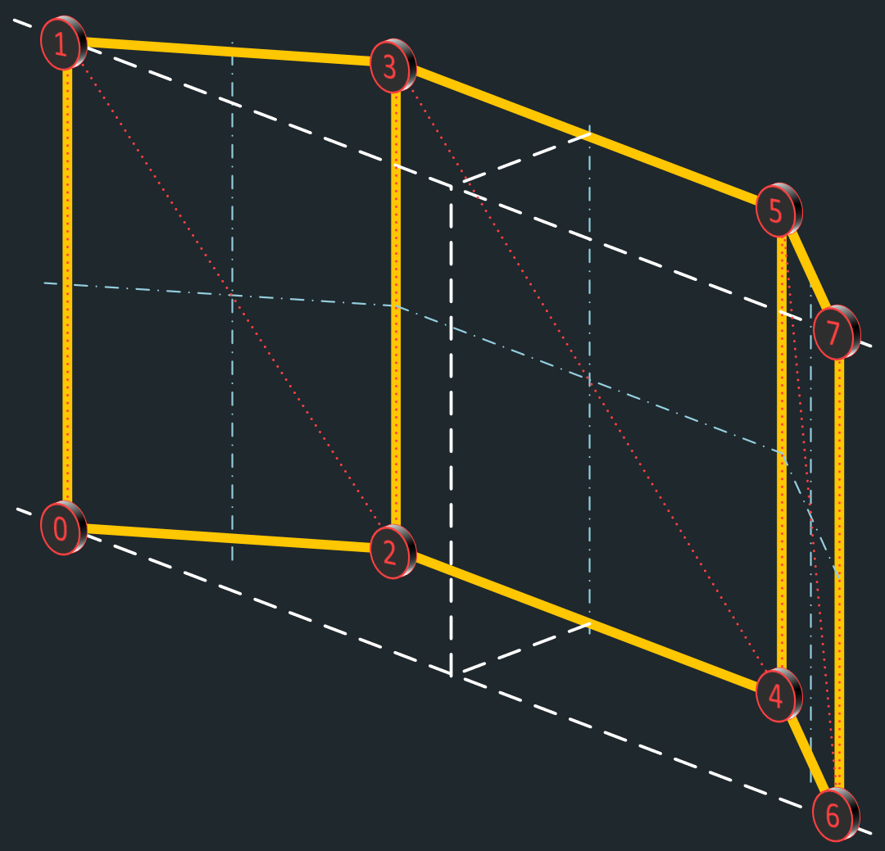

Позиционирование LED-экрана осуществляется в следующей последовательности:

- измерить дальномером расстояние до крайнего угла LED-экрана;
- зафиксировать данные позиционирования видеокамеры и измеренного расстояния с помощью инструмента **"LED Utils"**.

>Фиксация данных позиционирования видеокамеры и измеренного расстояния осуществляется следующим способом:
>
>- нажать кнопку `Add point` (фиксация данных позиционирования видеокамеры) (1);
>- выбрать добавленную точку (2);
>- ввести в параметр **"D"** раздела **"Distance"** измеренное дальномером расстояние (исчисляется метрами) и нажать клавишу `Enter` на клавиатуре (3).
>
>Процесс фиксации данных позиционирования видеокамеры и измеренного расстояния представлен на рисунке ниже:
>
>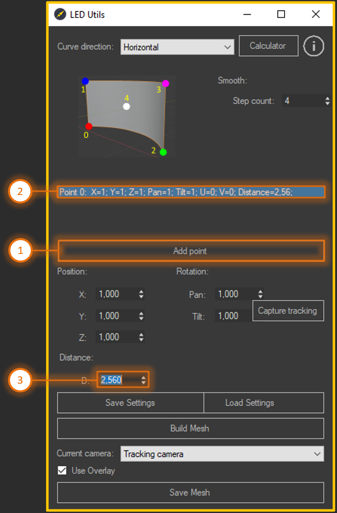
>
>Измерения отклонения от горизонтальной или вертикальной плоскости LED-экрана (измеряется по центральной точке) рекомендуется производить с отображением **телевизионной испытательной таблицы**, внешний вид которой представлен на рисунке ниже:
>
>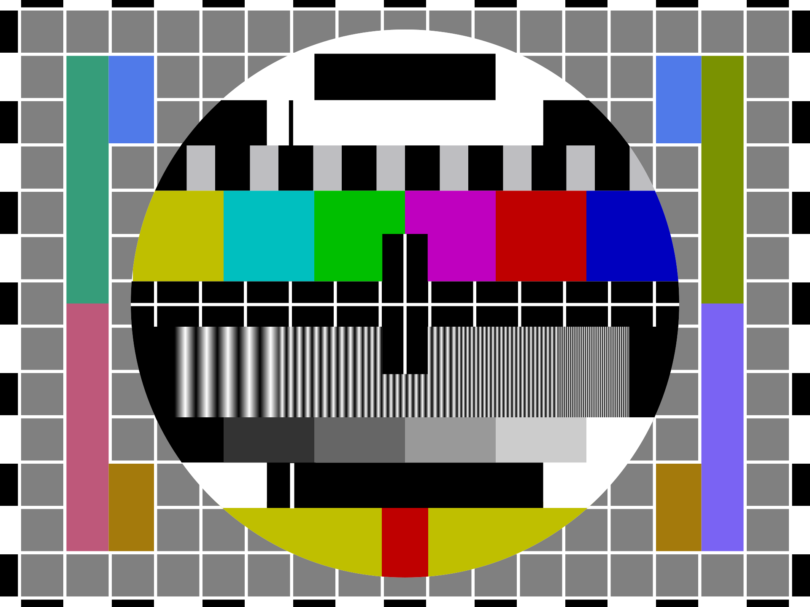

В рассматриваемом случае, ввиду использования LED-экрана с формой **плоского типа**, измерения глубины его искривления возможно осуществить в произвольном месте, а параметру **"Step count"** необходимо присвоить значение `1`.

Результат проведения измерений для LED-экрана c формой **плоского типа** представлен на рисунке ниже:

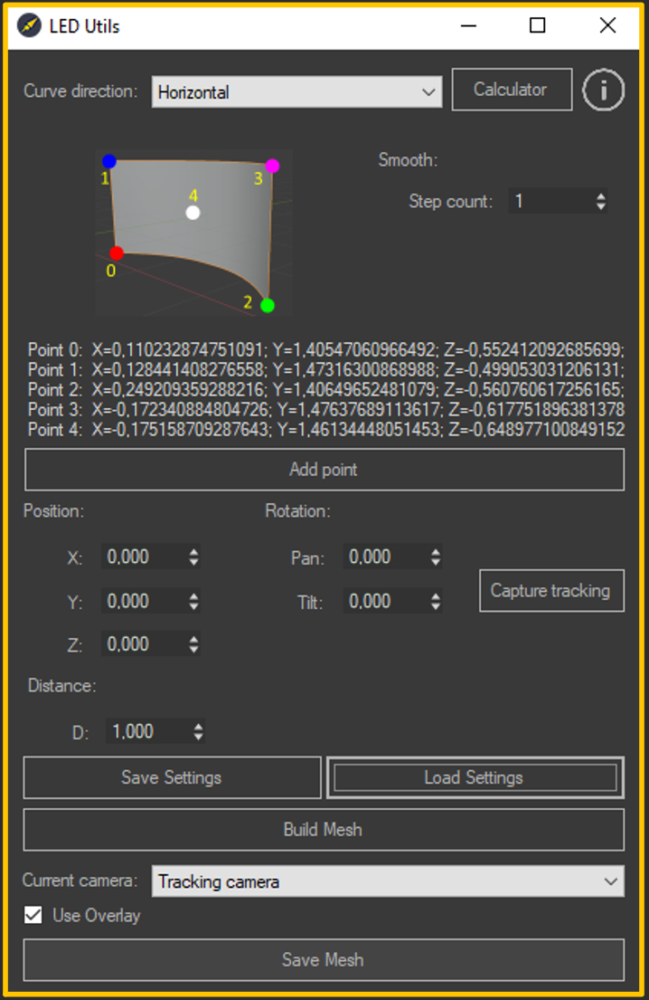

После проведённых измерений, необходимо сохранить измеренные параметры в файловую систему рабочей станции, путём взаимодействия с кнопкой `Save Settings` в окне **Led Utils**, внешний вид которой представлен на рисунке ниже.

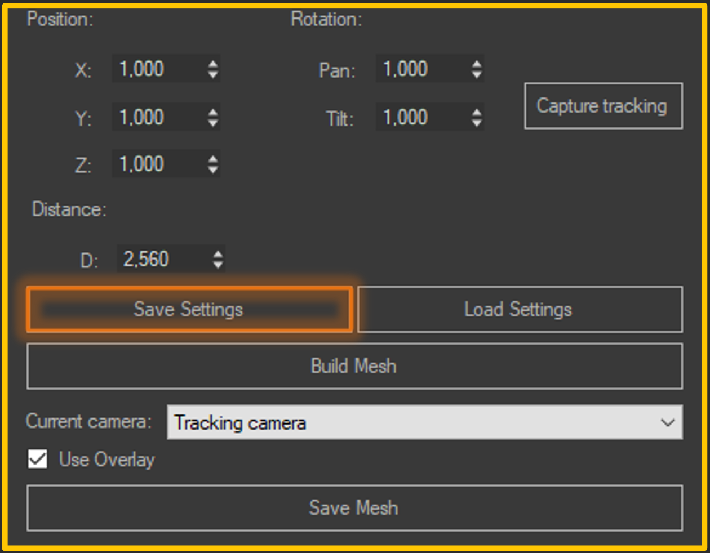

В результате проделанных действий, завершающим этапом по позиционированию LED-экрана является создание и сохранение трёхмерной сетки. Для этого, необходимо провзаимодействовать в окне **Led Utils** с кнопкой `Build Mesh`, а затем с кнопкой `Save Mesh`.

Последовательность действий по взаимодействию с кнопками `Build Mesh` и `Save Mesh` в окне **Led Utils** представлена на рисунке ниже.

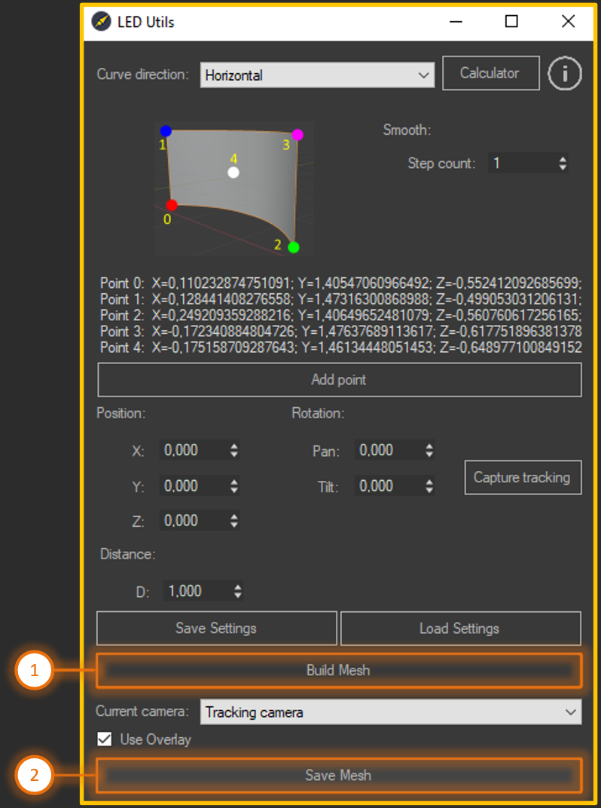

>После взаимодействия с кнопкой `Build Mesh` окна **Led Utils**, в приложении **Carrot Engine** отобразится созданная трёхмерная сетка LED-экрана. Внешний вид созданной трёхмерной сетки LED-экрана с включенным параметром отображения `Scene camera` в поле **"Current camera"** представлен на рисунках ниже.
>
>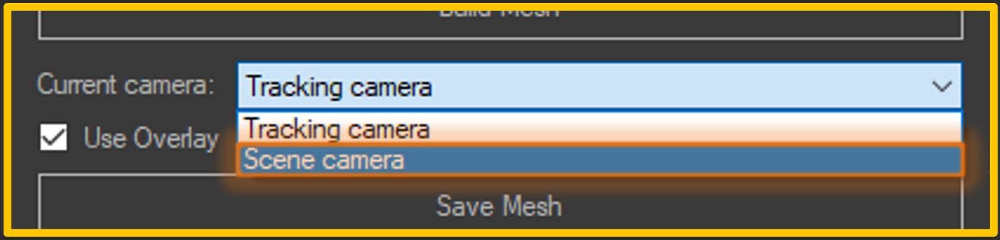
>
>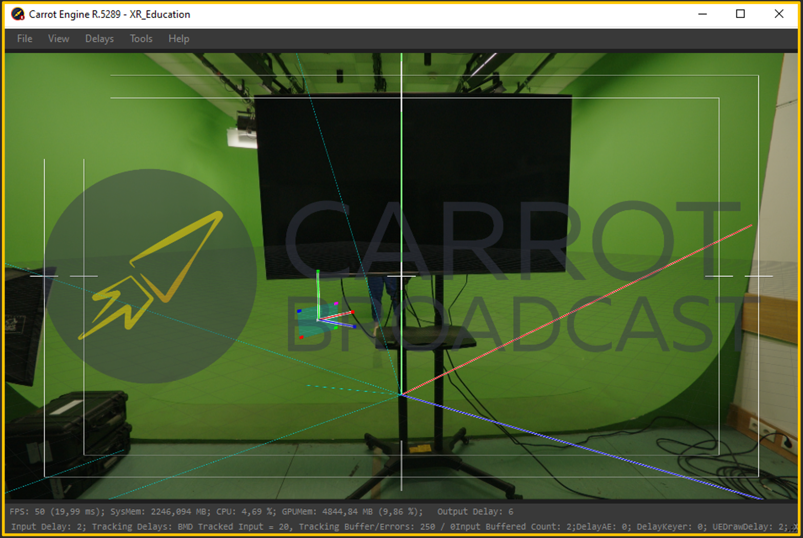

На данном этапе, процесс позиционирования LED-экрана является **завершённым**.

#### Создание схемы Carrot Engine для работы с XR

Для создания **cхемы Carrot Engine** с отображением виртуальных объектов на LED-экране плоского типа необходимо перейти в окно **"Engine FlowChart"** приложения **System Monitor** и добавить ноды в область **"Flowchart"** в соответствии с таблицей ниже.

| Порядковый номер | Тип ноды                    | Наименование ноды |
| ---------------- | --------------------------- | ----------------- |
| 1                | Input                       | BMD Tracked Input |
| 2                | Нода обработки видеосигнала | Container         |
| 3                | Нода обработки видеосигнала | AR                |
| 4                | Нода обработки видеосигнала | Led Scene         |
| 5                | Нода обработки видеосигнала | Led Panel         |
| 6                | Output                      | BMD Output        |

>В случае, если в проекте используется несколько LED-экранов, то используемые ноды обработки видеосигнала **"Led Panel"** должны соответствовать их фактическому количеству.
>
>Таким образом, внешний вид **схемы Carrot Engine** для двух LED-экранов будет соответствовать рисунку ниже.
>
>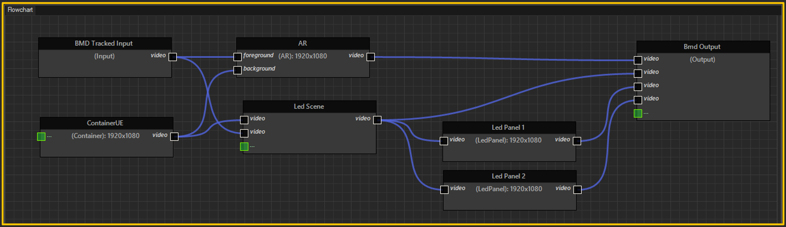
>
>При формировании **схем Carrot Engine** с использованием нескольких LED-экранов, важно учитывать аппаратные возможности используемого оборудования, в частности количество интерфейсов вывода карты видеозахвата.

Внешний вид расположения нод в окне **"Engine Flowchart"** представлен на рисунке ниже.

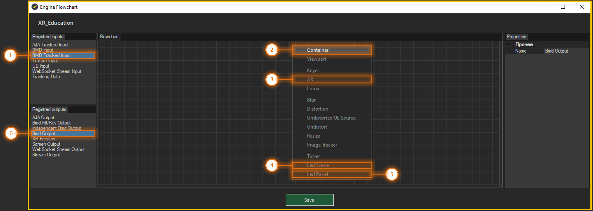

Далее, добавленные ноды, необходимо соединить их между собой в соответствии с рисунком ниже.

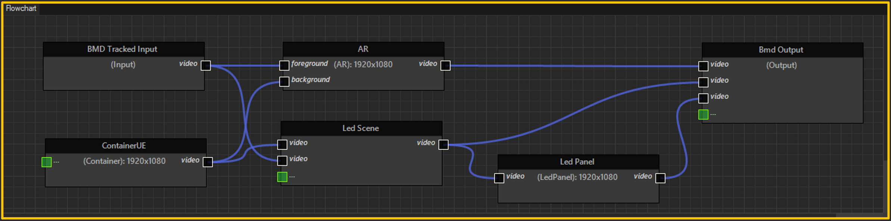

>Важно обратить внимание, что графический видеосигнал (в примере - **"ContainerUE"**) должен всегда соединяться с первой точкой входа ноды **"Led Scene"**.

После соединения нод между собой, сохраняем созданную **схему Carrot Engine** путём взаимодействия с кнопкой `Save` и закрываем окно **"Engine Flowchart"**. Внешний вид и расположение кнопки `Save` представлено на рисунке ниже.

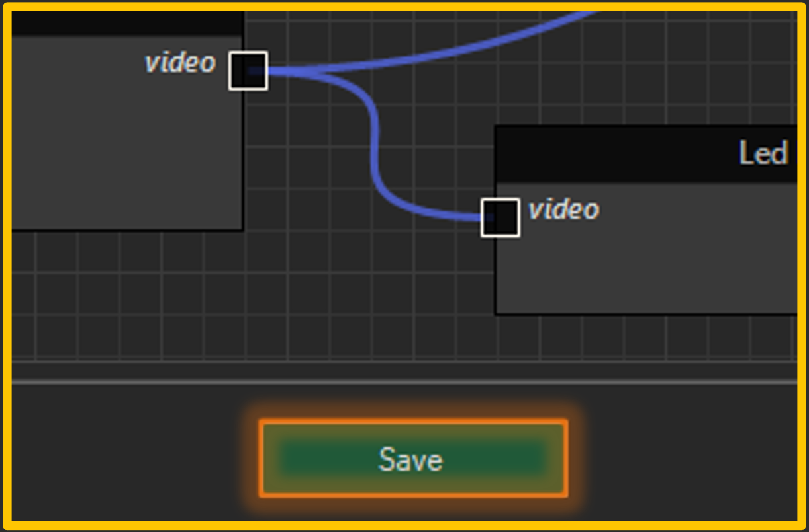

Закрыв окно **"Engine Flowchart"**, необходимо запустить рабочую станцию на которой планируется обработка видеосигнала, выполнив следующие действия:

- открыть функциональное окно **"Launcher"**;
- в области **"Схемы Carrot Engine"** выбрать созданную **схему Carrot Engine**;
- в области **"Рабочие станции (Workstations)"** выбрать рабочую станцию и нажать кнопку `Start`.

Последовательность действий по запуску рабочей станции представлена на рисунке ниже.

>Перед запуском **схемы Carrot Engine** необходимо осуществить экспорт ивентов в веб-интерфейс **Web Playlist (Carrot Dashboard)**, а также запустить проект. В случае, если предварительно не был осуществлён экспорт ивентов, то отобразится соответствующее окно с ошибкой, представленное на рисунке ниже.
>
>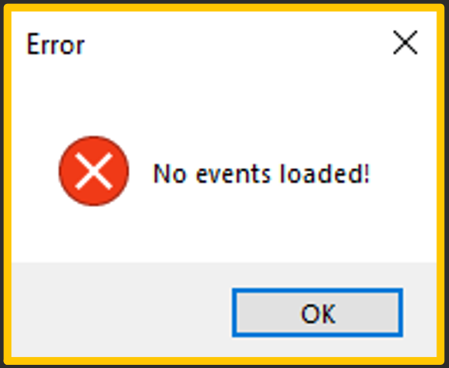

Внешний вид запущенной **схемы Carrot Engine** на рабочей станции представлен на рисунке ниже.

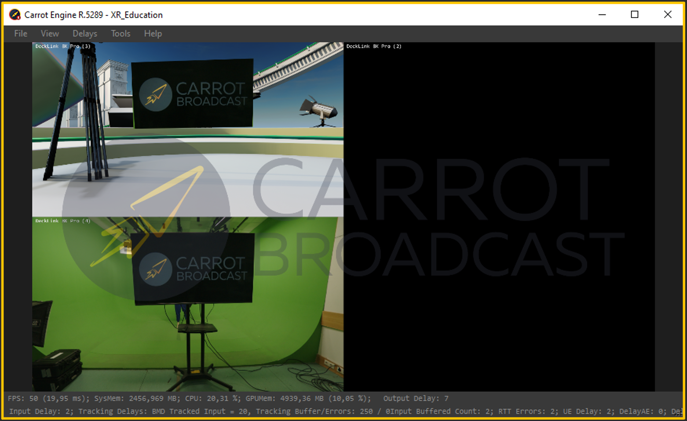

После запуска **схемы Carrot Engine** произведём настройку ноды обработки видеосигнала **"Led Scene"** в окне **"Led Scene Settings"** приложения **Carrot Engine**, для открытия которого необходимо:

- в области **"Вспомогательные кнопки взаимодействия c Carrot Engine"** приложения **Carrot Engine** нажать кнопку `Tools`;
- в открывшемся списке кнопки `Tools` выбрать раздел с настройками `Contents Settings` и нажать кнопку `Led Scene Settings`.

Последовательность действий для открытия окна **"Led Scene Settings"** в приложении **Carrot Engine** представлена на рисунке ниже.

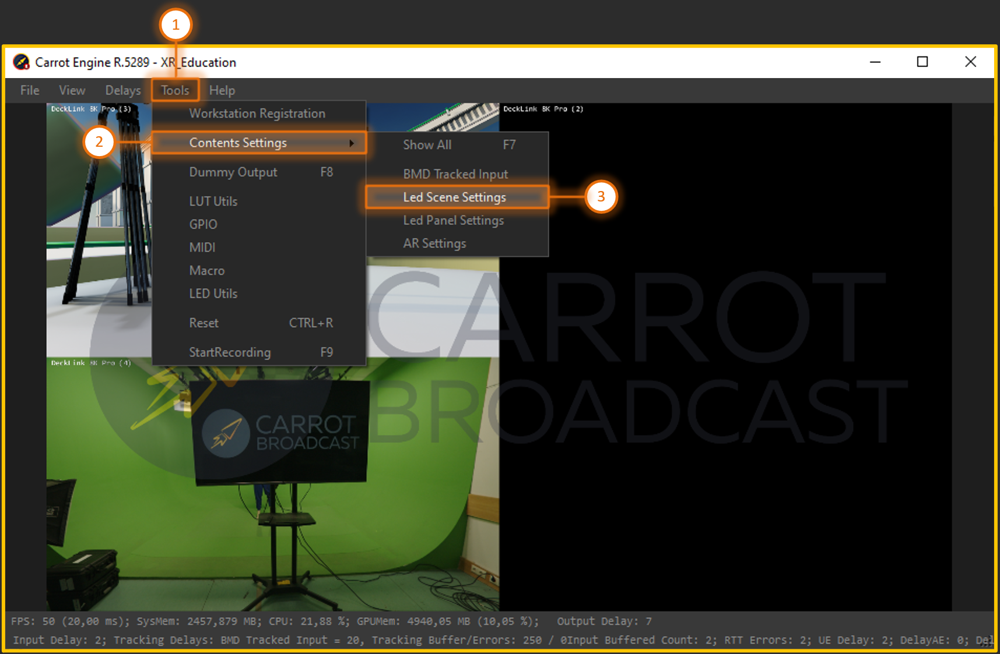

Внешний вид  окна **"Led Scene Settings"** представлен на рисунке ниже

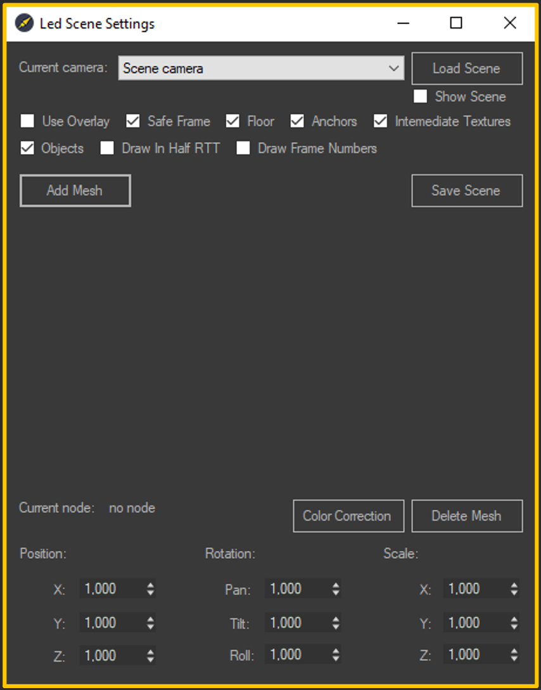

В открывшемся окне **"Led Scene Settings"** необходимо осуществить следующие действия:

- добавить сохранённую ранее трёхмерную сетку с помощью кнопки `Add Mash`;

>Результат взаимодействия с кнопкой `Add Mash` представлен на рисунке ниже.
>
>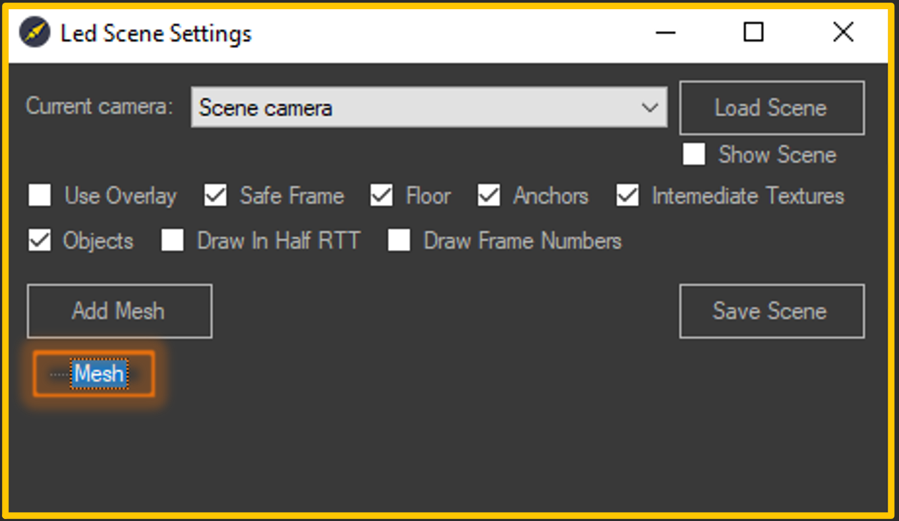
>
>После добавления трёхмерной сетки, возможно **"замирание"** видеосигнала в приложении **Carrot Engine**, что является корректной его работой.

- сохранить создаваемую сцену в директорию файловой системы рабочей станции, путём взаимодействия с кнопкой `Save Scene`;
- загрузить сохранённую сцену, путём взаимодействия с кнопкой `Load Scene`.

Последовательность действий в окне **"Led Scene Settings"** представлена на рисунке ниже.

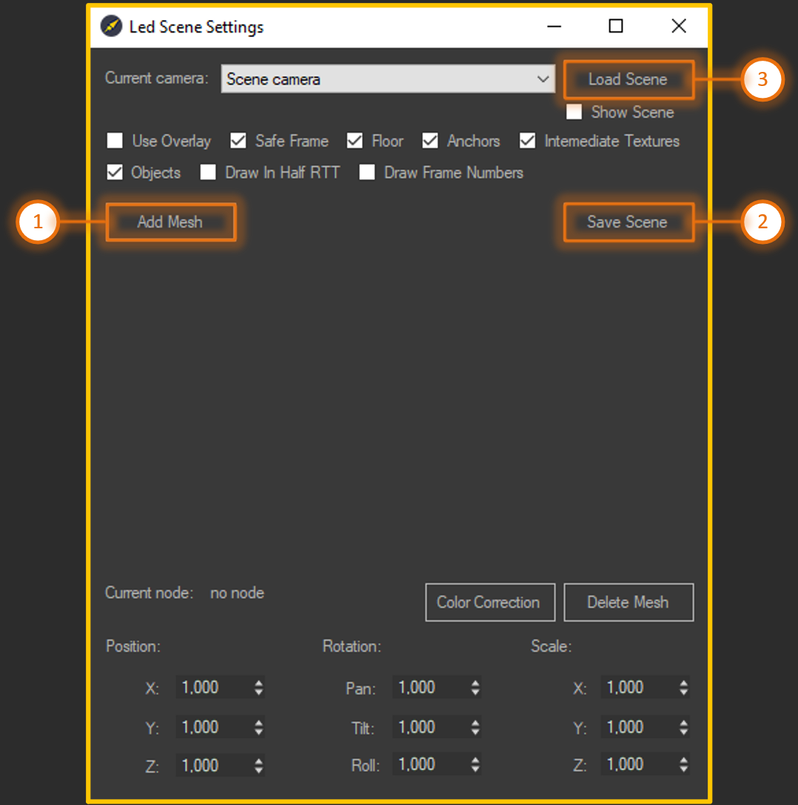

>В случае необходимости, в окне **"Led Scene Settings"** можно дополнительно настроить позиционирование трёхмерной сетки с помощью параметров, представленных на рисунке ниже.
>
>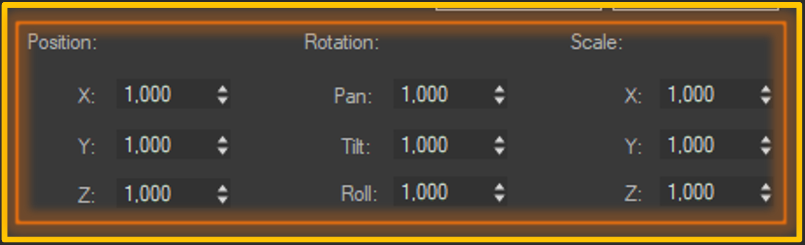
>
>Также, в окне **"Led Scene Settings"** имеется возможность осуществить цветокоррекцию графического изображения на трёхмерной сетке, для этого необходимо провзаимодействовать с кнопкой `Color Correction`, в результате чего, откроется соответствующее окно, представленное на рисунке ниже.
>
>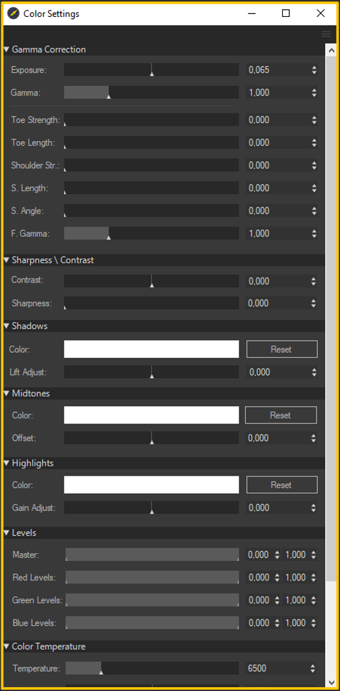

Результат проделанных действий по добавлению трёхмерной сетки и запуску сцены в приложении **Carrot Engine** представлен на рисунке ниже

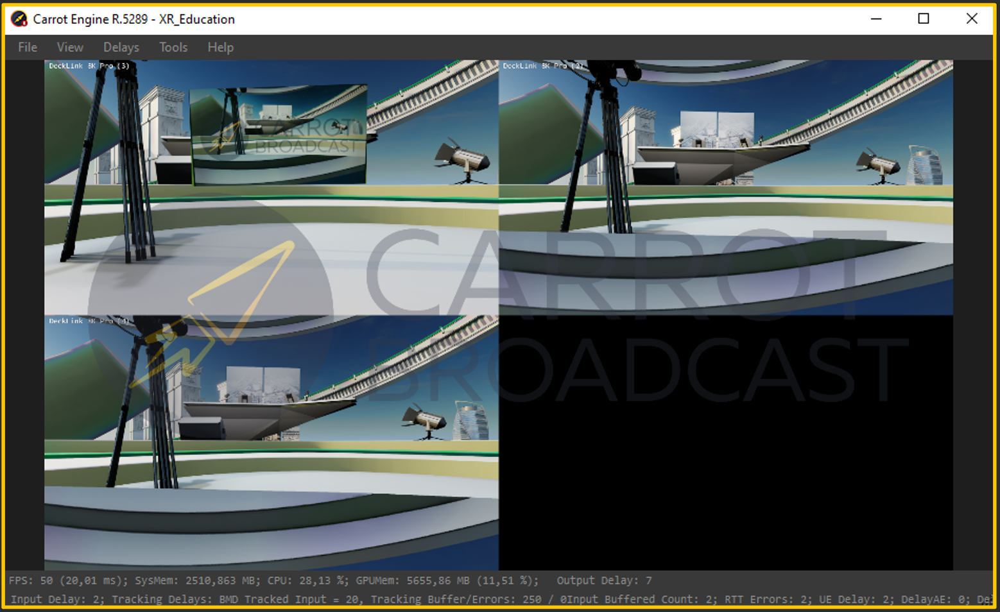

Также, в приложении **Carrot Engine** имеется возможность настройки параметров отображения ноды обработки видеосигнала **"Led Panel"** с помощью инструмента **"Led Panel Settings"**, для открытия которого необходимо:

- в области **"Вспомогательные кнопки взаимодействия c Carrot Engine"** приложения **Carrot Engine** нажать кнопку `Tools`;
- в открывшемся списке кнопки `Tools` выбрать раздел с настройками `Contents Settings` и нажать кнопку `Led Panel Settings`.

Последовательность действий для открытия окна **"Led Panel"** инструмента  **"Led Panel Settings"** в приложении **Carrot Engine** представлена на рисунке ниже.

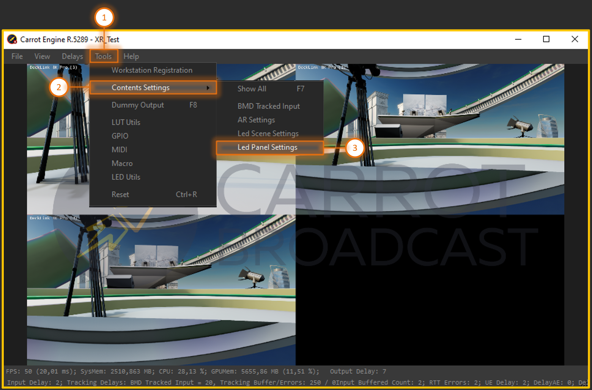

В открывшемся окне **"Led Panel"** необходимо выбрать способ отображения текстуры на LED-экране **"Графический"** ("0") или **"Цветокорректированный"** ("1"), а затем нажать кнопку `Save` чтобы сохранить результат.

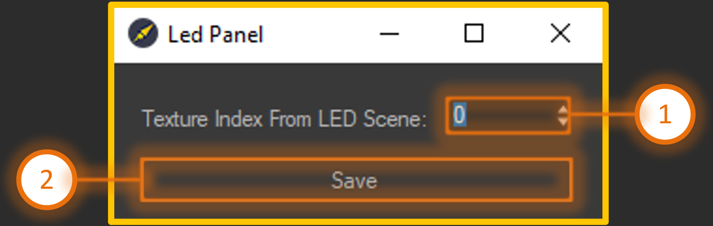

Результат отображения на LED-экране **"Графической"** и **"Цветокорректированной"** текстуры с помощью инструмента  **"Led Panel Settings"** представлен на рисунках ниже

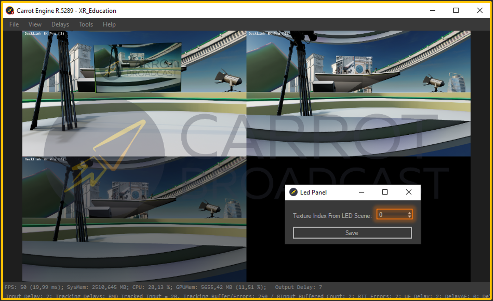

>Способ отображения текстуры на LED-экранах в окне **"Led Panel"** осуществляется методом индексации, то есть каждый индекс взаимосвязан с определённым LED-экраном.
>
>Таким образом, сформирована система, при которой каждый **третий индекс** (по счёту от начального показателя отображения текстуры на LED-экране) описывает способ отображения текстуры для **другого LED-экрана**. Внешний вид формируемой системы для **трёх LED-экранов** представлен на рисунке ниже.
>
>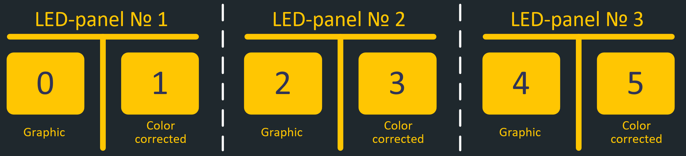

На данном этапе, процесс создания **схемы Carrot Engine** для работы с XR является **завершённым**.
