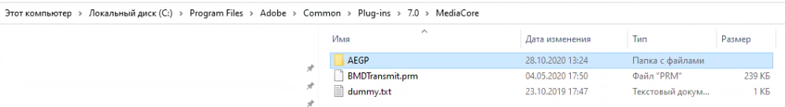
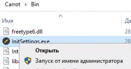
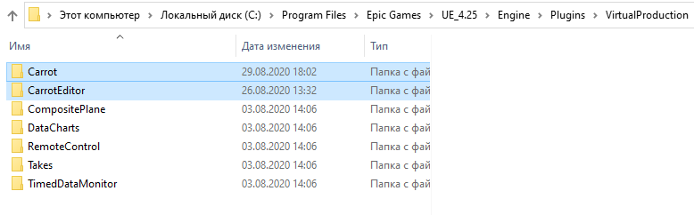
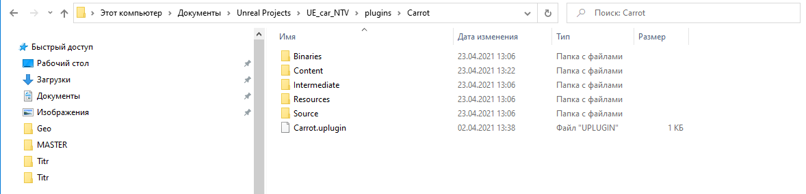

# Установка компонентов ПО Carrot

## Список компонентов ПО Carrot

**ПО Carrot** включает в себя следующие компоненты:

| Компонент                  | Описание                                                                                                                                                                                                                           | Установка                                                                                                                                                                             |
| -------------------------- | ---------------------------------------------------------------------------------------------------------------------------------------------------------------------------------------------------------------------------------- | ------------------------------------------------------------------------------------------------------------------------------------------------------------------------------------- |
| **Carrot Server**          | Единое место хранения медиа-контента и баз данных                                                                                                                                                                                  | Устанавливается на одну рабочую станцию, на которой предполагается хранение плейлистов, шаблонов и их медиаконтент.                                                                   |
| **Carrot Engine**          | Графический движок (cредство визуализации) реального времени, позволяющий отрисовывать геометрию, текстуры, эффекты освещения, послойно накладывать изображения полученные из разных источников.                                   | Устанавливается на каждую рабочую станцию, которую предполагается использовать для вывода изображения.                                                                                |
| **Carrot Web Playlist**    | Единая система управления контентом для всех CARROT ENGINE. Позволяет проигрывать шаблоны и/или запускать события в виртуальной студии, с возможностью оперативного изменения параметров.                                          | Устанавливается на тех рабочих станциях, которые предполагается использовать для управления показом шаблонов.                                                                         |
| **Carrot RTC Server**      | Программное решение для работы с потоковой передачей видео и аудио-сигнала с различных устройств и операционных систем: ANDROID, IOS, MACOS, WINDOWS, без установки дополнительных приложений (работает через браузер устройства). | Устанавливается на тех рабочих станциях, которые предполагается использовать для удаленных подключений.                                                                               |
| **Carrot Keyer**           | Программный модуль позволяющий размещать ведущего (или любой объект) с зелёного фона на виртуальный (или любой другой) фон с помощью технологии рир-проекции.                                                                      | Устанавливается на тех рабочих станциях, которые предполагается использовать для настройки обработки изображения.                                                                     |
| **Carrot Launcher**        |                                                                                                                                                                                                                                    | Устанавливается на каждую рабочую станцию, которую предполагается использовать для вывода изображения.                                                                                |
| **Carrot System Monitor**  |                                                                                                                                                                                                                                    | Устанавливается на тех рабочих станциях, которые предполагается использовать для настройки и запуска Carrot Engine, а также централизованного управления шаблонами и медиа контентом. |
| **Carrot Tracking Server** | Модуль для работы с внешними устройствами трекинга камеры. Поддерживает протоколы таких компаний как STYPE, MO-SYS, TRACKMEN и FREE-D протокол.                                                                                    | Устанавливается на тех рабочих станциях, на которые будут приходить данные от систем трекинга, либо те, которые будут использоваться для отправки данных трекинга статичным камерам.  |

## Установка Carrot AE Plugin

**Carrot System Monitor** устанавливается на тех рабочих станциях, на которых установлен **After Effects** и которые предполагается использовать для экспорта шаблонов на **Carrot Server**.

Для установки **Carrot AE Plugin** необходимо выполнить следующее:

1. Скопируйте папку `AEGP` в директорию `C:/Program Files/Adobe/Common/Plug-ins/7.0/MediaCore`;
     
1. Запустите **InitSettings** в папке `Carrot/Bin` от имени администратора.
     

## Установка Carrot UE4 Plugin

**UE4 Plugin** устанавливается на тех рабочих станциях, на которых установлен **Unreal Engine 4** и которые предполагается использовать для экспорта шаблонов на **Carrot Server**.

Для установки **Carrot UE4 Plugin** необходимо выполнить следующее:

- Скопируйте папку **CarrotEditor** в директорию `C:\Program Files\Epic Games\UE_4.26\Engine\Plugins\VirtualProduction`
    

### Установка Carrot UE4 Plugin в проект

**Carrot Plugin** устанавливается в проект.

Для установки **Carrot UE4 Plugin** в проект необходимо выполнить следующее:

- Создайте в корне проекта папку `Plugins` и скопируйте в неё папку `Carrot`
  В директорию с проектом `Unreal Projects\UE_car_NTV\plugins\Carrot`
    
