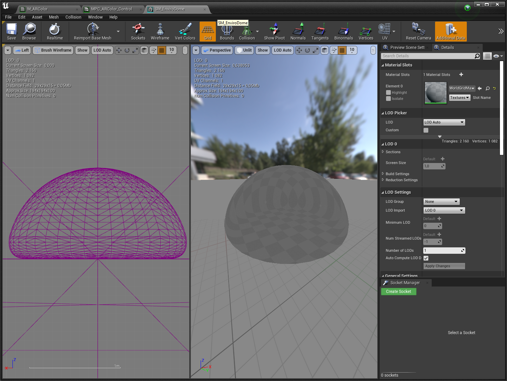
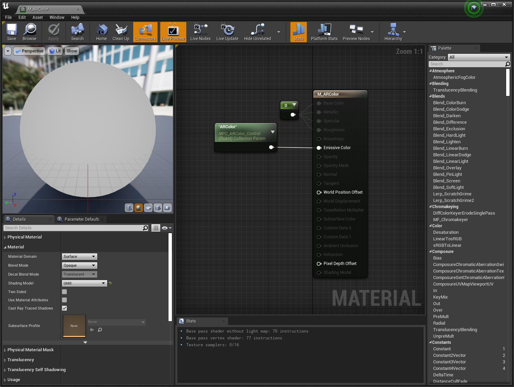
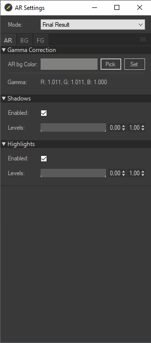

# Примеры

## Работа с Carrot Keyer

> Carrot Keyer - программный модуль позволяющий размещать нужный объект с зелёного фона на виртуальный (или любой другой) фон при помощи технологии рир-проекции.

> Для наилучшего результата рекомендуется работать с сигналом с прогрессивной развёрткой, при работе с чересстрочной разверткой могут возникнуть проблемы при работе с шумоподавлением.

_Входной сигнал_:

_Изначальный вид_

_Итоговый вид_

1. Откройте Carrot Engine.
2. Выберите **Tools > Contents Settings > Keyer Settings** или нажмите клавишу **F7**, чтобы открыть все доступные окна настроек.
    

> Для удобства настройки рекомендуется перейти в режим отображения **Mode > MultiView**, чтобы наблюдать за изменениями на всех этапах кеинга.

- Foreground - отображение переднего плана.
- DeNoise - отображение Foreground с шумоподавлением.
- DeSpill - отображение Foreground с избавлением от цветовых рефлексов.
- Screen Restoration - отображение Foreground с восстановлением зеленого цвета.
- Alpha Mask - отображение маски объекта, который нужно прокеить.
- Screen Mask -
- Shadows -
- Highlights -
- Background -
- Environment Overlay -
- Environment Light -

В правом нижнем углу для удобства расположены вектороскоп и гистограмма.

> Для наилучшего результата значения вектороскопа должны доходить до середины линии **_G_** или **_B_** в зависимости от цвета хромакея. 
>  Для наилучшего качества гистограмма должна быть максимально ровной, растянутой по всей границе и без пиков по краям. 
>  Нажатием **ЛКМ** или **ПКМ** по гистограмме можно посмотреть отдельно информацию по каждому цветовому каналу.

В начале нужно задать цвет хромакея, для этого:

1. Во вкладке **Alpha Mask** нажмите на кнопку `Pick` и с помощью **ЛКМ** щёлкните по любому участку хромакея на экране.
2. Оцените результат в окне режима _Alpha Mask._

### **DeNoise**

Наблюдаем, что изображение в _Alpha Mask_ имеет много шума, избавиться от него можно при помощи инструмента **DeNoise**: 
Во вкладке **DeNoise** имеются два параметра:

1. `Threshold` - порог срабатывания, позволяющий сохранить четкие границы на объектах;
2. `Radius` - радиус размытия в пикселях (в обычных случаях хватает значений до `50`).

Выставите значение `Threshold` в `0` и понемногу увеличивайте до требуемого результата. По необходимости скорректируйте параметр `Radius`.

Результат:

> Чтобы вернуть настройки по умолчанию, нажмите **ПКМ** по области стрелок нужного счетчика.

Режим _Final Result_:

### **DeSpill**

Картинка избавилась от лишнего шума, теперь необходимо убрать голубые границы с человека. Они возникли в результате того, что _DeSpill_ не соответствует заднему фону по тону и яркости.

> Если задний фон тёмный, а _DeSpill_ светлый, то на объекте будут видны белые границы и наоборот.

Чтобы исправить границы на объекте:

1. Переключите окно в режим отображения _DeSpill_.
    Параметры вкладки **DeSpill**:
   - `Preset` - настройка соотношения красного и синего. В нашем случае лучше всего подошёл пресет **Average**.
      Лучше всего добиться максимально серого цвета у **DeSpill** до наложения параметра `Saturation`.

- `Saturation` - смешивание с задним фоном по цвету.
- `Darken` и `Brighten` - изменение яркости тёмных и светлых областей.
  > Для наилучшего результата _DeSpill_ должен соответствовать по оттенкам и яркости изображению на _Background_.

Результат:

### **Screen Restoration**

Сравните окно _Screen Restoration_ с _Foreground_, в итоге должен получиться зеленый цвет без лишних объектов. Для настройки этого окна используется вкладка **Inner Mask**:

> **Inner Mask** помогает справиться с проблемными и дефектными элементами на объекте (например, зелеными пуговицами на человеке и т.п.)

1. С помощью инструментов `Red Weight`, `Blue Weight` и `Mask Levels` сделайте максимально возможную непрозрачную маску для необходимых объектов.
2. Наблюдайте за результатом в окнах _Inner Mask_, _Alpha Mask_ и _Screen Restoration_.

Результат: 
_Inner Mask_

_Alpha Mask_

_Screen Restoration_

### **Alpha Mask**

Теперь необходимо скорректировать саму маску. Для этого:

1. Во вкладке **Alpha Mask** выставите значение параметров `J Weight`, `Red Weight`, `Blue Weight`, `Inner Mask` на `0`.
2. Во вкладке **Alpha Mask (Advanced)** выберите `Key Type` - `UCS`.
   > У `RGB` параметры `Red Weight` и `Blue Weight` работают как процент вытеснения зелёного, т.е. в сумме эти два параметры должны, в идеале, составлять **единицу**.
3. За счёт параметров `Border Light` и `Border Dark` максимально проявите объект.

> `B. Feather` отвечает за смещение маски от границы **Inner Mask** до такого же расстояния снаружи объекта.
>  `Floor Levels` отвечает за улучшения маски у объектов, помеченных как `Chromakey Floor` во вкладке **Mask.**

4. Во вкладке **`Alpha Mask`** начинаем подбирать параметр **`Inner Mask`** в районе значения `0,5`.
5. Далее мы изменяем значение параметров `Red Weight` и `Blue Weight` до `1`.
   
   Если маски не хватает, то мы начинаем добавлять значение `J Weight` (разность яркости с _Screen Restoration_ и _Foreground,_ работает только с `Key Type` _-_ `UCS`). Если визуально этот параметр не оказывает заметного эффекта на _Alpha Mask_, то лучше его отключить. С помощью `Mask Levels` можно “подчистить” маску, чтобы остались только необходимые объекты.

> Если видно мерцание кея, то его можно уменьшить через правки `Threshold` и `Radius` вкладки **Denoise.**

_Final Result_

### **Shadows** & **Highlights**

Для усиления отображения теней и отражений можно использовать вкладки **Shadows** и **Highlights**, однако в данном примере эти настройки не требуются и остаются выключенными.

### **Environment**

Для улучшения эффекта "вживления" объекта с окружением можно воспользоваться вкладкой **Environment** и режимами отображения _Environment Overlay_ и _Environment Light_:

1. `Overlay` - уровень наложения фона на объекты.
2. `Overlay Blur` - размытие фона, лучше оставлять детали до тех пор, пока это не будет заметно на объектах первого плана.
3. `Light Strength` - степень засветки по краям объектов.
4. `Light Blur` - размытие фона для засветки
5. `Light Levels` - корректировка уровней яркости фона для засветки

> Для наилучшего результатас помощью Light Levels нужно оставлять только те элементы, которые действительно в реальности могут давать засвет на края объекта.

_Environment Light_

_Environment Overlay_

Итоговый результат:

## Дополненная реальность (AR) с Unreal Engine

> Дополненная реальность (AR) позволяет внедрить виртуальные 3D объекты и сцены в реальное окружение в реальном времени.

### 1. Подготовка Engine Scheme для работы с AR:

> Подробнее читайте в разделе [Создание схемы работы Carrot Engine](https://carrotsoftware.github.io/docs/4062/#/workflow?id=%d0%a1%d0%be%d0%b7%d0%b4%d0%b0%d0%bd%d0%b8%d0%b5-%d1%81%d1%85%d0%b5%d0%bc%d1%8b-%d1%80%d0%b0%d0%b1%d0%be%d1%82%d1%8b-carrot-engine).

1. Откройте Carrot SystemMonitor.
2. Создайте новую схему или выберите уже созданную.
3. Добавьте к схеме необходимую рабочую станцию.
4. нажмите `Edit Scheme` и перейдите в окно `Engine Flowchart`.

В окне `Engine Flowchart`:

1. Перетащите используемые вами ноды входного и выходного сигнал.
2. Добавьте контейнер для отображение контента из Unreal Engine и укажите ему имя (например, UE_AR).
3. Нажмите ПКМ и добавьте ноду `AR`.
4. Подсоедините контейнер UE_AR в `Foreground`, ноду с входящим видеосигналом в `Background`.
5. Пин `video` из ноды AR подключите к пину `video` выходного изображения, простейшая схема будет выглядеть как показано на скриншоте. 

### 2.  Подготовка проекта Unreal Engine для работы с AR
Изначальная настройка проекта UE4 описана в пункте [Подготовка UE4 проекта к экспорту шаблона (новый плагин)](https://carrotsoftware.github.io/docs/4062/#/unrealengine?id=%d0%9d%d0%b0%d1%81%d1%82%d1%80%d0%be%d0%b9%d0%ba%d0%b0-ue-%d0%bf%d1%80%d0%be%d0%b5%d0%ba%d1%82%d0%b0-%d0%bd%d0%be%d0%b2%d1%8b%d0%b9-%d0%bf%d0%bb%d0%b0%d0%b3%d0%b8%d0%bd-%d1%86%d0%b2%d0%b5%d1%82%d0%bd%d0%b0%d1%8f-%d0%bf%d0%be%d0%bb%d0%be%d1%81%d0%ba%d0%b0).

`Carrot Engine` работает в режиме `AR` на основе метода наложения `Screen\Add` по серому цвету и масками через `Custom Stencil Buffer`. Для удобства работу рекомендуем все созданные сцены и объекты создавать в своих отдельных уровнях и потом подгружать их в основной уровень проекта, настроенный под вывод Carrot.

Для работы AR понадобятся следующие типы объектов:

- Геометрия циклорамы с серым эмиссивным материалом.
- Захватчик отражений и теней.

#### 2.1. Циклорама и материал
`Циклорама` представляет из себя объект заполняющий весь видимый объем сцены. Это может быть куб, сфера либо заранее подготовленная модель с наложенным `Unlit` материалом.

Пример геометрии: 

Пример материала с вводом цвета через [Material Parameter Collection](https://docs.unrealengine.com/4.27/en-US/RenderingAndGraphics/Materials/ParameterCollections/): .

#### 2.2. Захватчик отражений и теней.

`Захватчик отражений и теней` представляет из себя плоскость с настраиваемым материалом по Metallic и Roughness. Подбирая эти 2 значения, можно отображать только отражения, только тени или всё вместе. Вторая плоскость накладывается сверху с Unlit материалом серого цвета с плавным градиентом, чтобы избавиться от четких краев первой плоскости и смешаться с окружением.

Пример материала маски: 

Пример материала для теней и отражений: 

Пример Blueprint Actor: 

>Для получения зеркальных отражений без RayTracing можно использовать `PlanarReflection`.

#### 2.3. Настройка объектов
Добавив объекты в сцену, нам нужно указать непрозрачным объектам `Custom Depth Pass`. В противном случае Carrot будет совмещать слои на основе метода наложения `Screen\Add`. Для этого:

1. Выделите нужные объекты на уровне/блупринте.
2. Наберите в строке поиска окна `Details` ключевое слово `"custom"`.
3. Поставьте галочку напротив свойства `Render CustomDepth Pass`.
4. Поставьте свойство `CustomDepth Stencil Value` - `255`. 

Результат работы в Carrot Engine с CustomStencil 255 и без: 

#### 2.4. Использование масок
AR композитинг работает по схеме, когда изображение с графикой накладывается поверх изображения настоящего. Иногда появляется возможность виртуальные объекты "обрезать" по форме реальных декораций. Для этой задачи мы можем использовать маски.

1. Добавьте необходимую геометрию на уровень.
2. Поставьте ей тот же материал, что и на серой циклораме.
3. Поставьте галочку напротив свойства `Render CustomDepth Pass`.
4. Поставьте свойство `CustomDepth Stencil Value` - `0`. 

Результат работы масок: 

### 3. Настройка AR в Carrot Engine

Экспорт шаблона происходит так же, как описано в пункте [Экспорт шаблона из проекта UE4](https://carrotsoftware.github.io/docs/4062/#/workflow?id=Экспорт-шаблона-из-проекта-ue4).

Чтобы открыть панель настроек ноды `AR`:

1. Откройте окно `Carrot Engine`
2. Откройте сверху меню `Tools` - `Show Content Settings` - `AR`

   

   Откроется окно настроек AR

   

3. В разделе `Gamma Correction` - `AR BG Color` нажмите на кнопку `Pick`, если серый цвет циклорамы выбран правильно значения `RGB Gamma` должны быть максимально близки к `1.000` как показано на скриншоте выше.

   

   В настройках `Carrot Engine` поставьте галочки `Enable` в разделах `Shadows` и `Highlights`.

   Для получения наилучших результатов используйте ползунки `Levels` а также параметрами `Metallic` и `Roughness` в материале захватчика теней и отражений.

4. Дополнительная информация по настройкам сцен AR

   - Рекомендуем использовать `Skylight` c серой `Cubemap` как показано на скриншоте, чтобы получить равномерно подсвеченную картинку для отражений.

   

   - Убедитесь что у Вас отключен эффект `Vignette` в камере которую использует Carrot и в `PostProcessVolume` он приводит к артефактам по краям кадра как показано на скриншоте.

   

   - Обратите внимание, что используя цветокоррекцию в `PostProcessVolume`, также затрагивается и цвет серой циклорамы. Альтернативно, цветокоррекцию можно проводить в окне `AR` внутри `Carrot Engine` во вкладка `BG`.