# Работа с ПО Carrot

## Работа с Carrot Server

### Изменение пароля администратора на Carrot Server

Для изменения пароля администратора выберите пункт `Tools` - `Change Administrator Password`:


Откроется окно, в котором необходимо ввести новый пароль и нажать `Apply`:


### Обновление списка подключений

Если известно, что подключение существует, но не отображается в списке подключений, то нажмите `Refresh` - программа войдет в цикл непрерывного обновления списка. Когда все подключения будут отображаться, нажмите `Refresh` еще раз.


### Удаление подключенных к Carrot Server компонентов

В главной области окна **Carrot Server** отображаются текущие подключения:


Для удаления подключения выделите его и нажмите `Disconnect Selected`:


## Настройка и регистрация рабочей станции

Для работы компонента **Carrot Engine** на конкретной рабочей станции, необходимо провести её регистрацию в **Carrot Server**. Для этого:

1. Запустите **Carrot Launcher** и выберите пункт `Tools` - `Workstation Registration`:


2. Откроется окно `Workstation Registration`:


2. В поле `Name` введите желаемое имя рабочей станции.
3. В разделе `Inputs` добавьте ноды ввода:

   - Нажмите `+` и выберите тип ноды:

     

     - `AjaTrackedInput` - работа с картой AJA при использовании UE4 шаблонов.
     - `Decklink10Bit` - работа с картой Decklink с глубиной цвета 10Bit.
     - `Decklink` - работа с картой Decklink с глубиной цвета 8Bit.
     - `RawRtc` - работа с подключением по WebRtc.
     - `BmdTrackedInput` - работа с картой Decklink при использовании UE4 шаблонов.
     - `TextureInput` - нода, использующая файл с изображением на компьютере.
     - `TrackedInput` - нода использующая только данные трекинга.
     - `WsStreamInput` - нода, для приёма сигнала с Carrot StreamSender.

   - Настройте параметры созданной ноды:

     

     

     

     

     

4. В разделе `Outputs` добавьте ноды вывода:

   - Нажмите `+` и выберите тип ноды:

     

     - `AjaOutput` - вывод изображения на карту AJA.
     - `Decklink` - вывод изображения на карту Decklink.
     - `DecklinkFillKey` - вывод изображений Fill и Key на карту Decklink.
     - `DecklinkSync` -
     - `Screen` - вывод изображения на экран монитора.
     - `WebStream` - вывод изображения на стриминговый сервис (например YouTube).

   - Настройте параметры созданной ноды:

     

     

     

     

     

     

5. Сохраните изменения:

   - Нажмите `Register/Update`:

     

   - Выберите нужную директорию сохранения и нажмите `ОК`:

     

   - Выберите нужную директорию сохранения и нажмите `ОК`:

     

6. При необходимости удалить рабочую станцию из базы данных **Carrot Server** нажмите `UnRegister`:

   

   Появится уведомление об успешном выполнении операции:

   

## Создание схемы работы Carrot Engine

**Carrot Engine** производит обработку изображения в соответствии со схемой, составленной в `System Monitor`. Для этого:

1. Запустите `System Monitor` и выберите раздел `Engines`:

   

2. Добавьте новую директорию нажав `Add Folder` либо выберите уже существующую.
3. Нажмите `Add Engine` и введите желаемое имя схемы и нажмите `OK`:

   

4. Выберите созданную схему:

   

5. Добавьте рабочие станции, которые будут работать по настраиваемой схеме:

   - Нажмите `Add Workstation` - откроется окно `Workstations`:

     

   - Выберите рабочую станцию и нажмите `ОК`.
   - В разделе `Workstations` отобразится добавленная рабочая станция:

     

6. Настройте созданную схему:

   - Нажмите `Edit Scheme` - откроется окно `Engine Flowchart`:

     

   - Добавьте ноды ввода перетаскиванием из раздела `Registered inputs`:

     

   - Добавьте одну ноду вывода перетаскиванием из раздела `Registered outputs`:

     

   - Кликнув правой кнопкой мыши по пустому месту выберите тип добавляемой ноды:

     

     - `Carrot Container` - используется для проигрывания шаблонов, либо для отображения изображения, получаемого от ноды ввода.

       

       Данная нода может иметь несколько входных пинов. На вход можно подать как ноду ввода, так и другие ноды. Позволяет изменять следующие характеристики:

       - Положение относительно левого верхнего угла (параметры X, Y).
       - Размер изображения на выходе (параметры Width, Height).

     - `Carrot Keyer` - используется для замены заднего фона изображения на другое изображение.

       

       Пин `Foreground` - изображение, которое будет прокеено и наложено поверх виртуального фона (например, камера с зеленой циклорамой).

       Пин `Background` - изображение, которое будет использовано в качестве виртуального фона (например, контейнер с UE шаблоном).

       Позволяет изменять следующие характеристики:

       - Положение относительно левого верхнего угла (параметры X, Y).
       - Размер изображения на выходе (параметры Width, Height).

     - `Carrot AR` - Служит для добавление объектов дополненной реальности.

       Пин `Foreground` - виртуальное изображение, которое будет наложено поверх заднего фона (например, контейнер с UE шаблоном).

       Пин `Background` - изображение, на которое будут проецироваться виртуальные объекты (например, сигнал с камеры).

       Позволяет изменять следующие характеристики:

       - Положение относительно левого верхнего угла (параметры X, Y).
       - Размер изображения на выходе (параметры Width, Height).

     - `Carrot Viewport` - Случит для прямого наложения нескольких веток друг на друга.

   - Сохраните составленную схему нажатием кнопки `Save`.

     

> Примечание: если рассматривать ноды в качестве слоёв, то на итоговом изображении слои накладываются друг поверх друга начиная от ноды ввода к ноде вывода.
>
> 

## Настройка Carrot Keyer

### Настройка Mask

Зайдите `Carrot Keyer` -> `Key` -> `Alpha Mask` -> `Key color` -> `Pick` и выберите цвет который необходимо убрать.


Нам необходимо убрать верхнюю часть кадра с оборудованием:


- выберете в `Mode` -> `Alpha mask`

  В **Carrot Engine** включиться отображение `Alpha mask`.

- Перейдите в `Carrot Keyer` -> `Mask` -> `Scene` - > `Filename`


И выберете модель вашей студии в формате `.fbx`

Модель должна содержать в себе следующие объекты:

1. Модель вашей циклорамы.
2. Модель помещения студии.
3. Захватчик отражений (если вы его используете).
4. Специальные объекты (при использовании excluder).

Они отобразятся в разделе `Objects`.


Теперь каждому объекту надо указать его назначение.
Для этого щелкните по объекту `ЛКМ` и в разделе `ObjType` выберите его тип:


В разделе `Object offsets` можно изменить местоположение угол поворота и размер объектов

Объекты вашей модели должны совпасть по положению с реальными результат должен выглядеть примерно так:


Так же при статических камерах возможно использовать маски в формате `.png`

Для этого переключите `Mask type` -> `Texture`

И в разделе `Scene` -> `Filename` укажите путь к файлу:


За тип маски в данном случае будет отвечать канал в пикселе изображения:

- Канал `Red` - Chromakey BG
- Канал `Blue` - VR BG
- Канал `Green` - Chromakey Floor

Результат работы масок:


## Настройка AE проекта для Carrot

### Настройки композиции

1. Запустите Adobe After Effects.
2. Откройте проект.
3. На панели **Project** откройте корневую композицию, которую хотите экспортировать.
   

4. Выберите меню **Composition** > **Composition Settings...** или нажмите клавиши **CTRL**+**K**
   

5. Проверьте разрешение и частоту кадров композиции.
   

   > Частота кадров композиции должна совпадать с частотой кадров видеотракта.<br>
   > <br>Разрешение композиции должно совпадать с разрешением контейнера в схеме движка Carrot.
   > 

6. Удалите из проекта все неиспользуемые элементы. Для этого выберите **File** > **Dependencies** > **Remove Unused Footage**.
   

### Указание точек входа и выхода анимации


Для того, чтобы Carrot распознал отрезки анимации, пользователю требуется выставить маркеры композиции. Композиция должна содержать минимум 3 маркера. Если в других композициях присутствуют какие-либо маркеры, то их следует удалить.

Для того, чтобы добавить маркера:

1. Переместите ползунок в начало композиции (или анимации) и поставьте первый маркер с помощью клавиши **Numpad «\*»** на цифровой клавиатуре или выберите **Layer** > **Markers** > **Add Marker**:
   

2. Щелкните правой кнопкой мыши по добавленному маркеру и выберите **Settings...**
   

3. В открывшемся окне измените комментарий маркера на `OUT`.

   

4. Переместите ползунок в середину композиции и поставьте следующий маркер.

   

5. Измените комментарий маркера на `IN`

   

   

6. Переместите ползунок в конец композиции и поставьте следующий маркер.

   

7. Измените комментарий маркера на `OUT`.

   

Расположение маркеров будет выглядеть следующим образом:


Здесь присутствуют два временных промежутка:

- `OUT` - `IN` (в движке именуется как `IN`)
- `IN` - `OUT` (в движке именуется как `OUT`)

Воспроизведение в движке этого шаблона будет выглядеть следующим образом:

- Шаблон не активен, графика не показывается.
- Шаблон активируется, проигрывается область между маркерами `OUT`-`IN`.
- Шаблон активен, графика остаётся на позиции маркера `IN` и именуется как `ACTIVE`.
- Шаблон деактивируется, проигрывается область между маркерами `IN`-`OUT`.

7. Сохраните проект.

### Указание точек дополнительных анимаций

Композиция также может содержать дополнительные анимации помимо стандартных для входа и выхода. Для них также следует добавить маркеры. Для этого:

1. Переместите ползунок в начало желаемой анимации и добавьте новый маркер.
2. Измените комментарий маркера.
3. Переместите ползунок в конец желаемой анимации и добавьте ещё один маркер.
4. Измените комментарий маркера на желаемый.

Пример:


Здесь присутствуют три временных промежутка:

- `OUT` - `IN` (в движке именуется как `IN`)
- `IN` - `ANIM` (в движке именуется как `ANIM`)
- `ANIM` - `OUT` (в движке именуется как `OUT`)

Область между маркерами с одинаковыми именами (в примере `ANIM`-`ANIM`) игнорируется в **Carrot Engine** и пропускается при воспроизведении.

### Дополнительная информация и рекомендации

#### Проект

- Каждый шаблон рекомендуется сохранять в свой отдельный проект **After Effects**.
  > При экспорте шаблона из **After Effects** информация о всех композициях и контенте в проекте (в том числе неиспользуемых) передаётся и обрабатывается движком Carrot.

#### Эффекты

Поддерживаемые эффекты из **After Effects** в **Carrot Engine** в режиме реального времени:

- _Blur & Sharpen_ - **Sharpen**
- _Generate_ - **Fill**
- _Generate_ - **Gradient Ramp**
- _Color Correction_ - **Tritone**
- _Color Correction_ - **Tint**
- _Color Correction_ - **Levels**
- _Color Correction_ - **Curves**
- _Expression Controls_ - **3D Point Control**
- _Expression Controls_ - **Angle Control**
- _Expression Controls_ - **Checkbox Control**
- _Expression Controls_ - **Color Control**
- _Expression Controls_ - **Point Control**
- _Expression Controls_ - **Slider Control**
- _Transition_ - _Wipes_ - **Linear Wipe**

#### Композиции и слои

- Ключи анимации должны располагаться по краям кадров.
  
- Слои, отмеченные в композиции как `Guide Layer` следует скрыть или удалить перед экспортом.
- При использовании логики **IF ELSE** внутри выражений, для корректной обработки в **Carrot Engine**, структура должна выглядеть следующим образом:

  

- Все выражения, которые не требуют обработки в реальном времени, рекомендуется конвертировать в ключи анимации перед экспортом.

Поддерживаемые типы слоев в композиции:

- **Null Layer**
- **Solid Layer**
- **Shape Layer**, конвертированные в кривые Безье (без операций с контурами)
- **Text Layer** (без эффектов аниматора)
- **Media Layer** (MP4, MOV, JPG, PNG, PSD и т.д.)
  > В целях оптимизации шаблона и проекта PSD/AI слои внутри композиции рекомендуется заменить на Solid Layer, либо на готовое изображение PNG или JPG.

Поддерживаемые операции со слоями:

- **Track Matte** (Подложки отслеживания)
- **Parent Link** к другому слою или его свойствам (Привязка)
- **Blending Modes** (Режимы наложения)
- **Masking** (Маски)
- **Expressions** (Выражения)

#### Маски

- Маска в режиме наложения `None` скрывает отображение слоя в **Carrot Engine**.
- Единичную маску в режиме `Intersect` следует поменять на `Add`.
- Свойство `Mask Feather` по умолчанию в **Carrot Engine** использует бикубический режим сэмплинга.

#### Текст

- **Carrot Engine** считывает свойства текста (шрифта, размер, цвет, интервалы и т.д.) по первому символу и применяет их на все остальные символы.
- **Carrot Engine** принудительно применяет для кернинга текста тип `Metrics`.
- Используемые сторонние шрифты рекомендуется устанавливать в систему в формате **OTF**.

#### 3D слои

- **Carrot Engine** считывает систему измерений из After Effects в миллиметрах, т.е. 1000px в **After Effects** = 1000mm в **Carrot Engine**.
- Для вращения слоя следует использовать свойство **Orientation**.

## **Экспорт шаблона из проекта AE**

1. Выберите меню `Composition` - `Export Carrot Template`.


> Примечание: если этот пункт не активен, нажмите на раздел с композициями в нижней части интерфейса **After Effects**. 2. Появится окно **Template Preview**.

    

3. Откройте вкладку `Animation` в центральном разделе `Viewport`.

   

4. В поле `Composition` выберите композицию, которая была экспортирована:
   

Благодаря маркерам здесь появились три стейта:

- `IN` (соответствует промежутку `OUT`-`IN`)
- `ANIM` (соответствует промежутку `IN`-`ANIM`)
- `OUT` (соответствует промежутку `ANIM`-`OUT`)

  

4. Проверьте правильность воспроизведения анимации:

   1. Нажмите на название стейта.
      

   2. Дождитесь завершения проигрывания.

5. Нажмите кнопку `Save Template`.

   

6. В новом окне выберите директорию для сохранения шаблона.

7. В поле `Name` задайте название шаблона.

8. Нажмите на поле `Container`.

9. В появившемся окне выберите нужную схему движка и укажите соответствующий контейнер.

   

10. Нажмите на кнопку **Save Template**.
11. Закройте **Template Preview**.

### Создание переменных

Текстовые или медиа слои могут выступать в качестве оперативно изменяемых параметров шаблона в **Carrot Web Playlist**:


1. Для назначения слоя в качестве переменной выполните следующее:

   1. Выберите требуемый слой
   2. Зажмите левую кнопку мыши и перетащите его в раздел **Variables**.

   

   2. Выберите созданную переменную
   3. В поле `Name` введите желаемое имя переменной.

    4. В поле `Type` укажите необходимый тип переменной.

#### Создание текстовой переменной


Для назначения текстового слоя в качестве переменной выполните следующее:

1. Раскройте слой и найдите свойство `Source Text`.
2. Зажмите левую кнопку мыши и перетащите его в раздел **Variables**.

   

   - В поле `Name` введите желаемое имя переменной.
   - В поле `Type` укажите тип `Text` или `RichText`.
     > В случае, если указан тип `RichText`, к содержимому поля `DefaultValue` добавится тег изначального цвета текста:
     > 

   ```xml
    "<font color=\"#000000\">Text Sample</font>"
   ```

3. Настройте плавность линий, отображающих текст:
   1. Выберите текстовой слой.
      
   2. В разделе `Properties` измените параметр `StepCount` на желаемый:
      

> Примеры значений параметра `StepCount`:<br>

    `StepCount` = 1:
    <br><br>
    `StepCount` = 2:
    <br><br>
    `StepCount` = 4:
    <br><br>
    <br>Примечание: чем больше значение параметра `StepCount`, тем больше потребляется ресурсов ГП на отрисовку текста.

## AR с использованием UE4

Отображение в реальной студии виртуальных объектов (дополненная реальность).

### 1. Подготовка схемы для работы с AR:

`System monitor` - `Engine` - `Add Engine` - `Введите имя схемы` - `Ok`
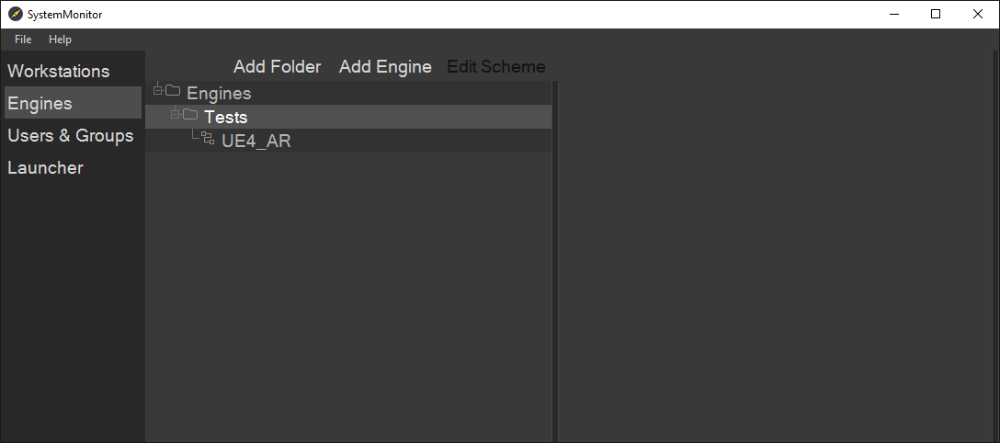

Выберите схему и нажмите `Add Workstation` и добавьте сервер на котором будет запущена схема


После этого нажмите `Edit Scheme` откроется окно `Flowchart`

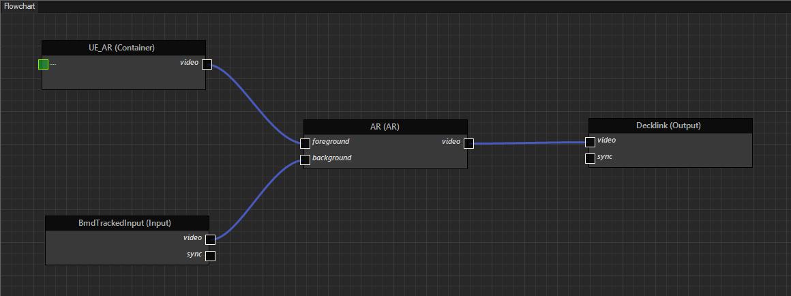

1. Перетащите используемые вами ноды входного и выходного сигнал.
2. Добавьте контейнер для шаблона UE4 правой клавишей мыши.
3. Добавьте ПКМ ноду `AR` и подсоедините контейнер UE4 в `Foreground`, ноду с входящим видеосигналом в `Background`. Коннектор video подсоедините к ноде выходного видео сигнала, схема должна выглядеть как показано на скриншоте.

### 2.  Подготовка проекта UE4 для работы с AR
Изначальная настройка проекта UE4 описана в пункте `Подготовка UE4 проекта к экспорту шаблона (новый плагин)`

В `Project settings` - `Rendering` отключите `Ambient Occlusion` , `Auto Exposure` (`Motion Blur` если это необходимо) как показано на скриншоте


Если Вам необходимы `Ambient Occlusion` в проекте используйте локальный `PostProccesVolume` с отключенной функцией `infiniti extent`.

`Carrot Engine` работает с `AR` на основе метода наложения `Screen\Add` по серому цвету. Мы рекомендуем создать все объекты для работы с AR в отдельном sublevel и вложить его в основной level проекта.

Нам необходимо создать следующие типы объектов:

- Серая циклорама
- Захватчик отражений и теней

`Серая циклорама` представляет из себя объект заполняющий весь видимый объем сцены это может быть куб, сфера либо заранее подготовленная модель с наложенным МАТЕРИАЛОМ(Пример настроек материала приведен на скриншоте).

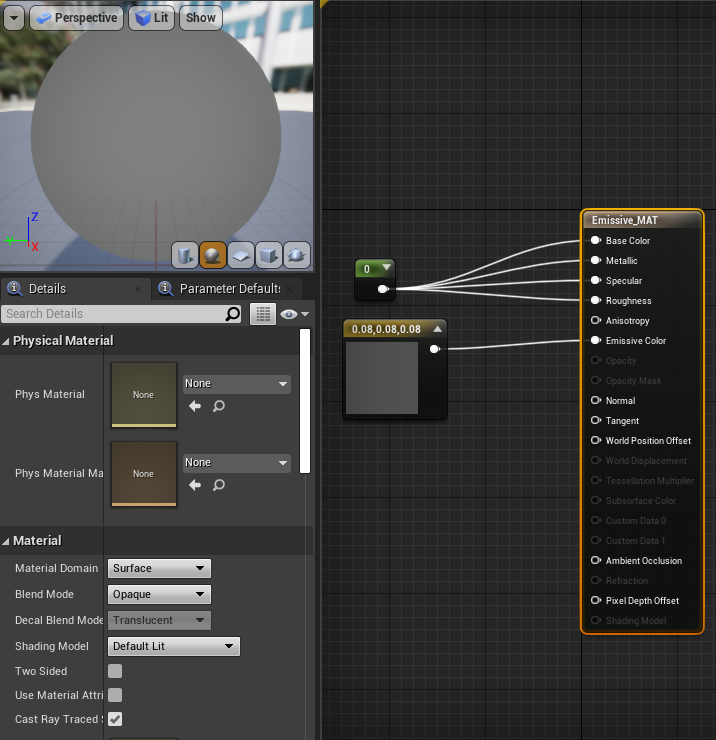

Пример объекта дополненной реальности в созданной циклораме

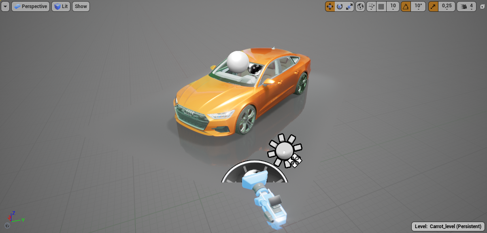

### 3. Настройка Carrot Engine при работе с AR

Экспорт шаблона происходит так же, как описано в пункте [Экспорт шаблона из проекта UE4](https://carrotsoftware.github.io/docs/4062/#/workflow?id=Экспорт-шаблона-из-проекта-ue4).

Чтобы открыть панель настроек ноды `AR`:

1. Откройте окно `Carrot Engine`
2. Откройте сверху меню `Tools` - `Show Content Settings` - `AR`

   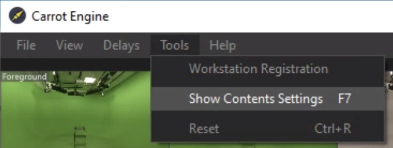

   Откроется окно настроек AR

   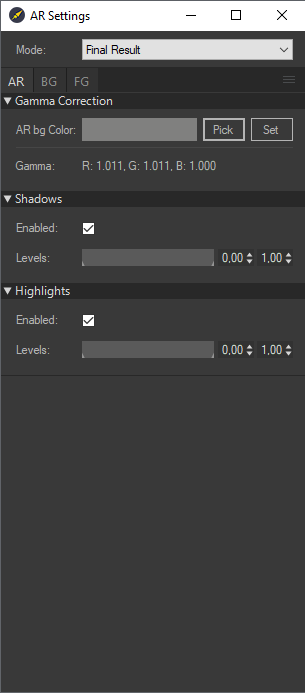

3. В разделе `Gamma Correction` - `AR BG Color` нажмите на кнопку `Pick`, если серый цвет циклорамы выбран правильно значения `RGB Gamma` должны быть максимально близки к `1.000` как показано на скриншоте выше.

4. Получение отражений и теней с объектов дополненной реальности

   В UE4 необходимо необходимо создать `захватчик отражений и теней` представляет из себя 3D объект c наложенным МАТЕРИАЛОМ (Пример настроек материала приведен на скриншоте).

   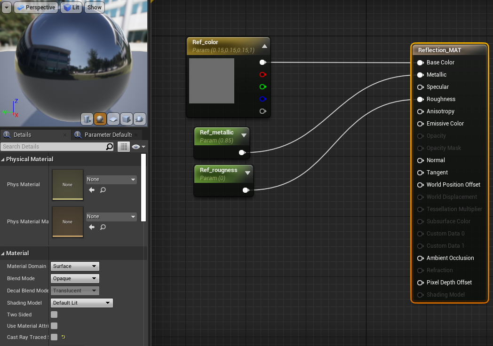

   Параметрами `Metallic` и `Roughness` подбираем степень отражения объекта и видимость тени.

   В параметре `Base Color` подбираем серый цвет чтобы он соответствовал цвету циклорамы в зависимости от освещения в сцене результат должен выглядеть как на скриншоте

   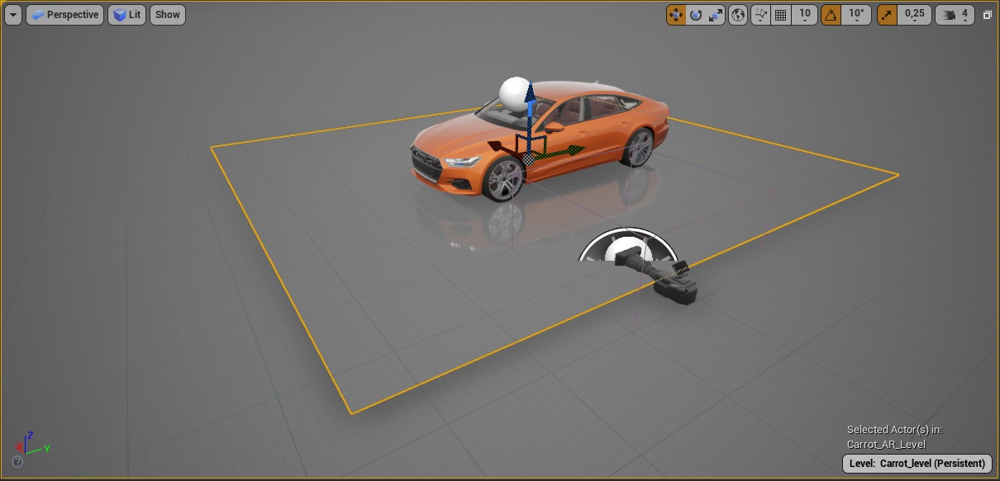

   Возможно использование всех видов отражений `SSR`, `Planar Reflections`, `RayTracing Reflections`.

   

   В настройках `Carrot Engine` поставьте галочки `Enable` в разделах `Shadows` и `Highlights`.

   Для получения наилучших результатов используйте ползунки `levels` а также параметрами `Metallic` и `Roughness` в материале захватчика.

5. Дополнительная информация по настройкам сцен AR

   - Используйте `skylight` c `серой cubemap` как показано на скриншоте, чтобы избежать артефактов связанных с освещением

   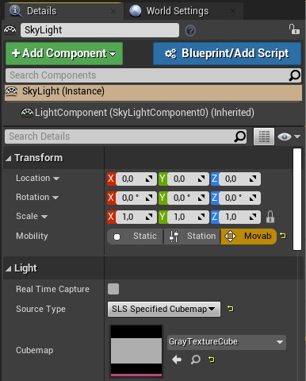

   - Используйте `Sphere Reflection Capture` работающей на всю сцену c `серой cubemap` как показано на скриншоте, чтобы избежать артефактов связанных отражениями. И локальные `Reflection Capture` которые работают локально на AR объекты.

   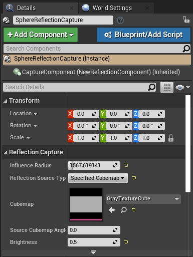

   - Убедитесь что у Вас отключен эффект `Vignette` в камере которую использует Carrot и в `PostProcessVolume` он приводит к артефактам по краям кадра как показано на скриншоте.

   

   - На всех объектах находящиеся на сцене должен быть включен `Render CustomDepth Pass` c параметром `CustomDepth Stencil Value` `255` как показано на скриншоте, иначе объекты будут полупрозрачными.

   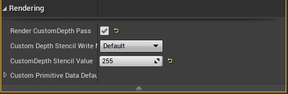

   - Для работа с полупрозрачными объектами (стеклянными) мы советуем не использовать сложные шейдеры в материалах, а использовать `CustomDepth Stencil Value` для получения нужной прозрачности объекта.

   - Нельзя использовать цветокор в `PostProcessVolume` это приводит к возникновению цветовых артефактов. Цветокора ue4 сцены осуществляется через `Carrot Engine` вкладка `BG`


## Создание плейлиста

Для проигрывания экспортированных шаблонов необходимо создать плейлист, с которого будут отправляться команды на их проигрывание.

Для этого:

1. Запустите `Carrot Web Playlist` зайдите через браузер на страницу управления плейлистами.
2. Выберите пункт `Editor`

   

3. Нажмите кнопку `NEW`.
   Откроется вкладка создания нового плейлиста.

   В разделе `Enter Playlist Name` введите имя будущего плейлиста.

   Нажмите `OK`.

   

4. Окно `Editor` состоит из трех областей

   - Область настройки плейлиста (выделена красным) служит для настройки очередности событий в плейлисте
   - Область `Templates` (выделена зеленым) тут хранятся загруженные на сервер шаблоны
   - Область `Properties` (выделена синим) служит для настройки поведения конкретного шаблона в плейлисте.

   

5. Заполнение плейлиста:

   - Плейлист заполняет перетягиваем мышки (Drug and Drop) шаблона из области `Templates` в область плейлиста.

6. Меню редактирования плейлиста

   

   - `Add store` - добавляет новую пустую историю в плейлист
   - `Group` - группирует шаблоны в плейлисте
   - `Rename story` - переименовывает выбранную историю
   - `Remove item` - удаляет выбранный шаблон из истории
   - `Remove story` - удаляет историю с находящимися внутри шаблонами

7. Раздел `Properties`

   

   `Name` - имя шаблона которое будет отображаться в плейлисте.
   `Template name` - имя шаблона задается при сохранении на сервер.
   `State` - стейт с которого будет воспроизводиться шаблон.
   `Новость\Улица` - Текстовое параметрическое поле задается при создании шаблона.
   `Back\Face` - `Media input` для отображения в шаблоне медиаданных (фото, видео файлов а так же захват изображения с карты захвата)
   поля задаются при создании шаблона.

   Окно для указания `media inputs` в шаблоне:

   

   - `Media Assets Library` - библиотека загруженных медиа файлов
   - `Inputs` - Вход для видео потока (Карта захвата, WebRTC, другие шаблоны)

## Проигрывание плейлиста


- `Load` - загружает выбранное события в плейлисте.
- `Load all` - загружает все события в плейлисте.
- `In` - загружает и переводит активирует событие выбранное событие в плейлисте.
- `Next` - деактивирует выделенное событие в плейлисте и активирует нижестоящее событие.
- `Out` - деактивирует выделенное событие в плейлисте.
- `Unload` - выгружает выбранное события в плейлисте.
- `Unload all` - выгружает все события в плейлисте.

Выберите интересующий вас шаблон ЛКМ его фон станет серым, как показано на скриншоте:


Перед воспроизведение его надо загрузить в оперативную память это можно сделать кнопкой `Load` либо `ПРОБЕЛ` с клавиатуры (если вам нужно загрузить весь `playlist` можно воспользоваться кнопкой `load all`).

После того как шаблон был загружен цвет его теста станет черным, а `Status` измениться на `Ready`, как показано на скриншоте:


Теперь данный шаблон можно воспроизвести с помощью кнопки `IN` либо `ПРОБЕЛ` с клавиатуры, цвет строки станет зеленым, а `Status` измениться на `Active`, как показано на скриншоте:


Чтобы завершить воспроизведение (либо проиграть выходной стейт)

нажмите клавишу `OUT`, как только воспроизведение закончиться `Status` измениться на `Ready` и зеленая подсветка отключиться.

Шаблоны находящиеся в `Status Active` не подлежат редактированию!!!

Перед редактирование шаблона его обязательно надо перевести в `Status Ready`.

Если Вам необходимо перезалить шаблон с тем же именем файла, шаблон должен находиться в `Status Unloaded` перед загрузкой.

## Добавление специальных событий

Для добавления специальных событий необходимо выполнить следующее:

В меню редактирования плейлиста выберите `Add Special Event`


### Типы специальных событий

1. `Reset` - восстановление буферов вызывается у движков, которые задействованы в этом плейлисте.
1. `StopPlaylist` - убирает с показа все шаблоны плейлиста катом. (аналог кнопки Panic).
1. `TextCommand` - передача текстовой команды напрямую в движки, задействованные в плейлисте

### Список `TextCommand`:

1. ApplySettingsToContent - применение настроек (на текущий момент только для контента Keyer).
1. RestartContent - рестарт контента (на текущий момент только для контента Ticker).
1. TakeOutContainer - вызов TakeOut у шаблонов, показывающихся на конкретном контейнере.
1. SetGlobalVar - изменение глобальной переменной.

#### 1. `ApplySettingsToContent`


`Содержимое команды`:

%Command=[ApplySettingsToContent] %ContentName=[Имя контента в схеме] %SettingsPath=[путь к файлу с настройками] %SaveSettingsToDB=[True или False]

`Пример`:

%Command=[ApplySettingsToContent] %ContentName=[Keyer] %SettingsPath=[D:\KeyerSettings\key test 14-01-22.xml] %SaveSettingsToDB=[False]

Соответственно, на каждом компьютере по этому пути должен быть файл с настройками.

Если %SaveSettingsToDB=[True] (или этого параметра нет вообще), то при выполнении команды настройки применяются и сохраняются в БД, то есть при следующем запуске они восстановятся.

#### 2. `RestartContent`

`Содержимое команды`:

%Command=[RestartContent] %ContentName=[Имя контента в схеме]

`Пример`:

%Command=[RestartContent] %ContentName=[Ticker]

Тикер перенесет все строки в начало.

#### 3. `TakeOutContainer`

`Содержимое команды`:

%Command=[TakeOutContainer] %ContainerName=[Имя контейнера в схеме]

`Пример`:

%Command=[TakeOutContainer] %ContainerName=[AE 2D]

Шаблоны, которые рисуются в контейнере AE 2D уйдут с анимацией выхода

#### 4. `SetGlobalVar`

`Содержимое команды`:

%Command=[SetGlobalVar] %GlobalVarName=[Имя переменной] %GlobalVarValue=[значение переменной]

`Пример`:

%Command=[SetGlobalVar] %GlobalVarName=[title] %GlobalVarValue=[заголовок]

## Настройка задержек ввода/вывода

Для настройки задержек необходимо выполнить следующее:

Откройте меню `Carrot Engine` - `Delays` - `Show Delays Form`


Откроется форма настройки задержек


- `Input Delay Offset` - покадровая задержка входящего видео потока
- `Tracking Delay` - покадровая задержка данных из трекинг системы
- `Apply` - применить изменения
- `Стрелка` - служит для сброса `output delay` в `Carrot Engine`.
