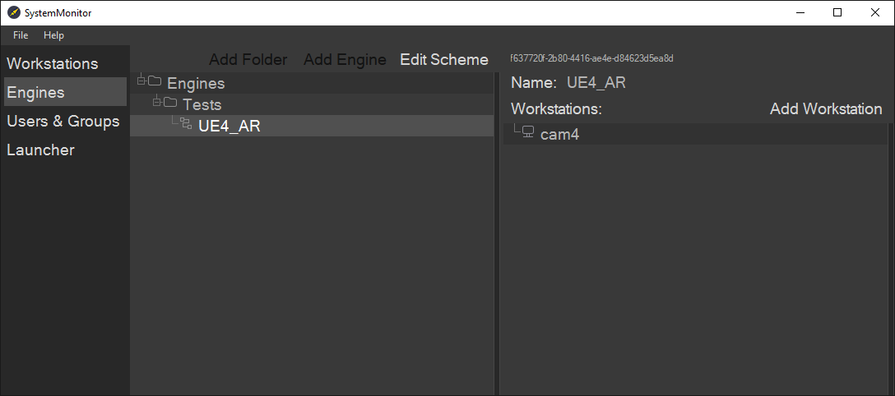

# Работа с ПО Carrot

## Шаг 1. Инициализация и запуск модулей Carrot.

### 1.1. Инициализация компонентов Carrot.

Инициализация настроек `Init Settings` необходима для сопряжения подключаемой сборки, после инициализации **Carrot Launcher** использует данные запущенной версии Carrot.

1. Откроем папку `Carrot`, далее `Bin`.
2. В списке файлов находим `InitSettings.exe`.
3. Запускаем файл от имени администратора.
4. Сборка иниализирована.

---

### 1.2. Запуск компонентов Carrot.

Для начала работы с **Carrot** достаточно запустить `четыре` модуля:

- **Carrot Server** - единое место хранения медиа-контента и баз данных.
- **Carrot Laucher** - модуль для запуска **Carrot Engine**. Используется для настройки и регистрации рабочих станций.
- **Carrot WebPlaylist** - единая система управления контентом для всех **Carrot Engine**.
- **Carrot System Monitor** - модуль для настройки и запуска **Carrot Engine**, а также для централизованного управления шаблонами и медиа контентом.

Разберём каждый из модулей отдельно.

---

### 1.3. Carrot Server.

Запуск модулей **Carrot** всегда начинается с **Carrot Server**, являясь единым местом хранения медиа и баз данных, модуль выполняет роль центра объединяющего все прочие модули.

**Carrot Server** запускается только на одной рабочей машине, на остальных данный модуль не требуется.

1. Запустите модуль **Carrot Server** на рабочей машине, которую планируете использовать как **Host**.

2. Убедитесь, что все подключенные модули отображаются в списке подключений. В случае, если модуль не появился в списке, нажмите `Refresh` - **Carrot Server** войдёт в цикл и начнёт поиск модулей, после нахождения нажмите на кнопку ещё раз. Если данный способ не помог, проверьте правильность IP-адреса прописанного в модулях.

---
---

## Шаг 2. Регистрация рабочей станции.

### 2.1. Launcher.

**Carrot Launcher** необходим для старта **Carrot Engine**. Он позволяет регистрировать и настраивать рабочие станции отдельно на каждом устройстве, где предполагается использование **Carrot Engine**.

1. Запустите приложение **Carrot Launcher** (`Launcher.exe`).
2. В окне `Tools` нажмите на кнопку `Workstation Registration`.
3. Перед вами открыто окно для регистрации и настройки рабочей станции.

### 2.2. Workstation Registration.

>Для `экспорта` и `импорта` готовых пресетов нажмите на `File` и соответствующий раздел.

4. В поле `Name` введите название рабочей станции. По умолчанию модуль берёт название текущего устройства.

5. В разделе `Inputs` нажмите на `+` , перед вами раскроется список с возможностями, которые можно использовать в качества входа. Рассмотрим отдельно каждый `Input`.
- `AJA Tracked Input` - используется с картами видеозахвата **AJA**.
- `BMD Input` - используется с картами видеозахвата **Blackmagic Design**.
  - `UseResourceThread` - параметр работает в ресурсном потоке (не в потоке рендера, тем самым снижает нагрузку на ЦП);
  - `Use Audio Input` - параметр позволяет забирать аудиопоток.
- `BMD Tracked Input` - используется с картами видеозахвата **Blackmagic Design** при использовании трекинговых данных.
  - `Use Audio Input` - параметр позволяет забирать аудиопоток.
- `Texture Input` - используется для вывода изображения или видеофайла на устройстве.
- `Tracking Data` - используется для вывода только трекинг данных.
  - `Wait` - параметр позволяющий использовать его в схемах, где синхранизация должна приходить извне.
- `UE Input` - изображение запущенной сцены UE c трекингом. 
- `WebSocket Stream Input` - используется для вывода видеосигнала или аудиосигнала с устройства подключённого к данной рабочей станции.
  - `Use GPU Encoder` - при включённом параметре принудительно использует `Encoder` графического процессора. Рекомендуется использовать при работе с **4К** изображением.

> - При работе со звуком в `BMD Input`, звук в `BMD Output` и `BMD Fill/Key Output` автоматически подключается.
> - При работе со звуком можно использовать максимум один выход, при использовании двух или более буфер рендера переполняется.
> - Требования к видео при работе со звуком:
>   - 16 канальный звук;
>   - моно - работает только 3 канал;
>   - стерео - работает корректно, рекомендуется использовать 48кГц.

6. В разделе `Outputs` нажмите на `+` , перед вами раскроется список с возможностями, которые можно использовать в качества выхода. Рассмотрим отдельно каждый `Outputs`.
- `AJA Output` - вывод изображения на карту AJA.
- `Bmd Fill/Key Output` - вывод изображений `Fill` и `Key` на карту **Blackmagic Design, Decklink**.
- `Bmd Output` - вывод изображения на карту **Blackmagic Design, Decklink**.
  - `UseResourceThread` - параметр работает в ресурсном потоке (не в потоке рендера, тем самым снижает нагрузку на ЦП);
- `Screen Output` - вывод изображения на экран монитора.
- `WebSocket Stream Output` - вывод изображения с одной рабочей станции **Carrot** на другую по локальной сети.
  - `Use GPU Decoder` - при включённом параметре принудительно использует `Decoder` графического процессора, при выключенном параметре используется **3D**. Рекомендуется использовать при работе с **4К** изображением.
- `Stream Output` - вывод изображения на стриминговый сервис (*например: YouTube*).

7. Выберите и настройте входы и выходы для рабочей станции.

8. Нажмите `Register/Update` для регистрации рабочий станции в **Carrot**.
9. В появившемся окне нажмите `ОК`.

10. Ваша рабочая станция зарегистрирована в **Carrot**.

>При необходимости удалить рабочую станцию из базы данных **Carrot Server** нажмите `UnRegister`.

---
---

## Шаг 3. Создание схемы в Carrot Flowchart.

### 3.1. System Monitor. 

**Carrot System Monitor** - модуль для настройки и запуска **Carrot Engine**, а также для централизованного управления шаблонами и медиа контентом.

**Carrot Engine** производит обработку изображения в соответствии со схемой, составленной в **System Monitor**.

> Как создать движок и добавить в него рабочие станции?

1. Перейдите во вкладку `Engines`.
2. Добавьте новую директорию нажав на `Add Folder`, либо выберите уже существующую.
3. Нажмите кнопку `Add Engine`.
4. Введите название движка и нажмите `ОК`.
5. Нажмите кнопку `Add Workstation` и выберите рабочие станции, которые будут задействованы в схеме.

### 3.2. Carrot Flowchart. 

> Как настроить схему для работы с движком?

1. Нажмите `Edit Scheme` - откроется окно `Engine Flowchart`.
2. Добавьте ноды ввода перетаскиванием из раздела `Registered inputs`.
3. Добавьте одну ноду вывода перетаскиванием из раздела `Registered outputs`.
4. Кликнув ПКМ по пустому месту выберите тип добавляемой ноды.
5. Соедините ноды.
6. Сохраните составленную схему нажатием кнопки `Save`.

Подробнее с нодами можно ознакомиться ниже:

>`Container` - используется для проигрывания AE и UE шаблонов.
>
>`Keyer` - используется для замены заднего фона изображения на другое изображение.
> - Пин `Foreground` принимает изображение, задний фон которого необходимо заменить.
> - Пин `Background` принимает изображение, на которое будет заменен задний фон.
>
>`AR` - служит для добавление объектов дополненной реальности.
> - Пин `Foreground` принимает изображение объекта который необходимо наложить.
> - Пин `Background` принимает изображение заднего фона.
>
>`Luma` - это кеер, в котором процесс формирования альфа маски отсутствует, поскольку он её получает как внешний сигнал.
> - Пин `Foreground` принимает изображение .
> - Пин `Background` принимает изображение .
> - Пин `Luma` принимает изображение из текстуры, где чёрный вычитает `Foreground`.
>
>`Viewport` - служит для прямого наложения нескольких веток друг на друга.
>
>`Blur` - служит для размылевания изображения подаваемого сигнала.
>
>`Distortion` - ручное искажение входящего в ноду изображения по коэффициентам дисторсии.
>
>`Undistorted UE Source` - находит запущенный UE шаблон и отображает его изображение без дисторсии.
>
>`Undistort` - обратная дисторсия на основании данных, полученных от трекинга.
>
>`Resize` - изменение размера изображения.
>
>`Image Tracker` - отслеживание выбранной области кадра (например лица) и перемещение изображения входящего в эту ноду в найденную область.
>
>`Ticker` - выводит бегущую строку в **Carrot Engine**, данные для бегущей строки берутся из модуля **DataStream**.

Данные ноды могут изменять следующие характеристики:
- Положение относительно левого верхнего угла (параметры X, Y).
- Размер изображения на выходе (параметры Width, Height).

> **Примечание:** если рассматривать ноды в качестве слоёв, то на итоговом изображении слои накладываются друг поверх друга начиная от ноды ввода к ноде вывода.

---
---

## Шаг 4. Экспорт AE / UE шаблона в Carrot.

### Экспорт AE шаблона в Carrot.

Подробнее о работе с AE шаблонами вы можете ознакомиться по данной [ссылке](ae_templates.md).

### Экспорт UE шаблона в Carrot.

Подробнее о работе с UE шаблонами вы можете ознакомиться по данной [ссылке](ue_templates.md).

---
---

## Шаг 5. Подготовка плейлиста.

### 5.1. WebPlaylist.

**Carrot WebPlaylist** - единая система управления контентом для всех **Carrot Engine**. Данный компонент состоит из двух модулей:
- **WebPlaylist** - сервер веб-плейлиста.
- **WebPlaylistSettings** - настройка сервера веб-плейлиста.

Для активации плейлиста в браузере, достаточно запустить приложение `WebPlaylist.exe`.

Если сервер плейлиста запущен правильно, должно появиться следующее окно.

### 5.2. Carrot Dashboard.

Для проигрывания экспортированных шаблонов необходимо создать плейлист, с которого будут отправляться команды на их проигрывание.

Для этого:

1. Запустите браузер на вашей рабочей станции. Для корректной работы рекомендуем использовать **Google Chrome**.
2. В поисковой строке введите IP-адрес и порт вашего сервера. По умолчанию порт `:8088`.
3. Перед вами открыто окно авторизации в **Carrot Dashboard**.

4. Введите логин и пароль.
5. Перед вами откроется пустой **Carrot Dashboard**.

### 5.3. Создание плейлиста.

Создадим **Playlist** для управления шаблонами **AE** и **UE** в **Carrot**.

1. Нажмите на раздел `Editor`.

2. Нажмите на кнопку `New`.
3. В появившемся окне введите название будущего плейлиста.

4. Нажмите `ОК`.
5. Перед вами открылся плейлист.

### 5.4. Функционал и возможности работы с плейлистами.

Раздел `Playlist`.

- В области названия плейлиста присутствует иконка в виде папки, нажмите на неё, чтобы открыть желаемый плейлист.

Раздел `Editor`.

- Кнопка `New` - создать новый плейлист.
- Кнопка `Open` - открыть существующий плейлист.

Раздел `Browser`.

- Перейдём в раздел `Playlists`. 
- Кнопка `Add Playlist` создрать новый плейлист.
- Кнопка `+` создаёт новую директорию, где можно хранить плейлисты.
- Кнопка `All Playlists` раскрывает список с возможностью отображения созданных плейлистов.
  - `All Playlists` - показать все плейлисты подключенные к серверу.
  - `Ready Playlists` - показать все плейлисты подгруженные на сервере.
  - `Active Playlists` - показать все активные плейлисты на сервере.

> Отображение списка важная функция позволяющая отслеживать рабочие плейлисты, тем самым отключая их для снижения нагрузки на рабочую станцию.

---

### 5.5. Работа с контентом в плейлисте.

>Для добавления контента в плейлист нужно выполнить следующие действия:

1. Откройте раздел `Editor`.
2. В области `Templates` выберите нужный шаблон.
3. Перетащите шаблон из области `Templates` в область событий.

4. Если шаблон имеет больше нескольких стейтов, то для упрощения переноса рекомедуется использовать функцию `Generate Events`, для её вызова нужно нажать `ПКМ` на шаблон и выбрать данную кнопку.

5. Если нажать на перенесённый шаблон, то в области `Properties` появятся редактируемые настройки данного шаблона.

6. Раздел `Properties`:

- `Name` - имя редактируемого события.
- `Allow Runtime Changes` - возможность изменять шаблон пока он запущен.
- `State` - участок с которого будет воспроизводиться шаблон.
- `Pick Defaults` - возвращение стейта к изначальным настройкам.

Окно для указания `Media Inputs` в шаблоне:

- `Media Assets Library` - библиотека загруженных медиа файлов.
- `Inputs` - вход для видео потока (карта захвата, WebRTC, другие шаблоны).

7. Меню редактирования плейлиста.

- `Add store` - добавляет новую пустую историю в плейлист
- `Group` - группирует шаблоны в плейлисте
- `Rename story` - переименовывает выбранную историю
- `Remove item` - удаляет выбранный шаблон из истории
- `Remove story` - удаляет историю с находящимися внутри шаблонами
- `Dublicate Item` - дублировать выбранный шаблон.
- `Add Special Event` - описание функционала ниже:

#### Типы специальных событий

- `Reset` - восстановление буферов вызывается у движков, которые задействованы в этом плейлисте.
- `StopPlaylist` - убирает с показа все шаблоны плейлиста катом (аналог кнопки Panic).
- `TextCommand` - передача текстовой команды напрямую в движки задействованные в плейлисте.

Список `TextCommand`:

- `ApplySettingsToContent` - применение настроек (на текущий момент только для контента **Keyer**).
- `RestartContent` - рестарт контента (на текущий момент только для контента **Ticker**).
- `TakeOutContainer` - вызов `TakeOut` у шаблонов, показывающихся на конкретном контейнере.
- `SetGlobalVar` - изменение глобальной переменной.

|Специальное событие|Содержимое команды|Пример|
|:------------------|:-----------------|:-----|
|**ApplySettingsToContent**|%Command=[ApplySettingsToContent] %ContentName=[Имя контента в схеме] %SettingsPath=[путь к файлу с настройками] %SaveSettingsToDB=[True или False]|%Command=[ApplySettingsToContent] %ContentName=[Keyer] %SettingsPath=[D:\KeyerSettings\key test 14-01-22.xml] %SaveSettingsToDB=[False]|
|||Соответственно, на каждом компьютере по этому пути должен быть файл с настройками. Если %SaveSettingsToDB=[True] (или этого параметра нет вообще), то при выполнении команды настройки применяются и сохраняются в БД, то есть при следующем запуске они восстановятся.|
|**RestartContent**|%Command=[RestartContent] %ContentName=[Имя контента в схеме]|%Command=[RestartContent] %ContentName=[Ticker]|
|||Тикер перенесет все строки в начало.|
|**TakeOutContainer**|%Command=[TakeOutContainer] %ContainerName=[Имя контейнера в схеме]|%Command=[TakeOutContainer] %ContainerName=[AE 2D]|
|||Шаблоны, которые рисуются в контейнере AE 2D уйдут с анимацией выхода|
|**SetGlobalVar**|%Command=[SetGlobalVar] %GlobalVarName=[Имя переменной] %GlobalVarValue=[значение переменной]|%Command=[SetGlobalVar] %GlobalVarName=[title] %GlobalVarValue=[заголовок]|

>Для управления контентом в плейлисте нужно выполнить следующие действия:

- Перейдите в раздел `Playlist`.

- `Load` - загружает выбранное события в плейлисте.
- `Load all` - загружает все события в плейлисте.
- `In` - загружает и переводит активирует событие выбранное событие в плейлисте.
- `Next` - деактивирует выделенное событие в плейлисте и активирует нижестоящее событие.
- `Out` - деактивирует выделенное событие в плейлисте.
- `Unload` - выгружает выбранное события в плейлисте.
- `Unload all` - выгружает все события в плейлисте.

Выберите интересующий вас шаблон ЛКМ его фон станет серым, как показано на скриншоте:

Перед воспроизведением его надо загрузить в оперативную память это можно сделать кнопкой `Load` либо `ПРОБЕЛ` с клавиатуры (если вам нужно загрузить весь `Playlist` можно воспользоваться кнопкой `Load All`).

После того как шаблон был загружен цвет его текста станет чёрным, а `Status` изменится на `Ready`, как показано на скриншоте:

Теперь данный шаблон можно воспроизвести с помощью кнопки `IN` либо `ПРОБЕЛ` с клавиатуры, цвет строки станет зеленым, а `Status` измениться на `Active`, как показано на скриншоте:

Чтобы завершить воспроизведение (либо проиграть выходной стейт) нажмите клавишу `OUT`, как только воспроизведение закончиться `Status` измениться на `Ready` и зеленая подсветка отключится.

Если Вам необходимо перезалить шаблон с тем же именем файла, шаблон должен находиться в `Status Unloaded` перед загрузкой.

---

### 5.6. Добавление медиа файлов.

1. Перейдите во вкладку `Browser`. 
2. В разделе `Media` нажмите на `+`, чтобы создать директорию для будущего добавляемого медиа контента.
3. В созданной директории нажмите на Add Media, чтобы загрузить файл в браузер.

---

### 5.7. Управление шаблонами.

1. Перейдите во вкладку `Browser`. 
2. В разделе `Templates` нажмите на `+`, чтобы создать директорию для структурирования будущих и текущих шаблонов.
3. Область с шаблонами представляет из себя список из `Templates` и их контента, здесь можно изменить текущий контейнер нажатием на пункт `Content`. Список предложит доступные для данной рабочей станции контейнеры с загруженным контентом.

---
---

## Шаг 6. Запуск и настройка движка.

### 6.1. Carrot Engine. Запуск.

После настройки **Launcher**, **Carrot Workflow**, **UE/AE templates**, **Carrot WebPlaylist** можно приступить к запуску **Carrot Engine**.

1. Откройте приложение System Monitor.
2. Перейдите во вкладку Launcher.

3. Выберите ранее настроенный движок.

>- **Серый** - приложение Launcher не запущено.
>
>
>
>- **Жёлтый** - движок готов к запуску.
>
>
>
>- **Синий** - движок выбран для запуска. Выбрать отдельный движок можно через сочетание `CTRL + ЛКМ`.
>
>
>
>- **Зелёный** - движок запущен.
>
>

4. Запустите выбраный движок через кнопку `Start`. После успешного запуска откроется приложение **Carrot Engine**, а окно движка в **System Monitor** станет *зелёным* и будет выдавать статистику рабочей станции.

### 6.2. Carrot Engine. Settings.

Рассмотрим подробнее меню навигации **Carrot Engine**.

- `File` - `Settings` - открывает настройки Launcher. Подробнее о данном пункте можно прочитать [здесь](https://carrotsoftware.github.io/docs/3189/#/settings?id=settings-1).
- `View` - `Full Screen` - открывает **viewport** на полный экран.
- `View` - `Scale To Fit` - растягивает **viewport** под размер окна.
- `Delays` - `Show Delays Form` - окно для настройки задержек. Где `Input Delay` - задержка входного сигнала, а `Tracking Delay` - задержка по трекингу. Правильная настройка задержек убирает "плавучий" эффект при работе с графикой.
- `Tools` - `Workstation Registration` - открывает окно Workstation Registration, подробнее о его настройке можно прочитать [здесь](https://carrotsoftware.github.io/docs/3189/#/workflow?id=_22-workstation-registration).
- `Tools` - `Dummy Output` - заглушка выставляемая вместого изображения выдаваемого **Carrot Engine**.

### 6.3. Carrot Engine. Keyer.

> Carrot Keyer - программный модуль позволяющий размещать нужный объект с зелёного фона на виртуальный (или любой другой) фон при помощи технологии рир-проекции.

_Входной сигнал_:

_Изначальный вид_

_Итоговый вид_

1. Откройте **Carrot Engine**.
2. Выберите **Tools > Contents Settings > Keyer Settings** или нажмите клавишу **F7**, чтобы открыть все доступные окна настроек.
    

> Для удобства настройки рекомендуется перейти в режим отображения **Mode > MultiView**, чтобы наблюдать за изменениями на всех этапах кеинга.

- Foreground - отображение переднего плана.
- DeNoise - отображение Foreground с шумоподавлением.
- DeSpill - отображение Foreground с избавлением от цветовых рефлексов.
- Screen Restoration - отображение Foreground с восстановлением зеленого цвета.
- Alpha Mask - отображение маски объекта, который нужно прокеить.
- Screen Mask - отображение области кеинга.
- Shadows - отображение областей в которых происходит контрастирование теней.
- Highlights - отображение областей в которых происходит контрастирование отражений.
- Background - отображение заднего плана.
- Environment Overlay - это отображение цвета накладываемого на передний план.
- Environment Light - это отображение цвета накладываемого на контур объекта на переднем плане.

В правом нижнем углу для удобства расположены вектороскоп и гистограмма.

> Для наилучшего результата значения вектороскопа должны доходить до середины линии **_G_** или **_B_** в зависимости от цвета хромакея. 
>  Для наилучшего качества гистограмма должна быть максимально ровной, растянутой по всей границе и без пиков по краям. 
>  Нажатием **ЛКМ** или **ПКМ** по гистограмме можно посмотреть отдельно информацию по каждому цветовому каналу.

В начале нужно задать цвет хромакея, для этого:

1. Во вкладке **Alpha Mask** нажмите на кнопку `Pick` и с помощью **ЛКМ** щёлкните по любому участку хромакея на экране.
2. Оцените результат в окне режима _Alpha Mask._

#### **DeNoise**

Наблюдаем, что изображение в _Alpha Mask_ имеет много шума, избавиться от него можно при помощи инструмента **DeNoise**: 
Во вкладке **DeNoise** имеются два параметра:

1. `Threshold` - порог срабатывания, позволяющий сохранить четкие границы на объектах;
2. `Radius` - радиус размытия в пикселях (в обычных случаях хватает значений до `50`).

Выставите значение `Threshold` в `0` и понемногу увеличивайте до требуемого результата. По необходимости скорректируйте параметр `Radius`.

Результат:

> Чтобы вернуть настройки по умолчанию, нажмите **ПКМ** по области стрелок нужного счетчика.

Режим _Final Result_:

#### **DeSpill**

Картинка избавилась от лишнего шума, теперь необходимо убрать голубые границы с человека. Они возникли в результате того, что _DeSpill_ не соответствует заднему фону по тону и яркости.

> Если задний фон тёмный, а _DeSpill_ светлый, то на объекте будут видны белые границы и наоборот.

Чтобы исправить границы на объекте:

1. Переключите окно в режим отображения _DeSpill_.
    Параметры вкладки **DeSpill**:
   - `Preset` - настройка соотношения красного и синего. В нашем случае лучше всего подошёл пресет **Average**.
      Лучше всего добиться максимально серого цвета у **DeSpill** до наложения параметра `Saturation`.

- `Saturation` - смешивание с задним фоном по цвету.
- `Darken` и `Brighten` - изменение яркости тёмных и светлых областей.
  > Для наилучшего результата _DeSpill_ должен соответствовать по оттенкам и яркости изображению на _Background_.

Результат:

#### **Screen Restoration**

Сравните окно _Screen Restoration_ с _Foreground_, в итоге должен получиться зеленый цвет без лишних объектов. Для настройки этого окна используется вкладка **Inner Mask**:

> **Inner Mask** помогает справиться с проблемными и дефектными элементами на объекте (например, зелеными пуговицами на человеке и т.п.)

1. С помощью инструментов `Red Weight`, `Blue Weight` и `Mask Levels` сделайте максимально возможную непрозрачную маску для необходимых объектов.
2. Наблюдайте за результатом в окнах _Inner Mask_, _Alpha Mask_ и _Screen Restoration_.

Результат: 
_Inner Mask_

_Alpha Mask_

_Screen Restoration_

#### **Alpha Mask**

Теперь необходимо скорректировать саму маску. Для этого:

1. Во вкладке **Alpha Mask** выставите значение параметров `J Weight`, `Red Weight`, `Blue Weight`, `Inner Mask` на `0`.
2. Во вкладке **Alpha Mask (Advanced)** выберите `Key Type` - `UCS`.
   > У `RGB` параметры `Red Weight` и `Blue Weight` работают как процент вытеснения зелёного, т.е. в сумме эти два параметры должны, в идеале, составлять **единицу**.
3. За счёт параметров `Border Light` и `Border Dark` максимально проявите объект.

> `B. Feather` отвечает за смещение маски от границы **Inner Mask** до такого же расстояния снаружи объекта.

> `Floor Levels` отвечает за улучшения маски у объектов, помеченных как `Chromakey Floor` во вкладке **Mask.** 4. Во вкладке **`Alpha Mask`** начинаем подбирать параметр **`Inner Mask`** в районе значения `0,5`. 5. Далее мы изменяем значение параметров `Red Weight` и `Blue Weight` до `1`. Если маски не хватает, то мы начинаем добавлять значение `J Weight` (разность яркости с _Screen Restoration_ и _Foreground,_ работает только с `Key Type` _-_ `UCS`). Если визуально этот параметр не оказывает заметного эффекта на _Alpha Mask_, то лучше его отключить. С помощью `Mask Levels` можно “подчистить” маску, чтобы остались только необходимые объекты.

> Если видно мерцание кея, то его можно уменьшить через правки `Threshold` и `Radius` вкладки **Denoise.**

_Final Result_

#### **Shadows** & **Highlights**

Для усиления отображения теней и отражений можно использовать вкладки **Shadows** и **Highlights**, однако в данном примере эти настройки не требуются и остаются выключенными.

#### **Environment**

Для улучшения эффекта "вживления" объекта с окружением можно воспользоваться вкладкой **Environment** и режимами отображения _Environment Overlay_ и _Environment Light_:

1. `Overlay` - уровень наложения фона на объекты.
2. `Overlay Blur` - размытие фона, лучше оставлять детали до тех пор, пока это не будет заметно на объектах первого плана.
3. `Light Strength` - степень засветки по краям объектов.
4. `Light Blur` - размытие фона для засветки
5. `Light Levels` - корректировка уровней яркости фона для засветки

> Для наилучшего результатас помощью Light Levels нужно оставлять только те элементы, которые действительно в реальности могут давать засвет на края объекта.

_Environment Light_

_Environment Overlay_

Итоговый результат:

#### **Save / Save As**

Завершив настройку кеера не забудьте сохранить данные изменения. Для этого можно воспользоваться функцией `Save` / `Save As`, данные пресеты будут сохранены на сервере и могут быть использованы в любое удобное время.

`Save As` - при сохранении настроек (*если они до этого не были сохранены*) появится новое диалоговое окно.

`Save` - сохраняет настройки либо как новые, либо их можно сохранить в уже существующие, тем самым обновив их для всех устройств.

Настройки можно сохранить как новые так и в уже имеющиеся, обновив их для всех использующих **Keyer**'ов. Если настройки были сохранены до, они запишутся туда же.

Настройки для **Keyer**, **Luma** и **AR** разделены, поэтому установить настройки от **AR** в **Keyer** не получится.

Ненужные настройки можно будет удалить через **System Monitor**. В нем появилась вкладка `KeyerSettings`.

В левой части список всех настроек **Keyer**, **AR**, **Luma**. Справа список контейнеров, где применены эти настройки. Настройки можно удалять (возможно удаление сразу нескольких настроек). В случае удаления, настройки на устройствах сбросятся к дефолтным.

### 6.4. Carrot Engine. AR.

> Дополненная реальность (AR) позволяет внедрить виртуальные 3D объекты и сцены в реальное окружение в реальном времени.

#### 6.4.1. Подготовка Engine Scheme для работы с AR:

> Подробнее читайте в разделе [Создание схемы работы Carrot Engine](https://carrotsoftware.github.io/docs/4062/#/workflow?id=%d0%a1%d0%be%d0%b7%d0%b4%d0%b0%d0%bd%d0%b8%d0%b5-%d1%81%d1%85%d0%b5%d0%bc%d1%8b-%d1%80%d0%b0%d0%b1%d0%be%d1%82%d1%8b-carrot-engine).

1. Откройте Carrot SystemMonitor.
2. Создайте новую схему или выберите уже созданную.
3. Добавьте к схеме необходимую рабочую станцию.
4. нажмите `Edit Scheme` и перейдите в окно `Engine Flowchart`.

В окне `Engine Flowchart`:

1. Перетащите используемые вами ноды входного и выходного сигнал.
2. Добавьте контейнер для отображение контента из Unreal Engine и укажите ему имя (например, UE_AR).
3. Нажмите ПКМ и добавьте ноду `AR`.
4. Подсоедините контейнер UE_AR в `Foreground`, ноду с входящим видеосигналом в `Background`.
5. Пин `video` из ноды AR подключите к пину `video` выходного изображения, простейшая схема будет выглядеть как показано на скриншоте. 

#### 6.4.2.  Подготовка проекта Unreal Engine для работы с AR
Изначальная настройка проекта UE4 описана в пункте [Подготовка UE4 проекта к экспорту шаблона (новый плагин)](https://carrotsoftware.github.io/docs/4062/#/unrealengine?id=%d0%9d%d0%b0%d1%81%d1%82%d1%80%d0%be%d0%b9%d0%ba%d0%b0-ue-%d0%bf%d1%80%d0%be%d0%b5%d0%ba%d1%82%d0%b0-%d0%bd%d0%be%d0%b2%d1%8b%d0%b9-%d0%bf%d0%bb%d0%b0%d0%b3%d0%b8%d0%bd-%d1%86%d0%b2%d0%b5%d1%82%d0%bd%d0%b0%d1%8f-%d0%bf%d0%be%d0%bb%d0%be%d1%81%d0%ba%d0%b0).

`Carrot Engine` работает в режиме `AR` на основе метода наложения `Screen\Add` по серому цвету и масками через `Custom Stencil Buffer`. Для удобства работу рекомендуем все созданные сцены и объекты создавать в своих отдельных уровнях и потом подгружать их в основной уровень проекта, настроенный под вывод Carrot.

Для работы AR понадобятся следующие типы объектов:

- Геометрия циклорамы с серым эмиссивным материалом.
- Захватчик отражений и теней.

#### 6.4.2.1. Циклорама и материал
`Циклорама` представляет из себя объект заполняющий весь видимый объем сцены. Это может быть куб, сфера либо заранее подготовленная модель с наложенным `Unlit` материалом.

Пример геометрии: 

Пример материала с вводом цвета через [Material Parameter Collection](https://docs.unrealengine.com/4.27/en-US/RenderingAndGraphics/Materials/ParameterCollections/): .

#### 6.4.2.2. Захватчик отражений и теней.

`Захватчик отражений и теней` представляет из себя плоскость с настраиваемым материалом по Metallic и Roughness. Подбирая эти 2 значения, можно отображать только отражения, только тени или всё вместе. Вторая плоскость накладывается сверху с Unlit материалом серого цвета с плавным градиентом, чтобы избавиться от четких краев первой плоскости и смешаться с окружением.

Пример материала маски: 

Пример материала для теней и отражений: 

Пример Blueprint Actor: 

>Для получения зеркальных отражений без RayTracing можно использовать `PlanarReflection`.

#### 6.4.2.3. Настройка объектов
Добавив объекты в сцену, нам нужно указать непрозрачным объектам `Custom Depth Pass`. В противном случае Carrot будет совмещать слои на основе метода наложения `Screen\Add`. Для этого:

1. Выделите нужные объекты на уровне/блупринте.
2. Наберите в строке поиска окна `Details` ключевое слово `"custom"`.
3. Поставьте галочку напротив свойства `Render CustomDepth Pass`.
4. Поставьте свойство `CustomDepth Stencil Value` - `255`. 

Результат работы в Carrot Engine с CustomStencil 255 и без: 

#### 6.4.2.4. Использование масок
AR композитинг работает по схеме, когда изображение с графикой накладывается поверх изображения настоящего. Иногда появляется возможность виртуальные объекты "обрезать" по форме реальных декораций. Для этой задачи мы можем использовать маски.

1. Добавьте необходимую геометрию на уровень.
2. Поставьте ей тот же материал, что и на серой циклораме.
3. Поставьте галочку напротив свойства `Render CustomDepth Pass`.
4. Поставьте свойство `CustomDepth Stencil Value` - `0`. 

Результат работы масок: 

#### 6.4.3. Настройка AR в Carrot Engine

Экспорт шаблона происходит так же, как описано в пункте [Экспорт шаблона из проекта UE4](https://carrotsoftware.github.io/docs/4062/#/workflow?id=Экспорт-шаблона-из-проекта-ue4).

Чтобы открыть панель настроек ноды `AR`:

1. Откройте окно `Carrot Engine`
2. Откройте сверху меню `Tools` - `Show Content Settings` - `AR`

   

   Откроется окно настроек AR

   

3. В разделе `Gamma Correction` - `AR BG Color` нажмите на кнопку `Pick`, если серый цвет циклорамы выбран правильно значения `RGB Gamma` должны быть максимально близки к `1.000` как показано на скриншоте выше.

   

   В настройках `Carrot Engine` поставьте галочки `Enable` в разделах `Shadows` и `Highlights`.

   Для получения наилучших результатов используйте ползунки `Levels` а также параметрами `Metallic` и `Roughness` в материале захватчика теней и отражений.

4. Дополнительная информация по настройкам сцен AR

   - Рекомендуем использовать `Skylight` c серой `Cubemap` как показано на скриншоте, чтобы получить равномерно подсвеченную картинку для отражений.

   

   - Убедитесь что у Вас отключен эффект `Vignette` в камере которую использует Carrot и в `PostProcessVolume` он приводит к артефактам по краям кадра как показано на скриншоте.

   

   - Обратите внимание, что используя цветокоррекцию в `PostProcessVolume`, также затрагивается и цвет серой циклорамы. Альтернативно, цветокоррекцию можно проводить в окне `AR` внутри `Carrot Engine` во вкладка `BG`.

### 6.5. Carrot Engine. Luma.

`Luma` - это кеер, который формирует альфа маску из внешнего сигнала.

Текстура с `Luma` должна иметь два цвета: **белый** и **чёрный**, где **белый** - `Foreground`, а **чёрный** - `Background`.

1. Составим схему для работы с `Luma`. Для этого заведём изображение на `Foreground`, `Background`. В `Luma` добавим изображение с заготовленными полями для кеинга.

2. Запустим движок.

3. В запущенном движке видно градиент наложенный Luma.

4. Перейдём в настройки инструмента. `Tools` - `Content Settings` - `Luma Settings`.

5. Здесь можно настроить шумоподавление, а также альфу `Luma`.

6. Движение ползунка меняет преимущество белого и чёрного цвета на текстуре (при наличии градиента).

7. Итог.

### 6.6. Carrot Engine. LUT.

>**Carrot Engine** имеет возможность создавать `LUT файлы` для дальнейшего использования их на посте или в движке на `Foreground` / `Background`.

1. Перейдём по пути `Tools` - `LUT Utils`.
2. Перед нами открылось окно `LUT Utils`, а во `Viewport`'е появились 24 разноцветные точки.

3. Используем цветовую палитру с 24-цветной шкалой, выставим её перед камерой так, чтобы квадраты с цветами попали в точки размещённые во `Viewport`'е.

4. В `LUT Utils` графе `Checker` нажмите на `Pick Checker Colors` для получения цветов из карточки.
5. В графе  `Process` нажать на `Process`.
6. Выберите формат для экспорта `LUT`. `PNG` для экспорта в Carrot. `.CUBE` для работы с прочими графическими редакторами.
7. Готово. Можно закрыть `LUT Utils`.
8. Если нужно наложить `LUT` на передний или задний план, перейдите в `Tools` - `Keyer`. Здесь выберите `FG` или `BG`.
9. В графе `FG` / `BG` найдите `LUT` - `Filename` и нажмите на `...`. 

10. Выберите экспортированный `LUT` файл.
11. Готово.

### 6.7. Carrot Engine. GPIO, MIDI, Macro.

Управление плейлистом Carrot возможно через контроллеры GPIO, MIDI, Macro. Для этого:

1. Подключите необходимый модуль к серверу.
2. В **Carrot Engine** нажмите `Tools` => `GPIO` / `MIDI` / `Macro`.
3. Перед вами откроется окно настроек контроллера.

4. Раскройте меню `Playlist`, чтобы выбрать плейлист для управления через контроллер.

5. Из региона `Playlist Events` перенесите события в регион `Assigned Events`.

6. Нажмите на клавишу контроллера. Если контроллер подключен правильно, то в графе `Cmd` вы должны получить значение отличное от `0`.

7. Назначьте полученное значение событию в правом регионе. Для этого нажмите на него через `ЛКМ` и в нижней графе `Cmd` введите полученое значение сверху. Нажмите `Enter` и кнопку `Save`. Если после введёного значения нажать на клавишу контроллера без предварительного `Save`, команда в графе `Cmd` сбросится.

8. Готово. Событие можно использовать с контроллера.

---

>**В случае если плейлист находится на другом сервере, вы можете достучаться до него используя модуль `InputDevices`. Для этого нужно:**

1. В папке `Carrot` => `Bin` откройте приложение `InputDevices.exe`.
2. Оно не раскроется во `Viewport`'е, однако его можно найти в списке скрытых значков.
>
3. Нажмите `ПКМ` по иконке `InputDevices` и выберите графу `Settings`.
4. Активируйте `Input`, который предполагаете использовать.
5. Введите IP адрес хост-сервера, где расположен плейлист.

6. Запустите `GPIO` / `MIDI` / `Macro` через `ПКМ` по `InputDevices` и настройте его.

---
---