# Первоначальная настройка компонентов ПО Carrot
## Настройка Carrot Server
Для настройки **Carrot Server** необходимо выполнить следующее:
1. Запустите **Carrot Server** с правами администратора.
2. Откройте окно настроек по пути `File` -> `Settings`:

    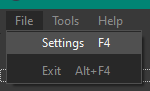

3. В открывшемся окне укажите заполните следующие поля:

    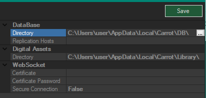

    1. Вкладка `DataBase`:
        - `Directory` - директория, в которой будет храниться база данных **Carrot Server**.
        - `Replication Hosts` - IP-адреса резервных **Carrot Server**.
    2. Вкладка `Digital Assets`:
        - `Directory` - директория в которой будут храниться медиа файлы, экспортируемые вместе с шаблонами, а также задаваемые через **Carrot Playlist**.
    3. Вкладка `WebSocket`:
        - `Certificate` - путь к файлу сертификата `.pfx`, если предполагается использование шифрованного соединения.
        - `Certificate Password` - пароль к файлу сертификата `.pfx`.
        - `Secure Connection` - установите `True`, если предполагается использование шифрованного соединения.
4. Нажмите кнопку `Save` и закройте окно настроек.

## Настройка Web Playlist
Для настройки **Carrot Playlist** необходимо выполнить следующее:

1. Запустите **Carrot Server** (`ServerWS.exe`) (Если **Carrot Server** уже запущен, перейдите на пункт 2).
2. Чтобы  иметь возможность подключаться к **Carrot Web Playlist**, необходимо выполнить сл. первоначальные настройки:
    1. В папке `publish` найдите файл `appsettings.json`.

    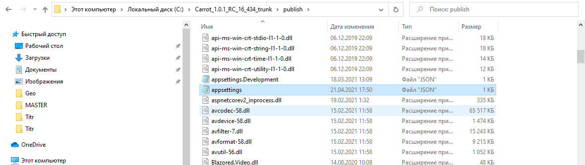
    2. Откройте его с помощью любого текстового редактора.

    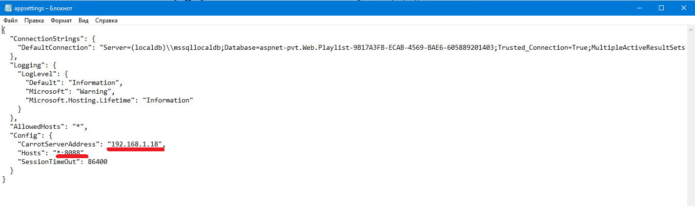

    3. Введите IP адрес машины на которой будет развернут **Carrot Web Playlist** , а также порт для подключения.
    4. Запустите `pvt.Web.Playlist.exe`, если запуск прошел успешно вы увидите следующее окно:
    
    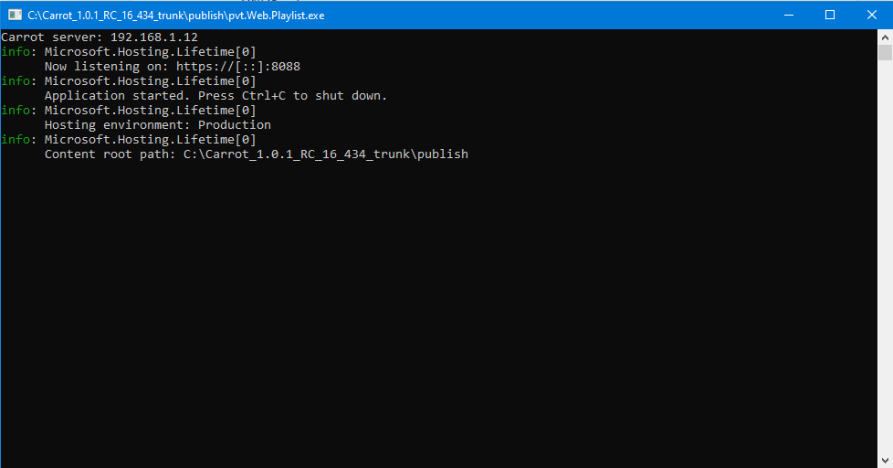
3. Запустите браузер (рекомендуется использовать **Google Chrome**) и в адресной строке введите `https://192.168.1.12:8088/` (Указанные в файле  `appsettings.json` IP адрес и порт).

    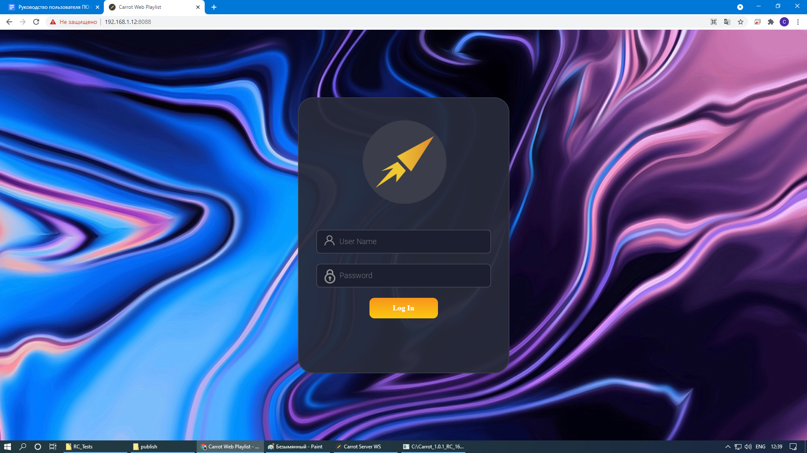

4. Введите `логин` и `пароль`.

    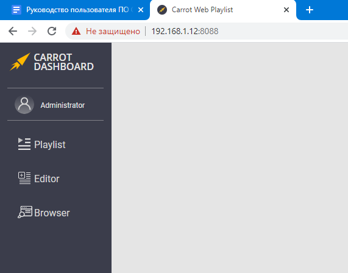

5. Окно **Carrot Web Playlist** имеет несколько вкладок со следующими опциями:
    - Вкладка `Playlist` - служит для управления заполненными плейлистами.
    - Вкладка `Editor` - создание и редактирование плейлистов.
    - Вкладка `Browser` - отображает весь  медиаконтент, загруженный на сервер (фото, видео, шаблоны UE4, шаблоны AE).

    Во вкладке `Playlist` имеются следующие кнопки:

    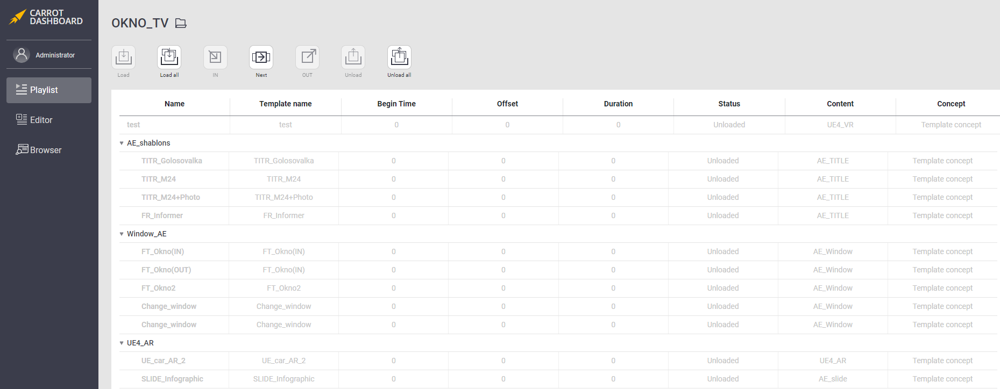

    1. `Load` - загружает выбранное события в плейлисте.
    2. `Load all` - загружает все события в плейлисте.
    3. `In` - загружает и переводит активирует событие выбранное событие в плейлисте.
    4. `Next` - деактивирует выделенное событие в плейлисте и активирует нижестоящее событие.
    5. `Out` - деактивирует выделенное событие в плейлисте.
    6. `Unload` - выгружает выбранное события в плейлисте.
    7. `Unload all` - выгружает все события в плейлисте.

    Каждое событие в Carrot Playlist имеет может находиться в следующем состоянии:
    - `Unloaded` (Выделен серым цветом) - событие с шаблоном не загружено внутри плейлиста.
    - `Loading` (Выделен оранжевым цветом) - событие с шаблоном загружается внутри плейлиста.
    - `Ready` (Выделен голубым цветом) - событие с шаблоном загружено и готово к работе.
    - `Active` (Выделен зеленым цветом) - событие с шаблоном активировано.

Процесс наполнения и редактирования событий в плейлисте описан в пункте [Создание плейлиста](http://a.com).

## Настройка Carrot RTC Server
Для настройки **Carrot RTC Server** необходимо выполнить следующее:

1. Запустите **Carrot Server** (`ServerWS.exe`) (Если **Carrot Server** уже запущен, перейдите на пункт 2).
2. Запустите **Carrot RTC Server** (`CarrotRTCWS.exe`).

Если **Carrot Server** не был запущен, либо **Carrot RTC Server** не смог установить с ним соединение, то на рабочем столе появится окно с ошибкой:

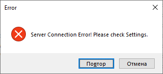

При нажатии на кнопку `Отмена` **Carrot RTC Server** завершит работу.

При нажатии на кнопку `Повтор` на рабочем столе откроется следующее окно `Settings` с настройками соединения **Carrot RTC Server**:

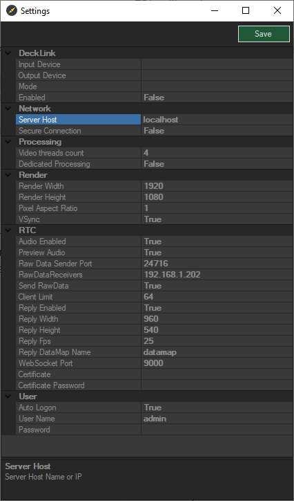

1. Вкладка DeckLink:
    - `Input Device` - Устройство ввода.
    - `Output Device` - Устройство вывода.
    - `Mode` - Формат изображения.
    - `Enabled` - Использовать устройство ввода/вывода.
2. Вкладка Network:
    - `Server Host` - Имя или IP адрес хоста сервера.
    - `Secure Connection` - Режим защищенного подключения.
3. Вкладка Processing:
    - `Video threads count` - Количество видеопотоков для обработки логическими процессорами.
    - `Dedicated Processing` - Обработка видеопотоков логическими процессорами.
4. Вкладка Render:
    - `Render Width` - Ширина рендера изображения для клиента.
    - `Render Height` - Высота рендера изображения для клиента.
    - `Pixel Aspect Ratio` - Соотношение сторон пикселя.
    - `VSync` - Вертикальная синхронизация.
5. Вкладка RTC:
    - `Audio Enabled` - Включение звука.
    - `Preview Audio` - не используется.
    - `Raw Data Sender Port` - Порт для отправки изображения клиенту.
    - `Raw Data Receivers` - IP адрес по которому приходят данные.
    - `Send Raw Data` - 
    - `Client Limit` - Лимит подключений.
    - `Reply Enabled` - Отправлять сигнал клиенту.
    - `Reply Width` - Предпочитаемая ширина кадра от клиента.
    - `Reply Height` - Предпочитаемая высота кадра от клиента.
    - `Reply FPS` - Предпочитаемая частота кадров в секунду от клиента.
    - `Reply DataMap Name` - Имя файла для обмена кадрами между процессом и формой RTC сервера.
    - `WebSocket Port` - Порт для подключения клиента по протоколу WebSocket.
    - `Certificate` - Путь к директории с сертификатом.
    - `Certificate Password` - Пароль сертификата.
6. Вкладка User:
    - `Auto Logon` - Автоматическая авторизация.
    - `User Name` - Имя пользователя.
    - `Password` - Пароль.

После ввода всех необходимых настроек нажмите кнопку `Save` в верхнем правом углу окна и закройте окно `Settings`. **Carrot RTC Server** произведет попытку подключения.

При успешном подключении к серверу на рабочем столе появится окно **Carrot RTC Server**:

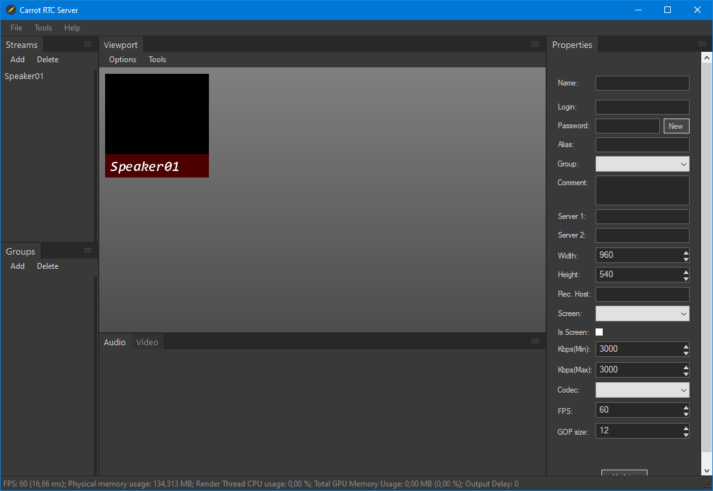

Окно **Carrot RTC Server** имеет несколько вкладок со следующими опциями:
1. Меню `File`:
    - `Outputs` - Настройка вывода изображения.
    - `Settings` - Открывает окно настройки **Carrot RTC Server** (вид и описание окна с его настройками изложены выше).
    - `Exit` (Комбинация клавиш Alt+F4) - выход из **Carrot RTC Server**.

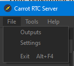

2. Меню `Tools`:
    - `RTC Procs` - Открывает окно RTC процессов.

    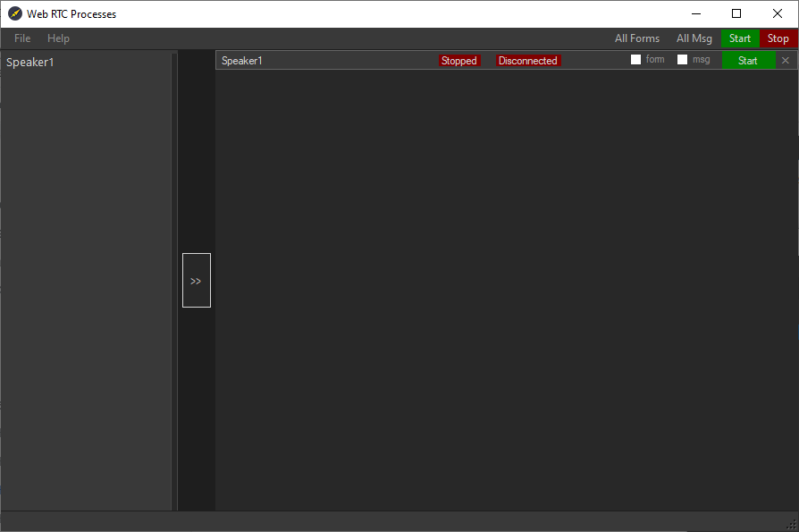

    >Окно **Web RTC Processes** имеет следующий функционал:
    >1. Запуск и остановка соединений.
    >2. Вывод формы соединения.
    >3. Вывод системных сообщений соединения.

    - `Copy login data` (Комбинация клавиш Ctrl+L) - Копирует в буфер обмена ссылку для авторизации на сервере с выбранным логином и паролем.
    - `Reset` (Комбинация клавиш Ctrl+R) - Сброс.

    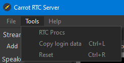

3. Меню `Help`:
    - `About` - информация о версии **ПО Carrot**.

    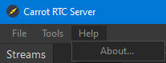

Внутри окна **Carrot RTC Server** расположены следующие блоки:
1. Блок `Streams` - Необходим для создания, редактирования и удаления подключений.
    - `Add` - добавляет новое подключение. После нажатия пользователю предлагается ввести название для подключения и подтвердить ввод.

    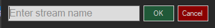

    - `Delete` - удаляет выбранное подключение.
2. Блок `Groups` - Необходим для создания, редактирования и удаления групп подключений.
    - `Add` - добавляет новую группу. После нажатия пользователю предлагается ввести название для группы и подтвердить ввод.
    
    

    - `Delete` - удаляет выбранную группу.
3. Блок `Viewport` - необходим для предпросмотра всех добавленных подключений.
    - Меню `Options`:
        - `Full screen` (клавиша F2) - перевод блока в полноэкранный режим.
    - Меню `Tools`:
        - `Export Frame` - создание и экспорт скриншота блока `Viewport`.
4. Блок `Audio`:
    - `Recording Device` - устройство ввода звука.
    - `Playout Device` - устройство вывода звука.
5. Блок `Video`:
    - `Select template…` - выбор шаблона.
6. Блок `Properties` - содержит в себе свойства выбранного элемента в блоках `Streams` и `Groups`.
    - `Name` - название подключения.
    - `Login` - логин для авторизации на RTC сервере.
    - `Password` - пароль для авторизации на RTC сервере.
    - `New` - сгенерировать новый пароль.
    - `Alias` - псевдоним.
    - `Group` - выбор группы, к которой относится подключение.
    - `Comment` - комментарий.
    - `Server 1` - адрес RTC сервера с портом подключения.
    - `Server 2` - резервный адрес RTC сервера с портом подключения.
    - `Width` - предпочитаемая ширина кадра.
    - `Height` - предпочитаемая высота кадра.
    - `Rec. Host` - адрес и порт получателя изображения.
    - `Screen` - выбор подключения, который является изображением с экрана того же клиента.
    - `Is Screen` - является ли это подключение изображением с экрана.
    - `Kbps(Min)` - минимальный битрейт обратного сигнала клиенту.
    - `Kbps(Max)` - максимальный битрейт обратного сигнала клиенту.
    - `Codec` - кодек для обработки видеоизображения.
    - `FPS` - предпочитаемое количество кадров в секунду.
    - `GOP size` - частота опорных кадров.
    - `Update` - применить изменения для подключения.

Внизу окна **Carrot RTC Server** находится строка статистики:

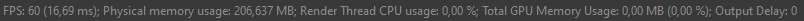

- `FPS` - количество кадров в секунду (время отрисовки кадра в миллисекундах)
- `Physical memory usage` - использование оперативной памяти в мегабайтах.
- `Render Thread CPU usage` - процент загрузки логического процессора.
- `Total GPU Memory Usage` - использование видеопамяти.
- `Output Delay` - задержка на выходе.

## Настройка Carrot Keyer

Чтобы открыть панель настроек **Carrot Keyer** в 
**`Carrot Engine` -> `Tools` -> `Show Content Settings`**:

Откроется новое окно с панелью настроек **Carrot Keyer**:

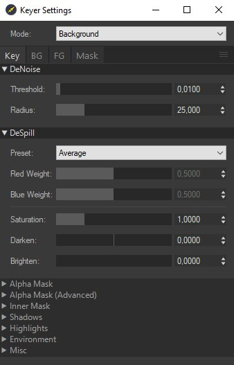

### Выпадающее меню `Mode`:

Меню `Mode` используется для переключения отображения масок в **Carrot Keyer**:

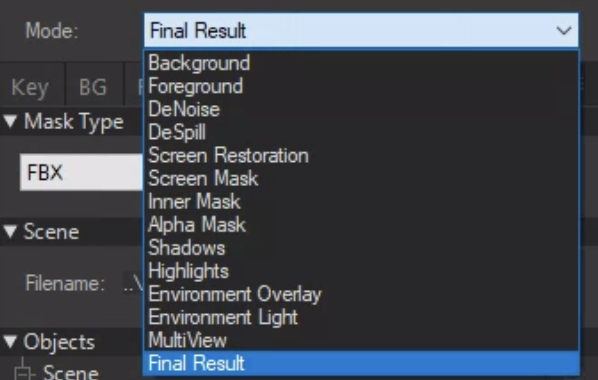

Режим `MultiView` выводит на экран все опции.

### Вкладка `Key`:

#### `DeNoise` - функция сглаживания шумов.
- `Threshold` - порог обработки.
- `Radius` - радиус обработки.

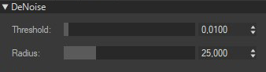

#### `DeSpill` - функция обработки паразитных рефлексов
- `Presets` - готовые пресеты.
- `Red Weight` - Вес красного цвета.
- `Blue Weight` - Вес синего цвета.
- `Saturation` - насыщенность.
- `Darken` - темнее.
- `Brighten` - яркость.

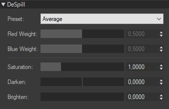

#### `Alpha Mask` - настройка альфа маски
- `Key Color` - цвет вычитаемого цвета.
- `J Weight` - J вес.
- `Red Weight` - вес красного цвета.
- `Blue Weight` - вес синего цвета.
- `Inner Mask` - уровень заполнения внутренней маской.
- `Mask Levels` - уровень маски.

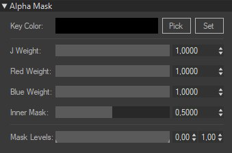

#### `Alpha Mask (Advanced)` - продвинутая настройка маски
- `White point` - точка белого
- `Key Type` - тип кеера
- `Boarder Light` - цвет контура светлее
- `Boarder Dark` - цвет контура темнее
- `B. Feather` - 
- `Floor Level` - уровни маски пола

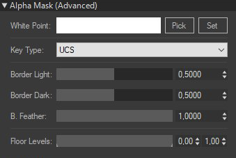

#### `Inner Mask` - Настройка внутренней маски
- `Red Weight` - вес красного цвета
- `Blue Weight` - вес синего цвета
- `Mask Levels` - уровень маски

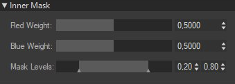

#### `Shadows` - Настройка теней
- `Enable` - включение отображения теней
- `Levels` - уровни маски теней
- `DeNoise mix` - уровень шумодава в тенях

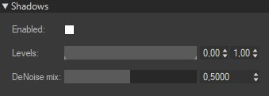

#### `Highlights` - Настройка отражений и бликов
- `Enable` - включить блики и отражения
- `Blend Mode` - режим наложения
- `Levels` - уровни маски отражений и бликов
- `DeNoise mix` - уровень шумодава в отражениях и бликах

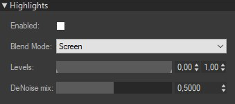

#### `Environment` - Настройка наложения освещения от окружения
- `Overlay` - уровень наложения
- `Overlay Blur` - размытие наложения
- `Light Strength` - сила освещения
- `Light Blur` - уровень размытия освещения
- `Light Level` - уровни освещения

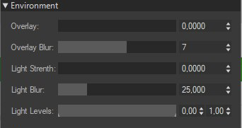

#### `Misc` - дополнительный функционал
- `Use BG Alpha` - использовать фоновый альфа
- `Use BG Stencil` - использовать фоновый Stencil

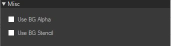

### Вкладка `BG`:

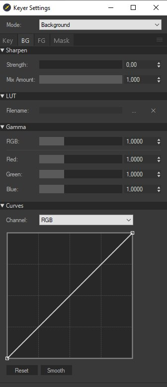

#### `Sharpen` - функция повышения резкости заднего фона
- `Strength` - сила повышения резкости
- `Mix Amount` - количество смешиваний

#### `Lut` - подключение lut файла для цветокоррекции
- `Filename` - нажать на ‘...’ чтобы указать путь к файлу

#### `Gamma` - коррекция гаммы заднего фона
- `RGB` - гамма красного зеленого и синего каналов
- `Red` - гамма красного канала
- `Green` - гамма зеленого канала
- `Blue` - гамма синего канала

#### `Curves` - коррекция цвета кривыми
- `Channel` - служит для выбора с какими каналами работает кривая
- `Reset` - сбросить все изменения
- `Smooth` - сгладить кривую

    >Для добавления точки на кривую щелкните `ЛКМ` по графику.
    >
    >Для удаления точки щелкните по ней `ПКМ`.

### Вкладка `FG`:

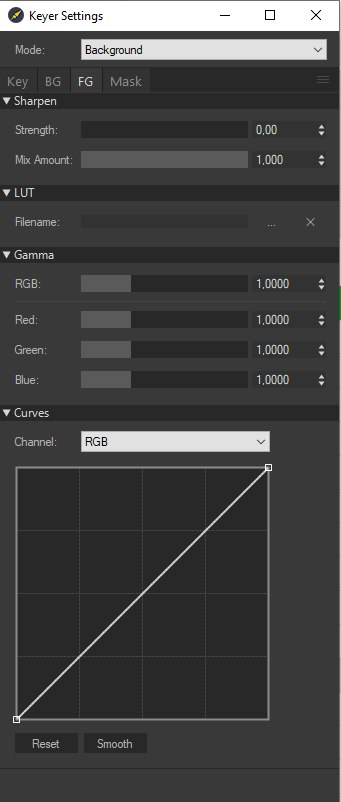

#### `Sharpen` - функция повышения резкости заднего фона
- `Strength` - сила повышения резкости
- `Mix Amount` - количество смешиваний

#### `Lut` - подключение lut файла для цветокоррекции
- `Filename` - нажать на ‘...’ чтобы указать путь к файлу

#### `Gamma` - коррекция гаммы заднего фона
- `RGB` - гамма красного зеленого и синего каналов
- `Red` - гамма красного канала
- `Green` - гамма зеленого канала
- `Blue` - гамма синего канала

#### `Curves` - коррекция цвета кривыми
- `Channel` - служит для выбора с какими каналами работает кривая
- `Reset` - сбросить все изменения
- `Smooth` - сгладить кривую

    >Для добавления точки на кривую щелкните `ЛКМ` по графику.
    >
    >Для удаления точки щелкните по ней `ПКМ`.

### Вкладка `Mask`:

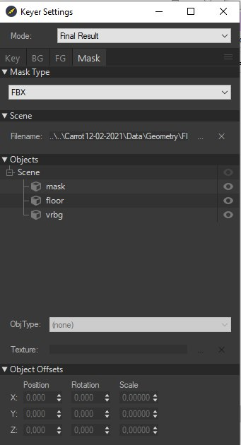

#### `Mask Type` - выбор типа маски
- `FBX` - для маски будет использована 3d модель в формате .fbx
- `Texture` - для маски будет использовано изображение

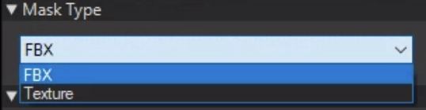

- `Scene` - указывать путь к файлу маски
- `Filename` - нажать на `‘...’` чтобы указать путь к файлу

- `Objects` - настройка объектов масок
- `ObjType` - тип маски применяемой к объекту:

    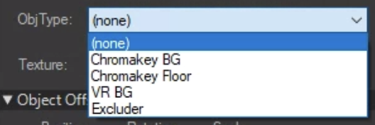

    - `Chromakey BG` - хромакей фон
    - `Chromakey Floor` - хромакей пол
    - `VR BG` - виртуальный фон
    - `Excluder` - тип маски для получения изображения реального объекта поверх `VR BG`
- `Texture` - наложение текстуры на объект. Нажать на `‘...’` чтобы указать путь к файлу

#### `Object offsets` - Настройка положения масок
- `Position` - позиция маски по осям XYZ.
- `Rotation` - угол поворота относительно осей XYZ.
- `Scale` - масштаб объекта относительно осей XYZ.

#### Вкладка управления настройками **Carrot Keyer**:

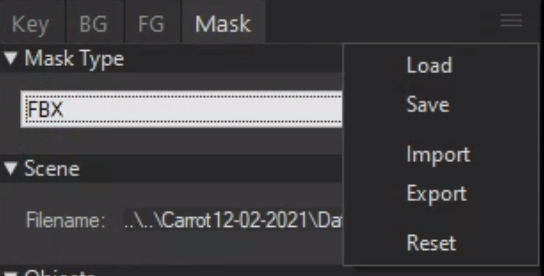

- `Load` - загрузить ранее сохраненные настройки
- `Save` - сохранить настройки
- `Import` - импортировать `.xml` файл с настройками
- `Export` - сохранить текущие настройки в `.xml` файл
- `Reset` - сбросить настройки с состояние по умолчанию

## Настройка Carrot Launcher

Для настройки **Carrot Launcher** необходимо выполнить следующее:

1. Запустите **Carrot Server** (`ServerWS.exe`) (Если **Carrot Server** уже запущен, перейдите на пункт 2).
2. Запустите **Carrot Launcher** (`LauncherWS.exe`).

Если **Carrot Server** не был запущен, либо **Carrot Launcher** не смог установить с ним соединение, то на рабочем столе появится окно с ошибкой:

При нажатии на кнопку `Отмена` **Carrot Launcher** завершит работу.

При нажатии на кнопку `Повтор` на рабочем столе откроется следующее окно `Settings` с настройками соединения **Carrot Launcher**:

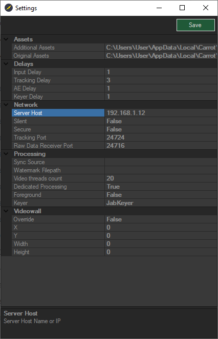

1. Вкладка `Assets`:
    - `Additional Assets` - путь к директории, в которой хранятся медиа файлы.
    - `Original Assets` - путь к директории, в которой хранятся медиа файлы.
2. Вкладка `Delays`:
    - `Input Delay` - Задержка видео на входе по умолчанию.
    - `Tracking Delay` - Задержка данных с трекинг системы.
    - `AE Delay` - Задержка АЕ шаблонов.
    - `Keyer Delay` - Задержка трекинг данных от Keyer.
3. Вкладка `Network`:
    - `Server Host` - Имя или IP адрес хоста сервера.
    - `Silent` - Режим подключения без отображения сообщений об ошибках.
    - `Secure` - Режим защищенного подключения.
    - `Tracking Port` - номер порта для получения трекинг данных.
    - `Raw Data Receiver Port` - номер порта для получения данных формата Raw.
4. Вкладка `Processing`:
    - `Sync Source` - Источник синхронизации (отдельное устройство или карта захвата)
    - `Watermark Filepath` - путь к файлу для водяного знака.
    - `Video threads count` - количество логических процессоров для обработки видеофайлов.
    - `Dedicated Processing` - обработка видео в выделенных логических процессорах.
    - `Foreground` - 
    - `Keyer` - тип `Keyer` (`JabKeyer`/`GreenKeyer`).
5. Вкладка `Videowall`:
    - `Override` -
    - `X` -
    - `Y` -
    - `Width` -
    - `Height` -

После ввода всех необходимых настроек нажмите кнопку `Save` в верхнем правом углу окна и закройте окно `Settings`. **Carrot Launcher** произведет попытку подключения.

При успешном подключении к серверу на рабочем столе появится окно **Carrot Launcher**:

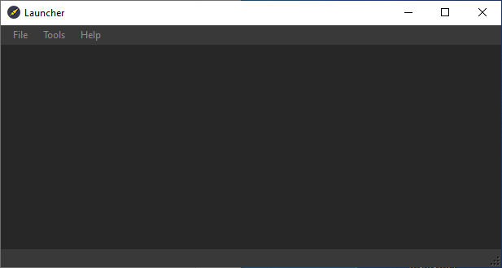

Окно **Carror Launcher** имеет несколько вкладок со следующими опциями:
1. Меню `File`:

    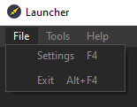
    - `Settings` (Горячая клавиша F4) - открывает окно настройки **Carrot Launcher** (вид и описание окна с его настройками изложены выше).
    - `Exit` (Комбинация клавиш Alt+F4) - выход из **Carrot Launcher**.

2. Меню `Tools`:

    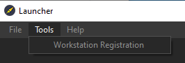
    - `Workstation Registration` - регистрация рабочей станции.
    >`(вид и описание окна с его настройками изложены в пункте 4.2 Настройка и регистрация рабочей станции).`

3. Меню `Help`:

    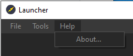
    - `About` - информация о версии **ПО Carrot**.

        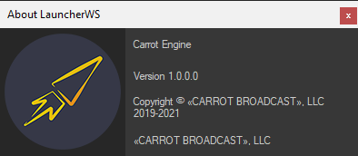

## Настройка Carrot System Monitor

Для настройки **Carrot System Monitor** необходимо выполнить следующее:

1. Запустите **Carrot Server** (`ServerWS.exe`) (Если **Carrot Server** уже запущен, перейдите на пункт 2).
2. Запустите **Carrot System Monitor** (`SystemMonitorWS.exe`).

Если **Carrot Server** не был запущен, либо **Carrot System Monitor** не смог установить с ним соединение, то на рабочем столе появится окно с ошибкой:

При нажатии на кнопку `Отмена` **Carrot System Monitor** завершит работу.

При нажатии на кнопку `Повтор` на рабочем столе откроется следующее окно `Settings` с настройками соединения **Carrot System Monitor**:

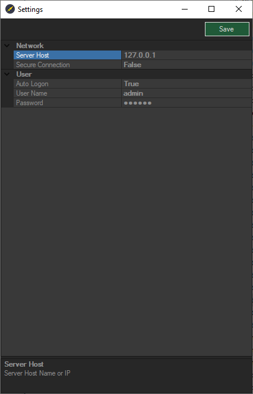

1. Вкладка `Network`:
    - `Server Host` - Имя или IP адрес хоста сервера.
    - `Secure Connection` - Режим защищенного подключения.
2. Вкладка `User`:
    - `Auto Logon` - Автоматическая авторизация.
    - `User Name` - Имя пользователя.
    - `Password` - Пароль.

После ввода всех необходимых настроек нажмите кнопку `Save` в верхнем правом углу окна и закройте окно `Settings`. **Carrot System Monitor** произведет попытку подключения.

При успешном подключении к серверу на рабочем столе появится окно **Carrot System Monitor**:

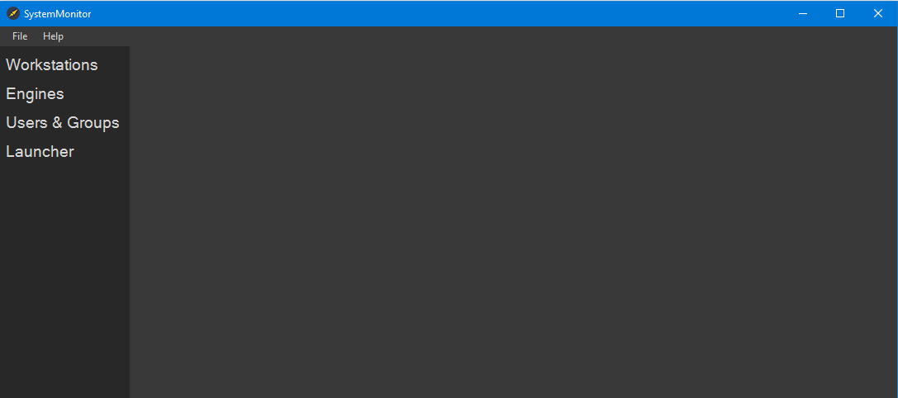

Окно **Carrot System Monitor** имеет несколько вкладок со следующими опциями:
1. Меню `File`:
    - `Settings` (Горячая клавиша F4) - открывает окно настройки **Carrot System Monitor**
    - `Exit` (Комбинация клавиш Alt+F4) - выход из **Carrot System Monitor**.

    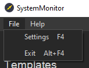

2. Меню `Help`:

    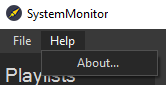
    - `About` - информация о версии **ПО Carrot**.

Разделы **Carrot System Monitor**:
- Раздел `Workstations` - отображает список всех доступных на указанном сервере рабочих станций и список схем, в которых эти станции задействованы. Есть возможность удалять зарегистрированные рабочие станции с сервера.
- Раздел `Engines` - отображает список всех доступных на указанном сервере схем и использованных в них рабочих станций. Есть возможность добавлять, редактировать и удалять схемы.
- Раздел `Users & Groups` - отображает настройки прав группы пользователей. Есть возможность добавлять, редактировать и удалять их.
- Раздел `Launcher` - отображает список всех созданных схем на указанном сервере. Есть возможность запускать, останавливать и производить сброс рабочих станций, указанных в выбранной пользователем схеме.

### Раздел `Workstations`:

При нажатии на кнопку раздела `Workstations` в **Carrot System Monitor** в окне появляется следующая структура, которая отображает список всех зарегистрированных рабочих станций на указанном сервере и подключенные к ним схемы:

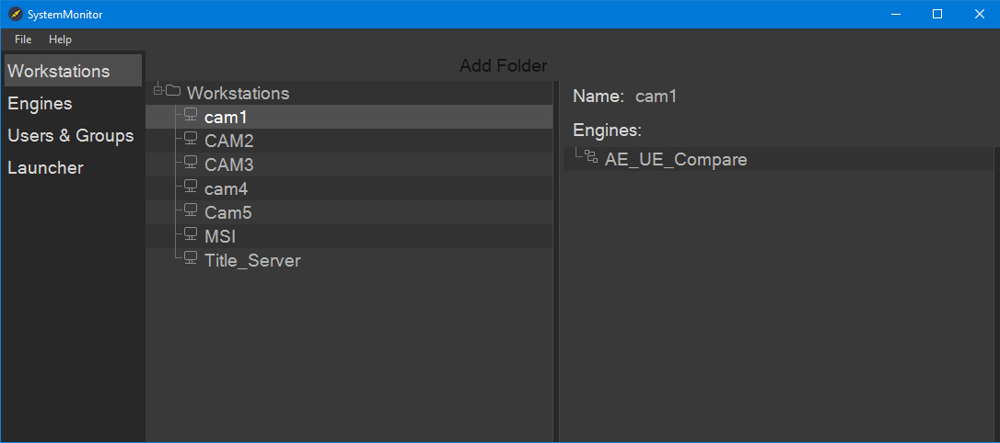

Кнопка `Add Folder` добавляет директорию служит для более удобной организации работы с рабочими станциями.

### Раздел `Engines`:

При нажатии на кнопку раздела `Engines` в **Carrot System Monitor** в окне появляется следующая структура, которая отображает список всех доступных схем на указанном сервере и указанные в них рабочие станции:

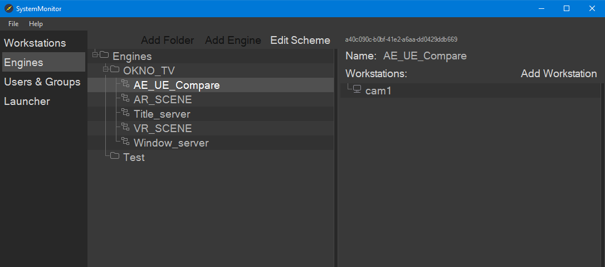

- Кнопка `Add Folder` добавляет директорию служит для более удобной организации работы со схемами
- Кнопка `Add Engine` позволяет пользователю создать в выбранной папке новую схему. Нажатие на неё открывает в новое окно и предлагает пользователю указать в поле название схемы. После необходимо подтвердить (`OK`), либо отменить (`Cancel`) выбор.
- Кнопка `Edit Scheme` открывает новое окно `Engine Flowchart` для настройки схемы:
    
    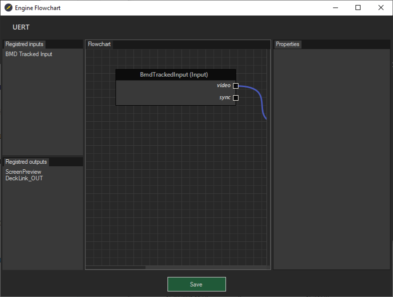

    Структура окна `Engine Flowchart`:
    - Название выбранной схемы.
    - `Registered inputs` - Указанные у выбранной рабочей станции входы (ноды ввода).
    - `Registered outputs` - Указанные у выбранной рабочей станции выходы (ноды вывода).
    - `Flowchart` - Окно для настройки и сборки нод.
    - `Properties` - Свойства выбранной ноды.
    - `Save` - Сохранение изменений в схеме.
    
    Подробное описание и настройка схемы описаны в пункте 4.3 Создание схемы работы Carrot Engine.

При выборе любой схемы в правой половине окна отображаются свойства выбранного плейлиста:
- `Name` - название схемы.
- `Add Workstation` - позволяет добавить в выбранную схему доступную рабочую станцию (`Workstation`).

При нажатии на кнопку `Add Workstation` открывается новое окно для выбора рабочей станции (`Workstation`) из списка доступных на сервере. При выборе рабочей станции, пользователю предлагается подтвердить выбор с помощью кнопки `OK`.

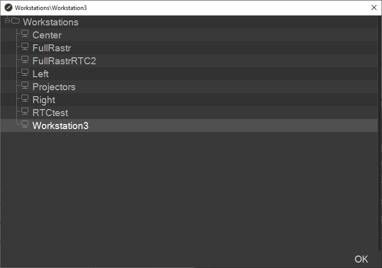

### Раздел `Users & Groups`:

При нажатии на кнопку раздела `Users & Groups` в **Carrot System Monitor** в окне появляется следующая структура, которая отображает список всех доступных групп пользователей, пользователей в них на указанном сервере и указанные для них следующие редактируемые свойства:

- `Name` - Имя группы или пользователя.
- `Role` - Роль группы пользователей.
- `Login` - Логин пользователя (редактируется).
- `Password` - Пароль пользователя.

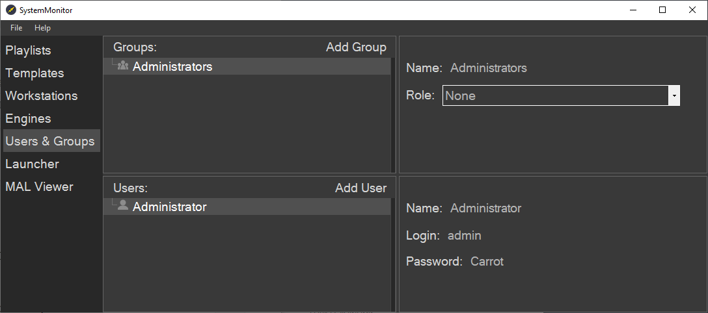

При нажатии на кнопку `Add Group` открывается новое окно, в котором пользователю предлагается указать название создаваемой группы пользователей. Подтверждение ввода осуществляется при помощи кнопок `OK` (Подтвердить) и `Cancel` (Отмена).

При нажатии на кнопку `Add User` открывается новое окно, в котором пользователю предлагается указать имя нового пользователя. Подтверждение ввода осуществляется при помощи кнопок `OK` (Подтвердить) и `Cancel` (Отмена).

### Раздел `Launcher`:

При нажатии на кнопку раздела `Launcher` в **Carrot System Monitor** в окне появляется следующая структура, которая отображает список всех доступных движков (`Engines`) на указанном сервере и указанные в них рабочие станции (`Workstation`) и позволяет управлять их работой:

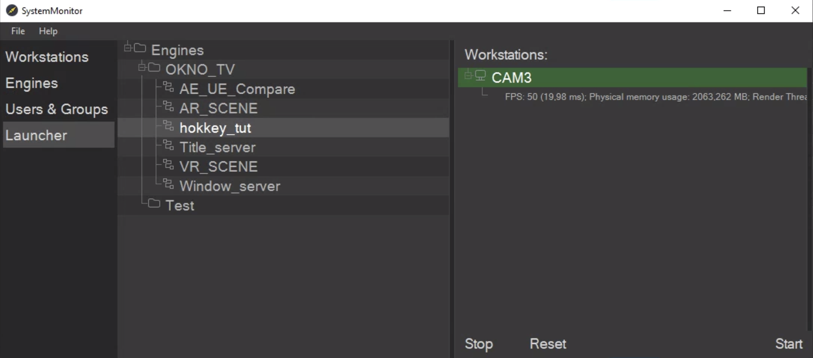

При выборе любой схемы, отображаемые справа связанные со схемой поля с рабочими станциями выделяются цветом, соответствующие их состоянию:
- `серый/чёрный` - рабочая станция недоступна для запуска.
- `желтый` - рабочая станция доступна для запуска.
- `зелёный` - рабочая станция запущена.
- `синий` - рабочая станция выделена пользователем комбинацией клавиш `Ctrl`+`ЛКМ`.
	
Нажатие на кнопку `Start` запускает все доступные рабочие станции, либо только выделенную пользователем.

Нажатие на кнопку `Stop` останавливает все запущенные рабочие станции, либо только выделенную пользователем.

Нажатие на кнопку `Reset` сбрасывает внутри движка у всех или у определенной пользователем рабочей станции компоненты, имеющие буфер.

## Настройка Carrot Tracking Server

Для настройки **Carrot Tracking Server** необходимо выполнить следующее:

1. Меню `File`:
    - `Settings` - настройки трекинг сервера.

        

        - `Input COM port` - Входящий COM порт.
        - `Connection Type` - Тип соединения.
        - `Input Port` - Входящий порт для получения данных трекинга.
        - `Output Host` - IP адрес сервера.
        - `Output Port` - Выходной порт для отправки трекинг данных на **Carrot Engine**.
        - `Output Broadcast` - для трансляции трекинг данных по всей локальной сети.
    - `Import settings` - Импорт Настроек.
    - `Export settings` - Экспорт Настроек.
    - `Export settings (Tracking Snapshot)` - Экспорт Настроек без Oversize.
    - `Exit` - Выход.

- `Provider` - Выбор протокола с трекинг данными.
- `Port` - Входящий порт для получения данных трекинга.
- `Output Host` - IP адрес сервера.
- `Output Port` - Выходной порт для отправки трекинг данных на **Carrot Engine**.
- `Delay` - Задержка в милисекундах.

Блоки `position` & `rotation`:
- Первый блок для управления системами координат.
- Блок `Offset`  - для задания Offset на входящие координаты.
- Блок `Scale` - для масштабирования входящих координат.
- Блок `Override` - для замены входящий координаты вписанной в данное меню.

Блок `Raw Lens Data` - для работы с данными приходящий от линзы:
- `Set min` \ `Set max`  - для задания рабочих отрезков по данным.
- `Override` - для задания своих числовых значений.

Блок `Lens File`:
- `Lens` путь к файлу линзы созданного в **Carrot Lens calibrator**.
- `Focus` путь к файлу линзы и информацией DOF.

Блок `Calibrated Lens`:
- Информация о искажениях линзы идущих с трекинг системы.
- `Override` - для задания своих числовых значений.

Блок `Input` - отображает данные которые присылает трекинг система.

## Настройка Carrot AE Plugin

Для настройки **Carrot AE Plugin** необходимо выполнить следующее:

1. Запустите **Carrot Server** (`ServerWS.exe`) (Если **Carrot Server** уже запущен, перейдите на пункт 2).
2. Убедитесь в том, что в настройках **Carrot Template Preview** в настройках указан адрес необходимого сервера и номер порта для получения трекинг данных.
3. Установите плагин **Carrot AE Export** для **AE**. Для установки содержимое папки необходимо переместить в папку по следующему пути:
`C:\Program Files\Adobe\Common\Plug-ins\7.0\MediaCore\AEGP`

    

4. Плагин готов к работе. Процесс экспорта шаблона из **AE** подробно описан в пункте 
>4.6 Экспорт шаблона из проекта АЕ.

## Настройка Carrot UE4 Plugin

Для настройки **Carrot UE4 Plugin** необходимо выполнить следующее:

В программе **UE4** открыть окно настройки `Plugins`:

В общем списке выбираем `Carrot`, и `CarrotEditor`:

