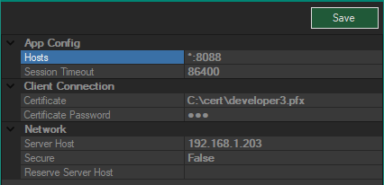
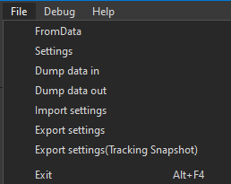

# Первоначальная настройка компонентов ПО Carrot

## Настройка Carrot Server

Для настройки Carrot Server необходимо выполнить следующее:

1. Запустите Carrot Server с правами администратора.
1. Откройте окно настроек по пути File - Settings:
  
1. В открывшемся окне укажите заполните следующие поля:
  
 **DataBase Directory** – директория, в которой будет храниться база данных Carrot Server.
 **Replication Hosts** – ip-адреса резервных Carrot Server.
 **Digital Assets Directory** – директория в которой будут храниться медиа файлы,экспортируемые вместе с шаблонами, а также задаваемые через Carrot Playlist.
 **Certificate** – путь к файлу сертификата .pfx, если предполагается использование шифрованного соединения.
 **Certificate Password** – пароль к файлу сертификата .pfx.
 **Secure Connection** – установите True, если предполагается использование шифрованного соединения.
1. Нажмите кнопку Save и закройте окно настроек.

## Настройка Carrot WEB Playlist

Для настройки Carrot Playlist необходимо выполнить следующее:

1. Запустите Carrot Server (ServerWS.exe) (Если Carrot Server уже запущен, перейдите на пункт 2).
1. Чтобы  иметь возможность подключаться к Carrot web playlist, необходимо выполнить сл. первоначальные настройки:
  - В папке publish найдите файл  appsettings.json
    
  - Откройте его с помощью текстового редактора
    
  - Введите ip адрес машины на которой будет развернуть Carrot Web Playlist , а также порт
  - Теперь запустите pvt.Web.Playlist.exe, если запуск прошел успешно вы увидите сл окно.
    
1. Запустите браузер (мы рекомендуем использовать Google Chrome) и в адресной строке введите https://192.168.1.12:8088/ (Указанные в файле  appsettings.json ip адрес и порт)
  
1. Введите Ваш логин и пароль.
  
1. Окно Carrot Web Playlist имеет несколько вкладок со следующими опциями:
 Вкладка **Playlist** – здесь происходит управление заполненными плейлистами.
 Вкладка **Editor** – создание и редактирование плейлистов
 Вкладка **Browser** – здесь отображается весь  медиа контент загруженный на сервер (фото, видео, шаблоны ue4, шаблоны AE)

### Playlist
Во вкладке Playlist имеются следующие кнопки:
  

Название | Описание
-|-
Load | загружает выбранное события в плейлисте.
Load all | загружает все события в плейлисте.
In | загружает и переводит активирует событие выбранное событие в плейлисте.
Next | деактивирует выделенное событие в плейлисте и активирует нижестоящее событие.
Out | деактивирует выделенное событие в плейлисте.
Unload | выгружает выбранное события в плейлисте.
Unload all | выгружает все события в плейлисте.

Каждое событие в Carrot Playlist имеет может находиться в следующем состоянии:

Название | Цвет | Описание
-|-|-
Unloaded | Серый | Событие с шаблоном не загружено внутри плейлиста.
Loading | Оранжевый | Событие с шаблоном загружается внутри плейлиста.
Ready  | Голубой | Событие с шаблоном загружено и готово к работе.
Active  | Зеленый | Событие с шаблоном активировано.

> Процесс наполнения и редактирования событий в плейлисте описан в пункте 
[Создание плейлиста]().

## Настройка Carrot RTC Server

Для настройки Carrot RTC Server необходимо выполнить следующее:

1. Запустите Carrot Server (ServerWS.exe) (Если Carrot Server уже запущен, перейдите на пункт 2).
1. Запустите Carrot RTC Server (CarrotRTCWS.exe).

> Если Carrot Server не был запущен, либо Carrot RTC Server не смог установить с ним соединение, то на рабочем столе появится окно с ошибкой:
  

При нажатии на кнопку Отмена Carrot RTC Server завершит работу.

При нажатии на кнопку Повтор на рабочем столе откроется следующее окно Settings с настройками соединения Carrot RTC Server:
  

- Вкладка DeckLink:
  - Input Device - Устройство ввода.
  - Output Device - Устройство вывода.
  - Mode - Формат изображения.
  - Enabled - Использовать устройство ввода/вывода.
- Вкладка Network:
  - Server Host - Имя или IP адрес хоста сервера.
  - Secure Connection - Режим защищенного подключения.
- Вкладка Processing:
  - Video threads count - Количество видеопотоков для обработки логическими процессорами.
  - Dedicated Processing - Обработка видеопотоков логическими процессорами.
- Вкладка Render:
  - Render Width - Ширина рендера изображения для клиента.
  - Render Height - Высота рендера изображения для клиента.
  - Pixel Aspect Ratio - Соотношение сторон пикселя.
  - VSync - Вертикальная синхронизация.
- Вкладка RTC:
  - Audio Enabled - Включение звука.
  - Preview Audio - не используется.
  - Raw Data Sender Port - Порт для отправки изображения клиенту.
  - Raw Data Receivers - IP адрес по которому приходят данные.
  - Send Raw Data -
  - Client Limit - Лимит подключений.
  - Reply Enabled - Отправлять сигнал клиенту.
  - Reply Width - Предпочитаемая ширина кадра от клиента.
  - Reply Height - Предпочитаемая высота кадра от клиента.
  - Reply FPS - Предпочитаемая частота кадров в секунду от клиента.
  - Reply DataMap Name - Имя файла для обмена кадрами между процессом и формой RTC сервера.
  - WebSocket Port - Порт для подключения клиента по протоколу WebSocket.
  - Certificate - Путь к директории с сертификатом.
  - Certificate Password - Пароль сертификата.
- Вкладка User:
  - Auto Logon - Автоматическая авторизация.
  - User Name - Имя пользователя.
  - Password - Пароль.

После ввода всех необходимых настроек нажмите кнопку Save в верхнем правом углу окна и закройте окно Settings. Carrot RTC Server произведет попытку подключения.

При успешном подключении к серверу на рабочем столе появится окно Carrot RTC Server:
  

Окно Carrot RTC Server имеет несколько вкладок со следующими опциями:

- Вкладка File:
  
  - Outputs - Настройка вывода изображения.
  - Settings - Открывает окно настройки Carrot RTC Server (вид и описание окна с его настройками изложены выше).
  - Exit (Комбинация клавиш Alt+F4) - выход из Carrot RTC Server.
   
- Вкладка Tools:
  
  - RTC Procs - Открывает окно RTC процессов.
    
    Окно Web RTC Processes имеет следующий функционал:
    - Запуск и остановка соединений.
    - Вывод формы соединения.
    - Вывод системных сообщений соединения.
  - Copy login data (Комбинация клавиш Ctrl+L) - Копирует в буфер обмена ссылку для авторизации на сервере с выбранным логином и паролем.
  - Reset (Комбинация клавиш Ctrl+R) - Сброс.
   
- Вкладка Help
  
  - About - информация о версии ПО Carrot.

Внутри окна Carrot RTC Server расположены следующие блоки:
- Блок Streams - Необходим для создания, редактирования и удаления подключений.
  - Add - добавляет новое подключение. После нажатия пользователю предлагается ввести название для подключения и подтвердить ввод.
    
  - Delete - удаляет выбранное подключение.
- Блок Groups - Необходим для создания, редактирования и удаления групп подключений.
  - Add - добавляет новую группу. После нажатия пользователю предлагается ввести название для группы и подтвердить ввод.
    
  - Delete - удаляет выбранную группу.
- Блок Viewport - необходим для предпросмотра всех добавленных подключений.
  - Вкладка Options:
    - Full screen (клавиша <kbd>F2</kbd>) - перевод блока в полноэкранный режим.
  - Вкладка Tools
    - Export Frame - создание и экспорт скриншота блока Viewport.
- Блок Audio
  - Recording Device - устройство ввода звука.
  - Playout Device - устройство вывода звука.
- Блок Video
  - Select template… - выбор шаблона.
- Блок Properties - содержит в себе свойства выбранного элемента в блоках Streams и Groups.
  - Name - название подключения.
  - Login - логин для авторизации на RTC сервере.
  - Password - пароль для авторизации на RTC сервере.
  - New - сгенерировать новый пароль.
  - Alias - псевдоним.
  - Group - выбор группы, к которой относится подключение.
  - Comment - комментарий.
  - Server 1 - адрес RTC сервера с портом подключения.
  - Server 2 - резервный адрес RTC сервера с портом подключения.
  - Width - предпочитаемая ширина кадра.
  - Height - предпочитаемая высота кадра.
  - Rec. Host - адрес и порт получателя изображения.
  - Screen - выбор подключения, который является изображением с экрана того же клиента.
  - Is Screen - является ли это подключение изображением с экрана.
  - Kbps(Min) - минимальный битрейт обратного сигнала клиенту.
  - Kbps(Max) - максимальный битрейт обратного сигнала клиенту.
  - Codec - кодек для обработки видеоизображения.
  - FPS - предпочитаемое количество кадров в секунду.
  - GOP size - частота опорных кадров.
  - Update - применить изменения для подключения.

Внизу окна Carrot RTC Server находится строка статистики:
  
- FPS - количество кадров в секунду (время отрисовки кадра в миллисекундах)
- Physical memory usage - использование оперативной памяти в мегабайтах.
- Render Thread CPU usage - процент загрузки логического процессора.
- Total GPU Memory Usage - использование видеопамяти.
- Output Delay - задержка на выходе.

## Настройка Carrot Keyer

Открытие панели настроек Carrot Keyer
- В Carrot Engine, Tools > Show Content Settings
  

Откроется новое окно с панелью настроек Carrot Keyer
  

Выпадающее меню Mode
 
 Используется для переключения режимов отображения в Carrot Keyer.
 
 Отображает все режимы при выбранном пункте  MultiView.

### Вкладка Key

  

- DeNoise - функция сглаживания шумов
 
  - Treshold - порог обработки
  - Radius - радиус обработки

- DeSpill - функция обработки паразитных рефлексов
 
  - Presets - готовые пресеты
  - Red Weight - Вес красного цвета
  - Blue Weight - Вес синего цвета
  - Saturation - насыщенность
  - Darken - темнее
  - Brighten - яркость

- Alpha Mask - настройка Альфа маски
 
  - Key Color - Цвет вычитаемого цвета
  - J Weight - вес яркости
  - Red Weight - вес красного цвета
  - Blue Weight - вес синего цвета
  - Inner Mask - уровень заполнения внутренней маской
  - Mask Levels - уровень маски

- Alpha Mask (Advanced) - настройка маски продвинутые
 
  - White point - точка белого
  - Key Type - тип кеера
  - Border Light - цвет контура светлее
  - Border Dark - цвет контура темнее
  - B. Feather - степень влияния коррекции котуров
  - Floor Level - уровни маски пола

- Inner Mask - Настройка внутренней маски
 
  - Red Weight - вес красного цвета
  - Blue Weight - вес синего цвета
  - Mask Levels - уровень маски

- Shadows - Настройка теней
 
  - Enable - включить тени
  - Levels - уровни маски теней
  - DeNoise mix - уровень шумоподавления в тенях

- Highlights - Настройка отражений и бликов
 
  - Enable - включить блики и отражения
  - Blend Mode - режим наложения
  - Levels - уровни маски отражений и бликов
  - DeNoise mix - уровень шумоподавления в отражениях и бликах

- Environment - Настройка наложения освещения от окружения
 
  - Overlay - уровень наложения
  - Overlay Blur - размытие наложения
  - Light Strength - сила освещения
  - Light Blur - уровень размытия освещения
  - Light Level - уровни освещения

- Misc - дополнительный функционал
 
  - Use BG Alpha - использовать альфу фона
  - Use BG Stencil - использовать Stencil фона 

### Вкладка BG

 

- Sharpen - функция повышения резкости заднего фона
  - Strength - сила повышения резкости
  - Mix Amount - количество смешиваний
- Lut - подключение lut файла для цветокоррекции
  - Filename - нажать на ‘...’ чтобы указать путь к файлу
- Gamma - коррекция гаммы заднего фона
  - RGB - гамма красного зеленого и синего каналов
  - Red - гамма красного канала
  - Green - гамма зеленого канала
  - Blue - гамма синего канала
- Curves - коррекция цвета кривыми
  - Channel - служит для выбора с какими каналами работает кривая
  - Reset - сбросить все изменения
  - Smooth - сгладить кривую
  - Для добавления точки на кривую щелкните ЛКМ по графику
  - Для удаления точеки щелкните по ней ПКМ

### Вкладка FG

 

То же что и Вкладка BG только для переднего плана.

### Вкладка Mask

 

- Mask Type - выбор типа маски
 
  - FBX - для маски будет использована 3d модель в формате .fbx
  - Texture - для маски будет использовано изображение

- Scene - указывать путь к файлу маски
  - Filename - нажать на ‘...’ чтобы указать путь к файлу

- Objects - настройка объектов масок
  - Obj Type - тип маски применяемой к объекту
   
    - Chromakey BG - хромакей фон
    - Chromakey Floor - хромакей пол
    - VR BG - виртуальный фон
    - Excluder - тип маски для получения изображения реального объекта поверх VR BG
  - Texture - наложение текстуры на объект нажать на ‘...’ чтобы указать путь к файлу

- Object offsets - Настройка положения масок
  - Position - позиция маски по осям XYZ
  - Rotation - угол поворота относительно осей XYZ
  - Scale - масштаб объекта относительно осей XYZ

### Вкладка управления настройками Carrot Keyer

 
- Load - загрузить ранее сохраненные настройки
- Save - сохранить настройки
- Import - импортировать .xml файл с настройками
- Export - сохранить текущие настройки в .xml файл
- Reset - сбросить настройки с состояние по умолчанию

## Настройка Carrot Launcher

Для настройки Carrot Launcher необходимо выполнить следующее:

- Запустите Carrot Server (ServerWS.exe) (Если Carrot Server уже запущен, перейдите на пункт 2).
- Запустите Carrot Launcher (LauncherWS.exe).

> Если Carrot Server не был запущен, либо Carrot Launcher не смог установить с ним соединение, то на рабочем столе появится окно с ошибкой:
  

При нажатии на кнопку Отмена Carrot Launcher завершит работу.

При нажатии на кнопку Повтор на рабочем столе откроется следующее окно Settings с настройками соединения Carrot Launcher:
  

- Вкладка Assets
  - Additional Assets - путь к директории, в которой хранятся медиа файлы.
  - Original Assets - путь к директории, в которой хранятся медиа файлы.
- Вкладка Delays
  - Input Delay - Задержка видео на входе по умолчанию.
  - Tracking Delay - Задержка данных с трекинг системы.
  - AE Delay - Задержка АЕ шаблонов.
  - Keyer Delay - Задержка трекинг данных от Keyer.
- Вкладка Network
  - Server Host - Имя или IP адрес хоста сервера.
  - Silent - Режим подключения без отображения сообщений об ошибках.
  - Secure - Режим защищенного подключения.
  - Tracking Port - номер порта для получения трекинг данных.
  - Raw Data Receiver Port - номер порта для получения данных формата Raw.
- Вкладка Processing
  - Sync Source - Источник синхронизации (отдельное устройство или карта захвата)
  - Watermark Filepath - путь к файлу для водяного знака.
  - Video threads count - количество логических процессоров для обработки видеофайлов.
  - Dedicated Processing - обработка видео в выделенных логических процессорах.
  - Foreground - Возвращает фокус на Carrot Engine каждые 10 секунд.
  - Keyer - тип Keyer (JabKeyer/GreenKeyer).
- Вкладка Videowall
  - Override - Разворачивает окно Carrot Engine не на полный экран, а на определенные координаты.
  - X - Позиция X окна
  - Y - Позиция Y окна
  - Width - Ширина окна
  - Height - Высота окна

После ввода всех необходимых настроек нажмите кнопку Save в верхнем правом углу окна и закройте окно Settings. Carrot Launcher произведет попытку подключения.

При успешном подключении к серверу на рабочем столе появится окно Carrot Launcher:
  

Окно Carror Launcher имеет несколько вкладок со следующими опциями:

- Вкладка File
  
  - Settings (Горячая клавиша <kbd>F4</kbd>) - открывает окно настройки Carrot Launcher (вид и описание окна с его настройками изложены выше).
  - Exit (Комбинация клавиш <kbd>Alt</kbd>+<kbd>F4</kbd>) - выход из Carrot Launcher.

- Вкладка Tools
  
  - Workstation Registration - регистрация рабочей станции (вид и описание окна с его настройками изложены в пункте 4.2 Настройка и регистрация рабочей станции).

- Вкладка Help
  
  - About - информация о версии ПО Carrot.

## Настройка Carrot System Monitor

Для настройки Carrot System Monitor необходимо выполнить следующее:

- Запустите Carrot Server (ServerWS.exe) (Если Carrot Server уже запущен, перейдите на пункт 2).
- Запустите Carrot System Monitor (SystemMonitorWS.exe).

> Если Carrot Server не был запущен, либо Carrot System Monitor не смог установить с ним соединение, то на рабочем столе появится окно с ошибкой:
  

При нажатии на кнопку Отмена Carrot System Monitor завершит работу.

При нажатии на кнопку Повтор на рабочем столе откроется следующее окно Settings с настройками соединения Carrot System Monitor:
  

- Вкладка Network
  - Server Host - Имя или IP адрес хоста сервера.
  - Secure Connection - Режим защищенного подключения.
- Вкладка User
  - Auto Logon - Автоматическая авторизация.
  - User Name - Имя пользователя.
  - Password - Пароль.

После ввода всех необходимых настроек нажмите кнопку Save в верхнем правом углу окна и закройте окно Settings. Carrot System Monitor произведет попытку подключения.

При успешном подключении к серверу на рабочем столе появится окно Carrot System Monitor:
  

Окно Carrot System Monitor имеет несколько вкладок со следующими опциями:

- Вкладка File
  
  - Settings (Горячая клавиша <kbd>F4</kbd>) - открывает окно настройки Carrot System Monitor.
  - Exit (Комбинация клавиш <kbd>Alt</kbd>+<kbd>F4</kbd>) - выход из Carrot System Monitor.

- Вкладка Help
  
  - About - информация о версии ПО Carrot.

### Разделы Carrot System Monitor

- Раздел **Workstations** - отображает список всех доступных на указанном сервере рабочих станций и список схем, в которых эти станции задействованы. Есть возможность удалять зарегистрированные рабочие станции с сервера.
- Раздел **Engines** - отображает список всех доступных на указанном сервере схем и использованных в них рабочих станций. Есть возможность добавлять, редактировать и удалять схемы.
- Раздел **Users & Groups** - отображает настройки прав группы пользователей. Есть возможность добавлять, редактировать и удалять их.
- Раздел **Launcher** - отображает список всех созданных схем на указанном сервере. Есть возможность запускать, останавливать и производить сброс рабочих станций, указанных в выбранной пользователем схеме.

### Workstations

При нажатии на кнопку раздела Workstations в Carrot System Monitor в окне появляется следующая структура, которая отображает список всех зарегистрированных рабочих станций на указанном сервере и подключенные к ним схемы:
  

Кнопка **Add Folder** добавляет директорию служит для более удобной организации работы с рабочими станциями.

### Engines

При нажатии на кнопку раздела Engines в Carrot System Monitor в окне появляется следующая структура, которая отображает список всех доступных схем на указанном сервере и указанные в них рабочие станции:
  

Кнопка **Add Folder** добавляет директорию служит для более удобной организации работы со схемами

Кнопка **Add Engine** позволяет пользователю создать в выбранной папке новую схему. Нажатие на неё открывает в новое окно и предлагает пользователю указать в поле название схемы. После необходимо подтвердить (OK), либо отменить (Cancel) выбор.

Кнопка **Edit Scheme** открывает новое окно Engine Flowchart для настройки схемы.
  

Структура окна Engine Flowchart:

- Название выбранной схемы.
- Registered inputs - Указанные у выбранной рабочей станции входы (ноды ввода).
- Registered outputs - Указанные у выбранной рабочей станции выходы (ноды вывода).
- Flowchart - Окно для настройки и сборки нод.
- Properties - Свойства выбранной ноды.
- Save - Сохранение изменений в схеме.

> Подробное описание и настройка схемы описаны в разделе [Создание схемы работы Carrot Engine]().

При выборе любой схемы в правой половине окна отображаются свойства выбранного плейлиста:

- Name - название схемы.
- **Add Workstation** - позволяет добавить в выбранную схему доступную рабочую станцию (Workstation).
  

При нажатии на кнопку Add Workstation открывается новое окно для выбора рабочей станции (Workstation) из списка доступных на сервере. При выборе рабочей станции, пользователю предлагается подтвердить выбор с помощью кнопки OK.
  

### Users & Groups

При нажатии на кнопку раздела Users & Groups в Carrot System Monitor в окне появляется следующая структура, которая отображает список всех доступных групп пользователей, пользователей в них на указанном сервере и указанные для них следующие редактируемые свойства:
  

- Name - Имя группы или пользователя.
- Role - Роль группы пользователей.
- Login - Логин пользователя (редактируется).
- Password - Пароль пользователя.

При нажатии на кнопку **Add Group** открывается новое окно, в котором пользователю предлагается указать название создаваемой группы пользователей. Подтверждение ввода осуществляется при помощи кнопок **OK** (Подтвердить) и **Cancel** (Отмена).

При нажатии на кнопку **Add User** открывается новое окно, в котором пользователю предлагается указать имя нового пользователя. Подтверждение ввода осуществляется при помощи кнопок **OK** (Подтвердить) и **Cancel** (Отмена).

### Launcher

При нажатии на кнопку раздела Launcher в Carrot System Monitor в окне появляется следующая структура, которая отображает список всех доступных движков (Engine) на указанном сервере и указанные в них рабочие станции (Workstation) и позволяет управлять их работой:
  

При выборе любой схемы, отображаемые справа связанные со схемой поля с рабочими станциями выделяются цветом, соответствующие их состоянию:

- серый/чёрный - рабочая станция недоступна для запуска.
- желтый - рабочая станция доступна для запуска.
- зелёный - рабочая станция запущена.
- синий - рабочая станция выделена пользователем комбинацией клавиш <kbd>Ctrl</kbd>+<kbd>ЛКМ</kbd>.

Нажатие на кнопку **Start** запускает все доступные рабочие станции, либо только выделенную пользователем.

Нажатие на кнопку **Stop** останавливает все запущенные рабочие станции, либо только выделенную пользователем.

Нажатие на кнопку **Reset** сбрасывает внутри движка у всех или у определенной пользователем рабочей станции компоненты, имеющие буфер.

## Настройка Carrot Tracking Server

Для настройки Carrot Tracking Server необходимо выполнить следующее:
  

- Меню File
  
  - Settings - настройки трекинг сервера
    
    - Input COM port - Входящий COM порт
    - Connection Type - Тип соединения
    - Input Port - Входящий порт для получения данных трекинга
    - Output Host - ip адрес сервера
    - Output Port - Выходной порт для отправки трекинг данных на Carrot Engine
    - Output Broadcast - для трансляции трекинг данных по всей локальной сети
  - Import settings - Импорт Настроек
  - Export settings - Экспорт Настроек
  - Export settings (Tracking Snapshot) - Экспорт Настроек без Oversize
  - Exit - Выход

Панель сетевых настроек:
  
- Provider - Выбор протокола с трекинг данными
- Port - Входящий порт для получения данных трекинга
- Output Host - ip адрес сервера
- Output Port - Выходной порт для отправки трекинг данных на Carrot Engine
- Delay - Задержка в милисекундах

Блоки position & rotation:
  
- Первый блок для управления системами координат
- Блок Offset  - для задания Offset на входящие координаты
- Блок Scale - для масштабирования входящих координат
- Блок Override - для замены входящий координаты вписанной в данное меню

Блок Raw Lens Data - для работы с данными приходящий от линзы
  
- Set min \ Set max  - для задания рабочих отрезков по данным
- Override - для задания своих числовых значений

Блок Lens File
- Lens путь к файлу линзы созданного в Carrot Lens calibrator
- Focus путь к файлу линзы и информацией DOF
 
Блок Calibrated Lens
- Информация об искажениях линзы идущих с трекинг системы
- Override - для задания своих числовых значений

Блок Input - отображает данные которые присылает трекинг система.
  

## Настройка Carrot AE Plugin

Для настройки Carrot AE Plugin необходимо выполнить следующее:
1. Запустите Carrot Server (ServerWS.exe) (Если Carrot Server уже запущен, перейдите на пункт 2).
1. Убедитесь в том, что в настройках Carrot Template Preview в настройках указан адрес необходимого сервера и номер порта для получения трекинг данных.
1. Установите плагин Carrot AE Export для AE. Для установки содержимое папки необходимо переместить в папку по следующему пути:
 C:\Program Files\Adobe\Common\Plug-ins\7.0\MediaCore\AEGP
  
1. Плагин готов к работе.

> Процесс экспорта шаблона из AE подробно описан в разделе [Экспорт шаблона из проекта АЕ]().

## Настройка Carrot UE4 Plugin

Для настройки Carrot UE4 Plugin необходимо выполнить следующее:

1. В программе UE4 открыть окно настройки Plugins
  

2. В общем списке необходимо выбрать Carrot, и CarrotEditor
  

3. Перезапустить проект UE.