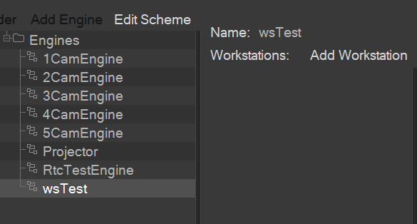
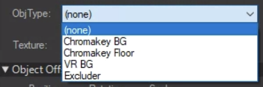
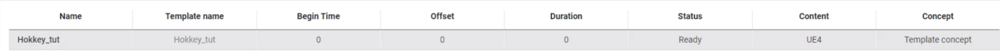

# Работа с ПО Carrot
## Работа с Carrot Server
### Изменение пароля администратора на Carrot Server

Для изменения пароля администратора выберите пункт `Tools` - `Change Administrator Password`:


Откроется окно, в котором необходимо ввести новый пароль и нажать `Apply`:


### Обновление списка подключений

Если известно, что подключение существует, но не отображается в списке подключений, то нажмите `Refresh` - программа войдет в цикл непрерывного обновления списка. Когда все подключения будут отображаться, нажмите `Refresh` еще раз.


### Удаление подключенных к Carrot Server компонентов

В главной области окна **Carrot Server** отображаются текущие подключения:


Для удаления подключения выделите его и нажмите `Disconnect Selected`:


## Настройка и регистрация рабочей станции

Для работы компонента **Carrot Engine** на конкретной рабочей станции, необходимо провести её регистрацию в **Carrot Server**. Для этого:

1. Запустите **Carrot Launcher** и выберите пункт `Tools` - `Workstation Registration`:


2. Откроется окно `Workstation Registration`:


2. В поле `Name` введите желаемое имя рабочей станции.
3. В разделе `Inputs` добавьте ноды ввода:
    - Нажмите `+` и выберите тип ноды:
    
        
        
        - `AjaTrackedInput` - работа с картой AJA при использовании UE4 шаблонов.
        - `Decklink10Bit` - работа с картой Decklink с глубиной цвета 10Bit.
        - `Decklink` - работа с картой Decklink с глубиной цвета 8Bit.
        - `RawRtc` - работа с подключением по WebRtc.
        - `BmdTrackedInput` - работа с картой Decklink при использовании UE4 шаблонов.
        - `TextureInput` - нода, использующая файл с изображением на компьютере.
        - `TrackedInput` - нода использующая только данные трекинга.
        - `WsStreamInput` - нода, для приёма сигнала с Carrot StreamSender.

    - Настройте параметры созданной ноды:

        

        

        

        

        

4. В разделе `Outputs` добавьте ноды вывода:
    - Нажмите `+` и выберите тип ноды:

        

        - `AjaOutput` - вывод изображения на карту AJA.
        - `Decklink` - вывод изображения на карту Decklink.
        - `DecklinkFillKey` - вывод изображений Fill и Key на карту Decklink.
        - `DecklinkSync` -
        - `Screen` - вывод изображения на экран монитора.
        - `WebStream` - вывод изображения на стриминговый сервис (например YouTube).

    - Настройте параметры созданной ноды:

        
        
        

        

        

        

        

5. Сохраните изменения:
    - Нажмите `Register/Update`:

        

    - Выберите нужную директорию сохранения и нажмите `ОК`:

        

    - Выберите нужную директорию сохранения и нажмите `ОК`:

        

6. При необходимости удалить рабочую станцию из базы данных **Carrot Server** нажмите `UnRegister`:

    

    Появится уведомление об успешном выполнении операции:

    

## Создание схемы работы Carrot Engine

**Carrot Engine** производит обработку изображения в соответствии со схемой, составленной в `System Monitor`. Для этого:

1. Запустите `System Monitor` и выберите раздел `Engines`:

    

2. Добавьте новую директорию нажав `Add Folder` либо выберите уже существующую.
3. Нажмите `Add Engine` и введите желаемое имя схемы и нажмите `OK`:

    

4. Выберите созданную схему:

    

5. Добавьте рабочие станции, которые будут работать по настраиваемой схеме:
    
    - Нажмите `Add Workstation` - откроется окно `Workstations`:

        

    - Выберите рабочую станцию и нажмите `ОК`.
    - В разделе `Workstations` отобразится добавленная рабочая станция:

        

6. Настройте созданную схему:
    - Нажмите `Edit Scheme` - откроется окно `Engine Flowchart`:

        

    - Добавьте ноды ввода перетаскиванием из раздела `Registered inputs`:

        

    - Добавьте одну ноду вывода перетаскиванием из раздела `Registered outputs`:

        

    - Кликнув правой кнопкой мыши по пустому месту выберите тип добавляемой ноды:

        

        - `Carrot Container` - используется для проигрывания шаблонов, либо для отображения изображения, получаемого от ноды ввода.

            

            Данная нода может иметь несколько входных пинов. На вход можно подать как ноду ввода, так и другие ноды. Позволяет изменять следующие характеристики:
            - Положение относительно левого верхнего угла (параметры X, Y).
            - Размер изображения на выходе (параметры Width, Height).

        - `Carrot Keyer` - используется для замены заднего фона изображения на другое изображение.

            

            Пин `Foreground` принимает изображение, задний фон которого необходимо заменить.
            
            Пин `Background` принимает изображение, на которое будет заменен задний фон.

            Позволяет изменять следующие характеристики:
            - Положение относительно левого верхнего угла (параметры X, Y).
            - Размер изображения на выходе (параметры Width, Height).

        - `Carrot AR` - Служит для добавление объектов дополненной реальности.

            Пин `Foreground` принимает изображение объекта который необходимо наложить.

            Пин `Background` принимает изображение заднего фона.

            Позволяет изменять следующие характеристики:
            - Положение относительно левого верхнего угла (параметры X, Y).
            - Размер изображения на выходе (параметры Width, Height).

        - `Carrot Viewport` - Случит для прямого наложения нескольких веток друг на друга.

    - Сохраните составленную схему нажатием кнопки `Save`.

        

>Примечание: если рассматривать ноды в качестве слоёв, то на итоговом изображении слои накладываются друг поверх друга начиная от ноды ввода к ноде вывода.
>
>

## Настройка Carrot Keyer

### Настройка Mask

Зайдите `Carrot Keyer` -> `Key` -> `Alpha Mask` -> `Key color` -> `Pick` и выберите цвет который необходимо убрать.


Нам необходимо убрать верхнюю часть кадра с оборудованием:


- выберете в `Mode` -> `Alpha mask`

    В **Carrot Engine** включиться отображение `Alpha mask`.

- Перейдите в `Carrot Keyer` -> `Mask` -> `Scene` - > `Filename`


И выберете модель вашей студии в формате `.fbx`

Модель должна содержать в себе следующие объекты:

1. Модель вашей циклорамы.
2. Модель помещения студии.
3. Захватчик отражений (если вы его используете).
4. Специальные объекты (при использовании excluder).

Они отобразятся в разделе `Objects`.


Теперь каждому объекту надо указать его назначение.
Для этого щелкните по объекту `ЛКМ` и в разделе `ObjType` выберите его тип:



В разделе `Object offsets` можно изменить местоположение угол поворота и размер объектов

Объекты вашей модели должны совпасть по положению с реальными результат должен выглядеть примерно так:


Так же при статических камерах возможно использовать маски в формате `.png`

Для этого переключите `Mask type` -> `Texture`

И в разделе `Scene` -> `Filename` укажите путь к файлу:


За тип маски в данном случае будет отвечать канал в пикселе изображения:

- Канал `Red` - Chromakey BG
- Канал `Blue` - VR BG
- Канал `Green` - Chromakey Floor

Результат работы масок:


## Подготовка AE проекта к экспорту шаблона
### Работа с композицией

Для подготовки AE проекта к экспорту шаблона на **Carrot Server** выполните следующее:

1. Откройте проект в AE:


2. Выберите композицию, которую собираетесь экспортировать


3. Композиция должна содержать минимум 3 маркера (`OUT` - `IN` - `OUT`), характеризующие начало (`OUT` - `IN`) и конец (`IN` - `OUT`) проигрываемой композиции. Для этого:

    1. Переместите ползунок в начало композиции и поставьте маркер:

        

    2. Измените комментарий маркера на `OUT`

        

    3. Переместите ползунок в середину композиции и поставьте маркер

        

    4. Измените комментарий маркера на `IN`

        

        

    5. Переместите ползунок в конец композиции и поставьте маркер

        

    6. Измените комментарий маркера на `OUT`.

        

    7. Расположение маркеров будет выглядеть примерно так:

        

    8. Если композиция содержит анимацию, которую необходимо проигрывать, следует создать для неё маркеры. Для этого:
        
        1. Переместите ползунок в начало анимации и поставьте маркер
        2. Измените комментарий маркера на желаемый
        3. Переместите ползунок в конец анимации и поставьте маркер
        4. Измените комментарий маркера на желаемый.
        >Примечание: если анимация начинается с начала композиции, то ее можно включить в маркеры `OUT`-`IN`, сместив `IN` на конец анимации.

        Пример:

        

        Здесь присутствуют три временных промежутка: 
        - OUT-IN (в дальнейшем будет именоваться как стейт `IN`) 
        - IN-ANIM (в дальнейшем будет именоваться как стейт `ANIM`) 
        - ANIM-OUT (в дальнейшем будет именоваться как стейт `OUT`) 
        > Примечание: участки с одинаковыми маркерами (`ANIM`-`ANIM`) не учитываются.
4. Сохраните проект.

### Рекомендации к подготовке шаблона

На 27.04.2021 для корректной работы шаблонов представлены следующие рекомендации к подготовке проекта:

#### Основное
- Для каждого шаблона, имеющего свои таймкоды для маркеров стейтов, рекомендуется создавать свой отдельный проект.
- Для однотипных шаблонов с одинаковыми стейтами можно создать один проект с главной композицией с маркерами для экспорта, внутри которой пользователь вкладывает композиции других шаблонов и оставляет видимым необходимый для экспортирования в движок Carrot. Не смотря на то, что неиспользуемые композиции могут быть скрыты, информация о них все-равно передаётся и обрабатывается при экспорте шаблона.
- У композиций, кроме главной, не должно быть маркеров.
- Ключи анимации должны располагаться строго по краям кадров.

#### Эффекты
Список поддерживаемых эффектов на 27.04.2021:
- Generate - Fill
- Generate - Gradient Ramp
- Color Correction - Tritone
- Color Correction - Tint
- Color Correction - Levels
- Color Correction - Curves
- Blur & Sharpen - Sharpen
- Transition - Wipes - Linear Wipe

#### Структура проекта и композиции
- Shape Layer необходимо заменить на Solid Layer.
PSD, AI слои внутри композиции необходимо заменить на Solid Layer, либо на изображение PNG, JPG или другого подобного расширения.

Поддерживаемые типы слоев в композиции:
- Null Layer
- Solid Layer
- Text Layer
- Media Layer (MP4, MOV, JPG, PNG и т.д.)

Поддерживаемые механики в композиции:
- Track Matte
- Parent Link
- Blending Modes
- Masking
- Expressions

#### Маски
- Маски с режимом наложения None нужно изменить на другое. Если маска одна и в режиме Intersect  нужно поменять на Add.
- Свойство Mask Feather по умолчанию в движке Carrot использует режим сэмплинга Bicubic.

#### Текст
- Параметр Animator у текстового слоя не поддерживается.
- Свойства размера шрифта, цвет, интервалы и т.д. в текстовом слое считываются в движке Carrot только по первому элементу и применяются на весь слой.
- В движке Carrot для режима кернинга текстовых слоев используется тип Metrics.

#### Дополнительная информация
- Слои, отмеченные в композиции как Guide Layer рекомендуется скрыть или удалить перед экспортом в движок Carrot.
- Expression, в которых есть обращение к функции Time рекомендуется конвертировать в ключи.
- Все Expressions, которые не требуют вычисления в реальном времени или не зависят от параметров слоя, указанного в движке Carrot как переменная, рекомендуется предварительно конвертировать в ключи анимации.
- Для поворота 3D слоев рекомендуется использовать свойство Orientation.
- При использовании логики IF ELSE внутри Expression структура должна выглядеть следующим образом:

    `if (*условие*) {*выражение*} else {*выражение*};`

- Если у слоя имеются свойства Position, Rotation и Anchor Point с ключами анимации, то для того, чтобы менять их внутри Carrot Tracking Preview необходимо предварительно создать Null Layer и сделать его родителем этого слоя. Тогда взаимодействовать с его свойствами можно будет через созданный Null Layer.
- Если в шаблоне используется сторонний шрифт, то рекомендуется устанавливать его в систему в формате OTF.
- Слои кроме текстового по умолчанию в движке Carrot используют режим сэмплинга Bicubic.
- При работе с 3D шаблонами нужно учитывать, что в АЕ система измерений проходит в пикселях, эти значения движок Carrot использует как миллиметры.

## Экспорт шаблона из проекта AE

1. Выберите пункт `Composition` - `Export Carrot Template`.


>Примечание: если этот пункт не активен, нажмите на раздел с композициями в нижней части интерфейса AE.
2. Появится окно экспорта шаблона **Template Preview**.

    

3. Откройте вкладку `Animation` в центральном разделе `Viewport` и в поле `Composition` выберите композицию, на которой расставлены маркеры:

    

    Здесь присутствуют три стейта:
    - `IN` (соответствует промежутку `OUT`-`IN`) 
    - `ANIM` (соответствует промежутку  `IN`-`ANIM`) 
    - `OUT` (соответствует промежутку `ANIM`-`OUT`)
4. Проверьте правильность анимации:
    - Нажмите на название стейта.
    - Дождитесь завершения проигрывания стейта.
5. Слои содержащие футажи или текст могут выступать в качестве изменяемых параметров шаблона:

    
    

    В **Template Preview** в разделе `Scene` слои отображаются так:

    

6. Для назначения слоя, содержащего футаж, в качестве переменной, выполните следующее:
    - Зажмите левой кнопкой мыши этот слой и перетащите его в раздел `Variables`

    

    - Выберите созданную переменную

    

    - В поле `Name` введите желаемое имя переменной.
    - В поле `Type` укажите тип `File`.

7. Для назначения слоя, содержащего текст, в качестве переменной, выполните следующее:
    - Раскройте слой и найдите параметр Source Text.
    - Зажмите левой кнопкой мыши этот параметр и перетащите его в раздел Variables

    

    - 

    

    - В поле `Name` введите желаемое имя переменной.
    - В поле `Type` укажите тип `Text`. В случае, если указан тип `RichText`, к содержимому поля `DefaultValue` добавится тег черного цвета:

    

        ```xml
        "<font color=\"#000000\">Text Sample</font>"
        ```

8. Настройте плавность линий, отображающих текст:
    - Выберите слой, содержащий текст

    

    - В разделе `Properties` измените параметр `StepCount` на желаемый:

    

    Примеры:

    - `StepCount` = 1:

    

    - `StepCount` = 2:

    

    - `StepCount` = 4:

    

    >Примечание: чем больше значение `StepCount`, тем больше ресурсов тратится на отрисовку текста.

9. Нажмите кнопку сохранения

    

10. Откроется окно выбора директории сохранения

    

11. Выберите директорию и в поле `Name` введите желаемое имя шаблона.
12. Нажмите `Save Template`. По окончании сохранения данное окно закроется.
13. Закройте **Template Preview**.

## Подготовка UE4 проекта к экспорту шаблона (старый плагин)

Для подготовки проекта к экспорту шаблона необходимо выполнить следующее:

1. Запустите проект, который необходимо экспортировать, включите плагины `Carrot` и `CarrotEditor` и перезапустите проект:

    

2. В разделе `Project` - `Maps & Modes` - `Default Maps` в параметрах `Editor Startup Map` и `Game Default Map` укажите ту сцену, которую предполагается использовать.

    

3. В настройках проекта в разделе `Engine` - `General Settings` - `Framerate` - `Custom TimeStep` укажите `CarrotCustomTimeStep`:

    

4. В разделе `Engine` - `Rendering` - `Default Settings` - `Anti-Aliasing Method` выбрать `TemporalAA`.

    

5. В настройках проекта в разделе `Engine` - `Rendering` - `Postprocessing` установите параметры, указанные ниже:

    

6. В настройках проекта в разделе `Engine` - `Rendering` - `Default Settings` установите параметр `Frame Buffer Pixel Format` равным `Float RGBA`:

    

7. Добавьте в сцену `Empty Actor` - этот объект будет отвечать за смещения координат, получаемых от **Carrot Tracking Server**.

    

8. Добавьте в сцену `Cine Camera Actor` - этот объект будет выполнять роль виртуальной камеры

    

9. Сделайте `Empty Actor` родительским объектом по отношению к `Cine Camera Actor`

    

10. Откройте свойства `Cine Camera Actor` и в разделе `Current Camera Settings` - `Lens Settings` установите параметр `Min Focal Length` равным 0 мм.

    

11. Выберите компонент `CameraComponent` и добавьте к нему компонент `SceneCaptureComponent2D`.

    

12. Создайте `Render Target` - эта текстура будет использоваться для вывода изображения.

    

13. Настройки данной текстуры приведите в соответствие с указанными ниже:

    

    >Примечание: разрешение текстуры должно совпадать с разрешением вьюпорта, на котором она будет проигрываться (см. 4.3 Создание схемы работы Carrot Engine)

14. Скопируйте ассет `PostProcMat_Frames.uasset`, `PostProcMat_Alpha.uasset` и `CarrotMacroLibrary.uasset` в папку проекта

    
    

15. Откройте настройки компонента `SceneCaptureComponent2D` объекта `Cine Camera Actor` и установите параметры:

    

    - `Texture Target` - выберите ту `Render Target`, которую Вы создали для вывода изображения.
    - `Primitive Render Mode` - выберите `Render Scene Primitives`.
    - `Capture Source` - `Final Color (LDR) in RGB`.
    - `Capture Every Frame` - отключено.
    - `Capture on Movement` - отключено.
    - `Always Persist Rendering State` - включено.
    - `Temporal AA` - включено.

        

16. В разделе `Post Process Volume` - `Rendering Features` добавьте элементы и укажите пути на ассеты `PostProcMat_Alpha` и `PostProcMat_Frames` которые былы скопированы с плагином `Carrot`.

    

17. Если планируется завести изображение внутрь проекта, то создайте еще одну `Render Target` - эта текстура будет использоваться для ввода изображения. Таких текстур может быть несколько.

    

18. Настройки данной текстуры приведите в соответствие с указанными ниже:

    

    >Примечание: разрешение текстуры должно квадратным и кратным степени двойки (например, 256х256, 512х512, 2048х2048), а также близким с разрешением вьюпорта, с которого будет забираться изображение (см. 4.3 Создание схемы работы Carrot Engine)
    >
    >
    >
    >Если четкости входящей текстуры недостаточно - поставить `NoMipmaps`. В остальных случаях следует выбирать `Sharpen`.

19. Создайте материал, который будет использовать созданную `Render Target`:

    

20. Откройте настройки материала и задайте ему созданную текстуру:

    

21. Примените созданный материал на объект, на котором планируется отображать входящее изображение:

    

22. Откройте `Level Blueprint` и добавьте `Carrot Macro`.

    

23. Во входных параметрах `Carrot Macro` укажите:

    

    - `Event BeginPlay`
    - `Event Tick`
    - Объект `Cine Camera Actor`, используемый в качестве виртуальной камеры.
    - Объект `Empty Actor`, который является родительским по отношению к `Cine Camera Actor`.
    - `Input Render Target 2D` - указывается текстура, которая используется для ввода изображения.
    - `Output Render Target 2D` - указывается текстура, которая используется для вывода изображения.
    
    Если используется несколько текстур для входящих изображений, раскройте макрос:

    

    Необходимо скопировать ноду `Carrot Receiver` столько раз, сколько будет использоваться таких текстур.

    Причем первая текстура указывается в макросе, а последующие указываются в копиях ноды:

    

    Если подобные текстуры вообще не используются, необходимо исключить ноду `Carrot Receiver` из процесса:

    

24. Используйте выходные пины `Begin Play Out` и `Event Tick Out`, если ивенты `Begin Play` и `Event Tick` будут использоваться после `Carrot Macro`:

    

25. Если проигрывание шаблона проекта подразумевает использование команд, то:
    - Создайте ноду `Switch on String` и соедините её с Carrot Macro, как показано на рисунке выше.
    - Каждый выходной пин ноды `Switch on String` будет соответствовать команде, которую можно будет отправлять с `Carrot Playlist`.

Соедините выходные пины ноды `Switch on String` с теми событиями, которые должны выполниться при вызове команды, чьё имя соответствует имени пина.

26. В разделе `Editor` - `General` - `Performance` выключите параметр `Use Less CPU when in Background`.

    

## Подготовка UE4 проекта к экспорту шаблона (новый плагин)

Для подготовки проекта к экспорту шаблона необходимо выполнить следующее:

1. В дополнение к основным настройкам в проекте, в папке Config в файле DefaultEngine и в папке Windows в файле WindowsEngine необходимо добавить строки:

```text
[/Script/Engine.Engine]
GameEngine=/Script/Carrot.CarrotGameEngine
GameViewportClientClassName=/Script/Carrot.CarrotViewportClient
```

2. В разделе `Editor` - `General` - `Performance` выключите параметр `Use Less CPU when in Background`.

    

3. В разделе `Project` - `Engine` - `General Settings` в параметре `Game Viewport Client Class`  выберите `CarrotViewportClient`.

    

4. Запустите проект, который необходимо экспортировать, включите плагины `Carrot` и `CarrotEditor` и перезапустите проект:

    

2. В разделе `Project` - `Maps & Modes` - `Default Maps` в параметрах `Editor Startup Map` и `Game Default Map` укажите ту сцену, которую предполагается использовать.

    

3. В настройках проекта в разделе `Engine` - `General Settings` - `Framerate` укажите:
- поле `Smooth Frame Rate` сделайте активным
- в поле `Smoothed Frame Rate Range` укажите минимальный и максимальный пороги равными частоте кадров общего тракта. Свойство порогов должно быть `Inclusive`
- в поле `Min Desired Frame Rate` укажите частоту кадров общего тракта
- в поле `Custom TimeStep` укажите `CarrotCustomTimeStep`

    

4. Если в проекте используются анимации

4. В разделе `Engine` - `Rendering` - `Default Settings` - `Anti-Aliasing Method` выбрать `TemporalAA`.

    

5. В настройках проекта в разделе `Engine` - `Rendering` - `Postprocessing` установите параметры, указанные ниже:

    

6. В настройках проекта в разделе `Engine` - `Rendering` - `Default Settings` установите параметр `Frame Buffer Pixel Format` равным `8bit RGBA`:

    

7. Добавьте в сцену `Empty Actor` - этот объект будет отвечать за смещения координат, получаемых от **Carrot Tracking Server**.

    

8. Добавьте в сцену `Cine Camera Actor` - этот объект будет выполнять роль виртуальной камеры

    

9. Сделайте `Empty Actor` родительским объектом по отношению к `Cine Camera Actor`

    

10. Откройте свойства `Cine Camera Actor` и в разделе `Current Camera Settings` - `Lens Settings` установите параметр `Min Focal Length` равным 0 мм.

    

11. Добавьте в сцену `Post Process Volume`

    

12. Скопируйте ассет `PostProcMat_Frames.uasset`, `PostProcMat_Alpha.uasset` и `CarrotMacroLibrary.uasset` в папку проекта

13. В `Post Process Volume` - `Rendering Features` добавьте элементы и укажите пути на ассеты `PostProcMat_Alpha` и `PostProcMat_Frames` которые былы скопированы с плагином `Carrot`.

    

14. Также активируйте параметр `Infinite Extent (Unbound)`.

    

15. Если планируется завести изображение внутрь проекта, то создайте еще одну `Render Target` - эта текстура будет использоваться для ввода изображения. Таких текстур может быть несколько.

    

16. Настройки данной текстуры приведите в соответствие с указанными ниже:

    

    >Примечание: разрешение текстуры должно быть квадратным и кратным степени двойки (например, 256х256, 512х512, 2048х2048), а также близким с разрешением вьюпорта, с которого будет забираться изображение (см. 4.3 Создание схемы работы Carrot Engine)
    >
    >
    >
    >Если четкости входящей текстуры недостаточно - поставить `NoMipmaps`. В остальных случаях следует выбирать `Sharpen`.

17. Создайте материал, который будет использовать созданную `Render Target`:

    

18. Откройте настройки материала и задайте ему созданную текстуру:

    

19. Примените созданный материал на объект, на котором планируется отображать входящее изображение:

    

20. Откройте `Level Blueprint` и добавьте `Carrot Macro`.

    

21. Во входных параметрах `Carrot Macro` укажите:

    

    - `Event BeginPlay`
    - `Event Tick`
    - Объект `Cine Camera Actor`, используемый в качестве виртуальной камеры.
    - Объект `Empty Actor`, который является родительским по отношению к `Cine Camera Actor`.
    
    Внутри макроса добавьте ноду `Carrot Receiver` и кажите в ней текстуру:

    

    Если используется несколько, необходимо скопировать ноду `Carrot Receiver` столько раз, сколько будет использоваться таких текстур.

    

    Если подобные текстуры вообще не используются, необходимо исключить ноду `Carrot Receiver` из процесса:

    

22. Используйте выходные пины `Begin Play Out` и `Event Tick Out`, если ивенты `Begin Play` и `Event Tick` будут использоваться после `Carrot Macro`:

    

23. Если проигрывание шаблона проекта подразумевает использование команд, то:
    - Создайте ноду `Switch on String` и соедините её с Carrot Macro.
    - Каждый выходной пин ноды `Switch on String` будет соответствовать команде, которую можно будет отправлять с `Carrot Playlist`.

    

Соедините выходные пины ноды `Switch on String` с теми событиями, которые должны выполниться при вызове команды, чьё имя соответствует имени пина.


## Экспорт шаблона из проекта UE4

Для экспорта шаблона из проекта UE4 необходимо выполнить следующее:

1. Нажмите кнопку `Export Carrot` (расположена на верхней панели):

    

2. Откроется окно `Carrot Objects`:

    

    В данном окне будут отображаться только те объекты проекта, которые будут использоваться для интеграции с **ПО Carrot**:

    - Текстуры для входных изображений;
    - Текстура выходного изображения;
    - Список команд.

3. Выберите режим сохранения шаблона:

    

    `Unreal Editor` - сохранится только шаблон проекта. Данный режим используется, когда запуск проекта происходит посредством `Unreal Editor`.
    `Already Packed Project` - указывается путь к уже собранному проекту.  Происходит его упаковка и сохранение в **Carrot Server** вместе с шаблоном. Данный режим используется, когда нужен запуск собранного проекта.

4. Нажмите кнопку сохранения и выберите директорию сохранения:

    

5. В поле `Name` введите желаемое имя шаблона и нажмите `Save Template`.

6. Закройте окно `Carrot Objects`:

    

    > Примечание:
    >
    > - при запуске собранного проекта его окно должно быть развернуто;
    > - при запуске сцены из-под `UE Editor` окно сцены должно быть развернуто, а окно `UE Editor` должно быть свернуто.

## Создание плейлиста

Для проигрывания экспортированных шаблонов необходимо создать плейлист, с которого будут отправляться команды на их проигрывание.

Для этого:
1. Запустите `Carrot Web Playlist` зайдите через браузер на страницу управления плейлистами.
2. Выберите пункт `Editor`

    

3. Нажмите кнопку `NEW`.
    Откроется вкладка создания нового плейлиста.

    В разделе `Enter Playlist Name` введите имя будущего плейлиста.

    Нажмите `OK`.

    

4. Окно `Editor` состоит из трех областей
    - Область настройки плейлиста (выделена красным) служит для настройки очередности событий в плейлисте
    - Область `Templates` (выделена зеленым) тут хранятся загруженные на сервер шаблоны
    - Область `Properties` (выделена синим) служит для настройки поведения конкретного шаблона в плейлисте.

    

5. Заполнение плейлиста:
    - Плейлист заполняет перетягиваем мышки (Drug and Drop) шаблона из области `Templates` в область плейлиста.

6. Меню редактирования плейлиста

    

    - `Add store` - добавляет новую пустую историю в плейлист
    - `Group` - группирует шаблоны в плейлисте
    - `Rename story` - переименовывает выбранную историю
    - `Remove item` - удаляет выбранный шаблон из истории
    - `Remove story` - удаляет историю с находящимися внутри шаблонами

7. Раздел `Properties`

    

    `Name` - имя шаблона которое будет отображаться в плейлисте.
    `Template name` - имя шаблона задается при сохранении на сервер.
    `State` - стейт с которого будет воспроизводиться шаблон.
    `Новость\Улица` - Текстовое параметрическое поле задается при создании шаблона.
    `Back\Face` - `Media input` для отображения в шаблоне медиаданных (фото, видео файлов а так же захват изображения с карты захвата)
    поля задаются при создании шаблона.

    Окно для указания `media inputs` в шаблоне:

    

    - `Media Assets Library` - библиотека загруженных медиа файлов
    - `Inputs` - Вход для видео потока (Карта захвата, WebRTC, другие шаблоны)

## Проигрывание плейлиста


- `Load` - загружает выбранное события в плейлисте.
- `Load all` - загружает все события в плейлисте.
- `In` - загружает и переводит активирует событие выбранное событие в плейлисте.
- `Next` - деактивирует выделенное событие в плейлисте и активирует нижестоящее событие.
- `Out` - деактивирует выделенное событие в плейлисте.
- `Unload` - выгружает выбранное события в плейлисте.
- `Unload all` - выгружает все события в плейлисте.

Выберите интересующий вас шаблон ЛКМ его фон станет серым, как показано на скриншоте:


Перед воспроизведение его надо загрузить в оперативную память это можно сделать кнопкой `Load` либо `ПРОБЕЛ` с клавиатуры (если вам нужно загрузить весь `playlist` можно воспользоваться кнопкой `load all`).

После того как шаблон был загружен цвет его теста станет черным, а `Status` измениться на `Ready`, как показано на скриншоте:



Теперь данный шаблон можно воспроизвести с помощью кнопки `IN` либо `ПРОБЕЛ` с клавиатуры, цвет строки станет зеленым, а `Status` измениться на `Active`, как показано на скриншоте:


Чтобы завершить воспроизведение (либо проиграть выходной стейт)

нажмите клавишу `OUT`, как только воспроизведение закончиться  `Status` измениться на `Ready` и зеленая подсветка отключиться.

Шаблоны находящиеся в `Status Active` не подлежат редактированию!!!

Перед редактирование шаблона его обязательно надо перевести в `Status Ready`.

Если Вам необходимо перезалить шаблон с тем же именем файла, шаблон должен находиться в `Status Unloaded` перед загрузкой.

## Настройка задержек ввода/вывода

Для настройки задержек необходимо выполнить следующее:

Откройте меню `Carrot Engine` - `Delays` - `Show Delays Form`


Откроется форма настройки задержек


- `Input Delay Offset` - покадровая задержка входящего видео потока
- `Tracking Delay` - покадровая задержка данных из трекинг системы
- `Apply` - применить изменения
- `Стрелка` - служит для сброса `output delay` в `Carrot Engine`.
